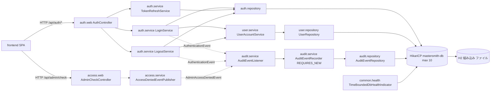
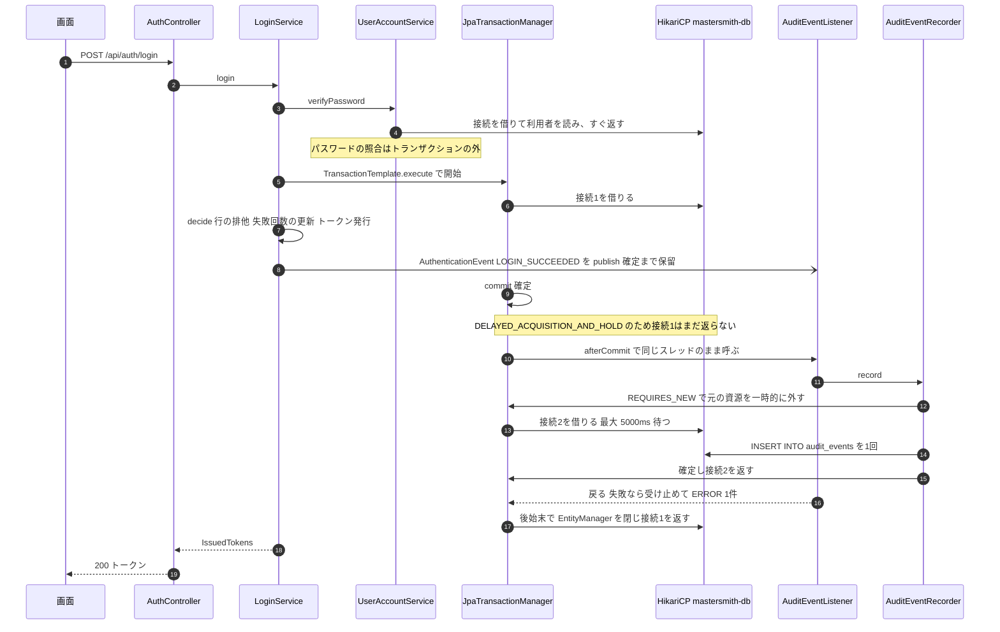
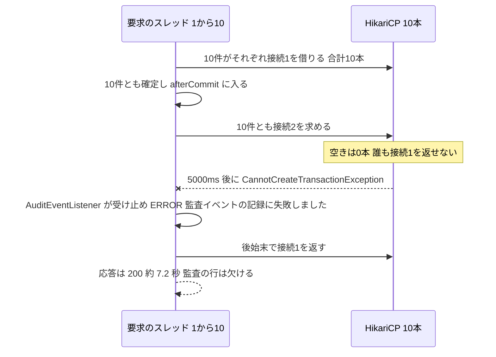
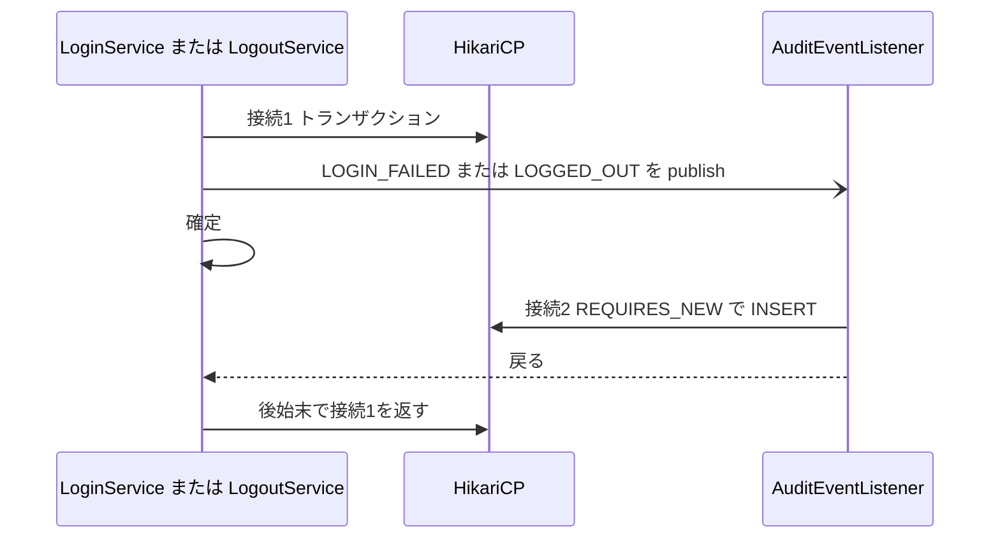

# アーキテクチャ（mastersmith2）

## System Overview

1つの Spring Boot アプリ（実行可能 WAR）に、React の SPA のビルド結果を同梱して配信する。API と画面は同じオリジンで、内部DBは同じプロセスの中の組み込み H2（ファイル保存）である。配備先は当面、開発者の PC 上のコンテナ1つ（`Dockerfile`・`compose.yaml`）。DB の接続は HikariCP のプール `mastersmith-db`（最大 10 本）1つを、業務処理・監査の書き込み・ヘルスチェックのすべてが共有する。

## Architectural Style

機能ごとに分けたモジュラーモノリス（層つき）。根拠:

- パッケージは機能（`auth`・`user`・`access`・`audit`・`common`・`config`）ごとに分かれ、各機能の中を `web`・`service`・`domain`・`repository` の層に分けている。
- 層と機能の境界は ArchUnit のテスト（`ArchitectureTest`・`AuthBoundaryArchitectureTest`・`AuditBoundaryArchitectureTest`）で確かめている。トランザクションの境界は `service` の層だけ、audit の `@Transactional` は `audit.service` だけ。
- 機能の間は、同じプロセスの中のアプリの出来事（`ApplicationEventPublisher`）で疎につないでいる。`auth` と `access` は出来事を publish するだけで、`audit` を直接呼ばない。
- 組み込み H2 のため、単一インスタンスが前提（前の Intent のドメイン設計の判断）。

## Component Relationships

図の文字での説明: 画面は `AuthController`（ログイン・更新・ログアウト）と `AdminCheckController` を呼ぶ。`LoginService` と `LogoutService` は `AuthenticationEvent` を、`AccessDeniedEventPublisher` は `AdminAccessDeniedEvent` を publish し、`AuditEventListener` が受け取って `AuditEventRecorder`（REQUIRES_NEW）経由で `AuditEventRepository` に追記する。すべての repository とヘルスチェックは同じプール `mastersmith-db`（最大 10 本）から接続を借り、その先は組み込み H2 である。

## Data Flow

- 要求 → `web`（入力検証と DTO の変換）→ `service`（トランザクションの境界。判定と書き込み）→ `repository`（Spring Data JPA ＋ Hibernate）→ HikariCP → H2。
- 監査: `service` のトランザクションの中で出来事を publish → 確定の後（AFTER_COMMIT）に同じスレッドで `AuditEventListener` → `AuditEventRecorder` が新しいトランザクションで `audit_events` に INSERT 1回。トランザクションの外で publish された出来事（`ACCESS_DENIED`）は `fallbackExecution = true` によりその場で受け取る。
- 応答のエラーは `GlobalExceptionHandler`（`@RestControllerAdvice`）で RFC 9457 Problem Details ＋ `code` に変換する。

## Key Design Decisions

| 決定 | 根拠と影響 |
|---|---|
| 監査は AFTER_COMMIT・同じスレッド・REQUIRES_NEW で追記する | 「確定の後に記録」「取り消されたら記録しない」「トレースIDの一致」を満たすため。元の接続を持ったまま2本目を借りることを「一時的に2本使う」として受け入れた（前の Intent の U4 の nfr-design）。これが F2 の原因である |
| 監査の失敗は受け止めて ERROR 1件、再試行しない | 操作を監査の失敗で止めない（BR3.1）。F2 でも応答は 200 のまま、監査の行だけが欠ける |
| `LoginService` はトランザクションを `TransactionTemplate` で明示する | パスワードの照合（重い処理）をトランザクションの外に出し、行の排他の時間を短くするため |
| 内部DBは組み込み H2 1つ、プールは `mastersmith-db` 1つ | 単一インスタンスの前提。業務・監査・ヘルスチェックが同じプールを奪い合う |
| JPA の `open-in-view: false` | 画面の描画まで接続を持ち越さない。ただし spring-orm の既定の `DELAYED_ACQUISITION_AND_HOLD` により、トランザクションの後始末まで接続は返らない |

### 接続のプールの現在の設定（修正の候補「プールの数を増やす」の評価の材料）

| 項目 | 値 | 場所 |
|---|---|---|
| プールの名前 | `mastersmith-db` | `backend/src/main/resources/application.yaml` 102 行 |
| 最大の接続数 `maximum-pool-size` | `10`（`MASTERSMITH_*` の専用の環境変数は無く、固定値。`compose.yaml`・`.env.example` にも口は無い） | 同 103 行 |
| 借りる待ちの上限 `connection-timeout` | `5000` ms | 同 105 行 |
| 最小の待機数・寿命などのほかの Hikari の値 | 設定なし（HikariCP 7.0.2 の既定） | — |
| `open-in-view` | `false` | 同 108 行 |
| 問い合わせの上限 `jakarta.persistence.query.timeout` | `10000` ms | 同 114 行 |
| Tomcat のスレッドの上限 | 設定なし（既定。プールの数より多い要求が同時に DB に来うる） | — |
| ヘルスチェックの DB の確認 | 同じプールから1本借りて `SELECT 1`。制限時間 `mastersmith.health.db-timeout`（既定 2s、同 28 行）を超えると DOWN | `common/health/TimeBoundedDbHealthIndicator.java` 127 行 |
| 結合テストのプール | 本番と同じ 10（`TestDatabase.register` は URL だけ差し替える） | `backend/src/test/java/cherry/mastersmith/common/testsupport/TestDatabase.java` |
| 実行環境の上限 | アプリのコンテナのメモリ `mem_limit: 1g`（前の Intent の F3 の前提） | `compose.yaml` 60 行（流し読み） |

## Interaction Diagrams

### ログインの成功（F2 が起きる経路）

文字での説明: (1) 照合のための短い借用は先に返る。(2) `TransactionTemplate.execute`（`LoginService.java` 119 行）で接続1を借り、`decide` の中で `LOGIN_SUCCEEDED` を publish する。(3) 確定の後、後始末の前の afterCommit で `AuditEventListener.onAuthenticationEvent`（87〜91 行、`@TransactionalEventListener(phase = AFTER_COMMIT, fallbackExecution = true)`、`@Order(HIGHEST_PRECEDENCE)`）が要求と同じスレッドで呼ばれる。(4) `AuditEventRecorder.record`（51〜54 行、`REQUIRES_NEW`）がプールから接続2を借りて INSERT 1回を確定し、接続2を返す。(5) 監査から戻った後の後始末で、はじめて接続1が返る。つまり 1 要求がこの区間で接続を2本同時に持つ。

### プールの枯渇（F2 の再現の形）

文字での説明: 同時の成功のログインがプールの数（10）に達すると、全員が接続1を持ったまま接続2を待ち、どれも返らない。`connection-timeout` の 5 秒後に 10 件とも監査の書き込みが失敗し、受け止められるため応答は 200 になる。この間、同じプールを使うヘルスチェックも接続を借りられず DOWN になりうる。

### ログインの失敗・ログアウト（同じ形の2本使い）

文字での説明: `LOGIN_FAILED`（`LoginService.java` 134・152 行）と `LOGGED_OUT`（`LogoutService.java` 76 行の `@Transactional` の中の 93 行）も同じく2本を同時に持つ。`TokenRefreshService.refresh`（74 行）は出来事を publish しないため1本だけ。`ACCESS_DENIED` はトランザクションの外で publish されるため1本だけ。

## Improvement Opportunities

- 監査の書き込みが元の接続を持ったまま2本目を借りる形の解消（F2。候補の比較は後の段で行う。守るべき既存の決まりは `code-quality-assessment.md` を参照）。
- ヘルスチェックが業務と同じプールを共有しているため、業務の枯渇がそのまま DOWN に見える点。
- Tomcat のスレッドの上限とプールの数の関係が設定で明示されていない点。
