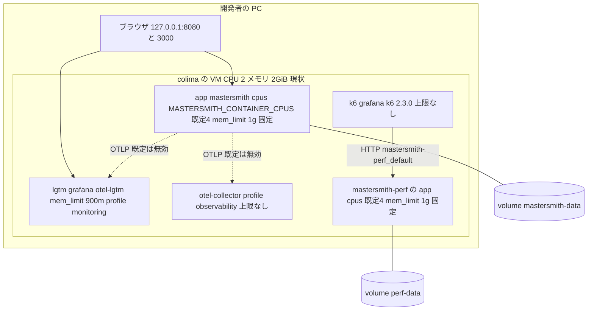
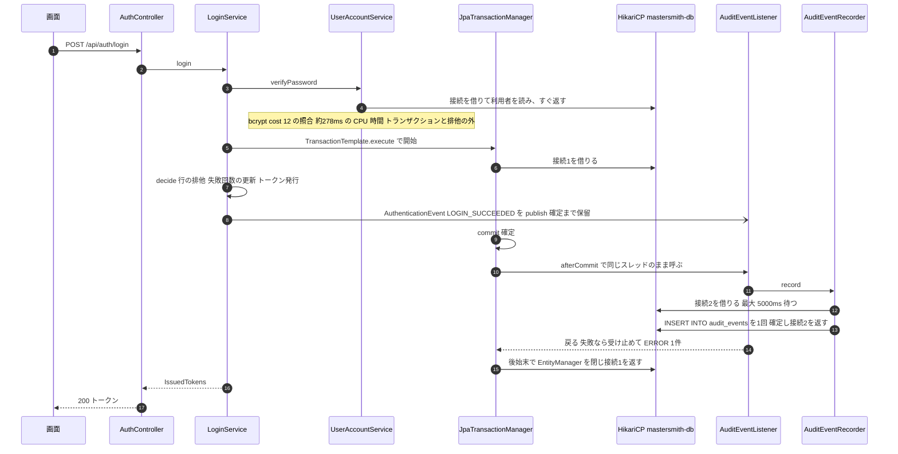
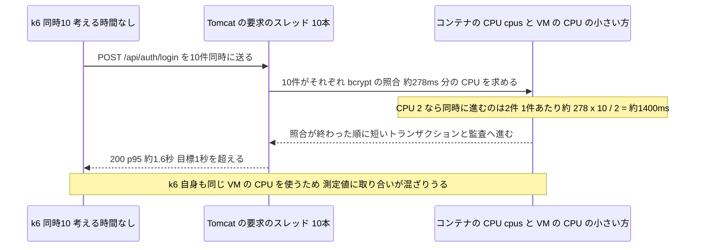
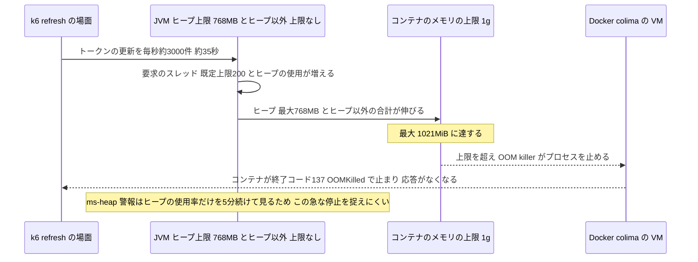
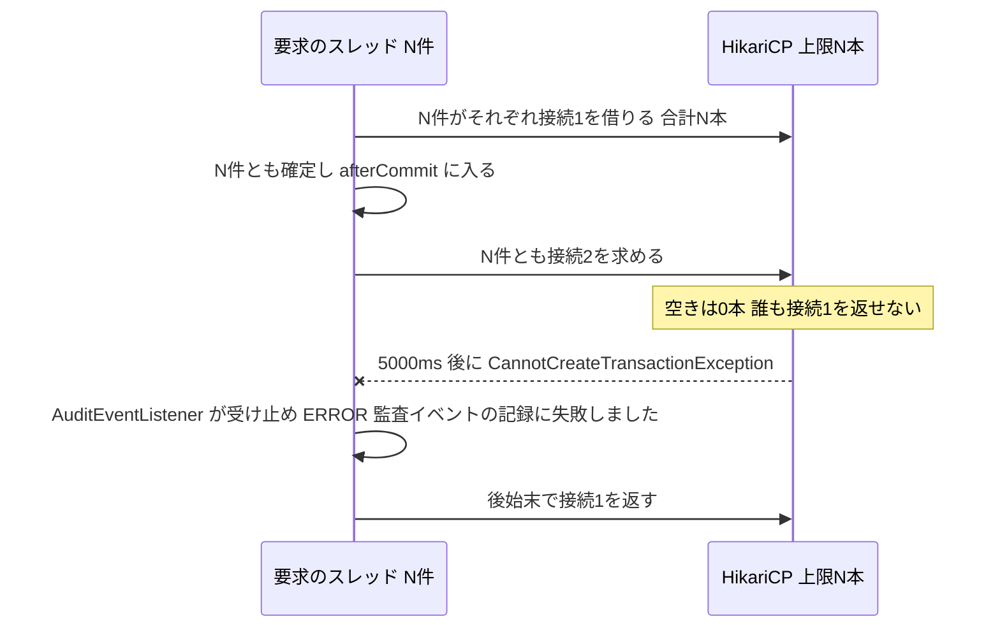

# アーキテクチャ（mastersmith2）

## System Overview

1つの Spring Boot アプリ（実行可能 WAR）に、React の SPA のビルド結果を同梱して配信する。API と画面は同じオリジンで、内部DBは同じプロセスの中の組み込み H2（ファイル保存）である。DB の接続は HikariCP のプール `mastersmith-db`（既定の上限 30 本、環境変数 `MASTERSMITH_DB_MAXIMUM_POOL_SIZE` で変更可）1つを、業務処理・監査の書き込み・ヘルスチェックのすべてが共有する。

配備先は当面、開発者の PC 上の colima の VM の中のコンテナである。同じ VM の中で、配備したアプリ（`compose.yaml`、プロジェクト名 `mastersmith`）、必要なときだけ起動する手元の監視（`lgtm`、profile `monitoring`）と OTLP の受け手（`otel-collector`、profile `observability`）、負荷の試験の使い捨ての環境（`docker/perf/compose.yaml`、プロジェクト名 `mastersmith-perf`）と k6 が、VM の CPU とメモリを分け合う。

## Architectural Style

機能ごとに分けたモジュラーモノリス（層つき）。根拠:

- パッケージは機能（`auth`・`user`・`access`・`audit`・`common`・`config`）ごとに分かれ、各機能の中を `web`・`service`・`domain`・`repository` の層に分けている。
- 層と機能の境界は ArchUnit のテスト（`ArchitectureTest`・`AuthBoundaryArchitectureTest`・`AuditBoundaryArchitectureTest`）で確かめている。トランザクションの境界は `service` の層だけ、audit の `@Transactional` は `audit.service` だけ。
- 機能の間は、同じプロセスの中のアプリの出来事（`ApplicationEventPublisher`）で疎につないでいる。`auth` と `access` は出来事を publish するだけで、`audit` を直接呼ばない。
- 組み込み H2 のため、単一インスタンスが前提（前の Intent のドメイン設計の判断）。コンテナも1つで、横に増やして負荷を分ける形は取れない。資源が足りないときは、1つのコンテナ（と VM）を縦に大きくするしかない。

## Component Relationships

### アプリの中

図の文字での説明: 画面は `AuthController`（ログイン・更新・ログアウト）と `AdminCheckController` を呼ぶ。`LoginService` と `LogoutService` は `AuthenticationEvent` を、`AccessDeniedEventPublisher` は `AdminAccessDeniedEvent` を publish し、`AuditEventListener` が受け取って `AuditEventRecorder`（REQUIRES_NEW）経由で `AuditEventRepository` に追記する。すべての repository とヘルスチェックは同じプール `mastersmith-db`（既定 30 本）から接続を借り、その先は組み込み H2 である。

### 実行環境（colima の VM の中）

図の文字での説明: VM（現状 CPU 2・メモリ 2GiB）の中に、配備したアプリ `app`（CPU の上限は環境変数、メモリの上限は 1g の固定値）、監視の `lgtm`（900m）、受け手の `otel-collector`、負荷の試験の `mastersmith-perf` の `app`（配備と同じ上限）と k6 が同居する。k6 と `otel-collector` には上限が無い。アプリからの OTLP の送信は既定で無効で、`.env` で有効にしたときだけ `lgtm` か `otel-collector` へ送る。ブラウザからは `127.0.0.1` の 8080（アプリ）と 3000（Grafana）だけに届く。VM が 2GiB では、アプリ 1g と使い捨ての環境 1g を同時に動かせないため、負荷の試験の間は配備したアプリを止める手順になっている（`perf/README.md` の手順 0）。

## Data Flow

- 要求 → `web`（入力検証と DTO の変換）→ `service`（トランザクションの境界。判定と書き込み）→ `repository`（Spring Data JPA ＋ Hibernate）→ HikariCP → H2。
- 監査: `service` のトランザクションの中で出来事を publish → 確定の後（AFTER_COMMIT）に同じスレッドで `AuditEventListener` → `AuditEventRecorder` が新しいトランザクションで `audit_events` に INSERT 1回。トランザクションの外で publish された出来事（`ACCESS_DENIED`）は `fallbackExecution = true` によりその場で受け取る。
- 応答のエラーは `GlobalExceptionHandler`（`@RestControllerAdvice`）で RFC 9457 Problem Details ＋ `code` に変換する。
- 観測: トレースIDはすべての要求に割り当てる（`management.tracing.sampling.probability` 既定 1.0）。OTLP の送信（トレース・ログ・指標）は `mastersmith.observability.export.enabled`（既定 false）1つで切り替え、送信は上限付きの待ち行列から要求と切り離して行う（`backend/src/main/java/cherry/mastersmith/config/ObservabilityConfig.java` の Javadoc）。指標は 60 秒ごとに送る（`application.yaml` 191 行）。

## Key Design Decisions

| 決定 | 根拠と影響 |
|---|---|
| 監査は AFTER_COMMIT・同じスレッド・REQUIRES_NEW で追記する | 「確定の後に記録」「取り消されたら記録しない」「トレースIDの一致」を満たすため。元の接続を持ったまま2本目を借りる（F2 の原因）。直し方としてはプールの上限を 30 に上げることを選び、形は変えていない（`aidlc/spaces/default/memory/project.md` の Decided） |
| 監査の失敗は受け止めて ERROR 1件、再試行しない | 操作を監査の失敗で止めない（BR3.1） |
| `LoginService` はトランザクションを `TransactionTemplate` で明示する | パスワードの照合（CPU の重い処理）をトランザクションと行の排他の外に出し、排他の時間を短くするため。その代わり、ログインの応答時間は照合の CPU 時間でほぼ決まる（F4） |
| パスワードのハッシュは bcrypt、cost 既定 12 | 照合1回 約 278ms（前の Intent の測定）。環境変数 `MASTERSMITH_AUTH_PASSWORD_BCRYPT_COST`（4〜31）で変えられる |
| 内部DBは組み込み H2 1つ、プールは `mastersmith-db` 1つ | 単一インスタンスの前提。業務・監査・ヘルスチェックが同じプールを分け合う |
| JPA の `open-in-view: false` | 画面の描画まで接続を持ち越さない。ただし spring-orm の既定の `DELAYED_ACQUISITION_AND_HOLD` により、トランザクションの後始末まで接続は返らない |
| イメージは WAR をコピーするだけの1段 | ビルドはイメージの外（Gradle）で行う。`.dockerignore` で WAR 1つだけを送る。JVM の起動の引数は `Dockerfile` の `ENTRYPOINT` に直書き |
| コンテナの CPU の上限は変数、メモリの上限は固定 | CPU は `${MASTERSMITH_CONTAINER_CPUS:-4}`（U2 の基盤の設計で U1 の 2 を 4 に上書き、照合の時間の目標は 4 が前提）。メモリは `mem_limit: 1g` を両方の compose に直書き |
| JVM の最大ヒープはコンテナのメモリの 75% | `-XX:MaxRAMPercentage=75.0`。1g なら最大ヒープ 768MB。ヒープ以外の上限とスレッドの上限は決めていない |

### 接続のプールの現在の設定

| 項目 | 値 | 場所 |
|---|---|---|
| プールの名前 | `mastersmith-db` | `backend/src/main/resources/application.yaml` 102 行 |
| 最大の接続数 `maximum-pool-size` | `${MASTERSMITH_DB_MAXIMUM_POOL_SIZE:30}`（以前は固定の 10） | 同 106 行 |
| 借りる待ちの上限 `connection-timeout` | `5000` ms（固定） | 同 108 行 |
| 最小の待機数・寿命などのほかの Hikari の値 | 設定なし（HikariCP の既定） | — |
| `open-in-view` | `false` | 同 111 行 |
| 問い合わせの上限 `jakarta.persistence.query.timeout` | `10000` ms | 同 117 行 |
| Tomcat のスレッドの上限 | 設定なし（既定の 200。README「既知の制約」） | — |
| ヘルスチェックの DB の確認 | 同じプールから1本借りて `SELECT 1`。制限時間 `mastersmith.health.db-timeout`（既定 2s、同 28 行）を超えると DOWN | `common/health/TimeBoundedDbHealthIndicator.java`（前回の記録） |

### 実行環境の資源の構成（F3・F4 の材料）

| 項目 | 値 | 場所 |
|---|---|---|
| colima の VM | CPU 2・メモリ 2GiB・aarch64（`colima list`。`docker info` は NCPU 2・MemTotal 約 1.9GiB） | PC の上の設定（リポジトリの外） |
| アプリのコンテナの CPU の上限 | `${MASTERSMITH_CONTAINER_CPUS:-4}` | `compose.yaml` 59 行、`docker/perf/compose.yaml` 50 行 |
| アプリのコンテナのメモリの上限 | `1g`（固定。変数なし） | `compose.yaml` 60 行、`docker/perf/compose.yaml` 51 行 |
| JVM の最大ヒープ | コンテナのメモリの 75%（1g で 768MB） | `Dockerfile` 34 行 `ENTRYPOINT` |
| ヒープ以外の上限（メタ領域・スレッドのスタック・直接バッファ等） | 指定なし | — |
| `JAVA_TOOL_OPTIONS` | どこにも設定なし | `Dockerfile`・両 compose・`.env.example`・README |
| 監視 `lgtm` のメモリの上限 | `900m`（コメント「VM 約 2GiB の中でアプリ 1GB と一緒に動かすため」） | `compose.yaml` 96〜97 行 |
| `otel-collector`・k6 の上限 | 指定なし | `compose.yaml` 69〜74 行、`perf/README.md` |
| 負荷の試験の CPU | 手順が `MASTERSMITH_CONTAINER_CPUS=2` を一時の `app.env` と `export` の両方に書く | `perf/README.md` 16・18 行 |
| 負荷の形 | k6 `constant-vus`、既定 同時 10・60 秒、考える時間なし、p95 は人が判定（`thresholds` なし） | `perf/k6/scenarios.js` 18・31〜43 行 |
| 前の測定（参考） | 通常の負荷でアプリのメモリ 353.8MiB（負荷中）・287.6MiB（配備後）。F3 では最大 1021MiB / 1GiB で OOMKilled（終了コード 137） | 前の Intent の記録（流し読み） |

## Interaction Diagrams

### ログインの成功（接続の2本使いと、照合の CPU 時間）

文字での説明: (1) `LoginService.login`（`backend/src/main/java/cherry/mastersmith/auth/service/LoginService.java` 117〜124 行）は、まず `userAccountService.verifyPassword` を1回呼ぶ（118 行）。照合は bcrypt（cost 既定 12、約 278ms）で CPU を使い、トランザクションと行の排他の外にある。(2) その後 `TransactionTemplate.execute`（119 行）で接続1を借り、`decide` の中で `LOGIN_SUCCEEDED` を publish する。(3) 確定の後、後始末の前の afterCommit で `AuditEventListener` が同じスレッドで呼ばれ、`AuditEventRecorder`（REQUIRES_NEW）が接続2を借りて INSERT 1回。(4) 後始末で接続1が返る。1 要求がこの区間で接続を2本同時に持つ（F2 の形。上限 30 で緩和）。

### 同時 10 件のログインでの CPU の分け合い（F4）

文字での説明: 照合は1件あたり約 278ms の CPU 時間を要し、同時 10 件を2つの CPU で分け合うと1件の待ちは約 1,400ms と見積もられ、実測の p95 は約 1.6 秒（F4）だった。使える CPU は「コンテナの `cpus`（`MASTERSMITH_CONTAINER_CPUS`）」と「VM の CPU の数」の小さい方で頭打ちになる。そのため VM の CPU を増やしても、`.env` の `MASTERSMITH_CONTAINER_CPUS` を上げなければ効かない（逆に、VM の CPU より大きい `cpus` は Docker が受け付けない）。k6 が同じ VM の中のコンテナで動くことも、測定値に影響しうる。CPU 4 での値は未測定。

### 高い負荷でのメモリの伸びとコンテナの停止（F3）

文字での説明: `refresh` の場面を毎秒約 3,000 件で約 35 秒流すと、コンテナが OOMKilled（終了コード 137、最大 1021MiB / 1GiB）で止まった（前の Intent の記録）。見立ては「最大ヒープ 768MB（1g の 75%）と、上限を決めていないヒープ以外（メタ領域・スレッドのスタック・コードキャッシュ・直接バッファ等）の合計が 1g を超える」。ヒープの割合は `Dockerfile` の `ENTRYPOINT`、メモリの上限は両 compose の固定値で決まるため、VM を大きくしてもこの2つを変えなければ同じ負荷で同じことが起きる見込み（未検証）。`refresh` の経路のコードは今回読んでおらず、メモリの伸びがコードに起因するかは未確認。`restart: "no"` のため止まったままになり、手元の監視では `ms-app-absent`（指標が 5 分届かない）が間接の検知になる。

### プールの枯渇（F2 の形。前回の記録）

文字での説明: 同時の成功のログインがプールの上限に達すると、全員が接続1を持ったまま接続2を待ち、5 秒後に監査の書き込みが失敗する。以前の上限 10 では同時 10 件で起きた。現在の上限は既定 30（README「既知の制約」）。同時の数を増やす試験をするときは、この上限にも近づく。

## Improvement Opportunities

事実としての所見だけを挙げる。直し方の決定は要件と設計の段で行う。詳細は `code-quality-assessment.md` の TD-6〜TD-11。

- コンテナのメモリの上限が固定値で、VM の大きさと切り離されている（TD-6）。
- JVM のヒープ以外の使用量とスレッドの数に上限が無い（TD-7）。
- JVM の起動の引数を配備ごとに変える口が無い（TD-8）。
- 設計の前提（CPU 4）と、この PC の実際（VM の CPU 2・メモリ 2GiB）、手順と文書の記述が食い違っている（TD-9）。
- 負荷の発生元（k6）と対象が同じ VM の資源を分け合う（TD-10）。
- コンテナ全体のメモリを見る監視が無い（TD-11）。
- （前回から引き継ぎ）監査の書き込みが元の接続を持ったまま2本目を借りる形、ヘルスチェックが業務と同じプールを共有する点、Tomcat のスレッドの上限とプールの上限の関係が設定で明示されていない点。
