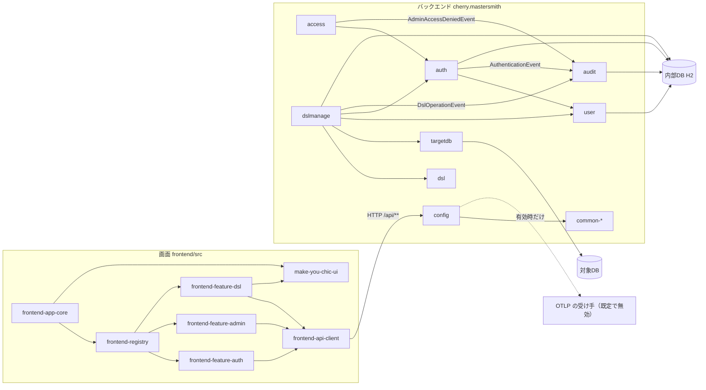
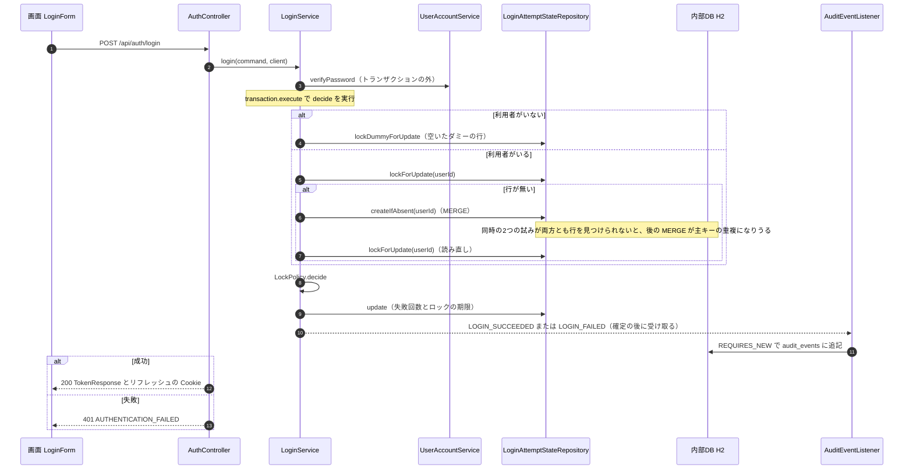
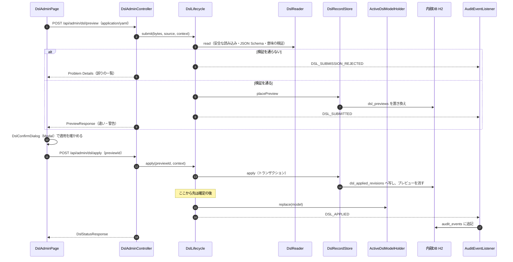
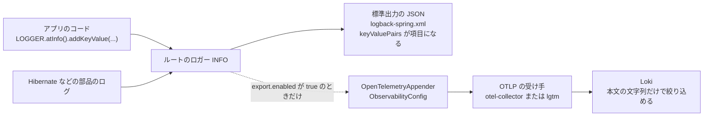

# アーキテクチャ（mastersmith2）

## Architecture Analysis

### System Overview

1つのプロセスの Web アプリケーションである。バックエンド（Java 25・Spring Boot 4.1.1）が REST API と、ビルド済みの画面（React の SPA）の配信の両方を受け持つ。成果物は画面のビルド結果（`frontend/dist`）を同梱した実行可能 WAR 1つで、コンテナ1つ（`Dockerfile`・`compose.yaml` の `app`）で動かす。

データの置き場は2種類ある。

- 内部DB: 組み込みの H2（ファイル保存、コンテナでは `/app/data`）。利用者・トークン・ロックの状態・監査ログ・DSL のプレビューと適用の履歴を置く。スキーマは Flyway（V1〜V6）が正本で、Hibernate は検証だけを行う。
- 対象DB: MySQL・MariaDB・PostgreSQL のどれか1つ（`MASTERSMITH_TARGET_DB_*` の設定）。スキーマを読むだけで、書き込まない。

外への送信は、既定で無効の OTLP の外部エクスポート（トレース・ログ・指標）だけである。

### Architectural Style

**モジュール分けしたモノリス（層構造）**である。

- パッケージが機能ごと（`auth`・`access`・`audit`・`user`・`targetdb`・`dsl`・`dslmanage`）と共通（`common`・`config`）に分かれ、各機能の中が `web`・`service`・`domain`・`repository` などの層になっている（`code-structure.md`）。
- 層と機能の境界は ArchUnit のテスト（`ArchitectureTest` と `*BoundaryArchitectureTest`、8 クラス）で確かめている。
- 機能の間は、差し込み口（Spring の Bean の一覧）とアプリの中の出来事（`ApplicationEventPublisher`）でつながる。`auth`・`access`・`dslmanage` は `audit` を知らない。
- HTTP セッションを作らない。認証は Bearer のアクセストークンで行う。

画面は SPA で、機能ごとの登録ファイル（`frontend/src/features/*/registration.ts`）を骨組み（`frontend/src/app/`）が読み込んで組み立てる。デザインシステム make-you-chic-ui を Git サブモジュールから `file:` 参照で取り込む。

### Component Relationships

文章による代替: 画面の骨組みが登録を通して認証・管理者向け領域・DSL の管理の3つの機能を差し込み、各機能は共通の API の呼び出しで同じオリジンの `/api/**` を呼ぶ。DSL の画面は make-you-chic-ui の `Modal`・`Alert` などを使う。バックエンドでは、`config` の1つのフィルターの連鎖に各機能が決まりを足す。`auth` は `user` で利用者を照合し、`access` は `auth` の主体を使う。`dslmanage` は `dsl`（読み込み・検証・適用中のモデル）と `targetdb`（対象DB のスキーマの読み取り）を使い、プレビューと履歴を内部DB に置く。`auth`・`access`・`dslmanage` は出来事を知らせ、`audit` が内部DB に追記する。`config` は外部エクスポートを有効にしたときだけ OTLP の受け手に送る。パッケージ間の依存の詳細は `dependencies.md`。

### Data Flow

1. 画面の要求は `apiFetch` がアクセストークン（メモリに保持）を `Authorization: Bearer` に付けて送る。
2. サーブレットのフィルター（本文の大きさの上限、Spring Security の連鎖、キャッシュの指定）を通り、コントローラー（`web`）が DTO を業務処理（`service`）の命令に変える。
3. トランザクションは `service` の層で始まり、`repository` の層が内部DB を読み書きする。DSL の管理では、対象DB を読むあいだ内部DB の接続を持ち続けないよう、トランザクションの境界を `DslRecordStore` に置いている。
4. 業務エラーは `BusinessException` として投げられ、`@RestControllerAdvice` の1か所で Problem Details（`code`・`traceId` 付き）に変わる。
5. 監査の対象の出来事は、確定の後に `audit` が別のトランザクション（`REQUIRES_NEW`、2本目の接続）で `audit_events` に追記する。
6. ログは標準出力に1行1件の JSON で出る（`logback-spring.xml`、キーと値は `<keyValuePairs/>` で項目になる）。外部エクスポートを有効にしたときだけ、ルートのロガーに OTLP の出力が足される（`ObservabilityConfig`）。

### Key Design Decisions

| 選択 | 内容 | 影響（今回の7件との関わり） |
|---|---|---|
| ログは標準出力の JSON が正、OTLP は有効時だけ足す | `OtlpLogAppenderInstaller` がルートのロガーに `OpenTelemetryAppender` を足す（`config/ObservabilityConfig.java` 67〜101 行） | 足す出力の設定は名前と文脈だけで、キーと値を属性として送る設定が無い（TD-1） |
| ロックの状態は1表・行ごとの排他 | 利用者の行とダミーの行を同じ表に置き、排他つきで読む。行が無ければ `MERGE` で作って読み直す | 行が無い利用者の同時の初めてのログインで、主キーの重複になりうる（TD-2） |
| 監査は確定の後・別トランザクション | `@TransactionalEventListener(AFTER_COMMIT)` と `REQUIRES_NEW` | 1要求で接続を2本使う（プールの上限 既定 30、README の既知の制約）。書き込みの失敗の ERROR に記録しようとした全項目を載せる（TD-1 の懸念） |
| 適用中の DSL のモデルは `dsl` が保持、差し替えは `dslmanage` | 後続の機能が `dsl` だけに依存できる | 起動時の読み込み（`DslStartupLoader`）の順序に依存する |
| 資源の上限は compose の既定と `.env` の上書き | CPU 既定 4、メモリ 既定 1g（`compose.yaml` 62〜63 行） | 10MB の DSL には 2g が要る（TD-5）。`app` は `.env` の全体を `env_file` で読む（TD-6） |
| デザインシステムはサブモジュールで固定 | 変更は make-you-chic-ui 側で行い、固定先を更新して取り込む（`project.md` の Forbidden・Mandated） | 閉じるボタンの文言と `aria-describedby` の直しは固定先の更新で取り込む（TD-7） |

### Improvement Opportunities

- 外部へ送るログの中身（キーと値）を確かめるテストが無い。送る値の決まり（秘密情報に加え、メールアドレスなど個人に関する値）を決めてから送る必要がある。
- ロックの状態の行の作成は、同時の作成への備え（重複の受け止めか、排他の取り方の変更）が要る。
- コンテナの既定の値（メモリの上限）は、compose・負荷の試験の compose・`.env.example`・README・確かめのスクリプトの5か所に散っている。
- 見本の対象DB のための秘密情報と、アプリの設定が同じ `.env` にある。

詳しくは `code-quality-assessment.md` を参照。

## Interaction Diagrams

### 1. ログインとロックの状態の行（`POST /api/auth/login`）

文章による代替: パスワードの照合はトランザクションの外で1回行う。その後の短いトランザクションで、利用者がいなければダミーの行を、いれば利用者の行を排他つきで読む。利用者の行が無いときは `MERGE` で作ってから読み直す。行が無い利用者が同時に2回ログインすると、どちらも行を見つけられずに `MERGE` を行い、後の方が主キーの重複となって想定外のエラー（500）になりうる（TD-2）。判定と更新の後、成功でも失敗でも出来事を知らせ、`audit` が確定の後に追記する。

### 2. DSL の投入・プレビュー・適用（`/api/admin/dsl/**`）

文章による代替: 画面は DSL のファイルを YAML のまま送る。`DslLifecycle` は `dsl` の読み込み口で検証し、通らなければ受け付けなかった投入を監査に知らせて誤りの一覧を返す。通ればプレビューを内部DB に置き、違いと警告を返す。画面は確かめの表示（make-you-chic-ui の `Modal`）で確認した後に適用を送る。適用は `DslRecordStore` のトランザクションで履歴へ写し、確定の後に適用中のモデルを差し替えて監査に知らせる。操作ごとに `DslOperationMetrics` がキーと値つきのログを出す（TD-1 で Loki から絞り込めない値）。この流れの中身は流し読みで確かめたものである。

### 3. ログの出力の道（TD-1・TD-4）

文章による代替: アプリのコードはキーと値の API でログを出し、部品（Hibernate など）のログと一緒にルートのロガー（INFO）へ入る。標準出力の JSON ではキーと値が項目になる。外部エクスポートを有効にしたときだけ OTLP の出力が足されるが、キーと値を属性として送る設定が無いため、Loki では本文の文字列でしか絞り込めない（TD-1）。ロガーごとの水準の指定は JDBC ドライバー3つだけで、`org.hibernate` の指定は無い（TD-4）。
