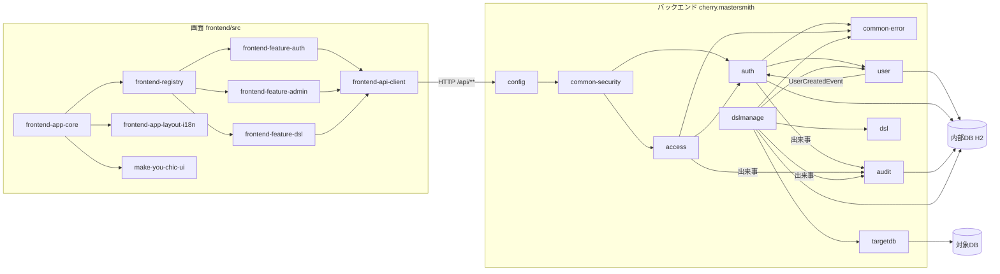
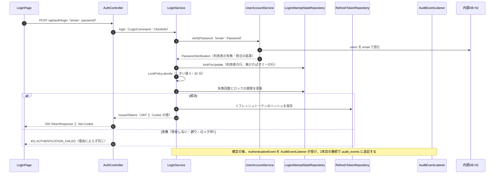
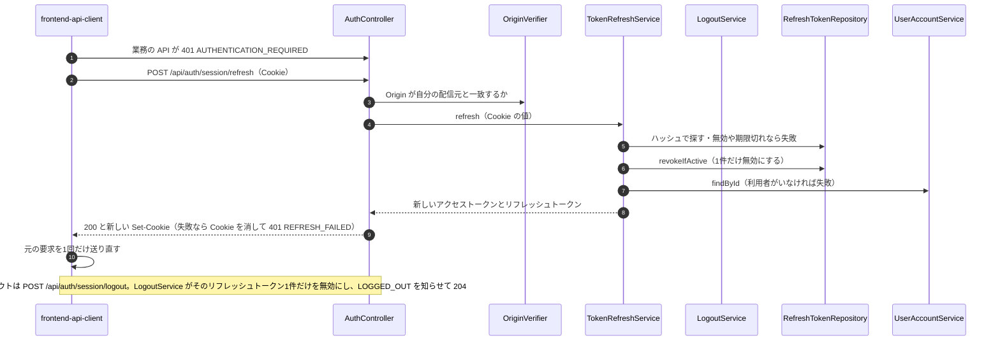
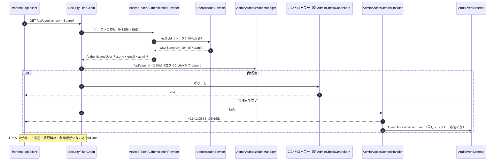
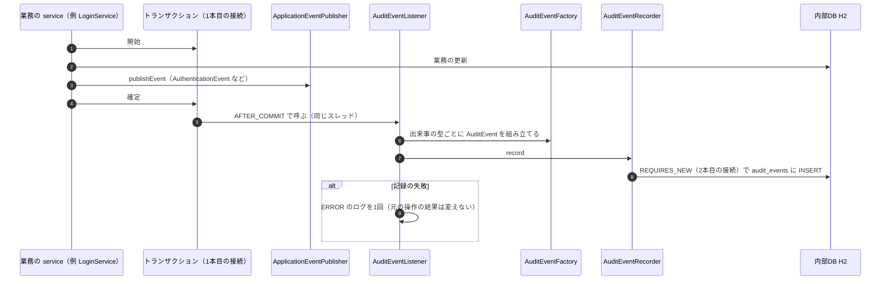

# アーキテクチャ（mastersmith2）

## Architecture Analysis

### System Overview

1つのプロセスの Web アプリケーションである。バックエンド（Java 25・Spring Boot 4.1.1）が REST API と、ビルド済みの画面（React の SPA）の配信の両方を受け持つ。成果物は画面のビルド結果を同梱した実行可能 WAR 1つで、コンテナ1つ（`Dockerfile`・`compose.yaml` の `app`）で動かす。JVM は `-XX:MaxRAMPercentage=50.0` で起動し（`Dockerfile` 45 行）、コンテナのメモリの上限（既定 2g、`compose.yaml` 63 行）の半分が最大ヒープになる。

データの置き場は2種類ある。

- 内部DB: 組み込みの H2（ファイル保存、コンテナでは `/app/data`、接続先 `jdbc:h2:file:./data/mastersmith;DEFRAG_ALWAYS=TRUE`）。利用者・リフレッシュトークン・ロックの状態・監査ログ・DSL のプレビューと適用の履歴を置く。スキーマは Flyway（V1〜V6）が正本で、Hibernate は検証だけ（`ddl-auto: validate`）。接続プールは HikariCP（上限 既定 30、借りる待ち 5 秒）。1インスタンスだけで動く前提である。
- 対象DB: MySQL・MariaDB・PostgreSQL のどれか1つ。スキーマを読むだけ（`targetdb`、今回は流し読み）。

外へ出ていく接続は、対象DB と、既定で無効の OTLP の送り先だけである。メールの送り先（SMTP）は無い（K-3、`technology-stack.md`）。

### Architectural Style

**モジュール分けしたモノリス（層構造）**である。パッケージが機能ごと（`auth`・`access`・`audit`・`user`・`targetdb`・`dsl`・`dslmanage`）と共通（`common`・`config`）に分かれ、各機能の中が `web`・`service`・`domain`・`repository` の層になる（`code-structure.md`）。境界は ArchUnit のテストで確かめている（`code-quality-assessment.md`）。

機能の間のつなぎ方は3つある（確かめた事実）。

- 直接の呼び出し: `auth` → `user.service`（照合と読み取り）、`access` → `auth`（検証済みの主体）など。向きは `dependencies.md`。
- 差し込み口（Bean の一覧）: `SecurityRuleContributor`（order 付き）・`ApiDefaultAccess`・`ProblemTypeCatalog`・`RequestBodyLimitRoute`。`config/SecurityConfig.java` が一覧を集めて組み立てる。
- アプリの中の出来事: `user` の `UserCreatedEvent` を `auth` が受けてロックの状態の行を作る。`auth`・`access`・`dslmanage` の出来事を `audit` が受けて記録する。

画面は機能ごとの `features/<id>/registration.ts` を自動で読み込み、URL・サイドバー・ユーザーメニュー・ログイン状態の提供元・文言を差し込む（`frontend-registry`）。

### Component Relationships

<!-- Text fallback: 画面の骨組み（frontend-app-core）が登録（frontend-registry）・レイアウトと表示言語・make-you-chic-ui を組み合わせ、登録から auth・admin・dsl の各画面を読み込む。各画面は frontend-api-client を通して同じオリジンの /api/** を呼ぶ。バックエンドでは config がセキュリティの連鎖を組み立て、common-security の差し込み口を通して auth（トークンの認証）と access（管理者の判定）の決まりを当てる。auth は user で利用者を照合し、access は auth の検証済みの主体を使う。dslmanage は dsl・targetdb・user を使う。user は利用者の作成を出来事で知らせ、auth がロックの状態の行を作る。auth・access・dslmanage の出来事を audit が受けて内部DB に記録する。想定内のエラーは common-error の仕組みで Problem Details になる。 -->

図は主な流れだけを描いた。パッケージ間の import の向きは `dependencies.md`、部品ごとの責務は `component-inventory.md` にある。

### Data Flow

1. 画面の要求は `Authorization: Bearer <アクセストークン>` を付けて送られる（リフレッシュトークンは `HttpOnly`・`Secure`・`SameSite=Strict`、Path `/api/auth/session` の Cookie）。
2. Spring Security の連鎖（`config/SecurityConfig.java`）: ヘッダーの設定 → トークンの認証（`auth`）→ アクセスの判定（公開の一覧 → 差し込み口の決まりを order 順 → `/api/**` はログイン必須 → それ以外は公開）→ 本文の大きさの上限（`RequestSizeLimitFilter`、判定の後）→ コントローラー（`web`）。
3. トランザクションは `service` の層で始まり、`repository` の層が内部DB を読み書きする。
4. 業務エラーは `BusinessException` と `ProblemType` で表し、`@RestControllerAdvice`（`common/error/web/GlobalExceptionHandler.java`）の1か所で Problem Details（`code`・`traceId` 付き、説明文は `Accept-Language` で日英）に変わる。フィルターの段階の 401・403 は `ErrorResponseWriter` が同じ形で書く。
5. 監査の対象の出来事は、確定の後に `audit` が別のトランザクション（`REQUIRES_NEW`、2本目の接続）で `audit_events` に追記する。

### Key Design Decisions

| 選択 | 内容（確かめた場所） | 今回の Intent との関わり |
|---|---|---|
| 状態を持たないトークンの認証 | セッションは STATELESS、CSRF は無効、アクセストークンは Authorization ヘッダーだけから読む（`SecurityConfig`・`AuthSecurityContributor`） | 登録の完了やパスワードの変更の API も同じ仕組みに乗る（K-6） |
| 要求ごとに利用者を内部DB から読む | `AccessTokenAuthenticationProvider` がトークンの利用者を `findById` で読み、管理者かどうかもその値で決める | 利用者の状態（招待中・無効など）を足すなら、ここで見る余地がある（K-2） |
| アクセストークンを失効させない | 失効の一覧を持たず、有効期限を短く（既定 5 分）する（`project.md` の DECIDED） | パスワードの変更の後も、発行済みのアクセストークンは期限まで使える（K-8） |
| 利用者の作成を出来事で auth に知らせる | `UserCreatedEvent` を `LoginAttemptStateInitializer` が `Propagation.MANDATORY` で受ける | 新しい登録の経路も `UserAccountService.createUser` を通せばロックの行ができる |
| 監査は確定の後に同じスレッドで2本目の接続 | `AuditEventListener`（`AFTER_COMMIT`、`fallbackExecution = true`）→ `AuditEventRecorder`（`REQUIRES_NEW`） | 監査に失敗しても元の操作は成功のまま。同時の数がプールの上限に近いと記録が欠けうる（README の既知の制約）。K-10 |
| 差し込み口で機能を足す | バックエンドは `SecurityRuleContributor` などの Bean、画面は `registration.ts` | 新しい機能を既存のファイルを大きく変えずに足せる |
| 画面の設定はデザインシステムに任せる | `App.tsx` が `ThemeProvider` を引数なしで置き、値は localStorage | 利用者ごとの保存とインスタンスの固定の値には、渡す道が要る（K-4） |

### Improvement Opportunities

- 監査の出来事の種類ごとに `audit` の中を変える形は、出来事が増えるほど `audit` の変更が増える（K-7）。共通の出来事の形にするかは、`project.md` の DECIDED のとおり後続の Intent で検討することになっている。
- 利用者の状態の確かめをログインとトークンの認証の2か所に書くと、片方の漏れが起きうる。確かめを `user` の1つの操作に寄せる形が考えられる（仮説。K-2）。
- 外への送信（メール）を入れると、今は無い「外の相手を待つ処理」が業務の流れに入る。トランザクションの外で送る形が考えられる（仮説。K-10）。

## Interaction Diagrams

### 1. ログイン（K-2 を含む）

<!-- Text fallback: 画面がメールアドレスとパスワードを送る。LoginService は UserAccountService で照合し、ロックの状態の行を行ロックで読み（存在しない利用者はダミーの行）、LockPolicy で成功・失敗・ロックを決めて行を更新する。成功ならリフレッシュトークンのハッシュを保存し、アクセストークンと Cookie を返す。失敗は理由によらず 401 AUTHENTICATION_FAILED。確定の後に監査の記録が別の接続で追記される。 -->

K-2（確かめた事実）: `LoginService.decide` は、利用者の有無・パスワードの照合の結果・ロックの状態だけで判断し、利用者の状態を見ない。`users` に状態の列が無いため（K-1）、今は見る対象も無い。招待中の利用者を同じ表に置く場合、ログインで拒否する確かめが今の流れには無い（推測: 状態の確かめを足す場所は `verifyPassword` の結果か `decide` のどちらか）。

### 2. トークンの更新とログアウト

<!-- Text fallback: 画面の API の呼び出しは 401 AUTHENTICATION_REQUIRED を受けると更新を1回だけ行う（同時の 401 は1つにまとめる）。更新は Origin の一致を確かめ、Cookie のリフレッシュトークンをハッシュで探し、有効ならその1件を無効にして、利用者がいれば新しいトークンの組を返す。失敗なら Cookie を消して 401。成功なら元の要求を1回だけ送り直す。ログアウトはそのリフレッシュトークン1件だけを無効にし、監査の出来事を知らせて 204 を返す。 -->

確かめた事実: 更新でも利用者の状態は見ず、`findById` で利用者がいれば通る。無効にするのは使ったトークン1件だけで、利用者のほかのリフレッシュトークンには触れない（K-8、`component-inventory.md` の `auth`）。更新には監査の出来事が無い。

### 3. 管理者の API の要求（認証と認可）

<!-- Text fallback: 管理者の API の要求は Bearer のトークンを付けて届く。AccessTokenAuthenticationProvider が署名と期限を確かめ、トークンの利用者を内部DB から読んで検証済みの主体を作る。AdminAuthorizationManager が /api/admin/** について、ログイン済みで admin であるかを確かめる。管理者ならコントローラーが呼ばれ、管理者でなければ 403 ACCESS_DENIED を返し、アクセス拒否の出来事を監査に知らせる。トークンが無いか不正なら 401。 -->

K-2 の続き（確かめた事実）: トークンの認証も `findById` で利用者がいれば通り、状態を見ない。

### 4. 監査の記録（K-10 を含む）

<!-- Text fallback: 業務の service はトランザクションの中で内部DB を更新し、出来事を知らせてから確定する。確定の後、同じスレッドで AuditEventListener が呼ばれ、AuditEventFactory が出来事の型ごとに監査の行を組み立て、AuditEventRecorder が REQUIRES_NEW の新しいトランザクション（2本目の接続）で audit_events に追記する。記録に失敗しても元の操作の結果は変わらず、ERROR のログが1回出る。 -->

K-10（事実と仮説）:

- 事実: 監査の記録は、確定の後に業務の接続を持ったまま2本目の接続を借りる（README の「既知の制約（同時の要求と接続プール）」、プールの上限 既定 30、借りる待ち 5 秒）。
- 仮説: 招待メールの送信（SMTP の待ち）を業務のトランザクションの中や、この確定の後の流れの中で行うと、送信の間も内部DB の接続を持ち続けうる。`project.md` の Corrections の「要求1件で接続を2本使う経路は、負荷の試験で確かめる」が当てはまる。送信の失敗を登録の結果にどう反映するか（登録を取り消すか、送り直せるようにするか）も、今の仕組みには前例が無い。
