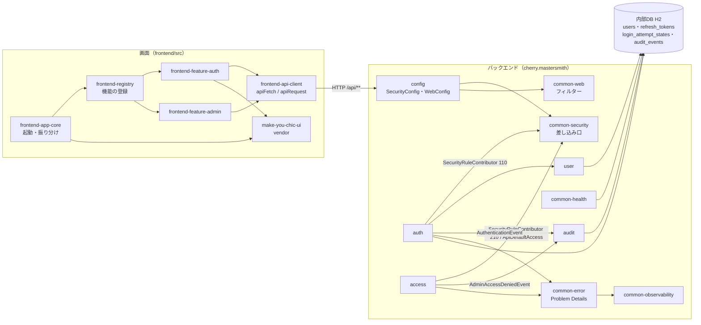
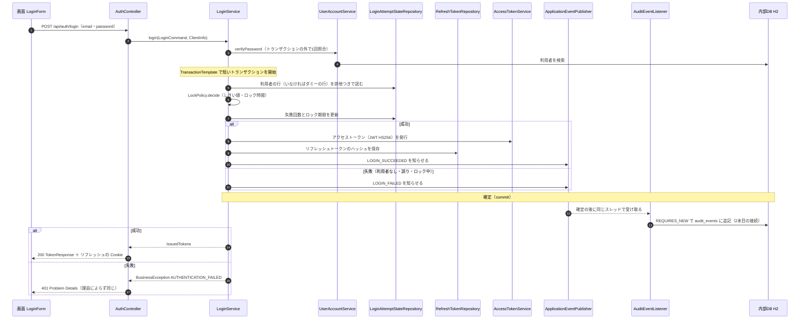
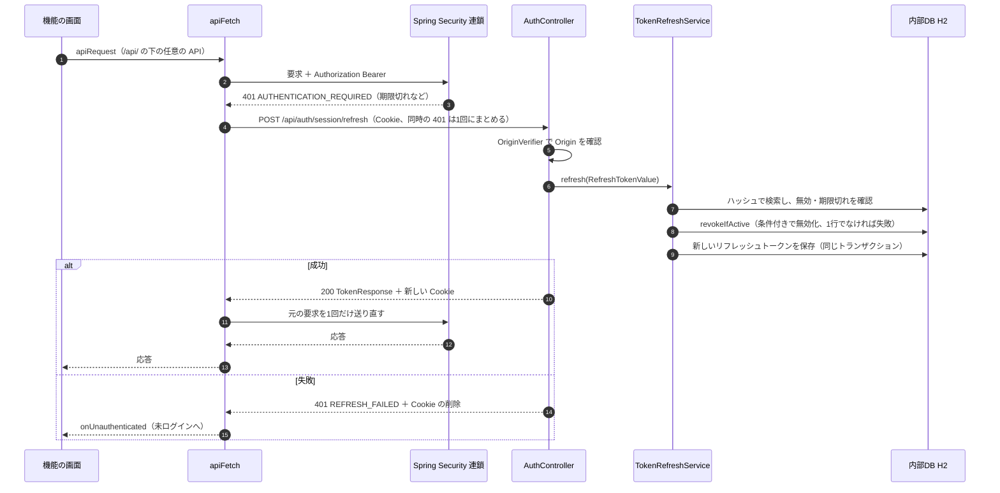
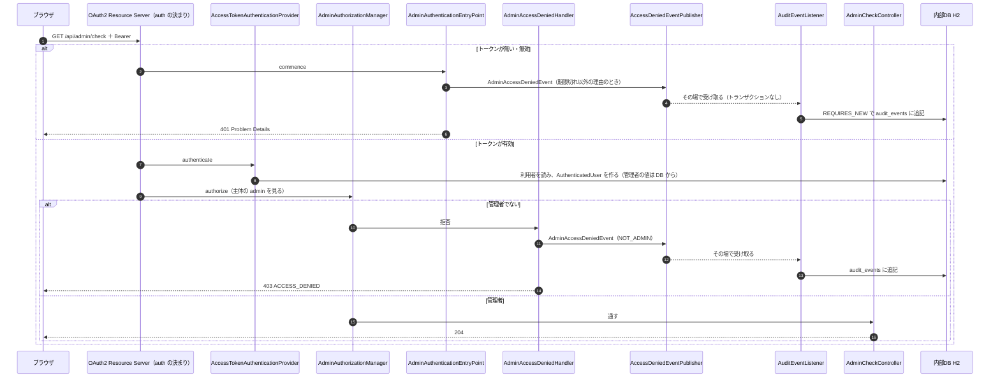
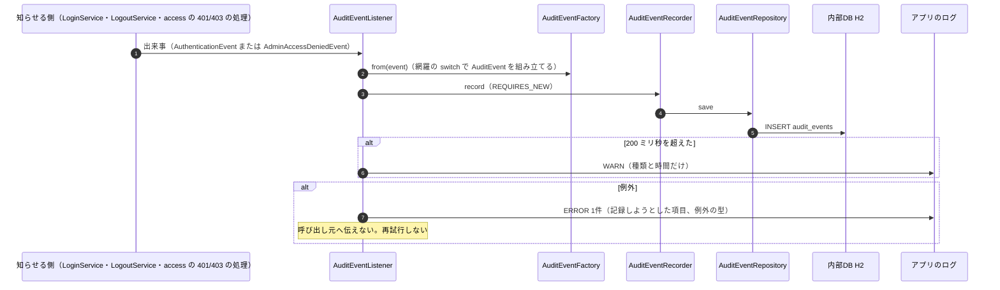
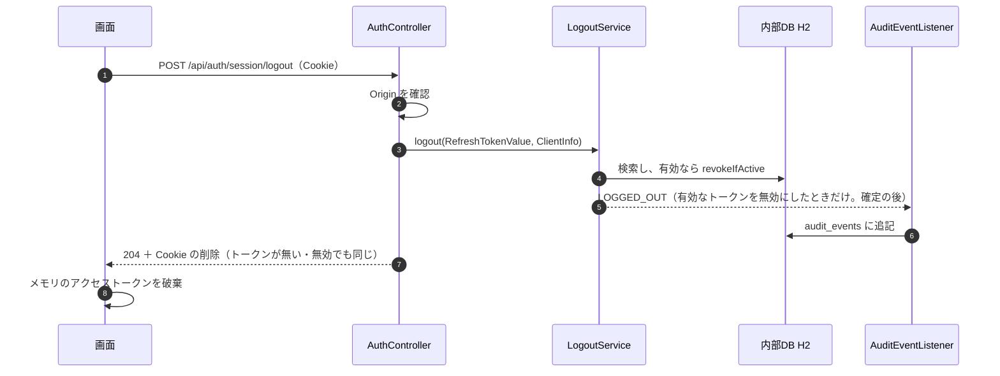

# アーキテクチャ（mastersmith2）

## Architecture Analysis

### System Overview

1つのプロセスの Web アプリケーションである。バックエンド（Java 25・Spring Boot 4.1.1）が、REST API と、ビルド済みの画面（React の SPA）の配信の両方を受け持つ。成果物は、画面のビルド結果（`frontend/dist`）を同梱した実行可能 WAR（`mastersmith.war`）1つで、コンテナ1つ（`Dockerfile`・`compose.yaml` の `app`）で動かす。

データの置き場は、組み込みの H2（ファイル保存、コンテナでは `/app/data`）の内部DBの1つだけである。スキーマは Flyway が正本で、Hibernate は検証（`ddl-auto: validate`）だけを行う。外部のシステムへの接続は無い。例外は、既定で無効の OTLP の外部エクスポートだけである。

### Architectural Style

**モジュール分けしたモノリス（層構造）**である。根拠は次のとおり。

- パッケージが機能ごと（`auth`・`access`・`audit`・`user`）と共通（`common`・`config`）に分かれ、各機能の中が `web`・`service`・`domain`・`repository` の層になっている（`code-structure.md`）。
- 層の境界は `backend/src/test/java/cherry/mastersmith/ArchitectureTest.java`（ArchUnit）でテストとして確かめられている（web は repository を使わない、`@Transactional` は service の層だけ、コントローラーはエンティティを返さない、コンストラクター注入だけ）。
- 機能の間は、直接の呼び出しより、差し込み口（Spring の Bean の一覧）とアプリの中の出来事（`ApplicationEventPublisher`）でつながっている。認証（`auth`）とアクセス制御（`access`）は、監査（`audit`）を知らない。
- 状態を持たない（HTTP セッションを作らない）。認証は Bearer のアクセストークンで行い、リフレッシュトークンだけを内部DBに保存する。

画面は SPA である。機能ごとの登録ファイル（`frontend/src/features/*/registration.ts`）を起動時に自動で読み込み、骨組み（`frontend/src/app/`）が画面・サイドバー・メニューを組み立てる。

### Component Relationships

文章による代替: 画面の骨組み（`frontend-app-core`）が登録（`frontend-registry`）を通して認証と管理者向け領域の機能を差し込む。各機能は共通の API 呼び出し（`frontend-api-client`）で同じオリジンの `/api/**` を呼ぶ。バックエンドでは、1つのフィルターの連鎖（`config` の `SecurityConfig`）に `auth`（order 110）と `access`（order 210）が差し込み口（`common-security`）を通して決まりを足す。`auth` は利用者（`user`）を読み、認証の出来事を知らせる。`access` はアクセス拒否の出来事を知らせる。`audit` はその両方を受け取って内部DBに追記する。エラー応答は `common-error` の1か所で作り、トレースIDを `common-observability` から添える。内部DBは H2 の1つだけで、`auth`・`user`・`audit`・`common-health` がこれを使う。

### Data Flow

1. 画面の要求は `apiFetch` がアクセストークン（メモリに保持）を `Authorization: Bearer` に付けて送る。リフレッシュトークンは HttpOnly の Cookie で、認証の API にだけ使われる。
2. サーブレットのフィルターの段階では、`RequestSizeLimitFilter`（本文の上限。既定 1MB、超えたら 413）、Spring Security の連鎖（Bearer の検証 → 認可）、`CacheControlFilter` を通る。
3. コントローラー（`web` の層）が DTO（`record`）を業務処理（`service` の層）の命令に変える。トランザクションは `service` の層で始まり、`repository` の層（Spring Data JPA と、H2 に依存する一部の生 SQL）が内部DBを読み書きする。
4. 業務エラーは `BusinessException` として投げられ、`GlobalExceptionHandler` が Problem Details（`code`・`traceId` 付き）に変える。フィルターの段階のエラーは `ErrorResponseWriter`（`DefaultErrorResponseWriter`）が同じ形で書く。
5. 認証とアクセス拒否の出来事は、アプリの中の出来事として知らされ、確定の後に `audit` が別のトランザクション（`REQUIRES_NEW`）で `audit_events` に追記する。

### Key Design Decisions

コードとコメントから読み取れる、既存の設計の選択である（番号は元の設計書の ADR・BR への参照で、コード中の Javadoc にある）。

| 選択 | 内容 | 影響 |
|---|---|---|
| フィルターの連鎖は1つ、機能が差し込む | `SecurityConfig` だけが連鎖を作り、機能は `SecurityRuleContributor` を order の順に足す。`/api/**` の既定（ログイン必須）は `ApiDefaultAccess` が1つだけ決める | 新しい API は既定でログインが必要。`/api/admin/**` に置けば管理者のみになる |
| 監査は出来事で疎結合 | `auth`・`access` は `ApplicationEventPublisher` で知らせるだけで、`audit` を知らない | 監査の対象を増やすには、出来事の型と `AuditEventFactory`・`AuditEventListener` の網羅の `switch` を増やす |
| 監査は確定の後、別トランザクション | `@TransactionalEventListener(AFTER_COMMIT, fallbackExecution = true)` と `REQUIRES_NEW` | ログインなどでは1要求で接続を2本使う（README の既知の制約。プールの上限は既定 30） |
| エラー応答は Problem Details＋`code` | `ProblemType` を機能ごとの `ProblemTypeCatalog` で登録し、起動時に `ProblemTypeRegistry` が重複を検査する | 拡張の項目は `code`・`traceId` だけ。複数のエラーを1つの応答で返す形は無い |
| 内部DB は組み込み H2 の1つ | Spring Boot の自動構成の `DataSource`・JPA・Flyway・ヘルスチェックがすべてこれに結び付いている | 2つ目の `DataSource`（対象DB）を足すと、自動構成の前提が変わる |
| 時刻は注入する `Clock` | `AuthClockConfig` が UTC の `Clock` の Bean を全体に提供する | テストで時刻を差し替えられる |
| メソッドの呼び出しの追跡 | `TraceAspect` が TRACE のときだけ引数と戻り値を文字列にする | 秘密情報を持つ型は `toString` で伏せ字にする決まりがある |

### Improvement Opportunities

- 対象DB を扱う層（接続・メタデータの読み取り・書き込み）を、内部DB の層と分けて置く場所が、まだ決まっていない。内部DB の生 SQL は H2 の方言に依存しているため、書き方を流用できない。
- 監査の仕組みは、認証とアクセス拒否に特化している（`project.md` の DECIDED により、共通化は業務データを扱う後続の Intent で検討することになっている）。
- 画面の振り分けは、登録した URL と完全に一致する1画面の表示だけである。プレビュー→適用のような段階を持つ画面の URL の扱いは、機能の側で工夫が要る。

詳しくは `code-quality-assessment.md` を参照。

## Interaction Diagrams

### 1. ログイン（`POST /api/auth/login`）

文章による代替: パスワードの照合はトランザクションの外で1回だけ行う。その後、短いトランザクションで、ロックの状態の行（利用者がいなければダミーの行）を排他つきで読み、`LockPolicy` で判定して更新する。成功ならトークンを発行してリフレッシュトークンのハッシュを保存する。成功でも失敗でも、同じトランザクションの中で出来事を知らせる。受け取り側（`audit`）は確定の後に、新しいトランザクションで監査の行を追記する。失敗の応答は理由によらず 401 / `AUTHENTICATION_FAILED` である。

### 2. トークンの更新と、画面側の自動の送り直し

文章による代替: 画面の `apiFetch` は、401 で `code` が `AUTHENTICATION_REQUIRED` のときだけ、更新の API を1回呼ぶ。同時に起きた 401 は、1つの更新にまとめる。サーバーは Origin を確かめ、使ったリフレッシュトークンを条件付きで無効にし、同じトランザクションで新しいものを保存する。成功なら画面は元の要求を1回だけ送り直し、失敗なら未ログインとして扱う。更新は監査の対象ではない（出来事を知らせない）。

### 3. 管理者向け API の認可（401・403・200）とアクセス拒否の監査

文章による代替: `/api/admin` と `/api/admin/**`（`AdminPaths`）は、`access` の決まり（order 210）で管理者のみになる。トークンが無い・無効なら 401 の入口（`AdminAuthenticationEntryPoint`）が、管理者のみのパスで理由が有効期限切れでないときに、アクセス拒否の出来事を知らせてから、`auth` の入口に応答の書き出しを任せる。トークンが有効なら、利用者を内部DBから読んで主体を作り、`AdminAuthorizationManager` が主体の管理者の値で判断する。管理者でなければ 403 の処理が出来事を知らせてから 403 を返す。出来事はトランザクションの外で知らされるため、`audit` は要求と同じスレッドで、応答を書く前にその場で追記する。

### 4. 監査の記録（共通の部分）

文章による代替: 受け取り側は最優先の順で受け取り、組み立て・追記・確定のすべての失敗を受け止めて ERROR を1件出す。呼び出し元の操作は失敗させず、再試行もしない。成功したときは、監査の内容をアプリのログに出さない（二重の記録にしない）。

### 5. ログアウト（`POST /api/auth/session/logout`）

文章による代替: ログアウトは、有効なリフレッシュトークンだけを無効にして `LOGGED_OUT` を知らせる。トークンが無い・無効でも応答は同じ 204 である。アクセストークンは失効させない（有効期限まで使える。既定 5 分）。
