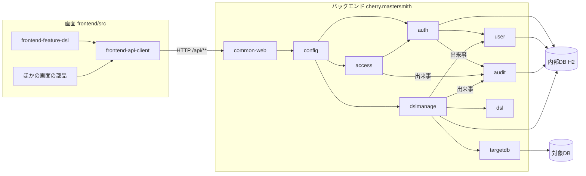
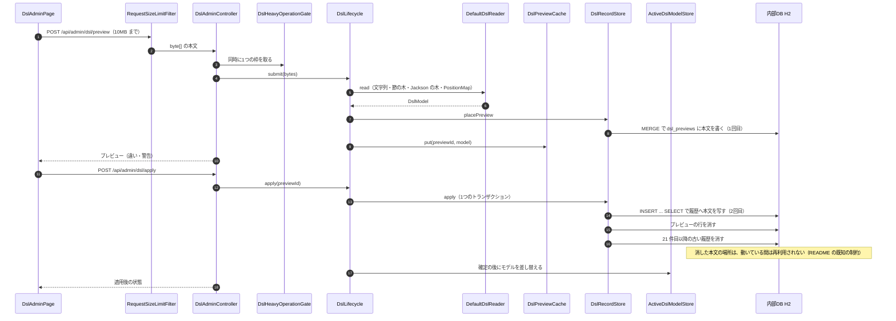
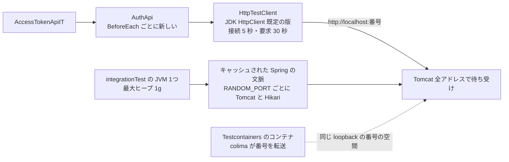

# アーキテクチャ（mastersmith2）

## Architecture Analysis

### System Overview

1つのプロセスの Web アプリケーションである。バックエンド（Java 25・Spring Boot 4.1.1）が REST API と、ビルド済みの画面（React の SPA）の配信の両方を受け持つ。成果物は画面のビルド結果を同梱した実行可能 WAR 1つで、コンテナ1つ（`Dockerfile`・`compose.yaml` の `app`）で動かす。JVM は `-XX:MaxRAMPercentage=75.0` で起動し、コンテナのメモリの上限（既定 2g）の 75%（約 1.5GiB）が最大ヒープになる。

データの置き場は2種類ある。

- 内部DB: 組み込みの H2 2.4.240（ファイル保存、コンテナでは `/app/data`、接続先 `jdbc:h2:file:./data/mastersmith;DEFRAG_ALWAYS=TRUE`）。利用者・トークン・ロックの状態・監査ログ・DSL のプレビューと適用の履歴を置く。スキーマは Flyway（V1〜V6）が正本。接続プールは HikariCP（上限 既定 30）。
- 対象DB: MySQL・MariaDB・PostgreSQL のどれか1つ。スキーマを読むだけ。

### Architectural Style

**モジュール分けしたモノリス（層構造）**である。パッケージが機能ごと（`auth`・`access`・`audit`・`user`・`targetdb`・`dsl`・`dslmanage`）と共通（`common`・`config`）に分かれ、各機能の中が `web`・`service`・`domain`・`repository` などの層になる（`code-structure.md`）。境界は ArchUnit のテストで確かめている。機能の間は差し込み口（Bean の一覧）とアプリの中の出来事でつながり、`audit` は出来事の型にだけ依存する。

### Component Relationships

文章による代替: 画面の各機能は共通の API の呼び出し（`frontend-api-client`）で同じオリジンの `/api/**` を呼ぶ。要求はまず `common-web` のフィルター（本文の大きさの上限など）と `config` のセキュリティの連鎖を通り、各機能のコントローラーに届く。`auth` は `user` で利用者を照合し、`access` は `auth` の主体を使う。`dslmanage` は `dsl`（読み込み・検証・適用中のモデル）と `targetdb`（対象DB のスキーマの読み取り）を使い、プレビューと履歴を内部DB に置く。`auth`・`access`・`dslmanage` は出来事を知らせ、`audit` が確定の後に内部DB に追記する。パッケージ間の依存の詳細は `dependencies.md`。

### Data Flow

1. 画面の要求は `Authorization: Bearer` を付けて送られ、サーブレットのフィルター、Spring Security の連鎖を通ってコントローラー（`web`）に届く。
2. トランザクションは `service` の層で始まり、`repository` の層が内部DB を読み書きする。DSL の管理では、対象DB を読むあいだ内部DB の接続を持ち続けないよう、トランザクションの境界を `DslRecordStore` に置く。
3. 業務エラーは `@RestControllerAdvice` の1か所で Problem Details（`code`・`traceId` 付き）に変わる。
4. 監査の対象の出来事は、確定の後に `audit` が別のトランザクション（2本目の接続）で追記する。

### Key Design Decisions

| 選択 | 内容 | 影響（今回の4件との関わり） |
|---|---|---|
| DSL の本文をバイト列のまま BLOB に置く | `dsl_previews.yaml_bytes`・`dsl_applied_revisions.yaml_bytes`（`V5`） | 識別とダウンロードが一致する代わりに、投入と適用で本文を2回書く（TD-1） |
| 適用はプレビューの行を `INSERT ... SELECT` で履歴へ写す | 10MB の本文をアプリに読み直さない（`DslAppliedRevisionRepository` の `COPY_SQL`） | DB の中で本文がもう1つ増える。H2 の SQL に依存する（TD-1） |
| 内部DB の詰め直しは閉じるときだけ | `DEFRAG_ALWAYS=TRUE`（`application.yaml` 137 行） | 動いている間はファイルが縮まない（TD-1、README の既知の制約） |
| 読み込みは節の木と位置の対応表を作る | `SafeYamlParser`（SnakeYAML の `Composer`）→ Jackson の木と `PositionMap` | 誤りの行と列を示せ、上限を検査できる代わりに、1回の投入で本文の数倍の形が同時に生きる（TD-2） |
| モデルを2つ持ち続ける | 適用中（`ActiveDslModelStore`）とプレビュー（`DslPreviewCache`）、どちらも `AtomicReference` の1件 | 10MB の DSL なら両方が大きい（TD-2） |
| 重い操作は同時に1つ | `DslHeavyOperationGate` | 投入の読み込みのメモリは同時に1つ分に抑えられるが、ログインなどほかの要求とは重なる（TD-2） |
| 結合テストは1つの JVM で文脈をキャッシュ | `integrationTest` は最大ヒープ 1g、`RANDOM_PORT` の文脈がそれぞれ Tomcat と Hikari を持つ | 一時的な失敗の候補の1つ（TD-3） |

### Improvement Opportunities

- 本文を1か所に置き、プレビューと履歴は識別で指す形にすれば、DB の中の複写が減る（未検証。後方互換の制約は `code-quality-assessment.md` の TD-1）。
- 読み込みの途中の形（文字列・節の木・Jackson の木・位置の対応表）を同時に持つ時間を短くする余地がある。ただし上限の検査と誤りの位置を保つ必要がある。
- `DslLifecycle`（462 行）は DSL の管理の操作をすべて持つ。

詳しくは `code-quality-assessment.md` を参照。

## Interaction Diagrams

### 1. DSL の投入と適用で本文が書かれる道（TD-1・TD-2）

文章による代替: 投入の本文は大きさの上限のフィルターを通ってコントローラーに `byte[]` で届き、重い操作の枠を取ってから `DslLifecycle` が読み込みと検証を行う。通れば `MERGE` でプレビューの行に本文を書き（1回目）、モデルをプレビューの置き場に持つ。適用では、1つのトランザクションでプレビューの本文を `INSERT ... SELECT` で履歴へ写し（2回目）、プレビューの行と古い履歴を消す。確定の後に適用中のモデルを差し替える。消した本文の場所が動いている間に再利用されないため、内部DB のファイルが伸び続ける（TD-1）。読み込みの途中の形は TD-2。

### 2. 結合テストの HTTP の道（TD-3）

文章による代替: 結合テストは1つの JVM（最大ヒープ 1g）で動き、Spring の文脈がキャッシュされて `RANDOM_PORT` ごとに組み込みの Tomcat と Hikari のプールを持ち続ける。`AccessTokenApiIT` は毎回新しい `AuthApi`（新しい JDK の `HttpClient`）で `http://localhost:<番号>` に送る。Tomcat は全アドレスで待ち受け、Testcontainers のコンテナの番号は colima が PC の loopback へ転送するため、番号の空間を共有する。失敗の原因の候補（負荷・番号の衝突・資源の使い過ぎ）はどれも未検証で、`code-quality-assessment.md` の TD-3 に書いた。
