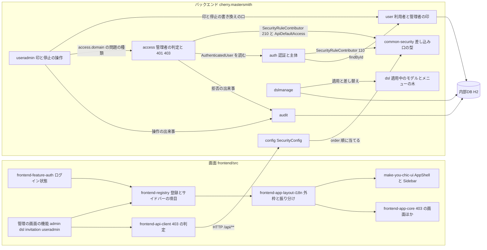
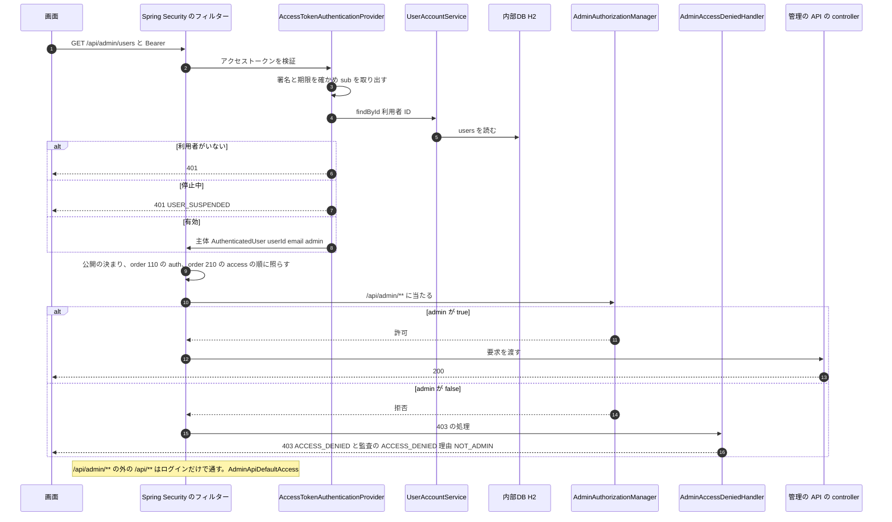
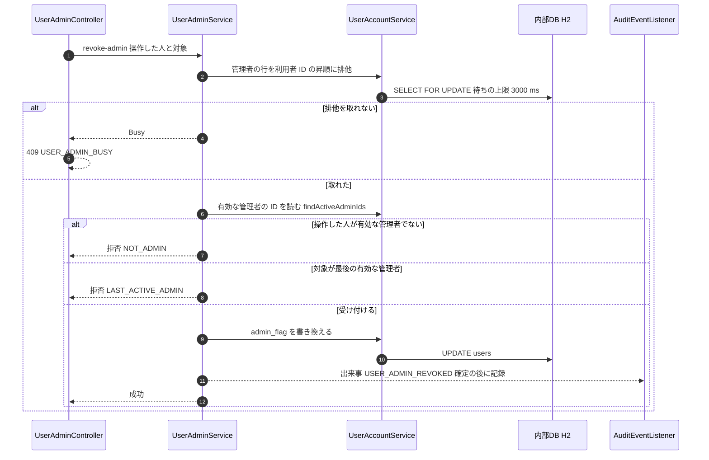
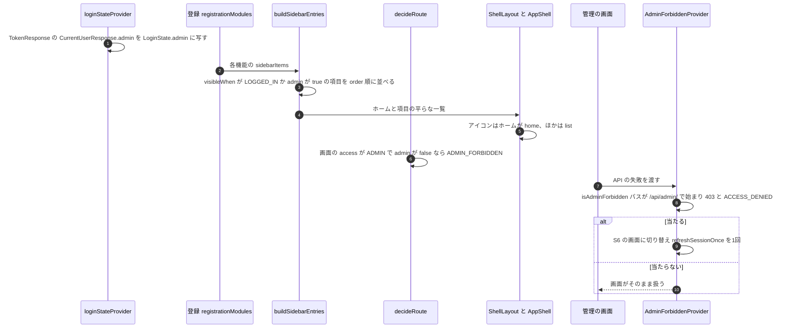
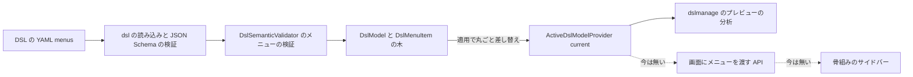

# アーキテクチャ（mastersmith2）

パスは、`backend/src/main/java/cherry/mastersmith/` の下のものはそれを省いて書く（画面・テスト・設定・移行・`vendor/` のファイルは省かない）。部品ごとの責務と読みの深さは `component-inventory.md`、依存の向きは `dependencies.md`。

## Architecture Analysis

### System Overview

1つのプロセスの Web アプリケーションである。バックエンド（Java 25・Spring Boot 4.1.1）が REST API と、ビルド済みの画面（React の SPA）の配信の両方を受け持つ。成果物は画面のビルド結果を同梱した実行可能 WAR 1つで、コンテナ1つ（`Dockerfile`・`compose.yaml` の `app`）で動かす。

- 内部DB: 組み込みの H2（ファイル）。利用者・ロックの状態・リフレッシュトークン・監査ログ・DSL・招待を置く。スキーマは Flyway の V1〜V9（前進のみ）が正本で、次に足す移行は V10 になる。単一インスタンスの前提（前回までの記録）。
- 認証: `Authorization: Bearer <アクセストークン>`（HS256 の JWT）。セッションと CSRF の仕組みは無い。アクセストークンの主張は `sub`（利用者 ID）・`iat`・`exp` だけで、権限は入っていない（`auth/service/AccessTokenService.java` 92〜96 行）。
- 認可: 要求ごとに利用者を DB から読み直して主体を作り、URL の決まりで判定する。権限は「管理者の印」1つ（K-32・K-33、Interaction Diagrams 1）。
- 画面: 機能ごとの `registration.ts` を骨組みが読み込み、サイドバー・振り分け・403 の画面を組み立てる。外枠は make-you-chic-ui の `AppShell`（K-35・K-36）。
- 対象DB: MySQL・MariaDB・PostgreSQL のどれか1つ。スキーマを読むだけ（流し読み）。
- 外へ出る接続: 対象DB、SMTP（手元では Mailpit）、既定で無効の OTLP の送り先。

### Architectural Style

**モジュール分けしたモノリス（層構造）**である。パッケージが機能ごと（`auth`・`access`・`audit`・`user`・`useradmin`・`invitation`・`mail`・`appearance`・`targetdb`・`dsl`・`dslmanage`）と共通（`common`・`config`）に分かれ、各機能の中が `web`・`service`・`domain`・`repository` の層（と用途名の下位パッケージ）になる（`code-structure.md`）。

根拠（今回確かめた範囲）:

- 層の決まりは全体の `backend/src/test/java/cherry/mastersmith/ArchitectureTest.java` が、機能の間の向きは機能ごとの `*BoundaryArchitectureTest` が ArchUnit で確かめる。境界テストは 10 個あり、`access` には無い（K-38）。
- 機能の間は、直接の呼び出し（service の口）・差し込み口（`common/security/SecurityRuleContributor`・`ApiDefaultAccess` の Bean）・アプリの中の出来事（Spring の `ApplicationEventPublisher`）でつなぐ。各機能の出来事を `audit` が確定の後に受ける。
- 画面も同じ考え方で、機能は `features/<featureId>/registration.ts` で骨組みの4つの差し込み口（画面・サイドバーの項目・ユーザーメニューの項目・ログイン状態の提供元）に登録し、骨組みのファイルは書き換えない（`frontend/src/app/registry/types.ts`）。

### Component Relationships

```mermaid
flowchart LR
  subgraph FE["画面 frontend/src"]
    REG["frontend-registry 登録とサイドバーの項目"]
    LAY["frontend-app-layout-i18n 外枠と振り分け"]
    CORE["frontend-app-core 403 の画面ほか"]
    FAUTH["frontend-feature-auth ログイン状態"]
    FADM["管理の画面の機能 admin dsl invitation useradmin"]
    APIC["frontend-api-client 403 の判定"]
    MYC["make-you-chic-ui AppShell と Sidebar"]
  end
  subgraph BE["バックエンド cherry.mastersmith"]
    CFG["config SecurityConfig"]
    SEC["common-security 差し込み口の型"]
    AUTH["auth 認証と主体"]
    ACC["access 管理者の判定と 401 403"]
    USER["user 利用者と管理者の印"]
    UA["useradmin 印と停止の操作"]
    AUDIT["audit"]
    DSL["dsl 適用中のモデルとメニューの木"]
    DSLM["dslmanage"]
  end
  H2[("内部DB H2")]

  FADM --> REG
  FAUTH --> REG
  REG --> LAY
  LAY --> MYC
  LAY --> CORE
  FADM --> APIC
  APIC -- "HTTP /api/**" --> CFG
  CFG -- "order 順に当てる" --> SEC
  AUTH -- "SecurityRuleContributor 110" --> SEC
  ACC -- "SecurityRuleContributor 210 と ApiDefaultAccess" --> SEC
  AUTH -- "findById" --> USER
  ACC -- "AuthenticatedUser を読む" --> AUTH
  UA -- "印と停止の書き換えの口" --> USER
  UA -- "access.domain の問題の種類" --> ACC
  ACC -- "拒否の出来事" --> AUDIT
  UA -- "操作の出来事" --> AUDIT
  DSLM -- "適用と差し替え" --> DSL
  USER --> H2
  AUDIT --> H2
  DSLM --> H2
```

<!-- Text fallback: 画面では、管理の画面の機能（admin・dsl・invitation・useradmin）と frontend-feature-auth（ログイン状態の提供元）が frontend-registry に登録し、frontend-app-layout-i18n がそれを使って外枠（make-you-chic-ui の AppShell と Sidebar）と振り分けを組み立て、403 の画面は frontend-app-core が出す。管理の画面は frontend-api-client で同じオリジンの /api/** を呼び、403 の判定もそこにある。バックエンドでは config の SecurityConfig が common-security の差し込み口（SecurityRuleContributor と ApiDefaultAccess）を order の順に当てる。auth は order 110、access は order 210 の決まりと /api/** の既定を置く。auth は user の findById で利用者を読み直して主体 AuthenticatedUser を作り、access はその主体の admin を見る。useradmin は user の印と停止の書き換えの口と、access.domain の問題の種類を使う。access の拒否と useradmin の操作の出来事を audit が受けて内部DB に記録する。dslmanage は dsl の適用中のモデル（メニューの木を含む）を差し替える。 -->

図は今回の Intent の論点（認可・管理者の印・画面の出し分け・メニュー）を中心に描いた。`invitation`・`appearance`・`mail`・`targetdb`・`common-error` などは省いた（一覧は `component-inventory.md`、依存の向きの全体は `dependencies.md`）。

### Data Flow

1. 画面の要求は `Authorization: Bearer <アクセストークン>` を付けて送られる。
2. アクセストークンの認証（`auth/web/AccessTokenAuthenticationProvider.java`）はフィルターの中で動き、`sub` の利用者 ID から `UserAccountService.findById` で利用者を読み直し、停止中なら 401（`USER_SUSPENDED`）、そうでなければ主体 `AuthenticatedUser(userId, email, admin)` を作る（K-32）。
3. URL の決まり（`SecurityConfig` の公開の決まり → contributor の order 順 → `/api/**` の既定 → 画面の配信）で判定する。`/api/admin/**` は `AdminAuthorizationManager` が主体の `admin` を見る（K-33）。
4. トランザクションは `service` の層で始まる。新しい機能の業務処理は想定内の失敗を結果の型で返し、controller が `BusinessException` に変え、`common/error/web/GlobalExceptionHandler.java` が Problem Details にする（前回までの記録）。
5. 監査の対象の出来事は業務のトランザクションの中で知らせ、`audit/service/AuditEventListener.java` が確定の後（AFTER_COMMIT）に受けて `audit_events` に追記する。種類は `AuditEventType` の 22 個（K-38）。
6. 画面は、ログインと更新の応答 `TokenResponse` に含まれる `CurrentUserResponse.admin` をログイン状態に写し、サイドバーと振り分けを決める。管理の API の 403 を受けると 403 の画面（S6）に切り替え、ログイン状態を1回読み直す（K-35）。

### Key Design Decisions

| 選択 | 内容（確かめた場所） | 今回の Intent との関わり |
|---|---|---|
| 権限はトークンに入れず、要求ごとに DB から読む | `AccessTokenService.issue`（92〜96 行）、`AccessTokenAuthenticationProvider` | 権限・役割を変えても次の要求で効く性質を保てる（K-32） |
| 権限は `users.admin_flag` の真偽値1つ | `backend/src/main/resources/db/migration/V2__u2_user_account.sql` 25 行、`auth/domain/AuthenticatedUser.java` 25 行 | 役割・権限の表と主体の形を新しく決める（K-32） |
| Spring Security の権限（`GrantedAuthority`）・メソッドの認可は使わず、`AuthorizationManager` で URL を判定する | `auth/web/AuthenticatedUserToken.java` 35 行の `super(List.of())`、`access/web/AdminAuthorizationManager.java`。`GrantedAuthority`・`hasRole`・`@PreAuthorize`・`@EnableMethodSecurity` はアプリのソースに 0 件（検索） | 役割の判定をどこに足すか（K-33） |
| 安全の決まりは機能ごとの差し込み口を order 順に当てる | `common/security/SecurityRuleContributor`、order は auth 110・access 210・invitation 310・appearance 410（各 `*SecurityContributor` の `ORDER`） | 権限ごとの決まりを足す位置（K-33） |
| 最後の有効な管理者を無くす操作を受け付けない | `useradmin/service/UserAdminService.java`、`project.md` の Forbidden | 役割を入れても守る決まり（K-34） |
| 画面の機能は登録だけで骨組みにつながる | `frontend/src/app/registry/types.ts` | サイドバーの項目に階層・アイコン・権限の指定を足す口になる（K-35・K-36） |
| make-you-chic-ui はこのリポジトリから変えない | `project.md` の Forbidden | N 階層のサイドバーの描き方の選択肢が絞られる（K-36） |
| DSL は適用で丸ごと差し替わり、後続の Intent は `ActiveDslModelProvider` で読む | `dsl/service/ActiveDslModelProvider.java`（契約 C8） | DSL のメニューを画面に渡す口が無い（K-37） |

### Improvement Opportunities

- 「管理者」の判定が、サーバー側（`AdminAuthorizationManager`・`UserAdminService`・`UserRepository.findActiveAdminIds`）と画面側（`navigationItems.ts`・`decideRoute.ts`・`adminForbidden.ts`）に散っている（K-32〜K-35）。権限の判定の入口を1つに寄せる余地がある（見立て）。
- 画面の 403 の判定が URL の接頭辞 `/api/admin/` に結び付いている（K-35）。
- サイドバーの項目の型にアイコン・階層・権限の項目が無く、骨組みがアイコンを固定で決めている（K-35・K-36）。
- `access` に境界テストが無く、機能の間の向きが確かめられていない（K-38）。

## Interaction Diagrams

図はどれも今回（コミット `d5aea52`）の走査で読んだコードによる。見立て（未検証）の部分は図の Note と本文で分けた。

### 1. 要求の認証と管理の API の認可（K-32・K-33）

```mermaid
sequenceDiagram
  autonumber
  participant FE as 画面
  participant FC as Spring Security のフィルター
  participant ATP as AccessTokenAuthenticationProvider
  participant UAS as UserAccountService
  participant DB as 内部DB H2
  participant AAM as AdminAuthorizationManager
  participant ADH as AdminAccessDeniedHandler
  participant CTL as 管理の API の controller

  FE->>FC: GET /api/admin/users と Bearer
  FC->>ATP: アクセストークンを検証
  ATP->>ATP: 署名と期限を確かめ sub を取り出す
  ATP->>UAS: findById 利用者 ID
  UAS->>DB: users を読む
  alt 利用者がいない
    ATP-->>FE: 401
  else 停止中
    ATP-->>FE: 401 USER_SUSPENDED
  else 有効
    ATP->>FC: 主体 AuthenticatedUser userId email admin
  end
  FC->>FC: 公開の決まり、order 110 の auth、order 210 の access の順に照らす
  FC->>AAM: /api/admin/** に当たる
  alt admin が true
    AAM-->>FC: 許可
    FC->>CTL: 要求を渡す
    CTL-->>FE: 200
  else admin が false
    AAM-->>FC: 拒否
    FC->>ADH: 403 の処理
    ADH-->>FE: 403 ACCESS_DENIED と監査の ACCESS_DENIED 理由 NOT_ADMIN
  end
  Note over FC: /api/admin/** の外の /api/** はログインだけで通す。AdminApiDefaultAccess
```

<!-- Text fallback: 画面が Bearer を付けて GET /api/admin/users を送る。Spring Security のフィルターが AccessTokenAuthenticationProvider でアクセストークンを検証し、署名と期限を確かめて sub（利用者 ID）を取り出す。UserAccountService.findById で内部DB の users を読み、利用者がいなければ 401、停止中なら 401（USER_SUSPENDED）、有効なら主体 AuthenticatedUser（userId・email・admin）を作る。フィルターは公開の決まり、order 110 の auth、order 210 の access の順に決まりを照らし、/api/admin/** に当たると AdminAuthorizationManager が主体の admin を見る。true なら controller に渡して 200、false なら AdminAccessDeniedHandler が 403（ACCESS_DENIED）を返し、監査の ACCESS_DENIED（理由 NOT_ADMIN）の出来事を出す。/api/admin/** の外の /api/** は AdminApiDefaultAccess によりログインだけで通る。 -->

K-32 権限の持ち方は「管理者の印」の真偽値1つだけで、要求ごとに DB から読む

確かめた事実:

- 内部DB の権限の列は `users.admin_flag BOOLEAN NOT NULL` だけである（`backend/src/main/resources/db/migration/V2__u2_user_account.sql` 25 行）。役割・権限・役割の割り当ての表は V1〜V9 のどこにも無い。
- 主体は `AuthenticatedUser(long userId, String email, boolean admin)`（`auth/domain/AuthenticatedUser.java` 25 行）で、認証の結果 `AuthenticatedUserToken` の権限の一覧は空（`auth/web/AuthenticatedUserToken.java` 35 行の `super(List.of())`）。
- アクセストークンの主張は `sub`・`iat`・`exp` だけで、権限は入っていない（`auth/service/AccessTokenService.java` 92〜96 行）。`AccessTokenAuthenticationProvider` が要求ごとに `UserAccountService.findById` で利用者を読み直すため、印の変更は次の要求で効く（トークンの作り直しは要らない）。
- `access/web/AdminAuthorizationManager.java` の Javadoc に「後続 Intent F で役割・権限の判定を足す場所はここになる（ADR-003）」とある（33 行）。判定は `user.admin()` を見るだけである（40〜46 行）。

見立て（未検証）:

- 役割・権限を足しても、要求ごとに DB から読む今の形を保てば、変更が即時に効く性質と `project.md` の Mandated（利用者の状態の判定はサーバー側で行う）は残せる。ただし、要求ごとに読むものが増える（役割と権限の結び付き）ため、問い合わせの回数・キャッシュの有無は設計で決める必要がある。

K-33 URL による認可は「`/api/admin/**` は管理者だけ」の1つの決まり

確かめた事実:

- `access/web/AdminSecurityContributor.java`（`ORDER = 210`）が `AdminPaths.adminPatterns()`（`/api/admin`・`/api/admin/**`）に `AdminAuthorizationManager` を当てる（66 行付近の `contribute`）。それ以外の `/api/**` は `access/web/AdminApiDefaultAccess.java`（`common/security/ApiDefaultAccess` の唯一の実装）でログイン必須だけ（`config/SecurityConfig.java` 129〜135 行）。
- 決まりは先に当たったものが勝つ。並びは `SecurityConfig` の公開の決まり（`/actuator/health`・`/api/problems/**`、120 行）→ contributor の order の小さい順（auth 110 → access 210 → invitation 310 → appearance 410）→ `/api/**` の既定 → 画面の配信は許可。
- 管理の API は `/api/admin/users`・`/api/admin/invitations`・`/api/admin/dsl/**`・`/api/admin/check` の4つのまとまりで、どれも「管理者なら全部できる」。操作ごと・画面ごとの権限の区別は無い（`api-documentation.md`）。
- 拒否の理由 `access/domain/AccessDeniedReason.java` は5つ（`NOT_ADMIN`・`TOKEN_MISSING`・`TOKEN_MALFORMED`・`TOKEN_INVALID`・`USER_NOT_FOUND`）で、403 の理由は `NOT_ADMIN` だけ（ほかの4つは 401）。`AdminAccessDeniedHandler` が監査の `ACCESS_DENIED` の出来事を出す。

見立て（未検証）:

- 役割ごとに API の範囲を分けるなら、(a) `AdminAuthorizationManager` の判定を「パスに要る権限を持つか」に変える、(b) order 210 より前（200 台の中）に権限ごとの決まりを足す、のどちらかになる。どちらも 403 の理由（`NOT_ADMIN` だけ）・監査の記録の項目と、画面の 403 の判定（K-35）に波及する。
- Spring Security の `GrantedAuthority` に写す形を選ぶと、`AuthenticatedUserToken` の空の一覧を埋めることになり、既存のテスト（`AdminAuthorizationManagerTest`・`AdminAccessIT` など）の前提が変わる。

### 2. 管理者の印の付け外しと最後の管理者の保護（K-34）

```mermaid
sequenceDiagram
  autonumber
  participant CTL as UserAdminController
  participant SVC as UserAdminService
  participant UAS as UserAccountService
  participant DB as 内部DB H2
  participant AL as AuditEventListener

  CTL->>SVC: revoke-admin 操作した人と対象
  SVC->>UAS: 管理者の行を利用者 ID の昇順に排他
  UAS->>DB: SELECT FOR UPDATE 待ちの上限 3000 ms
  alt 排他を取れない
    SVC-->>CTL: Busy
    CTL-->>CTL: 409 USER_ADMIN_BUSY
  else 取れた
    SVC->>UAS: 有効な管理者の ID を読む findActiveAdminIds
    alt 操作した人が有効な管理者でない
      SVC-->>CTL: 拒否 NOT_ADMIN
    else 対象が最後の有効な管理者
      SVC-->>CTL: 拒否 LAST_ACTIVE_ADMIN
    else 受け付ける
      SVC->>UAS: admin_flag を書き換える
      UAS->>DB: UPDATE users
      SVC-->>AL: 出来事 USER_ADMIN_REVOKED 確定の後に記録
      SVC-->>CTL: 成功
    end
  end
```

<!-- Text fallback: UserAdminController が操作した人と対象を付けて UserAdminService の印を外す操作を呼ぶ。UserAdminService は UserAccountService で管理者の行を利用者 ID の昇順に排他する（SELECT FOR UPDATE、待ちの上限 3000 ms）。取れなければ Busy を返し、controller が 409 USER_ADMIN_BUSY にする。取れたら findActiveAdminIds で有効な管理者（印あり・停止なし）の ID を読み、操作した人が有効な管理者でなければ NOT_ADMIN、対象が最後の有効な管理者なら LAST_ACTIVE_ADMIN で拒否する。受け付けたら admin_flag を書き換え、USER_ADMIN_REVOKED の出来事を確定の後に監査に記録し、成功を返す。 -->

K-34 「管理者」は利用者の管理の業務の決まりにも組み込まれている

確かめた事実:

- `useradmin/service/UserAdminService.java`（250〜398 行）は、管理者の印の付け外しと停止で管理者の行を利用者 ID の昇順に排他し、排他の後の「有効な管理者」（印あり・停止なし）の集合で、最後の管理者の保護（拒否の理由 `LAST_ACTIVE_ADMIN`）と操作した人の確かめ直し（`NOT_ADMIN`）を行う。集合は `user/repository/UserRepository.java` の `findActiveAdminIds`（182 行）で読む。操作の種類は `useradmin/domain/AdminOperation.java`、拒否の理由は `useradmin/domain/RejectionReason.java`。
- `project.md` の Forbidden「最後の有効な管理者を無くす操作を受け付けない」と Mandated「利用者の状態（停止・管理者の印）の判定は…サーバー側で行う」「利用者の権限・状態を変える管理の操作は…監査に残す」が、この形に結び付いている。
- 監査の種類に `USER_ADMIN_GRANTED`・`USER_ADMIN_REVOKED` がある（`audit/domain/AuditEventType.java`）。
- `backend/src/test/java/cherry/mastersmith/useradmin/UserAdminBoundaryArchitectureTest.java` が「印・停止・トークン・失敗回数を変える口を呼べるのは `useradmin.service` だけ」（191 行〜）と「`useradmin` が使ってよい `access` は `access.domain.AccessProblemTypes` だけ」（113 行〜）を固定している。

見立て（未検証）:

- 役割を入れるときに「管理者の印」を残すか（例: 管理者は役割の1つにする／印は全権の役割として残す）で、最後の管理者の保護の数え方・監査の種類・境界テストの書き換えの量が大きく変わる。要件定義の論点になる。役割の割り当てを変える口も、境界テストの「書き換えの口」と同じ扱い（呼べる側を固定する）にするかが論点になる。

### 3. 画面のサイドバー・振り分け・403 の画面（K-35）

```mermaid
sequenceDiagram
  autonumber
  participant LSP as loginStateProvider
  participant REG as 登録 registrationModules
  participant NAV as buildSidebarEntries
  participant RT as decideRoute
  participant SH as ShellLayout と AppShell
  participant PG as 管理の画面
  participant AFP as AdminForbiddenProvider

  LSP->>LSP: TokenResponse の CurrentUserResponse.admin を LoginState.admin に写す
  REG->>NAV: 各機能の sidebarItems
  NAV->>NAV: visibleWhen が LOGGED_IN か admin が true の項目を order 順に並べる
  NAV->>SH: ホームと項目の平らな一覧
  SH->>SH: アイコンはホームが home、ほかは list
  RT->>RT: 画面の access が ADMIN で admin が false なら ADMIN_FORBIDDEN
  PG->>AFP: API の失敗を渡す
  AFP->>AFP: isAdminForbidden パスが /api/admin/ で始まり 403 と ACCESS_DENIED
  alt 当たる
    AFP->>AFP: S6 の画面に切り替え refreshSessionOnce を1回
  else 当たらない
    AFP-->>PG: 画面がそのまま扱う
  end
```

<!-- Text fallback: loginStateProvider が認証の応答 TokenResponse の CurrentUserResponse.admin を LoginState.admin に写す。各機能の登録（registrationModules）の sidebarItems を buildSidebarEntries が受け、visibleWhen が LOGGED_IN か、admin が true の項目だけを order の順に並べ、ホームと合わせた平らな一覧を ShellLayout に渡す。ShellLayout は AppShell の navItems にし、アイコンはホームが home、ほかはすべて list にする。decideRoute は access が ADMIN の画面を admin が false の利用者に開かれたら ADMIN_FORBIDDEN にする。管理の画面は API の失敗を AdminForbiddenProvider に渡し、isAdminForbidden（パスが /api/admin/ で始まり、403 で、code が ACCESS_DENIED）が真なら 403 の画面（S6）に切り替え、ログイン状態を refreshSessionOnce で1回読み直す。当たらなければ画面がそのまま扱う。 -->

K-35 画面の出し分けも真偽値 `admin` と `/api/admin/` の接頭辞だけ

確かめた事実:

- ログイン状態は `LoginState { loggedIn, admin, displayName?, preferences? }`（`frontend/src/app/registry/types.ts` 82〜84 行付近）で、`admin` は認証の応答の `CurrentUserResponse.admin` から来る（`frontend/src/features/auth/loginStateProvider.ts`）。`CurrentUserResponse` は `email`・`admin`・`displayName`・`language`・`theme`・`fontSize` を持ち（`auth/web/CurrentUserResponse.java`）、ログイン中の利用者を返す単独の API は無い。
- 画面の見られる人 `AccessLevel = 'PUBLIC' | 'LOGGED_IN' | 'ADMIN'`（26 行）、サイドバーの表示の条件 `VisibleWhen = 'LOGGED_IN' | 'ADMIN'`（32 行）。`buildSidebarEntries` は `visibleWhen === 'LOGGED_IN' || loginState.admin` で絞り、`order` の順に並べる（`frontend/src/app/navigation/navigationItems.ts` 43 行）。`decideRoute` は `loggedIn && loginState.admin` で管理者を決める（`frontend/src/app/routing/decideRoute.ts` 63 行）。
- 403 の判定は `isAdminForbidden` の1か所で、「パスが `/api/admin/` で始まる・403・code が `ACCESS_DENIED`」に固定（`frontend/src/shared/api-client/adminForbidden.ts`）。`frontend/src/app/admin-forbidden/AdminForbiddenProvider.tsx` が S6 に切り替え、`refreshSessionOnce` でログイン状態を1回読み直す。
- 骨組みのアイコンは「ホームは `home`、ほかはすべて `list`」に固定（`frontend/src/app/layout/ShellLayout.tsx` 46 行）。登録の型 `SidebarItemRegistration` にアイコンの項目は無い。
- 今のサイドバーの項目は、管理（order 200）・DSL（210）・招待（220）・利用者（230）の4つで、どれも `ADMIN`（各 `features/*/registration.ts`）。ユーザーメニューの項目は auth（100）・preferences（80・90）。

見立て（未検証）:

- 役割・権限で出し分けるには、ログイン状態に権限（または見てよい画面・メニュー）の一覧を足し、`AccessLevel`・`VisibleWhen` を権限の指定に広げ、403 の判定を `/api/admin/` の外にも広げる必要がある。骨組みのファイル（`types.ts`・`navigationItems.ts`・`decideRoute.ts`・`adminForbidden.ts`）と、それぞれのテスト（`navigationItems.test.ts`・`decideRoute.test.ts`・`AppRouter.test.tsx`・`validateRegistrations.test.ts`）の書き換えになる。
- 画面の出し分けはサーバー側の判定の代わりにしない（`team.md` の Testing Posture の「認可」、`project.md` の Mandated）。画面の権限の一覧はあくまで表示のためで、正はサーバー側の判定である。

### 4. DSL の適用とメニューの木の届き方（K-37 の補足）

```mermaid
flowchart LR
  YAML["DSL の YAML menus"] --> PARSE["dsl の読み込みと JSON Schema の検証"]
  PARSE --> SEM["DslSemanticValidator のメニューの検証"]
  SEM --> MODEL["DslModel と DslMenuItem の木"]
  MODEL -- "適用で丸ごと差し替え" --> PROV["ActiveDslModelProvider current"]
  PROV --> PREV["dslmanage のプレビューの分析"]
  PROV -. "今は無い" .-> NAVAPI["画面にメニューを渡す API"]
  NAVAPI -. "今は無い" .-> SIDE["骨組みのサイドバー"]
```

<!-- Text fallback: DSL の YAML の menus は、dsl の読み込みと JSON Schema の検証、DslSemanticValidator のメニューの検証を経て、DslModel の DslMenuItem の木になる。適用で丸ごと差し替わり、ActiveDslModelProvider.current() で読める。今の読み手は dslmanage のプレビューの分析だけで、画面にメニューを渡す API と、それを骨組みのサイドバーに載せる流れは無い（点線は今は無い流れ）。 -->

本文（確かめた事実と見立て）は `api-documentation.md` の K-37 に書いた。
