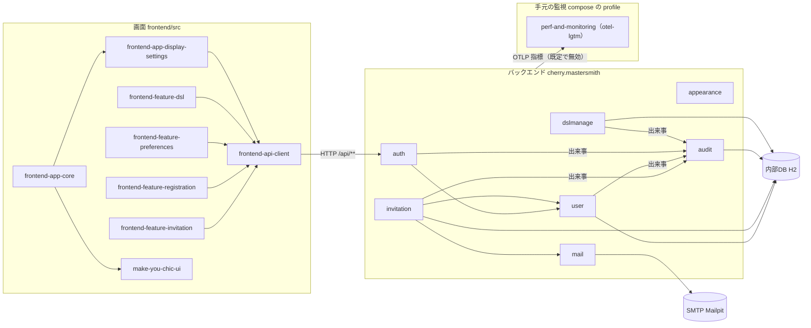
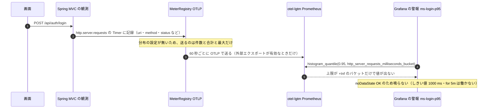
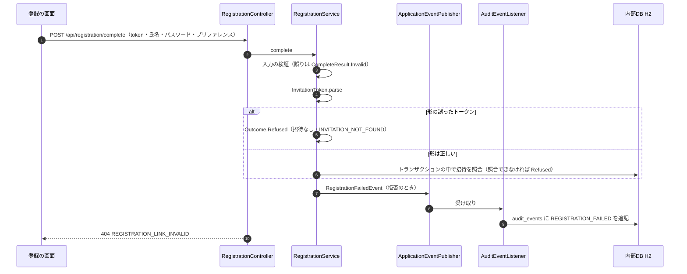
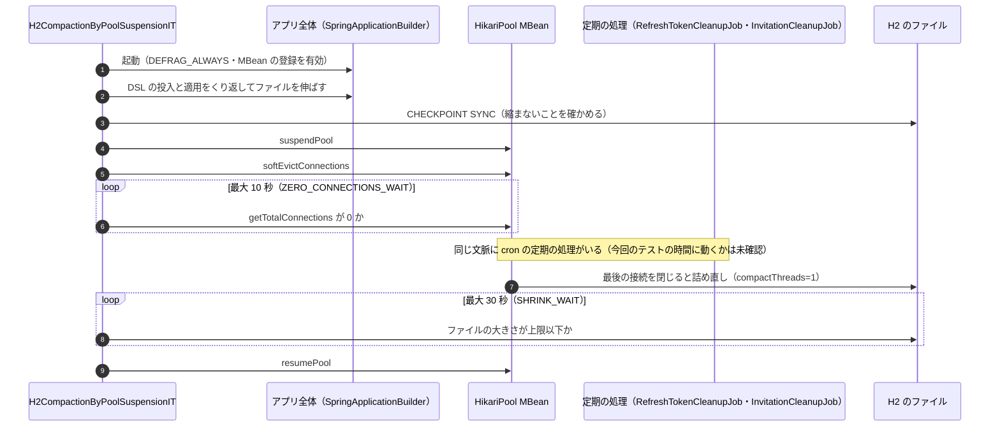
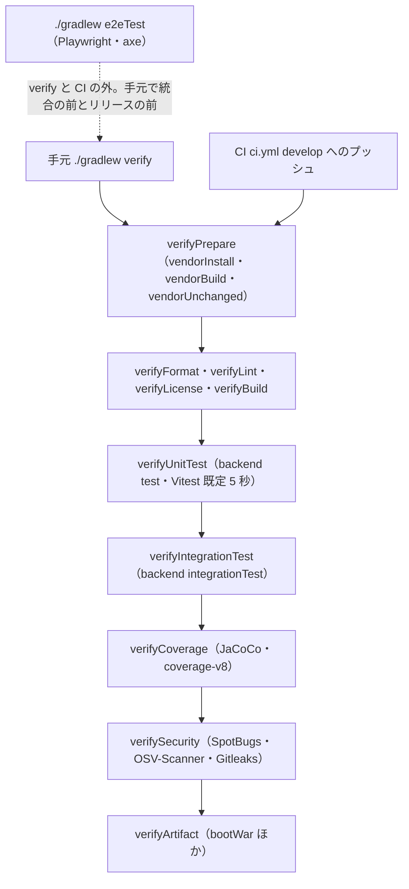

# アーキテクチャ（mastersmith2）

## Architecture Analysis

### System Overview

1つのプロセスの Web アプリケーションである。バックエンド（Java 25・Spring Boot 4.1.1）が REST API と、ビルド済みの画面（React の SPA）の配信の両方を受け持つ。成果物は画面のビルド結果を同梱した実行可能 WAR 1つで、コンテナ1つ（`Dockerfile`・`compose.yaml` の `app`）で動かす。JVM は `-XX:MaxRAMPercentage=50.0 -Duser.timezone=Asia/Tokyo -Dh2.compactThreads=1` で起動する（`Dockerfile` 49 行）。

- 内部DB: 組み込みの H2（ファイル保存、`DEFRAG_ALWAYS=TRUE`）。利用者・トークン・ロックの状態・監査ログ・DSL・招待を置く。スキーマは Flyway（V1〜V8）が正本。接続プールは HikariCP（MBean を登録し、運用の道具 `docker/hikari-pool.sh` から一時停止と破棄を行う）。1インスタンスだけで動く前提である。
- 対象DB: MySQL・MariaDB・PostgreSQL のどれか1つ。スキーマを読むだけ。
- 外へ出る接続: 対象DB、SMTP（手元では Mailpit）、既定で無効の OTLP の送り先（指標・トレース・ログ）。

### Architectural Style

**モジュール分けしたモノリス（層構造）**である。パッケージが機能ごと（`auth`・`access`・`audit`・`user`・`invitation`・`mail`・`appearance`・`targetdb`・`dsl`・`dslmanage`）と共通（`common`・`config`）に分かれ、各機能の中が `web`・`service`・`domain`・`repository` の層（と用途名の下位パッケージ）になる（`code-structure.md`）。境界は ArchUnit のテストで確かめている（前回の記録。今回は読み直していない）。機能の間は、直接の呼び出し・差し込み口（`SecurityRuleContributor` などの Bean）・アプリの中の出来事（監査は出来事を受けて記録）でつなぐ。向きは `dependencies.md`。

### Component Relationships

```mermaid
flowchart LR
  subgraph FE["画面 frontend/src"]
    CORE["frontend-app-core"]
    DISP["frontend-app-display-settings"]
    FINV["frontend-feature-invitation"]
    FREG["frontend-feature-registration"]
    FPREF["frontend-feature-preferences"]
    FDSL["frontend-feature-dsl"]
    APIC["frontend-api-client"]
    MYC["make-you-chic-ui"]
  end
  subgraph BE["バックエンド cherry.mastersmith"]
    AUTH["auth"]
    USER["user"]
    INV["invitation"]
    MAIL["mail"]
    APP["appearance"]
    AUDIT["audit"]
    DSLM["dslmanage"]
  end
  subgraph OPS["手元の監視 compose の profile"]
    LGTM["perf-and-monitoring（otel-lgtm）"]
  end
  H2[("内部DB H2")]
  SMTP[("SMTP Mailpit")]

  CORE --> DISP
  CORE --> MYC
  FINV --> APIC
  FREG --> APIC
  FPREF --> APIC
  FDSL --> APIC
  DISP --> APIC
  APIC -- "HTTP /api/**" --> AUTH
  AUTH --> USER
  INV --> USER
  INV --> MAIL
  MAIL --> SMTP
  INV -- "出来事" --> AUDIT
  USER -- "出来事" --> AUDIT
  AUTH -- "出来事" --> AUDIT
  DSLM -- "出来事" --> AUDIT
  USER --> H2
  INV --> H2
  AUDIT --> H2
  DSLM --> H2
  BE -- "OTLP 指標（既定で無効）" --> LGTM
```

<!-- Text fallback: 画面の骨組み（frontend-app-core）が見た目の設定（frontend-app-display-settings）と make-you-chic-ui を組み合わせ、招待・登録・プリファレンス・DSL の各画面は frontend-api-client を通して同じオリジンの /api/** を呼ぶ。バックエンドでは auth がトークンを認証し user を使う。invitation は user と mail を使い、mail が SMTP（手元では Mailpit）へ送る。invitation・user・auth・dslmanage の出来事を audit が受けて内部DB に記録する。アプリ全体の指標は、外部エクスポートを有効にしたときだけ OTLP で手元の監視（otel-lgtm）へ送られる。 -->

図は今回の Intent に関わる流れを中心に描いた。`access`・`common-*`・`config`・`dsl`・`targetdb`・画面の登録の仕組みなどは省いた（一覧は `component-inventory.md`）。

### Data Flow

1. 画面の要求は `Authorization: Bearer` を付けて送られ、Spring Security の連鎖（認証 → アクセスの判定 → 本文の大きさの上限）を経てコントローラーに届く（前回の記録。今回は読み直していない）。
2. トランザクションは `service` の層で始まり、`repository` の層が内部DB を読み書きする。業務エラーは `@RestControllerAdvice` の1か所で Problem Details（`code` 付き）になる。
3. 監査の対象の出来事は、確定の後に `audit` が2本目の接続で `audit_events` に追記する。
4. 観測: Spring MVC の観測が要求ごとに `http.server.requests` を、`SmtpMailSender` が `mastersmith.mail.send` を、`DslOperationMetrics` が `mastersmith.dsl.operation` を作る。外部エクスポートを有効にすると、OTLP で 60 秒ごと（`management.otlp.metrics.export.step`）に送る（流れは Interaction Diagrams 1）。

### Key Design Decisions

| 選択 | 内容（確かめた場所） | 今回の Intent との関わり |
|---|---|---|
| 観測は Spring Boot の既定に任せ、分布の設定を置かない | `application.yaml` の `management` に `metrics.distribution` が無い。`MeterFilter` などのコードも無い。DSL の指標だけコードで `publishPercentileHistogram()` を付ける | K-6 |
| 手元の監視は見たいときだけ起動 | otel-lgtm と警報・ダッシュボードのファイルを compose の profile で読む（`docker/monitoring/`）。`docker/otel-collector` は受けた値を debug に出すだけ | 警報の式の確かめは起動して行う（`project.md` の Corrections） |
| デザインシステムはサブモジュールで固定 | `vendor/make-you-chic-ui` を固定先のコミットで使い、中身は変えない（`project.md` の Forbidden） | K-1 |
| 詰め直しはプールの一時停止で行う | HikariCP の MBean で一時停止・破棄し、接続が 0 本になって H2 が閉じるときに詰め直す（`H2CompactionByPoolSuspensionIT` が同じ順で確かめる） | K-4 |
| E2E とブラウザのアクセシビリティの検査は CI の外 | `./gradlew e2eTest`（Playwright）は `verify` に含まれない（`team.md` の Testing Posture） | K-2 |

### Improvement Opportunities

- 指標の分布の設定を `application.yaml` に置けば、警報とダッシュボードの式を変えずに p95 が値を持つと見られる（仮説。K-6）。系列の数が増えるため、バケットの範囲を絞るかを決める必要がある。
- テストの中の固定の待ちの上限（10 秒・5 秒）は、CI の runner の速さに左右される。原因の切り分けの材料（失敗したときのプールとスレッドの状態）を残す作りが無い（K-4・K-5）。

## Interaction Diagrams

### 1. 要求の指標から p95 の警報まで（K-6）

```mermaid
sequenceDiagram
  autonumber
  participant C as 画面
  participant MVC as Spring MVC の観測
  participant REG as MeterRegistry OTLP
  participant L as otel-lgtm Prometheus
  participant G as Grafana の警報 ms-login-p95

  C->>MVC: POST /api/auth/login
  MVC->>REG: http.server.requests の Timer に記録（uri・method・status など）
  Note over REG: 分布の設定が無いため、送るのは件数と合計と最大だけ
  REG->>L: 60 秒ごとに OTLP で送る（外部エクスポートが有効なときだけ）
  G->>L: histogram_quantile(0.95, http_server_requests_milliseconds_bucket)
  L-->>G: 上限が +Inf のバケットだけで値が出ない
  Note over G: noDataState OK のため鳴らない（しきい値 1000 ms・for 5m は働かない）
```

<!-- Text fallback: 画面の要求を Spring MVC の観測が http.server.requests の Timer に記録する。分布の設定が無いため、登録先は件数・合計・最大だけを持つ。外部エクスポートを有効にすると 60 秒ごとに OTLP で otel-lgtm へ送られる。Grafana の警報 ms-login-p95 は http_server_requests_milliseconds_bucket に histogram_quantile(0.95) を当てるが、+Inf 以外のバケットが無いため値が出ず、noDataState OK のため鳴らない。ms-refresh-p95・ms-check-p95 も同じ。 -->

K-6（確かめた事実）:

- 警報 `ms-login-p95`・`ms-refresh-p95`・`ms-check-p95`（`docker/monitoring/provisioning/alerting/mastersmith.yaml` 153〜248 行）とダッシュボードの3つのパネルは `http_server_requests_milliseconds_bucket` に `histogram_quantile(0.95, …)` を当てる。3つとも `noDataState: OK`、しきい値は 1000。
- `application.yaml` にヒストグラムの設定（`management.metrics.distribution`）が無く、`backend/src/main/java` に `MeterFilter`・`MeterRegistryCustomizer` も無い（アーキテクトが検索で確かめた）。`publishPercentileHistogram()` を付けるのは `dslmanage/service/DslOperationMetrics.java` だけ。
- `mastersmith.mail.send` は `SmtpMailSender` の `Observation`（低い基数のタグは `mail.template`・`mail.language`・`mail.outcome`・`mail.failure.kind`）で、分布の設定が無いのは同じ。招待と登録・メールの送信の 95 パーセンタイルのパネルは、代わりにトレースから作る `traces_spanmetrics_latency_bucket` を使う（README の「手元の監視（Grafana）」が既知の欠けとして書く）。
- 手元の監視の受け手は otel-lgtm（`compose.yaml` の `lgtm`）。`docker/otel-collector/config.yaml` は受けた値を debug に出すだけで、Prometheus には渡さない。

K-6（見立て、未検証）:

- 最小の直しは `management.metrics.distribution.percentiles-histogram` に `http.server.requests` と `mastersmith.mail.send` を置く形と見られる（名前の前方一致で当たる）。Micrometer の既定のバケットは数十個あり、`uri`・`method`・`status`・`outcome`・`exception` の組み合わせで系列が大きく増えうる。範囲（`minimum-expected-value`・`maximum-expected-value`）か `slo` で絞るかは設計で決める。
- OTLP の登録先がヒストグラムを明示のバケットで送るか指数で送るか、Prometheus での名前が `_milliseconds_bucket` のままかは、起動して確かめる必要がある。
- 設定だけで済めば `packagesJudgedByTotal` のパッケージ（`common.observability` など）に手を入れずに済む。コードで足すなら K-10 の作業が付く。

### 2. 登録の完了の拒否と監査（K-8）

```mermaid
sequenceDiagram
  autonumber
  participant P as 登録の画面
  participant RC as RegistrationController
  participant RS as RegistrationService
  participant EP as ApplicationEventPublisher
  participant AL as AuditEventListener
  participant DB as 内部DB H2

  P->>RC: POST /api/registration/complete（token・氏名・パスワード・プリファレンス）
  RC->>RS: complete
  RS->>RS: 入力の検証（誤りは CompleteResult.Invalid）
  RS->>RS: InvitationToken.parse
  alt 形の誤ったトークン
    RS->>RS: Outcome.Refused（招待なし・INVITATION_NOT_FOUND）
  else 形は正しい
    RS->>DB: トランザクションの中で招待を照合（照合できなければ Refused）
  end
  RS->>EP: RegistrationFailedEvent（拒否のとき）
  EP->>AL: 受け取り
  AL->>DB: audit_events に REGISTRATION_FAILED を追記
  RC-->>P: 404 REGISTRATION_LINK_INVALID
```

<!-- Text fallback: 登録の画面がトークンと入力を送る。RegistrationService は入力を検証し、トークンの形を確かめる。形が誤っていれば招待なし（INVITATION_NOT_FOUND）の拒否とし、形が正しければトランザクションの中で招待を照合する（照合の中身は今回読んでいない）。拒否のときは RegistrationFailedEvent を出し、audit が REGISTRATION_FAILED を監査ログに追記する。画面には 404 REGISTRATION_LINK_INVALID が返る。 -->

確かめた事実: `RegistrationService.complete`（152〜159 行）は、形の誤ったトークンでも `RegistrationFailedEvent` を出す。`AuditEventListener` はこの出来事を受け（208 行）、`AuditEventType` に `REGISTRATION_FAILED` がある。拒否の応答は 404 `REGISTRATION_LINK_INVALID`（`InvitationProblemTypes`）で、5xx の割合の警報には当たらない。K-8 の本文は `api-documentation.md`。

### 3. プールの一時停止による詰め直しのテスト（K-4）

```mermaid
sequenceDiagram
  autonumber
  participant T as H2CompactionByPoolSuspensionIT
  participant APP as アプリ全体（SpringApplicationBuilder）
  participant POOL as HikariPool MBean
  participant JOB as 定期の処理（RefreshTokenCleanupJob・InvitationCleanupJob）
  participant H2 as H2 のファイル

  T->>APP: 起動（DEFRAG_ALWAYS・MBean の登録を有効）
  T->>APP: DSL の投入と適用をくり返してファイルを伸ばす
  T->>H2: CHECKPOINT SYNC（縮まないことを確かめる）
  T->>POOL: suspendPool
  T->>POOL: softEvictConnections
  loop 最大 10 秒（ZERO_CONNECTIONS_WAIT）
    T->>POOL: getTotalConnections が 0 か
  end
  Note over POOL,JOB: 同じ文脈に cron の定期の処理がいる（今回のテストの時間に動くかは未確認）
  POOL->>H2: 最後の接続を閉じると詰め直し（compactThreads=1）
  loop 最大 30 秒（SHRINK_WAIT）
    T->>H2: ファイルの大きさが上限以下か
  end
  T->>POOL: resumePool
```

<!-- Text fallback: テストはアプリ全体を起動し、DSL の投入と適用をくり返して H2 のファイルを伸ばす。CHECKPOINT SYNC で縮まないことを確かめた後、プールの MBean で一時停止と破棄を行い、接続が 0 本になるまで最大 10 秒待つ。最後の接続が閉じると H2 が詰め直し、ファイルが上限以下になるまで最大 30 秒待ってから再開する。同じ文脈に cron で動く定期の処理が2つある。 -->

K-4（確かめた事実）:

- CI での失敗の箇所は 196 行の `await().atMost(ZERO_CONNECTIONS_WAIT).until(() -> pool.getTotalConnections() == 0)`（前の Intent の記録）。`ZERO_CONNECTIONS_WAIT` は 10 秒で、運用の道具の既定に合わせた固定値（112 行）。同じ定数を 235・251・264 行でも使う。
- テストの JVM は `-Dh2.compactThreads=1`・`maxHeapSize = "1g"`・`-Djava.net.preferIPv4Stack=true`（`backend/build.gradle.kts` 116〜143 行）。
- 前の Intent の記録では、原因は確かめておらず、手元の `verify` では通っていた。

K-4（仮説、どれも未検証。開発担当の見立て）:

- (a) 一時停止の直前に動いていた HikariCP の接続の補充が、破棄の後に接続を1本足し、0 本にならない。
- (b) 同じ文脈の定期の処理や起動の後の処理が接続を借りていて、返すのが遅れた（破棄の印を付けられた接続は、返されるまで数に残る）。
- (c) CI の runner が遅く、最後の接続を閉じるときの H2 の処理が 10 秒を超えた。
- 直し方を決める前に、失敗したときの `getTotalConnections`・`getActiveConnections`・`getIdleConnections`・`getThreadsAwaitingConnection` とスレッドの状態を出す診断を足して再現を試みることが勧められている。上限を延ばすだけにする場合は、`team.md` の「不安定なテストは原因を直すまで統合しない」と `project.md` の学び（再現できなければ不安定と確かめられていない扱い）との関係を要件で決める必要がある。

### 4. 検査の流れと E2E の置き場（K-2・K-5）

```mermaid
flowchart TD
  DEV["手元 ./gradlew verify"] --> PREP["verifyPrepare（vendorInstall・vendorBuild・vendorUnchanged）"]
  CI["CI ci.yml develop へのプッシュ"] --> PREP
  PREP --> FMT["verifyFormat・verifyLint・verifyLicense・verifyBuild"]
  FMT --> UT["verifyUnitTest（backend test・Vitest 既定 5 秒）"]
  UT --> IT["verifyIntegrationTest（backend integrationTest）"]
  IT --> COV["verifyCoverage（JaCoCo・coverage-v8）"]
  COV --> SEC["verifySecurity（SpotBugs・OSV-Scanner・Gitleaks）"]
  SEC --> ART["verifyArtifact（bootWar ほか）"]
  E2E["./gradlew e2eTest（Playwright・axe）"] -. "verify と CI の外。手元で統合の前とリリースの前" .-> DEV
```

<!-- Text fallback: 手元の ./gradlew verify と CI（develop へのプッシュ）は同じ段を順に通る。準備（サブモジュールの準備と変更なしの確かめ）、フォーマット・リンタ・ライセンス・ビルド、単体テスト（Vitest は既定の 5 秒）、結合テスト、カバレッジ、セキュリティ、成果物。E2E（Playwright と axe のコントラストの検査）は verify と CI の外にあり、手元で統合の前とリリースの前に流す。 -->

確かめた事実: 段は `build.gradle.kts` 340〜416 行で `mustRunAfter` で並ぶ。CI は `./gradlew verify` を1回、`timeout-minutes: 60` で流す。コントラストの確かめ（axe）は E2E にだけあるため、K-1 の更新は CI だけでは確かめられない（K-2）。
