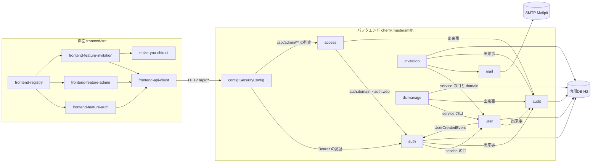
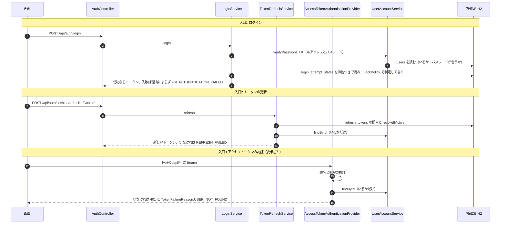
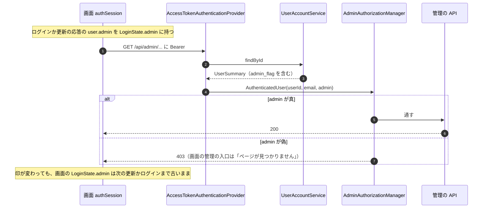
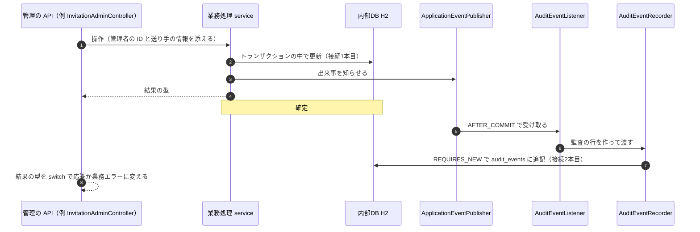
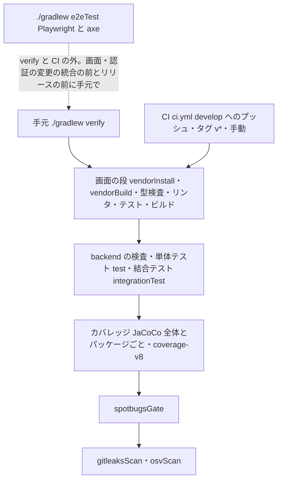

# アーキテクチャ（mastersmith2）

## Architecture Analysis

### System Overview

1つのプロセスの Web アプリケーションである。バックエンド（Java 25・Spring Boot 4.1.1）が REST API と、ビルド済みの画面（React の SPA）の配信の両方を受け持つ。成果物は画面のビルド結果を同梱した実行可能 WAR 1つで、コンテナ1つ（`Dockerfile`・`compose.yaml` の `app`）で動かす（`Dockerfile`・`compose.yaml` は今回イメージの行だけを流し読みした）。

- 内部DB: 組み込みの H2。利用者（`users`）・ロックの状態（`login_attempt_states`）・リフレッシュトークン（`refresh_tokens`）・監査ログ（`audit_events`）・DSL・招待（`invitations`）を置く。スキーマは Flyway（`backend/src/main/resources/db/migration/` の V1〜V8、前進のみ）が正本。1インスタンスだけで動く前提で、ロックの判定は行の排他（`SELECT ... FOR UPDATE`、待ちの上限 3 秒）に頼る（`auth/repository/LoginAttemptStateRepository.java` 30 行の注記）。
- 起動時に、設定の値から初期管理者を1人だけ作る（`user/service/InitialAdminInitializer.java`。同じメールアドレスの利用者がいれば作らない）。
- 対象DB: MySQL・MariaDB・PostgreSQL のどれか1つ。スキーマを読むだけ（今回は流し読み）。
- 外へ出る接続: 対象DB、SMTP（手元では Mailpit）、既定で無効の OTLP の送り先。

パスは、`backend/src/main/java/cherry/mastersmith/` の下のものはそれを省いて書く（画面・テスト・移行のファイルは省かない）。

### Architectural Style

**モジュール分けしたモノリス（層構造）**である。パッケージが機能ごと（`auth`・`access`・`audit`・`user`・`invitation`・`mail`・`appearance`・`targetdb`・`dsl`・`dslmanage`）と共通（`common`・`config`）に分かれ、各機能の中が `web`・`service`・`domain`・`repository` の層（と用途名の下位パッケージ）になる（`code-structure.md`）。

根拠:

- 層の決まりは全体の `backend/src/test/java/cherry/mastersmith/ArchitectureTest.java`（web は repository を使わない・トランザクションは service だけ・controller はエンティティを返さない・コンストラクター注入だけ・Lombok なし）が、機能の間の向きは機能ごとの `*BoundaryArchitectureTest`（9 本）が確かめる。今回は `ArchitectureTest`・`AuthBoundaryArchitectureTest`・`AuditBoundaryArchitectureTest`・`InvitationBoundaryArchitectureTest` の決まりの名前と対象を読んだ。
- 機能の間は、直接の呼び出し（service の口）・差し込み口（`SecurityRuleContributor` などの Bean）・アプリの中の出来事（Spring の `ApplicationEventPublisher`）でつなぐ。逆向きの知らせは出来事で行う（`team.md` の Code Style）。向きの一覧は `dependencies.md`。

### Component Relationships

```mermaid
flowchart LR
  subgraph FE["画面 frontend/src"]
    REG["frontend-registry"]
    FAUTH["frontend-feature-auth"]
    FADM["frontend-feature-admin"]
    FINV["frontend-feature-invitation"]
    APIC["frontend-api-client"]
    MYC["make-you-chic-ui"]
  end
  subgraph BE["バックエンド cherry.mastersmith"]
    CFG["config SecurityConfig"]
    AUTH["auth"]
    ACC["access"]
    USER["user"]
    INV["invitation"]
    MAIL["mail"]
    AUDIT["audit"]
    DSLM["dslmanage"]
  end
  H2[("内部DB H2")]
  SMTP[("SMTP Mailpit")]

  REG --> FAUTH
  REG --> FADM
  REG --> FINV
  FADM --> APIC
  FINV --> APIC
  FAUTH --> APIC
  FINV --> MYC
  APIC -- "HTTP /api/**" --> CFG
  CFG -- "Bearer の認証" --> AUTH
  CFG -- "/api/admin/** の判定" --> ACC
  AUTH -- "service の口" --> USER
  ACC -- "auth.domain・auth.web" --> AUTH
  INV -- "service の口と domain" --> USER
  INV --> MAIL
  MAIL --> SMTP
  DSLM -- "service の口" --> USER
  USER -- "UserCreatedEvent" --> AUTH
  AUTH -- "出来事" --> AUDIT
  ACC -- "出来事" --> AUDIT
  USER -- "出来事" --> AUDIT
  INV -- "出来事" --> AUDIT
  DSLM -- "出来事" --> AUDIT
  USER --> H2
  AUTH --> H2
  INV --> H2
  AUDIT --> H2
  DSLM --> H2
```

<!-- Text fallback: 画面では、登録の仕組み（frontend-registry）がログイン・管理の入口・招待の管理の各機能を読み込み、各機能は frontend-api-client を通して同じオリジンの /api/** を呼ぶ。招待の管理の画面は make-you-chic-ui の部品を使う。バックエンドでは、config の SecurityConfig が要求を受け、auth が Bearer のアクセストークンを認証し、access が /api/admin/** を管理者だけに絞る。auth は user の service の口を使い、access は auth の domain と web を使う。invitation は user（service の口と domain）と mail を使い、mail が SMTP へ送る。dslmanage も user の service の口を使う。user の UserCreatedEvent を auth が受けてロックの状態の行を作る。auth・access・user・invitation・dslmanage の出来事を audit が受けて内部DB に記録する。user・auth・invitation・audit・dslmanage が内部DB を読み書きする。 -->

図は今回の Intent に関わる流れを中心に描いた。`appearance`・`common`・`dsl`・`targetdb`・画面のほかの機能は省いた（一覧は `component-inventory.md`）。**利用者の管理の部品は図のどこにも無い**。どこに置くかは K-3（`dependencies.md`）の境界の決まりで絞られる。

### Data Flow

1. 画面の要求は `Authorization: Bearer <アクセストークン>` を付けて送られる。セッションと CSRF の仕組みは無い（`config/SecurityConfig.java`）。`/api/**` の既定はログインが必要（`access/web/AdminApiDefaultAccess.java`）で、`/api/admin` と `/api/admin/**` は管理者だけ（`access/domain/AdminPaths.java`・`access/web/AdminSecurityContributor.java`）。公開の道は機能ごとの差し込み口（order: auth 110・access 210・invitation 310・appearance 410）が足す。
2. アクセストークン（HS256 の JWT、`sub`・`iat`・`exp` だけ）は要求ごとに検証され、利用者 ID から **DB の利用者を読み直して** `AuthenticatedUser(userId, email, admin)` を作る（`auth/web/AccessTokenAuthenticationProvider.java` 54〜62 行）。管理者の判定はその `admin` だけを見る（K-4、Interaction Diagrams 2）。
3. トランザクションは `service` の層で始まり、`repository` の層が内部DB を読み書きする。業務エラーは `@RestControllerAdvice` の1か所で Problem Details（`code` 付き）になる。業務処理は想定内の失敗を結果の型（sealed interface）で返し、controller が `switch` で業務エラーに変える形が `invitation` にある（K-5）。
4. 監査の対象の出来事は、業務のトランザクションの中で知らせ、`audit/service/AuditEventListener.java` が確定の後（`AFTER_COMMIT`、`fallbackExecution = true`）に `audit/service/AuditEventRecorder.java` の新しいトランザクション（`REQUIRES_NEW`）で `audit_events` に追記する。要求1件で接続を2本使う（Interaction Diagrams 3）。
5. 画面は、ログインと更新の応答の `user.admin` から `LoginState.admin` を作ってモジュールの変数に持ち（`frontend/src/features/auth/authSession.ts`）、管理者の項目の表示を切り替える。判定はサーバー側だけが正（`frontend/src/app/registry/types.ts` の注記）。

### Key Design Decisions

| 選択 | 内容（確かめた場所） | 今回の Intent との関わり |
|---|---|---|
| 管理者の印はトークンに入れず、要求ごとに DB から読む | `auth/service/AccessTokenService.java`（クレームは `sub`・`iat`・`exp`）、`auth/web/AccessTokenAuthenticationProvider.java` | 印の変更・停止はサーバー側では次の要求から効かせられる（K-1・K-4） |
| ログアウトはアクセストークンを失効させない | `project.md` の Decided。アクセストークンの既定の有効期限は 5 分（`auth/service/AuthProperties.java`） | 停止の効き目をアクセストークンの期限まで待つかは、認証の入口で状態を見るかで決まる（K-1） |
| ロックは時刻で決まり、解除は時間の経過だけ | `auth/domain/LockPolicy.java`、しきい値 5・時間 30 分（`mastersmith.auth.lock.*`） | 管理者による解除は新しい操作（K-2） |
| `user` は `auth` を知らない | `backend/src/test/java/cherry/mastersmith/auth/AuthBoundaryArchitectureTest.java` 62 行 | 利用者とロックの状態を合わせる処理の置き場（K-3） |
| 監査は出来事を受けて確定の後に別のトランザクションで追記 | `audit/service/AuditEventListener.java`・`AuditEventRecorder.java` | 管理の操作ごとに出来事の型と監査の種類を足す（K-6） |
| 失敗の理由を応答に出さない | ログインの失敗は理由によらず `AUTHENTICATION_FAILED`（401）。理由は出来事（`LoginFailureReason`）にだけ載る（`auth/service/LoginService.java`） | 停止の理由を足しても応答は変えない形が前提になる（K-1） |
| 機能ごとの差し込み口と登録 | バックエンドは `SecurityRuleContributor`、画面は `features/<featureId>/registration.ts` | 管理の API は決まりを足さずに `/api/admin/**` に乗れる（K-5）。画面は骨組みを書き換えずに足せる（K-9） |
| 内部DB は組み込みの H2・単一インスタンス | 前の Intent からの既知の決定 | ロックの解除も行の排他でログインの判定と順番がそろう見込み（K-2） |

### Improvement Opportunities

- 利用者の状態（停止など）を見る場所が、ログインの照合・トークンの更新・アクセストークンの認証の3か所に分かれている（K-1）。1つの口（例: `user` の service の「使える利用者か」の判定）にまとめないと、入口ごとの見落としが起きやすい（見立て）。
- 監査の出来事の受け取りと写し取りが `audit` の3ファイルに積み上がる（`code-quality-assessment.md` の技術的負債）。管理の操作を足すたびに3ファイルと境界の検査を直すことになる。
- 管理の要求の文脈（操作した管理者の ID・送り手の情報）の読み取りが機能ごとに複製されている（`user/web/MeRequestContextResolver.java`・`invitation/web/InvitationRequestContextResolver.java`・`dslmanage/web/DslRequestContextResolver.java` の3つ。開発担当は前の2つを挙げ、アーキテクトがファイル名の検索で3つ目を確かめた。3つ目の中身は読んでいない）。利用者の管理を足すと4つ目になりやすい（`code-quality-assessment.md`）。
- 管理者の印を外す・停止する操作に対し、最後の管理者を守る仕組みが無い（K-4）。

## Interaction Diagrams

### 1. 認証の3つの入口と、利用停止を見る場所（K-1）

```mermaid
sequenceDiagram
  autonumber
  participant P as 画面
  participant AC as AuthController
  participant LS as LoginService
  participant TR as TokenRefreshService
  participant ATP as AccessTokenAuthenticationProvider
  participant UAS as UserAccountService
  participant DB as 内部DB H2

  Note over P,DB: 入口1 ログイン
  P->>AC: POST /api/auth/login
  AC->>LS: login
  LS->>UAS: verifyPassword（メールアドレスとパスワード）
  UAS->>DB: users を読む（いるか・パスワードが合うか）
  LS->>DB: login_attempt_states を排他つきで読み、LockPolicy で判定して書く
  LS-->>AC: 成功ならトークン、失敗は理由によらず 401 AUTHENTICATION_FAILED

  Note over P,DB: 入口2 トークンの更新
  P->>AC: POST /api/auth/session/refresh（Cookie）
  AC->>TR: refresh
  TR->>DB: refresh_tokens の照合と revokeIfActive
  TR->>UAS: findById（いるかだけ）
  TR-->>AC: 新しいトークン、いなければ REFRESH_FAILED

  Note over P,DB: 入口3 アクセストークンの認証（要求ごと）
  P->>ATP: 任意の /api/** に Bearer
  ATP->>ATP: 署名と期限の検証
  ATP->>UAS: findById（いるかだけ）
  ATP-->>P: いなければ 401 と TokenFailureReason.USER_NOT_FOUND
```

<!-- Text fallback: 利用者の状態を見うる入口は3つある。入口1のログインでは、AuthController が LoginService を呼び、LoginService は UserAccountService.verifyPassword で利用者がいるかとパスワードを確かめ、login_attempt_states を排他つきで読んで LockPolicy で判定する。失敗は理由によらず 401 AUTHENTICATION_FAILED。入口2のトークンの更新では、TokenRefreshService がリフレッシュトークンを照合して無効にし、findById で利用者がいるかだけを見て新しいトークンを出す（いなければ REFRESH_FAILED）。入口3では、要求ごとに AccessTokenAuthenticationProvider が署名と期限を検証し、findById で利用者がいるかだけを見る（いなければ 401 と USER_NOT_FOUND）。3つとも利用者の状態（停止など）は見ていない。 -->

K-1 利用停止を表す状態が無い（確かめた事実）:

- `users` の列は `user_id`・`email`・`password_hash`・`admin_flag`・`created_at`（V2）と `language`・`theme`・`font_size`・`display_name`（V7）だけで、停止・無効・状態の列は無い（`backend/src/main/resources/db/migration/V2__u2_user_account.sql`・`V7__u2_user_preferences.sql`、`user/domain/User.java`）。利用者を削除する操作も無い。
- `refresh_tokens.user_id`（V3 の `fk_refresh_tokens_user`）と `invitations.invited_by_user_id`・`completed_user_id`（V8 の外部キー2つ）が `users` を参照する。DSL の表（V5）と監査（V6 の `actor_user_id`・V7 の `target_user_id`）も利用者 ID を持つ（外部キーなし）。
- 3つの入口はどれも「利用者がいるか」だけを見る（上の図）。入口1は `user/service/UserAccountService.java` 91〜105 行 → `auth/service/LoginService.java` 157〜198 行、入口2は `auth/service/TokenRefreshService.java` 89 行（リフレッシュトークンを先に無効にしてから `findById`）、入口3は `auth/web/AccessTokenAuthenticationProvider.java` 54〜62 行。
- 失敗の理由の列挙は網羅の `switch` でつながる: `LoginFailureReason`（`USER_NOT_FOUND`・`PASSWORD_MISMATCH`・`ACCOUNT_LOCKED`）と `TokenFailureReason`（`TOKEN_MALFORMED`・`TOKEN_INVALID`・`TOKEN_EXPIRED`・`USER_NOT_FOUND`）→ `AccessDeniedReason.of(TokenFailureReason)`（`access/domain/AccessDeniedReason.java` 47〜54 行）→ `AuditFailureReason`（`audit/domain/AuditEventFactory.java` の写し取り）。
- 招待: `InvitationService` は招待先のメールアドレスの利用者がいれば 409 `INVITATION_EMAIL_REGISTERED` にする（`existsByEmail`、状態を見ない）。

K-1（見立て、未検証）:

- 利用者を削除すると上の外部キーと監査の利用者 ID に当たるため、止めるなら状態の列で表す形が前提になりやすい。
- 入口3は要求ごとに DB から読むため、ここで状態を見れば、停止はアクセストークンの有効期限（既定 5 分）を待たずに次の要求から効く。見ない場合は、ログアウトでアクセストークンを失効させない決定（`project.md` の Decided）と同じく、期限まで使える。どちらにするかは要件で決める。
- 入口2で状態を見ないなら、停止した利用者のリフレッシュトークンをまとめて無効にする必要があるが、その問い合わせは無い（`auth/repository/RefreshTokenRepository.java` は1件ずつの `revokeIfActive` 50 行と期限切れの削除 `deleteExpiredBefore` 64 行だけ）。
- 停止の区分を理由の列挙に足すと、上の網羅の `switch` と監査の `failure_reason`（`VARCHAR(32)`、V4）に波及する。応答は理由を推測させない形（ログインは `AUTHENTICATION_FAILED`）を保つ前提になる。
- 停止した利用者のメールアドレスは、今の招待では「登録済み」として招待できない。停止と再招待の関係は要件で決める。

### 2. 管理者の印の判定と、画面の持つ値（K-4）

```mermaid
sequenceDiagram
  autonumber
  participant P as 画面 authSession
  participant ATP as AccessTokenAuthenticationProvider
  participant UAS as UserAccountService
  participant AAM as AdminAuthorizationManager
  participant C as 管理の API

  Note over P: ログインか更新の応答の user.admin を LoginState.admin に持つ
  P->>ATP: GET /api/admin/... に Bearer
  ATP->>UAS: findById
  UAS-->>ATP: UserSummary（admin_flag を含む）
  ATP->>AAM: AuthenticatedUser(userId, email, admin)
  alt admin が真
    AAM->>C: 通す
    C-->>P: 200
  else admin が偽
    AAM-->>P: 403（画面の管理の入口は「ページが見つかりません」）
  end
  Note over P: 印が変わっても、画面の LoginState.admin は次の更新かログインまで古いまま
```

<!-- Text fallback: 画面はログインか更新の応答の user.admin を LoginState.admin としてモジュールの変数に持つ。管理の API への要求ごとに、AccessTokenAuthenticationProvider が findById で利用者を読み、admin_flag を含む AuthenticatedUser を作る。AdminAuthorizationManager はその admin だけで判定し、真なら通して 200、偽なら 403 を返す（画面の管理の入口は 403 を「ページが見つかりません」として扱う）。印が変わっても、画面の LoginState.admin は次の更新かログインまで古いままである。 -->

K-4 管理者の印（確かめた事実）:

- 判定は `access/web/AdminAuthorizationManager.java` 38〜47 行で、認証済みで `AuthenticatedUser` の `admin` が真のときだけ通す。`admin` は要求ごとに DB の `admin_flag` から作る（`auth/web/AccessTokenAuthenticationProvider.java` 61 行）。トークンは管理者の印を持たない。
- 画面の `LoginState.admin` は `auth/web/CurrentUserResponse.java` の `user.admin` から作り、`frontend/src/features/auth/authSession.ts` のモジュールの変数に持つ。管理の入口は 403 を `NotFound` の表示にする（`frontend/src/features/admin/adminAreaStatus.ts` 23〜27 行）。
- 管理者の印を変える口（`user/repository/UserRepository.java` の更新の問い合わせ）は無い。既存の更新は列を絞った `@Modifying` の問い合わせ（`updatePreferences` 70 行・`updatePasswordHashIfUnchanged` 85 行）だけで、全列を書かない決まり（同ファイルの注記）。
- 初期管理者の自動作成は、設定のメールアドレスの利用者が「いるか」だけを見る（`user/service/InitialAdminInitializer.java` 91 行 `existsByEmail`）。

K-4（見立て、未検証）:

- サーバー側では、印の変更は次の要求から効く。画面は、印を外された人が管理の画面に留まれば次の API の呼び出しで 403 になり、印を付けられた人は次の更新かログインまで管理のメニューが出ない。
- 最後の管理者を失う操作（すべての管理者の印を外す・停止する、自分自身の印を外す・自分を停止する）を止める仕組みが無い。初期管理者の自動作成はメールアドレスの有無だけを見るため回復の道にならず、DB を直接直すしかなくなる。要件で決める必要がある。
- 同時に2人の管理者が互いの印を外す場合のように、「最後の管理者」の判定は数える問い合わせと更新の間の競合に当たりうる。単一インスタンスの H2 でも、行の排他か条件つきの更新が要る（設計で決める）。

### 3. 管理の操作から監査の記録まで（K-6）

```mermaid
sequenceDiagram
  autonumber
  participant C as 管理の API（例 InvitationAdminController）
  participant S as 業務処理 service
  participant DB as 内部DB H2
  participant EP as ApplicationEventPublisher
  participant AL as AuditEventListener
  participant AR as AuditEventRecorder

  C->>S: 操作（管理者の ID と送り手の情報を添える）
  S->>DB: トランザクションの中で更新（接続1本目）
  S->>EP: 出来事を知らせる
  S-->>C: 結果の型
  Note over S,DB: 確定
  EP->>AL: AFTER_COMMIT で受け取る
  AL->>AR: 監査の行を作って渡す
  AR->>DB: REQUIRES_NEW で audit_events に追記（接続2本目）
  C-->>C: 結果の型を switch で応答か業務エラーに変える
```

<!-- Text fallback: 管理の API は、管理者の ID と送り手の情報を添えて業務処理を呼ぶ。業務処理はトランザクションの中で内部DB を更新し（接続1本目）、出来事を知らせて結果の型を返す。確定の後、AuditEventListener が AFTER_COMMIT で出来事を受け取り、AuditEventRecorder が新しいトランザクション（REQUIRES_NEW）で audit_events に追記する（接続2本目）。controller は結果の型を switch で応答か業務エラーに変える。 -->

この形は招待の管理（`invitation`）と自分の設定（`user` の `PasswordChangedEvent`）が使う。要求1件で接続を2本使うため、同時の数がプールの上限に達する場合は負荷の試験で確かめる決まりがある（`project.md` の Corrections）。K-6 の本文（足りている列と無い種類）は `component-inventory.md` の `audit`。

### 4. 検査の流れと E2E の置き場

```mermaid
flowchart TD
  DEV["手元 ./gradlew verify"] --> FE["画面の段 vendorInstall・vendorBuild・型検査・リンタ・テスト・ビルド"]
  CI["CI ci.yml develop へのプッシュ・タグ v*・手動"] --> FE
  FE --> BE["backend の検査・単体テスト test・結合テスト integrationTest"]
  BE --> COV["カバレッジ JaCoCo 全体とパッケージごと・coverage-v8"]
  COV --> GATE["spotbugsGate"]
  GATE --> SEC["gitleaksScan・osvScan"]
  E2E["./gradlew e2eTest Playwright と axe"] -. "verify と CI の外。画面・認証の変更の統合の前とリリースの前に手元で" .-> DEV
```

<!-- Text fallback: 手元の ./gradlew verify と CI（develop へのプッシュ・タグ v*・手動）は同じ検査を通る。画面の段（サブモジュールの準備とビルド、型検査・リンタ・テスト・ビルド）、backend の検査と単体テスト・結合テスト、カバレッジ（JaCoCo の全体とパッケージごと、画面の coverage-v8）、SpotBugs の関門、Gitleaks と OSV-Scanner。E2E（Playwright と axe）は verify と CI の外にあり、画面・認証に関わる変更の統合の前とリリースの前に手元で流す。 -->

段の厳密な並びは今回確かめていない（開発担当は `build.gradle.kts` のタスクの登録と `dependsOn` を検索しただけ）。カバレッジの下限と `packagesJudgedByTotal` の作業は K-7（`code-quality-assessment.md`）。
