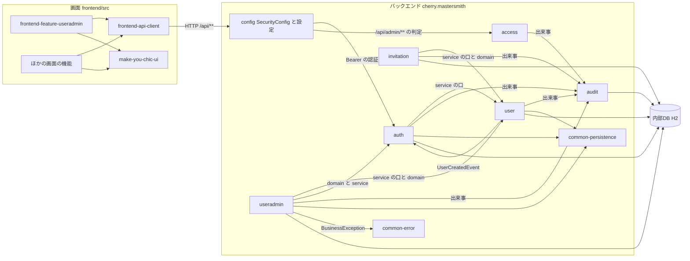
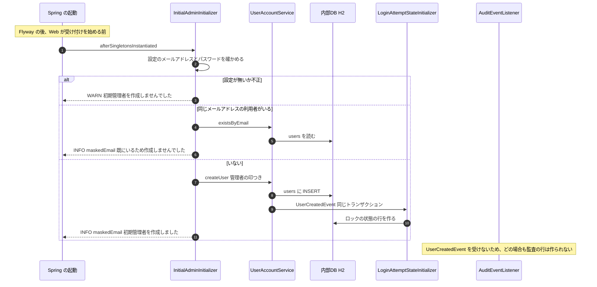
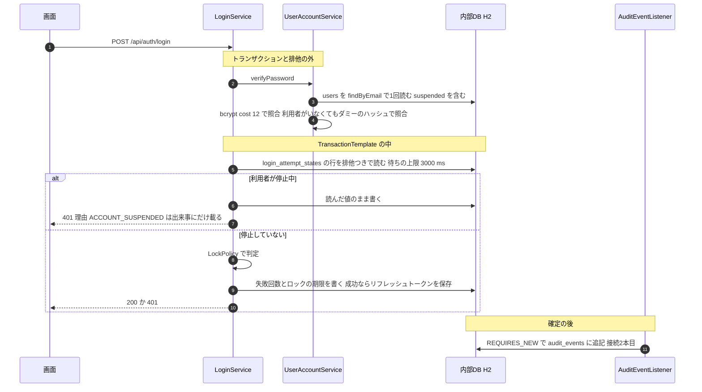
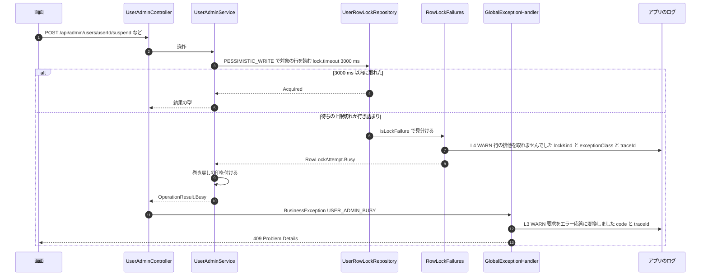
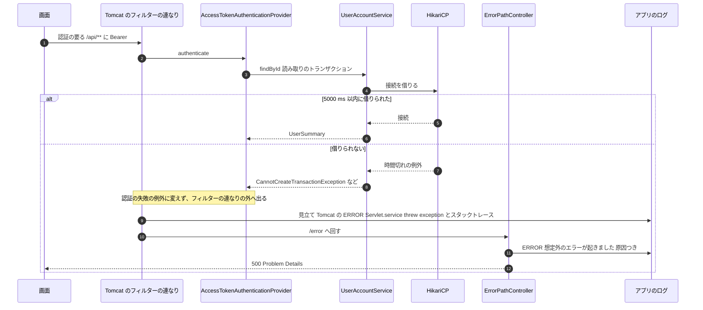

# アーキテクチャ（mastersmith2）

パスは、`backend/src/main/java/cherry/mastersmith/` の下のものはそれを省いて書く（画面・テスト・設定・移行のファイルは省かない）。部品ごとの責務と読みの深さは `component-inventory.md`、依存の向きは `dependencies.md`。

## Architecture Analysis

### System Overview

1つのプロセスの Web アプリケーションである。バックエンド（Java 25・Spring Boot 4.1.1）が REST API と、ビルド済みの画面（React の SPA）の配信の両方を受け持つ。成果物は画面のビルド結果を同梱した実行可能 WAR 1つで、コンテナ1つ（`Dockerfile`・`compose.yaml` の `app`）で動かす。

- 内部DB: 組み込みの H2（`application.yaml` の `jdbc:h2:file:./data/mastersmith;DEFRAG_ALWAYS=TRUE`）。利用者・ロックの状態・リフレッシュトークン・監査ログ・DSL・招待を置く。スキーマは Flyway の V1〜V9（前進のみ）が正本。単一インスタンスの前提で、ロックの判定と利用者の管理の操作は行の排他（待ちの上限 3000 ms）に頼る。
- 接続プール: HikariCP、上限の既定 30・借りる待ちの上限 5000 ms（`application.yaml`）。要求1件で接続を2本使う経路がある（業務のトランザクションと、確定の後の監査の書き込み）。
- 起動時に、設定の値から初期管理者を1人だけ作る（K-25、Interaction Diagrams 1）。
- 対象DB: MySQL・MariaDB・PostgreSQL のどれか1つ。スキーマを読むだけ（流し読み）。
- 外へ出る接続: 対象DB、SMTP（手元では Mailpit）、既定で無効の OTLP の送り先。
- ログ: 1行1件の JSON（logstash-logback-encoder）。MDC のうち `traceId`・`spanId` を各行に載せる（`logback-spring.xml`）。

### Architectural Style

**モジュール分けしたモノリス（層構造）**である。パッケージが機能ごと（`auth`・`access`・`audit`・`user`・`useradmin`・`invitation`・`mail`・`appearance`・`targetdb`・`dsl`・`dslmanage`）と共通（`common`・`config`）に分かれ、各機能の中が `web`・`service`・`domain`・`repository` の層（と用途名の下位パッケージ）になる（`code-structure.md`）。

根拠（前回までの記録。今回は決まりの中身を確かめ直していない）:

- 層の決まりは全体の `ArchitectureTest` が、機能の間の向きは機能ごとの `*BoundaryArchitectureTest` が ArchUnit で確かめる。
- 機能の間は、直接の呼び出し（service の口）・差し込み口（`SecurityRuleContributor` などの Bean）・アプリの中の出来事（Spring の `ApplicationEventPublisher`）でつなぐ。逆向きの知らせは出来事で行う（`team.md` の Code Style）。今回確かめた例は、`user` の `UserCreatedEvent` を `auth` が受ける形と、各機能の出来事を `audit` が受ける形である。

### Component Relationships

```mermaid
flowchart LR
  subgraph FE["画面 frontend/src"]
    FUA["frontend-feature-useradmin"]
    FOTHER["ほかの画面の機能"]
    APIC["frontend-api-client"]
    MYC["make-you-chic-ui"]
  end
  subgraph BE["バックエンド cherry.mastersmith"]
    CFG["config SecurityConfig と設定"]
    AUTH["auth"]
    ACC["access"]
    USER["user"]
    UA["useradmin"]
    INV["invitation"]
    AUDIT["audit"]
    PERS["common-persistence"]
    ERR["common-error"]
  end
  H2[("内部DB H2")]

  FUA --> APIC
  FUA --> MYC
  FOTHER --> APIC
  FOTHER --> MYC
  APIC -- "HTTP /api/**" --> CFG
  CFG -- "Bearer の認証" --> AUTH
  CFG -- "/api/admin/** の判定" --> ACC
  AUTH -- "service の口" --> USER
  UA -- "service の口と domain" --> USER
  UA -- "domain と service" --> AUTH
  INV -- "service の口と domain" --> USER
  USER -- "UserCreatedEvent" --> AUTH
  AUTH -- "出来事" --> AUDIT
  ACC -- "出来事" --> AUDIT
  USER -- "出来事" --> AUDIT
  UA -- "出来事" --> AUDIT
  INV -- "出来事" --> AUDIT
  UA --> PERS
  USER --> PERS
  AUTH --> PERS
  UA -- "BusinessException" --> ERR
  USER --> H2
  AUTH --> H2
  UA --> H2
  INV --> H2
  AUDIT --> H2
```

<!-- Text fallback: 画面では、利用者の管理の画面（frontend-feature-useradmin）とほかの画面の機能が frontend-api-client を通して同じオリジンの /api/** を呼び、make-you-chic-ui の部品を使う。バックエンドでは、config の SecurityConfig が要求を受け、auth が Bearer のアクセストークンを認証し、access が /api/admin/** を管理者だけに絞る。auth・useradmin・invitation は user の service の口（と domain）を使い、useradmin は auth の domain と service も使う。user は UserCreatedEvent で auth にロックの状態の行を作らせる。auth・access・user・useradmin・invitation の出来事を audit が受けて内部DB に記録する。useradmin・user・auth は common-persistence の行の排他の結果の型と失敗の判定を使い、useradmin の業務エラーは common-error が応答に変える。user・auth・useradmin・invitation・audit が内部DB を読み書きする。 -->

図は今回の Intent の論点（初期管理者・ログイン・利用者の管理・例外の扱い）を中心に描いた。`appearance`・`mail`・`dsl`・`dslmanage`・`targetdb`・画面のほかの機能は省いた（一覧は `component-inventory.md`）。`common-persistence` を使う側は import の検索で確かめた（`dependencies.md`）。

### Data Flow

1. 画面の要求は `Authorization: Bearer <アクセストークン>` を付けて送られる。セッションと CSRF の仕組みは無い。`/api/**` の既定はログインが必要で、`/api/admin/**` は管理者だけ（前回までの記録）。
2. アクセストークンの認証（`auth/web/AccessTokenAuthenticationProvider.java`）はフィルターの中で動き、利用者 ID から `UserAccountService.findById`（読み取りのトランザクション）で利用者を読み直し、停止中なら拒否する。ここで DB の接続を借りる（K-28、Interaction Diagrams 4）。
3. トランザクションは `service` の層で始まる。業務処理は想定内の失敗を結果の型（sealed interface）で返し、controller が `switch` で `BusinessException` に変え、`common/error/web/GlobalExceptionHandler.java`（`@RestControllerAdvice`）が Problem Details にする（4xx は WARN「要求をエラー応答に変換しました」、5xx は ERROR「想定外のエラーが起きました」）。Spring MVC の外の例外は `/error`（`common/error/web/ErrorPathController.java`）が受ける。
4. 監査の対象の出来事は業務のトランザクションの中で知らせ、`audit/service/AuditEventListener.java`（`@TransactionalEventListener(AFTER_COMMIT, fallbackExecution = true)`）が受けて、`audit/service/AuditEventRecorder.java`（`REQUIRES_NEW`）で `audit_events` に追記する。記録の失敗は受け止めて ERROR を1回出し、呼び出し元へ伝えない。
5. 行の排他を取れなかったとき（待ちの上限切れ・行き詰まり）は `common/persistence/RowLockFailures.java` が見分けて WARN を出し、`RowLockAttempt.Busy` を返す（K-27、Interaction Diagrams 3）。

### Key Design Decisions

| 選択 | 内容（確かめた場所） | 今回の Intent との関わり |
|---|---|---|
| 初期管理者は起動時に設定の値から作り、同じメールアドレスの利用者がいれば何もしない | `user/service/InitialAdminInitializer.java` 92〜105 行 | 救済の口が無い。作成は監査に残らない（K-25） |
| 監査は出来事を受けて確定の後に別のトランザクションで追記し、失敗を呼び出し元へ伝えない | `audit/service/AuditEventListener.java`・`AuditEventRecorder.java` | 起動の途中の出来事も、この仕組みのまま記録できる形（K-25） |
| 監査の行は接続元 IP を必ず持つ | `audit_events.source_ip VARCHAR(45) NOT NULL`（`V4__u4_audit_event.sql`）、`AuditEvent` の構築子の `requireNonNull` | 要求の無い起動時の出来事の値を決める必要がある（K-25） |
| 利用者の状態（停止・管理者の印）は認証の3つの入口でサーバー側が判定する | `auth/service/LoginService.java` 189 行・`auth/service/TokenRefreshService.java`・`auth/web/AccessTokenAuthenticationProvider.java` | ログインでは問い合わせを増やさずに判定している（K-26） |
| 行の排他の失敗は結果の型で返し、元の例外を持たない | `common/persistence/RowLockAttempt.java` 20〜24 行の注記（連なりの文に行の値が入りうるため） | BUSY の L4 の持ち主（K-27） |
| 例外のログは変換する境界で1回だけ出す | `team.md` の Code Style、`GlobalExceptionHandler`・`ErrorPathController` | フィルターの中の例外が二重に出うる（K-28） |
| make-you-chic-ui はこのリポジトリから変えない | `project.md` の Forbidden | 言語の欄の直しの選択肢が絞られる（K-29） |
| 内部DB は組み込みの H2・単一インスタンス | 前の Intent からの既知の決定 | 外の接続から行を持ち続けて BUSY を起こす負荷の場面が作りにくい（K-27） |

### Improvement Opportunities

- 起動時の運用の操作（初期管理者の作成・将来の救済）が監査の外にある（K-25）。要求の無い出来事を監査に載せる決まり（接続元・操作した人）が無い。
- 例外を受ける場所が `@RestControllerAdvice`（Spring MVC の中）と `/error`（フィルターとコンテナ）の2つに分かれ、同じ文の ERROR を出す。ログの件数だけでは経路を区別できず、`logger` の項目で見分ける必要がある（K-28）。
- 同じイメージの版とダイジェストを3か所に手で書いている（K-31、`dependencies.md`）。
- `audit_events` は追記のたびに NULL を許す列が増え（V6・V7）、出来事ごとにどの列を使うかの決まりはコメントにしか無い（開発担当の記録。今回の Intent の外）。

## Interaction Diagrams

図はどれも今回（コミット `47ec27b`）の走査で読んだコードによる。見立て（未検証）の部分は図の Note と本文で分けた。

### 1. 起動時の初期管理者の作成と監査（K-25）

```mermaid
sequenceDiagram
  autonumber
  participant SP as Spring の起動
  participant IAI as InitialAdminInitializer
  participant UAS as UserAccountService
  participant DB as 内部DB H2
  participant LAS as LoginAttemptStateInitializer
  participant AL as AuditEventListener

  Note over SP: Flyway の後、Web が受け付けを始める前
  SP->>IAI: afterSingletonsInstantiated
  IAI->>IAI: 設定のメールアドレスとパスワードを確かめる
  alt 設定が無いか不正
    IAI-->>SP: WARN 初期管理者を作成しませんでした
  else 同じメールアドレスの利用者がいる
    IAI->>UAS: existsByEmail
    UAS->>DB: users を読む
    IAI-->>SP: INFO maskedEmail 既にいるため作成しませんでした
  else いない
    IAI->>UAS: createUser 管理者の印つき
    UAS->>DB: users に INSERT
    UAS->>LAS: UserCreatedEvent 同じトランザクション
    LAS->>DB: ロックの状態の行を作る
    IAI-->>SP: INFO maskedEmail 初期管理者を作成しました
  end
  Note over AL: UserCreatedEvent を受けないため、どの場合も監査の行は作られない
```

<!-- Text fallback: Spring の起動で、Flyway の後、Web が受け付けを始める前に InitialAdminInitializer の afterSingletonsInstantiated が呼ばれる。設定のメールアドレスとパスワードを確かめ、無いか不正なら WARN「初期管理者を作成しませんでした」を出して終わる。UserAccountService.existsByEmail で同じメールアドレスの利用者がいれば、停止中でも管理者でなくても INFO（キー maskedEmail）「既にいるため作成しませんでした」を出して終わる。いなければ createUser で管理者の印つきの利用者を作り、同じトランザクションで UserCreatedEvent を知らせ、LoginAttemptStateInitializer がロックの状態の行を作る。最後に INFO「初期管理者を作成しました」を出す。AuditEventListener は UserCreatedEvent を受けないため、どの場合も監査の行は作られない。 -->

K-25 確かめた事実:

- 初期管理者は `user/service/InitialAdminInitializer.java`（`SmartInitializingSingleton`）が、設定 `mastersmith.auth.initial-admin.email`・`password`（環境変数 `MASTERSMITH_AUTH_INITIAL_ADMIN_EMAIL`・`MASTERSMITH_AUTH_INITIAL_ADMIN_PASSWORD`。`.env.example` では値は空）から作る。記録はアプリのログの INFO（キー `maskedEmail`）だけである（92〜105 行）。
- 作成の判定は `existsByEmail` だけで、**そのメールアドレスの利用者がいれば、停止中でも管理者でなくても何もしない**（92〜95 行）。今の救済（前の Intent の手順 RB-22、記録による）は「別のメールアドレスに替えて新しい管理者を作る」形しか取れず、既にいる利用者の停止を解く・管理者の印を付ける口はアプリに無い。
- `createUser` は同じトランザクションで `UserCreatedEvent(userId)` を知らせる（`user/service/UserAccountService.java` 385 行）。受け取るのは `auth/service/LoginAttemptStateInitializer.java` だけで、`audit` は受け取らない（アーキテクトが import の検索で確かめた）。
- `audit/domain/AuditEventType.java` は 20 種類（`LOGIN_SUCCEEDED`〜`LOGIN_FAILURES_RESET`）で、初期管理者の作成・救済に当たる種類は無い。`audit_events.event_type` は `VARCHAR(32)` で CHECK の制約は無い（種類を足すのに表の変更は要らない）。
- `audit_events.source_ip` は `VARCHAR(45) NOT NULL`（V4）。起動時の出来事には要求が無く接続元 IP が無いため、記録するには固定の値を決めるか、列の扱いを変える移行（次は V10）が要る。
- `AuditEventListener` は `fallbackExecution = true` のため、トランザクションの外で知らせた出来事も受け取れる。書き込みの失敗は受け止めて ERROR を1回出すだけなので、起動の途中で記録に失敗しても起動は続く形になる。
- 依存の向きは `audit` → `user`。新しい出来事を `user` 側（`PasswordChangedEvent` と同じく `user.domain` など）に置き、`audit` が受け取る形なら境界の向きは変わらない。
- `user/service/InitialAdminProperties.java` の `toString()`（33 行）はパスワードを `***` で伏せるが、**メールアドレスはそのまま文字列にする**。

K-25 見立て（未検証）:

- `InitialAdminProperties` が `TraceAspect` の対象の層の引数・戻り値として渡る経路は見当たらない（設定の部品のため）が、設定の結び付けの失敗のメッセージなどで文字列にされると、メールアドレスがログに出うる。救済の口を設けるときは `toString` を `EmailAddress.mask` の形にそろえるか確かめたい（`project.md` の Forbidden）。
- 救済を「起動時の設定で既存の利用者の停止を解く・印を付ける」形にするなら、管理者を増やす向きのため `project.md` の Forbidden（最後の有効な管理者を無くす操作を受け付けない）とはぶつからない。ただし `.env` に残したまま再起動するたびに働くか（一度だけか）の決まりが要る。

### 2. ログインの流れと停止の判定（K-26）

```mermaid
sequenceDiagram
  autonumber
  participant P as 画面
  participant LS as LoginService
  participant UAS as UserAccountService
  participant DB as 内部DB H2
  participant AL as AuditEventListener

  P->>LS: POST /api/auth/login
  Note over LS,UAS: トランザクションと排他の外
  LS->>UAS: verifyPassword
  UAS->>DB: users を findByEmail で1回読む suspended を含む
  UAS->>UAS: bcrypt cost 12 で照合 利用者がいなくてもダミーのハッシュで照合
  Note over LS,DB: TransactionTemplate の中
  LS->>DB: login_attempt_states の行を排他つきで読む 待ちの上限 3000 ms
  alt 利用者が停止中
    LS->>DB: 読んだ値のまま書く
    LS-->>P: 401 理由 ACCOUNT_SUSPENDED は出来事にだけ載る
  else 停止していない
    LS->>LS: LockPolicy で判定
    LS->>DB: 失敗回数とロックの期限を書く 成功ならリフレッシュトークンを保存
    LS-->>P: 200 か 401
  end
  Note over AL,DB: 確定の後
  AL->>DB: REQUIRES_NEW で audit_events に追記 接続2本目
```

<!-- Text fallback: ログインでは、LoginService がトランザクションと排他の外で UserAccountService.verifyPassword を呼び、users を findByEmail で1回読み（suspended の列を含む）、bcrypt（cost 12）で照合する。利用者がいなくてもダミーのハッシュで照合する。次に TransactionTemplate の中で login_attempt_states の行を排他つきで読み（待ちの上限 3000 ms）、利用者が停止中なら読んだ値のまま書いて 401 にする（理由 ACCOUNT_SUSPENDED は出来事にだけ載る）。停止していなければ LockPolicy で判定し、失敗回数とロックの期限を書き、成功ならリフレッシュトークンを保存して 200、失敗なら 401 を返す。確定の後に AuditEventListener が REQUIRES_NEW で audit_events に追記する（接続2本目）。 -->

K-26 確かめた事実:

- 停止の判定（`auth/service/LoginService.java` 189 行 `if (user.suspended())`）は、照合の前に読んだ `UserSummary` の値を見るだけで、**問い合わせを増やしていない**。`suspended` は `users` の列（V9）で、同じ1行の読み取りに含まれる。判定は行の排他を取った後、`LockPolicy` の前に置かれている。
- bcrypt の cost は既定 12（`user/service/PasswordProperties.java`、`application.yaml` の `bcrypt-cost`、環境変数 `MASTERSMITH_AUTH_PASSWORD_BCRYPT_COST`）。
- `perf/k6/scenarios.js` の `loginSuccess` は「別々の利用者 10 名のログイン」で、台本に閾値を持たない。p95 は k6 の結果から読んで判定している（前の Intent の記録による）。

K-26 見立て（未検証）:

- ログインの時間の大半は bcrypt の計算で、停止の判定の追加は無視できる大きさと見る。939.6 ms と前の Intent の 904 ms の差（36 ms）は、PC の負荷やコンテナの CPU の割り当てのぶれの範囲の可能性が高い。
- 切り分けるには、停止の判定を入れる前の版のイメージと今の版を、同じ使い捨ての環境・同じ上限・同じ `VUS`・`DURATION` で交互に複数回流し、p95 の分布を比べる形が考えられる（1回ずつの比較ではぶれと区別できない）。手順は `perf/README.md`、`caffeinate -i` で台本全体を包む（`project.md` の Testing Posture）。

### 3. 409 USER_ADMIN_BUSY と L3・L4 のログ（K-27）

```mermaid
sequenceDiagram
  autonumber
  participant P as 画面
  participant UC as UserAdminController
  participant US as UserAdminService
  participant RL as UserRowLockRepository
  participant RF as RowLockFailures
  participant GEH as GlobalExceptionHandler
  participant LOG as アプリのログ

  P->>UC: POST /api/admin/users/userId/suspend など
  UC->>US: 操作
  US->>RL: PESSIMISTIC_WRITE で対象の行を読む lock.timeout 3000 ms
  alt 3000 ms 以内に取れた
    RL-->>US: Acquired
    US-->>UC: 結果の型
  else 待ちの上限切れか行き詰まり
    RL->>RF: isLockFailure で見分ける
    RF->>LOG: L4 WARN 行の排他を取れませんでした lockKind と exceptionClass と traceId
    RF-->>US: RowLockAttempt.Busy
    US->>US: 巻き戻しの印を付ける
    US-->>UC: OperationResult.Busy
    UC->>GEH: BusinessException USER_ADMIN_BUSY
    GEH->>LOG: L3 WARN 要求をエラー応答に変換しました code と traceId
    GEH-->>P: 409 Problem Details
  end
```

<!-- Text fallback: 利用者の管理の操作の要求で、UserAdminController が UserAdminService を呼び、UserAdminService は UserRowLockRepository で対象の行を PESSIMISTIC_WRITE（jakarta.persistence.lock.timeout 3000 ms）で読む。3000 ms 以内に取れれば Acquired で操作を続け、結果の型を返す。待ちの上限切れか行き詰まりなら、RowLockFailures.isLockFailure が見分けて L4 の WARN「行の排他を取れませんでした」（キー lockKind・exceptionClass、MDC の traceId）を出し、RowLockAttempt.Busy を返す。UserAdminService は巻き戻しの印を付けて OperationResult.Busy を返し、UserAdminController が BusinessException（USER_ADMIN_BUSY）に変え、GlobalExceptionHandler が L3 の WARN「要求をエラー応答に変換しました」（code、MDC の traceId）を出して 409 の Problem Details を返す。L3 と L4 は同じ要求のスレッドで出る。 -->

K-27 確かめた事実:

- BUSY は `user/repository/UserRowLockRepository.java` の排他つきの読み取り（`PESSIMISTIC_WRITE`、`LOCK_TIMEOUT_MILLIS = 3000`）が待ちの上限切れ・行き詰まりになったときだけ起きる。失敗回数を戻す操作は `auth.repository.LoginAttemptStateRepository`（同じく 3000 ms）を通る。
- 記録の呼び名の L4 は `common/persistence/RowLockFailures.java` の WARN、L3 は `GlobalExceptionHandler` の WARN（`code` が `USER_ADMIN_BUSY`）に当たる。どちらも同じ要求のスレッドで出て、`logback-spring.xml` が MDC の `traceId`・`spanId` を各行に載せる。
- 本番の待ち合わせの口（`useradmin/service/UserAdminBarrier.java`）は何もしない部品で、結合テストだけが差し替える。
- 既存の `backend/src/test/java/cherry/mastersmith/useradmin/web/UserAdminBusyApiIT.java` は、別のトランザクションで対象の行を持ち続けて5つの操作の 409 を作るが、L3・L4 の `traceId` の結び付きは確かめていない。
- 前の Intent の T1 の負荷では、409 の 128 件の内訳は `USER_ADMIN_NO_CHANGE` 70・`USER_ADMIN_TARGET_SUSPENDED` 58・`USER_ADMIN_BUSY` 0 だった（記録による）。

K-27 見立て（未検証）:

- 操作は1件 1 ms 前後（記録による）で排他を持つ時間が短く、本番のコードのまま k6 の負荷で 3 秒の待ちを作るのは難しい。接続の待ち（5 秒）が先に尽きて 500 になる経路の方が起きやすい。
- 組み込みの H2 のファイルは1つのプロセスからしか開けず、`AUTO_SERVER` も使っていないため、使い捨ての環境でも外から行を持ち続けて BUSY を起こすのは難しい。結合テスト（`UserAdminBusyApiIT` と同じ作り方に、ログの JSON を捕まえる `common/testsupport/JsonLogRecords.java` などを足して L3 と L4 の `traceId` が1対1で一致することを確かめる）の方が確実と見る。どちらで確かめるかは要件で決める。

### 4. フィルターの中の例外と ERROR の二重の出力（K-28）

```mermaid
sequenceDiagram
  autonumber
  participant P as 画面
  participant TC as Tomcat のフィルターの連なり
  participant ATP as AccessTokenAuthenticationProvider
  participant UAS as UserAccountService
  participant HK as HikariCP
  participant EPC as ErrorPathController
  participant LOG as アプリのログ

  P->>TC: 認証の要る /api/** に Bearer
  TC->>ATP: authenticate
  ATP->>UAS: findById 読み取りのトランザクション
  UAS->>HK: 接続を借りる
  alt 5000 ms 以内に借りられた
    HK-->>UAS: 接続
    UAS-->>ATP: UserSummary
  else 借りられない
    HK-->>UAS: 時間切れの例外
    UAS-->>ATP: CannotCreateTransactionException など
    Note over ATP,TC: 認証の失敗の例外に変えず、フィルターの連なりの外へ出る
    TC->>LOG: 見立て Tomcat の ERROR Servlet.service threw exception とスタックトレース
    TC->>EPC: /error へ回す
    EPC->>LOG: ERROR 想定外のエラーが起きました 原因つき
    EPC-->>P: 500 Problem Details
  end
```

<!-- Text fallback: 認証の要る /api/** への要求で、Tomcat のフィルターの連なりの中の AccessTokenAuthenticationProvider.authenticate が UserAccountService.findById（読み取りのトランザクション）を呼び、HikariCP から接続を借りる。5000 ms 以内に借りられれば UserSummary を返す。借りられないと時間切れの例外が CannotCreateTransactionException などになり、認証の失敗の例外に変えられずにフィルターの連なりの外へ出る。見立てでは、Tomcat が「Servlet.service() ... threw exception」の ERROR をスタックトレースつきで出し、続いて /error に回して ErrorPathController が同じ例外を原因に付けて ERROR「想定外のエラーが起きました」を出し、500 の Problem Details を返す。 -->

K-28 確かめた事実:

- `GlobalExceptionHandler`（`@RestControllerAdvice`）は `Exception.class` まで受けて 5xx で ERROR を1回出すが、Spring MVC（`DispatcherServlet`）の中の例外だけを受ける。
- フィルターやコンテナで起きた例外は `/error` に回り、`ErrorPathController` が `RequestDispatcher.ERROR_EXCEPTION` を原因に付けて、5xx なら ERROR「想定外のエラーが起きました」を出す（84〜91 行）。文は `GlobalExceptionHandler` の 5xx の ERROR と同じである。
- `AccessTokenAuthenticationProvider.authenticate` はフィルターの中で `findById`（`@Transactional(readOnly = true)`）を呼んで接続を借りる。接続を借りられないときの例外を認証の失敗の例外（`TokenAuthenticationException`）に変えていない。
- 前の Intent の T1 の ERROR の内訳は「想定外のエラーが起きました」456・Tomcat の `dispatcherServlet` のロガーの `Servlet.service() … threw exception` 239・監査の記録の失敗 206 だった（記録による）。

K-28 見立て（未検証）:

- 接続の時間切れの負荷で、上の図の経路により 239 件は「想定外のエラーが起きました」456 件のうちの `/error` 経由の分と重なる。そうなら `team.md` の「例外のログは変換する境界で1回だけ出す」に反する二重の出力である。
- 確かめ方の候補: 結合テストで、認証の要る要求の間に `findById` の接続の取得を失敗させ（プールの上限を 1 にして持ち続けるなど）、Tomcat のロガー（`org.apache.catalina.core.ContainerBase.[Tomcat].[localhost].[/].[dispatcherServlet]`）の ERROR と `ErrorPathController` の ERROR が同じ `traceId` で2行出るかを、ログの JSON の `logger` の項目で数える。
- 直すときは `common.error.web`・`auth.web`（どちらも `packagesJudgedByTotal` の外）に手が入る見込み。`common.error.service`・`common.error.domain`・`common.web` に手を入れるとカバレッジの作業が付く（K-30）。
