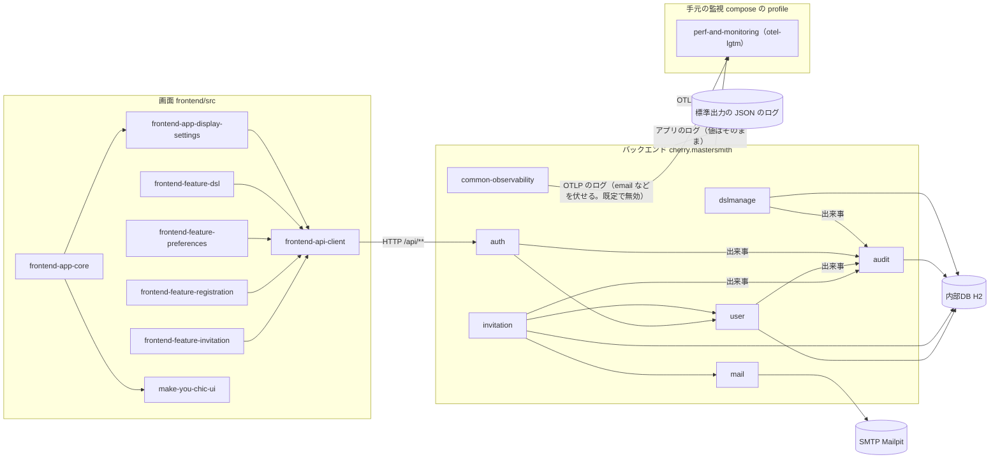
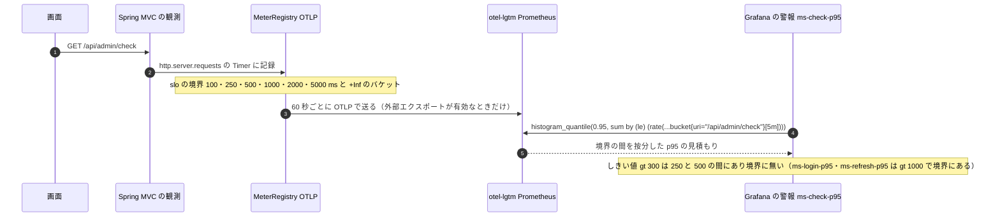
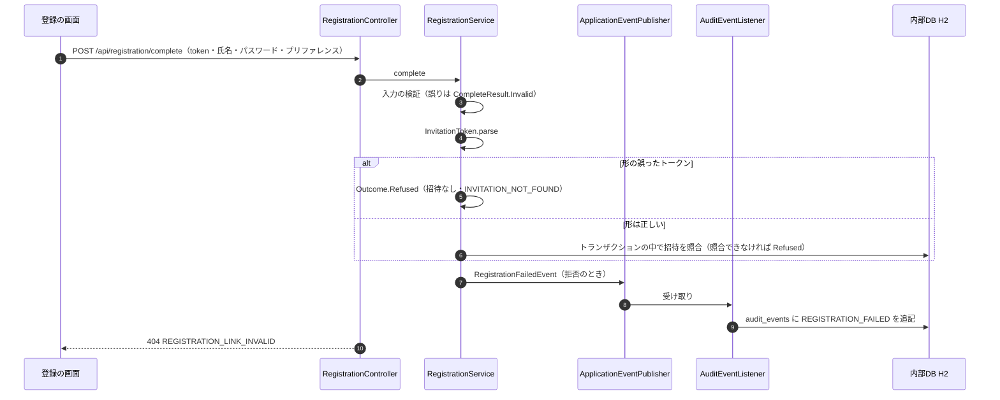
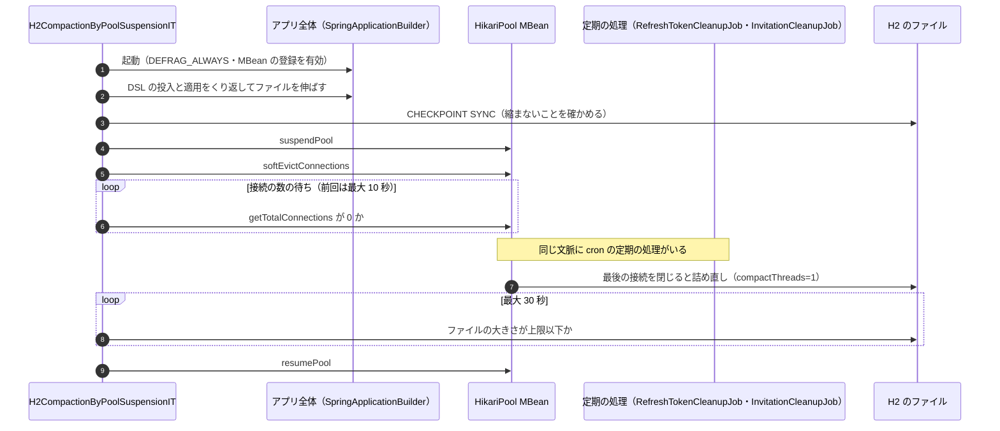
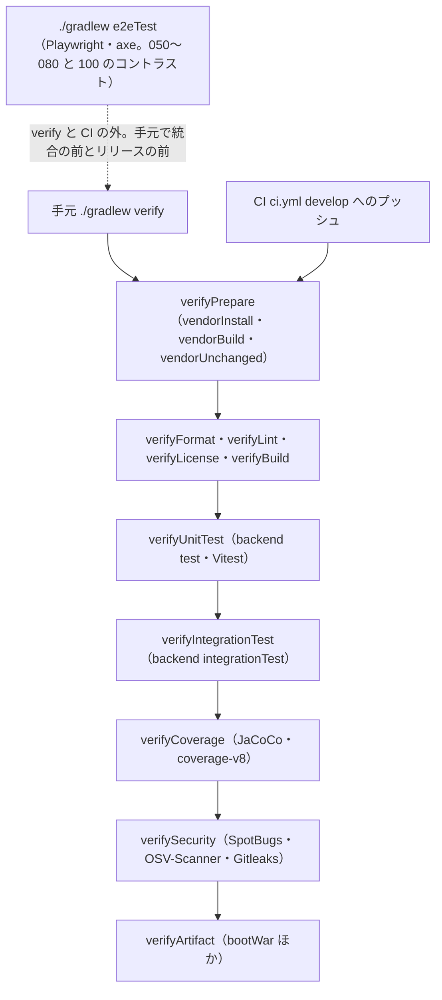

# アーキテクチャ（mastersmith2）

## Architecture Analysis

### System Overview

1つのプロセスの Web アプリケーションである。バックエンド（Java 25・Spring Boot 4.1.1）が REST API と、ビルド済みの画面（React の SPA）の配信の両方を受け持つ。成果物は画面のビルド結果を同梱した実行可能 WAR 1つで、コンテナ1つ（`Dockerfile`・`compose.yaml` の `app`）で動かす。JVM は `-XX:MaxRAMPercentage=50.0 -Duser.timezone=Asia/Tokyo -Dh2.compactThreads=1` で起動する（`Dockerfile`、前回の記録）。

- 内部DB: 組み込みの H2（ファイル保存、`DEFRAG_ALWAYS=TRUE`）。利用者・トークン・ロックの状態・監査ログ・DSL・招待を置く。スキーマは Flyway（V1〜V8）が正本。接続プールは HikariCP（MBean を登録し、運用の道具 `docker/hikari-pool.sh` から一時停止と破棄を行う）。1インスタンスだけで動く前提である。
- 起動時に、設定の値から初期管理者を1人だけ作る（`user/service/InitialAdminInitializer`。2回目以降の起動では作らない。ログの項目は K-11）。
- 対象DB: MySQL・MariaDB・PostgreSQL のどれか1つ。スキーマを読むだけ。
- 外へ出る接続: 対象DB、SMTP（手元では Mailpit）、既定で無効の OTLP の送り先（指標・トレース・ログ）。

### Architectural Style

**モジュール分けしたモノリス（層構造）**である。パッケージが機能ごと（`auth`・`access`・`audit`・`user`・`invitation`・`mail`・`appearance`・`targetdb`・`dsl`・`dslmanage`）と共通（`common`・`config`）に分かれ、各機能の中が `web`・`service`・`domain`・`repository` の層（と用途名の下位パッケージ）になる（`code-structure.md`）。境界は ArchUnit のテストで確かめている（前回までの記録。今回は読み直していない）。機能の間は、直接の呼び出し・差し込み口（`SecurityRuleContributor` などの Bean）・アプリの中の出来事（監査は出来事を受けて記録）でつなぐ。向きは `dependencies.md`。

### Component Relationships

```mermaid
flowchart LR
  subgraph FE["画面 frontend/src"]
    CORE["frontend-app-core"]
    DISP["frontend-app-display-settings"]
    FINV["frontend-feature-invitation"]
    FREG["frontend-feature-registration"]
    FPREF["frontend-feature-preferences"]
    FDSL["frontend-feature-dsl"]
    APIC["frontend-api-client"]
    MYC["make-you-chic-ui"]
  end
  subgraph BE["バックエンド cherry.mastersmith"]
    AUTH["auth"]
    USER["user"]
    INV["invitation"]
    MAIL["mail"]
    AUDIT["audit"]
    DSLM["dslmanage"]
    OBS["common-observability"]
  end
  subgraph OPS["手元の監視 compose の profile"]
    LGTM["perf-and-monitoring（otel-lgtm）"]
  end
  H2[("内部DB H2")]
  SMTP[("SMTP Mailpit")]
  STDOUT[("標準出力の JSON のログ")]

  CORE --> DISP
  CORE --> MYC
  FINV --> APIC
  FREG --> APIC
  FPREF --> APIC
  FDSL --> APIC
  DISP --> APIC
  APIC -- "HTTP /api/**" --> AUTH
  AUTH --> USER
  INV --> USER
  INV --> MAIL
  MAIL --> SMTP
  INV -- "出来事" --> AUDIT
  USER -- "出来事" --> AUDIT
  AUTH -- "出来事" --> AUDIT
  DSLM -- "出来事" --> AUDIT
  USER --> H2
  INV --> H2
  AUDIT --> H2
  DSLM --> H2
  BE -- "アプリのログ（値はそのまま）" --> STDOUT
  OBS -- "OTLP のログ（email などを伏せる。既定で無効）" --> LGTM
  BE -- "OTLP 指標（既定で無効）" --> LGTM
```

<!-- Text fallback: 画面の骨組み（frontend-app-core）が見た目の設定（frontend-app-display-settings）と make-you-chic-ui を組み合わせ、招待・登録・プリファレンス・DSL の各画面は frontend-api-client を通して同じオリジンの /api/** を呼ぶ。バックエンドでは auth がトークンを認証し user を使う。invitation は user と mail を使い、mail が SMTP（手元では Mailpit）へ送る。invitation・user・auth・dslmanage の出来事を audit が受けて内部DB に記録する。アプリのログは標準出力に値のまま JSON で出る。外部エクスポートを有効にしたときだけ、ログは common-observability が email などのキーの値を伏せてから、指標とともに OTLP で手元の監視（otel-lgtm）へ送られる。 -->

図は今回と前回の Intent に関わる流れを中心に描いた。`access`・`appearance`・`common` のほか・`config`・`dsl`・`targetdb`・画面の登録の仕組みなどは省いた（一覧は `component-inventory.md`）。ログの伏せ字が OTLP の出口だけに当たり、標準出力には当たらないことが K-11 の背景である（`SanitizingLogRecordExporter` は流し読み、README 664 行の説明による）。

### Data Flow

1. 画面の要求は `Authorization: Bearer` を付けて送られ、Spring Security の連鎖（認証 → アクセスの判定 → 本文の大きさの上限）を経てコントローラーに届く（前回までの記録。今回は読み直していない）。
2. トランザクションは `service` の層で始まり、`repository` の層が内部DB を読み書きする。業務エラーは `@RestControllerAdvice` の1か所で Problem Details（`code` 付き）になる。
3. 監査の対象の出来事は、確定の後に `audit` が2本目の接続で `audit_events` に追記する。
4. 観測: Spring MVC の観測が要求ごとに `http.server.requests` を、`SmtpMailSender` が `mastersmith.mail.send` を、`DslOperationMetrics` が `mastersmith.dsl.operation` を作る。`http.server.requests`・`mastersmith.mail.send` は `application.yaml` の `management.metrics.distribution.slo` で決めた境界だけのバケットを出す（`346c719` で足された。今回は流し読みで確かめた）。外部エクスポートを有効にすると、OTLP で 60 秒ごとに送る（流れは Interaction Diagrams 1）。
5. ログ: アプリのログはキーと値で渡し、標準出力に JSON で出る。外部エクスポートの出口（`common/observability/SanitizingLogRecordExporter`）だけが、キー `email`・`enteredEmail`・`sourceIp`・`userAgent` の値を伏せる（K-11）。

### Key Design Decisions

| 選択 | 内容（確かめた場所） | 今回の Intent との関わり |
|---|---|---|
| 指標は決めた境界だけのバケットを出す | `application.yaml` の `slo` に `http.server.requests` の 100・250・500・1000・2000・5000 ms（と `+Inf`）。既定のバケット（数十個）は使わず系列の数を絞る（前の Intent の決定、コメントによる） | K-15（300 ms が境界に無い） |
| 手元の監視は見たいときだけ起動 | otel-lgtm と警報・ダッシュボードのファイルを compose の profile で読む（`docker/monitoring/`）。警報・パネル・SLI の表・README の表が同じしきい値を別々に持つ | K-15 の直しは4か所をそろえる |
| ログの伏せ字は外部エクスポートの出口だけ | `SanitizingLogRecordExporter` の `MASKED_KEYS`（流し読み）。標準出力は値のまま | K-11（アプリのログにメールアドレスを出さない決まりは、出口の伏せ字では満たせない） |
| デザインシステムはサブモジュールで固定 | `vendor/make-you-chic-ui` を固定先のコミットで使い、中身は変えない（`project.md` の Forbidden） | K-12 |
| E2E とブラウザのコントラストの検査は CI の外 | `./gradlew e2eTest`（Playwright）は `verify` に含まれない（`team.md` の Testing Posture） | K-13（固定先を上げたときの確かめは手元の E2E だけ） |
| 版の固定と更新の知らせを分ける | 版は lockfile と `libs.versions.toml`、知らせは Dependabot（GitHub の画面ではマージしない） | K-14 |

### Improvement Opportunities

- `ms-check-p95` のしきい値をバケットの境界に合わせるか、境界に 300 ms を足すか（K-15）。どちらも警報・パネル・SLI の表・README の表を一緒に直す必要がある。
- 同じしきい値を4か所が別々に持つため、ずれやすい（K-15 はそのずれの1つ。前の Intent の要件の前提とも食い違った）。
- メールアドレスをログに出さない決まり（`project.md` の Forbidden）を、個々のログの呼び出しで守る形になっている。README 774 行によれば監査の書き込みの失敗の ERROR もキーと値でメールアドレスを載せる（`audit` は範囲の外で、コードは確かめていない。仮説として今回の1件目の範囲に入るかは要件で決める）。

## Interaction Diagrams

### 1. 要求の指標から p95 の警報まで（K-15）

```mermaid
sequenceDiagram
  autonumber
  participant C as 画面
  participant MVC as Spring MVC の観測
  participant REG as MeterRegistry OTLP
  participant L as otel-lgtm Prometheus
  participant G as Grafana の警報 ms-check-p95

  C->>MVC: GET /api/admin/check
  MVC->>REG: http.server.requests の Timer に記録
  Note over REG: slo の境界 100・250・500・1000・2000・5000 ms と +Inf のバケット
  REG->>L: 60 秒ごとに OTLP で送る（外部エクスポートが有効なときだけ）
  G->>L: histogram_quantile(0.95, sum by (le) (rate(...bucket{uri="/api/admin/check"}[5m])))
  L-->>G: 境界の間を按分した p95 の見積もり
  Note over G: しきい値 gt 300 は 250 と 500 の間にあり境界に無い（ms-login-p95・ms-refresh-p95 は gt 1000 で境界にある）
```

<!-- Text fallback: 画面の GET /api/admin/check を Spring MVC の観測が http.server.requests の Timer に記録する。slo の設定で 100・250・500・1000・2000・5000 ms と +Inf のバケットを持ち、外部エクスポートが有効なときだけ 60 秒ごとに OTLP で otel-lgtm へ送られる。Grafana の警報 ms-check-p95 は uri が /api/admin/check のバケットに histogram_quantile(0.95) を当て、300 ms を超えたかを判定する。300 は境界に無く、250 と 500 の間の按分の見積もりで判定することになる。ms-login-p95・ms-refresh-p95 のしきい値 1000 は境界にある。 -->

K-15（確かめた事実）:

- 警報 `ms-check-p95`（`docker/monitoring/provisioning/alerting/mastersmith.yaml` 217〜247 行、題「確認用 API の遅れ」、`for: 5m`、`noDataState: OK`）のしきい値は `gt 300`（ミリ秒）。同じ形の `ms-login-p95`（157〜186 行）・`ms-refresh-p95`（187〜216 行）は `gt 1000`。
- `http.server.requests` のバケットの境界は 100・250・500・1000・2000・5000 ms と `+Inf`（`application.yaml` 281〜284 行、流し読み）。コメントは「警報のしきい値 1000 ms を境界に含める」で、300 には触れていない。
- 300 は、警報のほかに、ダッシュボード `docker/monitoring/dashboards/mastersmith-overview.json` のパネル「確認用 API（/api/admin/check）」のしきい値の段（赤 `300`、386〜396 行付近）と SLI の表（83 行「300 ミリ秒以内」）、README の「警報と対応の手順」の表（699〜706 行）にある。README 682〜683 行は境界と「境界の刻みより細かい値は出ない」を説明する。
- 前の Intent の Build and Test で、しきい値が 1000 ms ではなく 300 ms と分かり要件の前提と食い違ったことが記録されている（`project.md` の Testing Posture の学び）。

K-15（見立て、未検証）:

- 境界の無い 300 では、p95 の値は 250〜500 の間の按分の見積もりになり、300 を超えたかの判定が粗い。
- 直し方は、しきい値を境界に合わせる（例 250・500）か、`slo` に 300ms を足す（`uri` などの組ごとに系列が1つ増える）かのどちらか。後者は `application.yaml` の変更で、`config`（流し読み）に手を入れる。どちらを選ぶかは要件で決める。

### 2. 登録の完了の拒否と監査（前回の K-8）

この図は前回（`e68f54d`）の記録で、今回は読み直していない。K-8 の記録の誤りは `7c2fea4`（README の直し）で扱われた（件名による）。

```mermaid
sequenceDiagram
  autonumber
  participant P as 登録の画面
  participant RC as RegistrationController
  participant RS as RegistrationService
  participant EP as ApplicationEventPublisher
  participant AL as AuditEventListener
  participant DB as 内部DB H2

  P->>RC: POST /api/registration/complete（token・氏名・パスワード・プリファレンス）
  RC->>RS: complete
  RS->>RS: 入力の検証（誤りは CompleteResult.Invalid）
  RS->>RS: InvitationToken.parse
  alt 形の誤ったトークン
    RS->>RS: Outcome.Refused（招待なし・INVITATION_NOT_FOUND）
  else 形は正しい
    RS->>DB: トランザクションの中で招待を照合（照合できなければ Refused）
  end
  RS->>EP: RegistrationFailedEvent（拒否のとき）
  EP->>AL: 受け取り
  AL->>DB: audit_events に REGISTRATION_FAILED を追記
  RC-->>P: 404 REGISTRATION_LINK_INVALID
```

<!-- Text fallback: 登録の画面がトークンと入力を送る。RegistrationService は入力を検証し、トークンの形を確かめる。形が誤っていれば招待なし（INVITATION_NOT_FOUND）の拒否とし、形が正しければトランザクションの中で招待を照合する。拒否のときは RegistrationFailedEvent を出し、audit が REGISTRATION_FAILED を監査ログに追記する。画面には 404 REGISTRATION_LINK_INVALID が返る。 -->

前回の確かめた事実: `RegistrationService.complete`（152〜159 行）は、形の誤ったトークンでも `RegistrationFailedEvent` を出す。`AuditEventListener` はこの出来事を受け、`AuditEventType` に `REGISTRATION_FAILED` がある。拒否の応答は 404 `REGISTRATION_LINK_INVALID` で、5xx の割合の警報には当たらない。K-8 の本文は `api-documentation.md`。

### 3. プールの一時停止による詰め直しのテスト（前回の K-4）

この図は前回（`e68f54d`）の記録で、今回は読み直していない。K-4 は `b20bf1e`（上限を延ばし、失敗時の診断を足す）で扱われた（件名による）。

```mermaid
sequenceDiagram
  autonumber
  participant T as H2CompactionByPoolSuspensionIT
  participant APP as アプリ全体（SpringApplicationBuilder）
  participant POOL as HikariPool MBean
  participant JOB as 定期の処理（RefreshTokenCleanupJob・InvitationCleanupJob）
  participant H2 as H2 のファイル

  T->>APP: 起動（DEFRAG_ALWAYS・MBean の登録を有効）
  T->>APP: DSL の投入と適用をくり返してファイルを伸ばす
  T->>H2: CHECKPOINT SYNC（縮まないことを確かめる）
  T->>POOL: suspendPool
  T->>POOL: softEvictConnections
  loop 接続の数の待ち（前回は最大 10 秒）
    T->>POOL: getTotalConnections が 0 か
  end
  Note over POOL,JOB: 同じ文脈に cron の定期の処理がいる
  POOL->>H2: 最後の接続を閉じると詰め直し（compactThreads=1）
  loop 最大 30 秒
    T->>H2: ファイルの大きさが上限以下か
  end
  T->>POOL: resumePool
```

<!-- Text fallback: テストはアプリ全体を起動し、DSL の投入と適用をくり返して H2 のファイルを伸ばす。CHECKPOINT SYNC で縮まないことを確かめた後、プールの MBean で一時停止と破棄を行い、接続が 0 本になるまで待つ（前回の記録では最大 10 秒）。最後の接続が閉じると H2 が詰め直し、ファイルが上限以下になるまで最大 30 秒待ってから再開する。同じ文脈に cron で動く定期の処理が2つある。 -->

前回の記録: CI での失敗の箇所は接続の数の待ち（10 秒）で、原因は確かめていなかった。仮説は (a) 接続の補充、(b) 定期の処理の借りっぱなし、(c) CI の runner の遅さ、だった。その後の直しの中身（延ばした上限・診断の形）は今回確かめていない。

### 4. 検査の流れと E2E の置き場（K-13）

```mermaid
flowchart TD
  DEV["手元 ./gradlew verify"] --> PREP["verifyPrepare（vendorInstall・vendorBuild・vendorUnchanged）"]
  CI["CI ci.yml develop へのプッシュ"] --> PREP
  PREP --> FMT["verifyFormat・verifyLint・verifyLicense・verifyBuild"]
  FMT --> UT["verifyUnitTest（backend test・Vitest）"]
  UT --> IT["verifyIntegrationTest（backend integrationTest）"]
  IT --> COV["verifyCoverage（JaCoCo・coverage-v8）"]
  COV --> SEC["verifySecurity（SpotBugs・OSV-Scanner・Gitleaks）"]
  SEC --> ART["verifyArtifact（bootWar ほか）"]
  E2E["./gradlew e2eTest（Playwright・axe。050〜080 と 100 のコントラスト）"] -. "verify と CI の外。手元で統合の前とリリースの前" .-> DEV
```

<!-- Text fallback: 手元の ./gradlew verify と CI（develop へのプッシュ）は同じ段を順に通る。準備（サブモジュールの準備と変更なしの確かめ）、フォーマット・リンタ・ライセンス・ビルド、単体テスト、結合テスト、カバレッジ、セキュリティ、成果物。E2E（Playwright と axe の 050〜080 のアクセシビリティの検査と 100 のコントラストの検査）は verify と CI の外にあり、手元で統合の前とリリースの前に流す。 -->

確かめた事実: CI は `develop` へのプッシュ・タグ `v*`・手動で `./gradlew verify` を1回流し、E2E は流さない（`.github/workflows/ci.yml`）。したがって make-you-chic-ui の固定先を上げたときのコントラストの確かめ（K-12・K-13）は、手元の `./gradlew e2eTest` でだけ行える。段の並び（`build.gradle.kts` の `mustRunAfter`）は前回の記録で、今回は並びを読み直していない。
