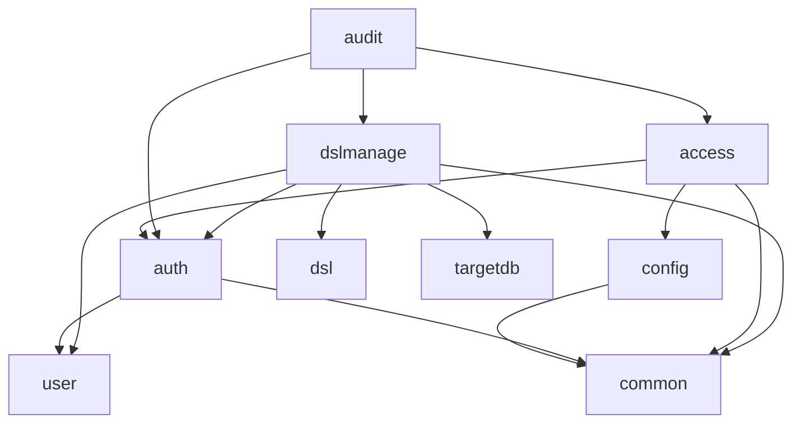

# 依存関係（mastersmith2）

部品の版は `technology-stack.md`、部品ごとの責務は `component-inventory.md` に書き、ここでは依存の向きと管理の決まりだけを書く。

## 外部への依存

### 実行時に接続するもの

| 相手 | 接続の仕方 | 既定 |
|---|---|---|
| 内部DB（H2、組み込み・ファイル） | Spring Boot の `DataSource`（HikariCP）、`MASTERSMITH_DB_URL` で上書き可（上書きするときも `;DEFRAG_ALWAYS=TRUE` を付ける） | 有効 |
| 対象DB（MySQL・MariaDB・PostgreSQL のどれか1つ） | `targetdb/config/`、設定は環境変数 | 設定したときだけ。読み取りだけ |
| OTLP の受け手 | `mastersmith.observability.export.*` | 無効 |

### ビルド時・検査時に使うもの

- Maven Central、npm のレジストリ
- Gitleaks・OSV-Scanner
- `vendor/make-you-chic-ui`（Git サブモジュール。先にビルドしてから画面をビルド）
- コンテナの実行環境（Testcontainers による対象DB の結合テスト。colima は `DOCKER_HOST`・`TESTCONTAINERS_DOCKER_SOCKET_OVERRIDE` を README どおりに渡す）

## 依存の管理の決まり

- Gradle は lockfile で固定（`dependencyLocking { lockAllConfigurations() }`）。npm は `npm ci`。
- 新しい依存は、採用の前にライセンスと、推移依存で既存の部品の版を引き上げないかを確かめる（`team.md`・`project.md`）。

## 内部の依存（バックエンドのパッケージ間）

各パッケージの `import cherry.mastersmith.*` を検索して確かめた（アーキテクトの確認、前回の記録と一致）。

文章による代替: `config` は `common` を使う。`auth` は `user` と `common`、`access` は `auth`・`common`・`config` を使う。`audit` は出来事の型のために `auth`・`access`・`dslmanage` を使う（逆向きの依存は無い）。`dslmanage` は `dsl`・`targetdb`・`user`・`auth`・`common` を使う。`dsl`・`targetdb`・`user`・`common` はアプリの中のほかのパッケージを import しない。循環する依存は無い。

### 内部DB の表の持ち主

| 表 | 持ち主 | 作るスキーマ変更 |
|---|---|---|
| `users` | `user` | V2 |
| `login_attempt_states`・`refresh_tokens` | `auth` | V3 |
| `audit_events` | `audit` | V4・V6 |
| `dsl_previews`・`dsl_applied_revisions` | `dslmanage`（本文は `yaml_bytes` の BLOB） | V5 |

表の形を変えるときは V7 以降で前進のみとし、1つ前の版のアプリが動く後方互換を保つ（`team.md` の Deployment）。

## ビルドのタスクの依存

- `verify` → フォーマット・リンタ・ライセンスヘッダー・型検査・`backend:test`・`backend:integrationTest`・カバレッジの下限・画面のテスト・Gitleaks・SpotBugs・OSV-Scanner
- `backend:bootWar` → `frontendBuild` → `vendorBuild`
- イメージは WAR をコピーするだけ（`Dockerfile`）
