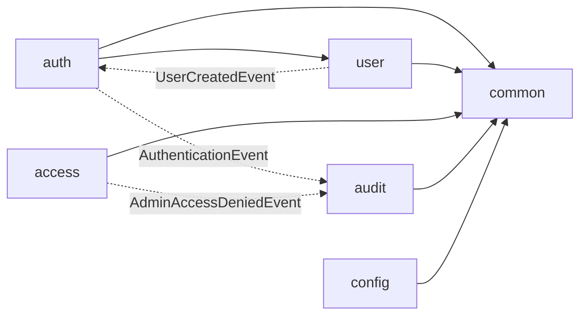

# 依存関係（mastersmith2）

## 外部の依存

外部のライブラリと版は `technology-stack.md` に記す。依存の固定の仕組み:

- Gradle: 依存の lockfile（`backend/gradle.lockfile`、`settings-gradle.lockfile`）と版の目録（`gradle/libs.versions.toml`）。Tomcat は 11.0.26 に強制。
- npm: `frontend/package-lock.json`。CI では `npm ci`。
- サブモジュール: `vendor/make-you-chic-ui`（固定先 `5258c8b`）。固定先の更新は承認を得た専用のコミットで行う。
- 外部サービスへの実行時の依存は無い（DB は同じプロセスの組み込み H2。OTLP の送信は既定で無効）。

## ビルドの依存

- `:backend:bootWar` → `:frontendBuild` → `vendorBuild` → `vendorInstall`（`frontend/dist` を WAR の `WEB-INF/classes/static` に同梱）。
- `verify`（ルート `build.gradle.kts`）→ フォーマット → リンタ → ライセンスヘッダー → ビルド → 単体テスト → 結合テスト → カバレッジ → 安全の検査 → 成果物 の9段。CI（`.github/workflows/ci.yml`）も同じタスクを呼ぶ。
- `:backend:check` → `integrationTest`（`*IT`）。`test` は `*Test` だけ。

## 内部の依存（パッケージの間）

図の文字での説明: 直接の呼び出しは `auth` → `user`（照合・利用者の検索）と、各機能 → `common` だけ。`auth`・`access` から `audit` へは出来事だけでつながり、直接の呼び出しは無い（ArchUnit で確認）。`user` → `auth` も `UserCreatedEvent` だけ。

## 実行時に共有する資源（本 Intent の要点）

| 資源 | 共有する部品 | 影響 |
|---|---|---|
| HikariCP のプール `mastersmith-db`（最大 10） | auth・user・audit の repository、`TimeBoundedDbHealthIndicator` | 1 要求が2本を同時に持つ経路（`LOGIN_SUCCEEDED`・`LOGIN_FAILED`・`LOGGED_OUT`）があるため、同時の数が 10 に達すると全員が待ち合う（F2） |
| 要求のスレッド（Tomcat、上限は既定） | すべての API | 監査は要求と同じスレッドで書くため、監査の待ちがそのまま応答の遅れになる |
| 組み込み H2 のファイル | アプリ1プロセスだけ | 単一インスタンスの前提 |
