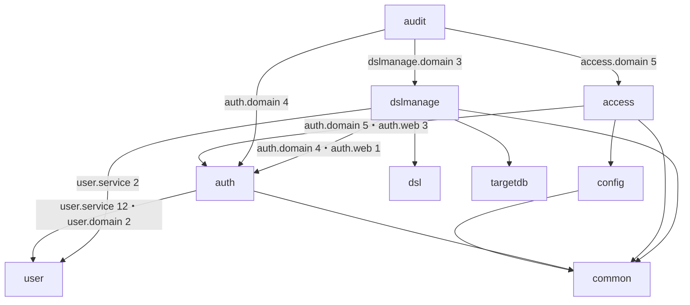
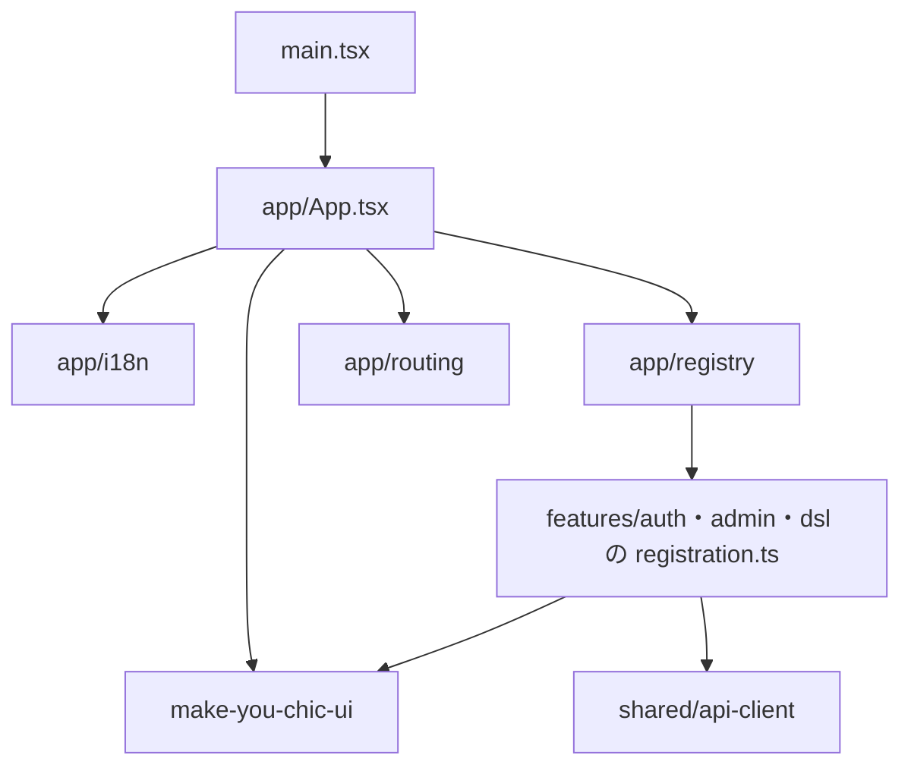

# 依存関係（mastersmith2）

部品の版は `technology-stack.md`、部品ごとの責務は `component-inventory.md` に書き、ここでは依存の向きと管理の決まりだけを書く。

## 外部への依存

### 実行時に接続するもの

| 相手 | 接続の仕方 | 既定 |
|---|---|---|
| 内部DB（H2、組み込み・ファイル） | Spring Boot の `DataSource`（HikariCP、上限 30・借りる待ち 5 秒）、`MASTERSMITH_DB_URL` で上書き可 | 有効 |
| 対象DB（MySQL・MariaDB・PostgreSQL のどれか1つ） | `targetdb` の独自のプール（上限 既定 5）、設定は環境変数 `MASTERSMITH_TARGET_DB_*` | 設定したときだけ。読み取りだけ |
| OTLP の受け手 | `mastersmith.observability.export.*` | 無効 |
| メールの送り先（SMTP） | 無い（K-3、`technology-stack.md`） | — |

### ビルド時・検査時に使うもの

- Maven Central（Gradle の依存の唯一の取得元）、npm のレジストリ
- Gitleaks・OSV-Scanner（版と SHA-256 を固定）
- `vendor/make-you-chic-ui`（Git サブモジュール。`vendorBuild` で先にビルドしてから画面をビルド）
- コンテナの実行環境（Testcontainers による対象DB の結合テスト）

## 依存の管理の決まり

- Gradle は lockfile で固定（`dependencyLocking { lockAllConfigurations() }`、更新は `./gradlew :backend:resolveAndLockAll --write-locks`）。npm は `npm ci`（`package-lock.json`）。
- 新しい依存は、採用の前にライセンスと、推移依存で既存の部品の版を引き上げないかを確かめる（`team.md` の Code Style、`project.md` の Corrections）。Apache License 2.0 と異なれば ADR に理由を残す。
- 画面の実行時の依存の脆弱性は High 以上で統合を止める（`team.md` の Deployment、`config/npm-build-tools.txt`）。

## 内部の依存（バックエンドのパッケージ間）

各パッケージの `import cherry.mastersmith.*` を検索して確かめた（アーキテクトの確認、2026-09-25）。数は import の行の数。

<!-- Text fallback: config は common を使う。auth は user（service を 12 行、domain を 2 行）と common を使う。access は auth（domain と web）・common・config を使う。audit は出来事の型のために auth・access・dslmanage の domain を使う。dslmanage は dsl・targetdb・user の service・auth（domain と web）・common を使う。user・dsl・targetdb・common はアプリの中のほかの機能を import しない。循環する依存は無い。 -->

- `user`・`dsl`・`targetdb` はアプリの中のほかのパッケージを import しない（`common` も使わない）。`user` が `auth` に依存しないことと、`auth` が `user.repository` と `User` のエンティティに依存しないことは `AuthBoundaryArchitectureTest` で確かめている。
- `audit` は出来事の型を通して `auth`・`access`・`dslmanage` に依存し、逆向きの依存は無い（`auth` と `user` は `audit` に依存しないことも `AuthBoundaryArchitectureTest` で確かめている）。出来事を足すたびに `audit` の依存先が増える（K-7、`component-inventory.md` の `audit`）。
- `user` から `auth` への知らせは、import ではなく出来事（`UserCreatedEvent`）で行う。

### `common` の中の依存

| 使う側 | 使う相手 |
|---|---|
| `config` | `common.security`・`common.web`・`common.observability` |
| `auth` | `common.error`（domain・web）・`common.security`・`common.observability` |
| `access` | `common.error.domain`・`common.security` |
| `dslmanage` | `common.error.domain`・`common.i18n.domain`・`common.web` |
| `common.error` | `common.i18n.domain`・`common.observability`・`common.security`・`common.web` |
| `common.security` | `common.error.domain` |
| `common.web` | `common.error.domain`・`common.security` |

`common.health`・`common.i18n`・`common.observability` は `common` の中のほかを import しない。

### 内部DB の表の持ち主

| 表 | 持ち主 | 作るスキーマ変更 |
|---|---|---|
| `users` | `user` | V2 |
| `login_attempt_states`・`refresh_tokens` | `auth` | V3（`login_attempt_states.subject_id` は利用者の ID かダミーの行の ID） |
| `audit_events` | `audit` | V4・V6 |
| `dsl_previews`・`dsl_applied_revisions` | `dslmanage` | V5 |

表の形を変えるときは V7 以降で前進のみとし、1つ前の版のアプリが動く後方互換を保つ（`team.md` の Deployment、README の「スキーマの変更（Flyway）」）。

## 画面の依存

<!-- Text fallback: main.tsx が App.tsx を起動し、App.tsx は make-you-chic-ui（ThemeProvider など）・表示言語・登録・振り分けを組み合わせる。登録は各機能の registration.ts を読み込み、各機能は共通の API の呼び出しと make-you-chic-ui の部品を使う。 -->

## ビルドのタスクの依存

- `verify` → `verifyPrepare` → `verifyFormat` → `verifyLint` → `verifyLicense` → `verifyBuild` → `verifyUnitTest` → `verifyIntegrationTest` → `verifyCoverage` → `verifySecurity` → `verifyArtifact`
- `backend:bootWar` → `frontendBuild` → `vendorBuild`。WAR の `WEB-INF/classes/static` に `frontend/dist` を同梱する。
- イメージは WAR をコピーするだけ（`Dockerfile`）。
