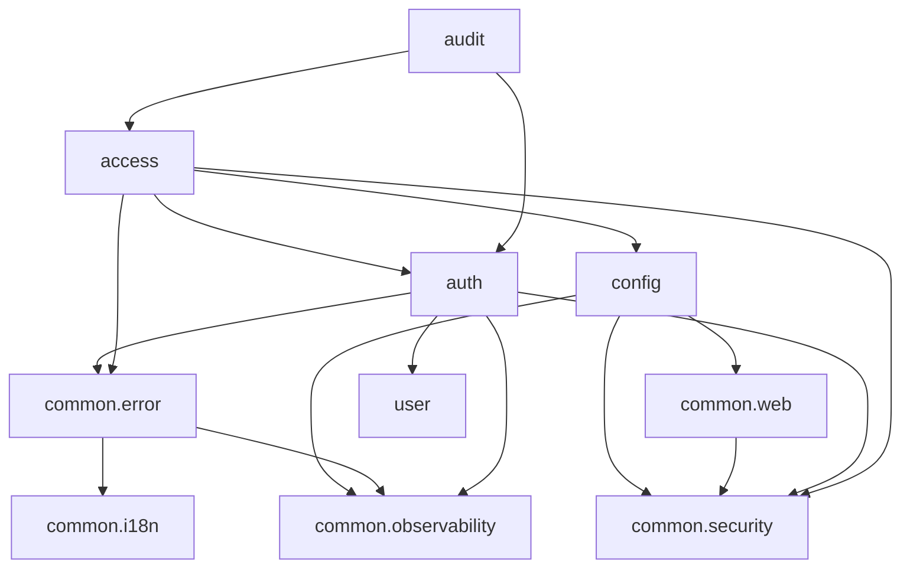

# 依存関係（mastersmith2）

部品の版は `technology-stack.md`、部品ごとの責務は `component-inventory.md` を参照。ここでは、依存の向きと、依存を管理する決まりだけを書く。

## 外部への依存

### 実行時に接続するもの

| 相手 | 接続の仕方 | 既定 |
|---|---|---|
| 内部DB（H2、組み込み・ファイル保存） | Spring Boot の自動構成の `DataSource` 1つ（`spring.datasource.*`、HikariCP `mastersmith-db`） | 有効。`jdbc:h2:file:./data/mastersmith`（コンテナでは `/app/data`） |
| OTLP の受け手（トレース・ログ・指標） | `mastersmith.observability.export.*` | 無効 |

ほかの外部のシステム（対象DB を含む）への接続は無い。

### ビルド時・検査時に使うもの

- Maven Central（Gradle の取得元はここだけ。`settings.gradle.kts` の `FAIL_ON_PROJECT_REPOS`）
- npm のレジストリ（`frontend/package-lock.json`、`vendor/make-you-chic-ui/package-lock.json`）
- Gitleaks・OSV-Scanner（手元では導入済みの道具、CI では版と SHA-256 で固定して取得）
- `vendor/make-you-chic-ui`（Git サブモジュール。`vendorInstall`・`vendorBuild` で先にビルドし、`vendorUnchanged` で変更が無いことを確かめる）

## 依存の管理の決まり

- Gradle は全構成を lockfile で固定する（`backend/gradle.lockfile`・`settings-gradle.lockfile`）。更新は `:backend:resolveAndLockAll --write-locks`。
- npm は lockfile どおりに入れる（CI は `npm ci`）。
- OSV-Scanner の関門（`osvScan`）: Gradle は CVSS 7.0 以上で失敗。npm は実行時の依存（推移を含む）が High 以上で失敗、開発用は警告。ただし成果物を作る道具（`config/npm-build-tools.txt`）と `MAL-` で始まるものは開発用でも失敗。
- Tomcat の版は `resolutionStrategy` で上書きしている（`backend/build.gradle.kts`）。
- 新しい依存を足すときは、lockfile の更新と OSV の関門を通す必要がある。

## 内部の依存（バックエンドのパッケージ間）

文章による代替（`import` 文を grep で集めて確かめた）:

- `config` は `common.security`（差し込み口）、`common.web`（フィルター・設定の型）、`common.observability`（送るトレースの消毒）を使う。
- `common` の中では、`common.error` が `common.i18n`（表示言語）と `common.observability`（トレースID）を使う。`common` から機能のパッケージへの依存は無い。
- `auth` は `user`（`user.domain`・`user.service`。利用者の照合と検索）、`common.error`、`common.security`、`common.observability`（`ClientInfoResolver` がトレースIDを取る）を使う。
- `access` は `auth`（`auth.domain` の主体 `AuthenticatedUser`、`auth.web` の `TokenAuthenticationEntryPoint`・`ClientInfoResolver`）、`common.error`・`common.security`、`config`（`AccessRequestRejectedHandler` が `SecurityHeaderProperties` を使う）を使う。
- `audit` は `auth.domain`（`AuthenticationEvent`）と `access.domain`（`AdminAccessDeniedEvent`）の出来事の型にだけ依存する。トレースIDは出来事が運ぶ。`auth`・`access` から `audit` への依存は無い（出来事で疎結合）。
- `user` はアプリの中のほかのパッケージを import しない。

循環する依存は見当たらない。`access` は DB を読まない。

### 内部DB の表の持ち主

| 表 | 持ち主 | 作るスキーマ変更 |
|---|---|---|
| `users` | `user` | `V2__u2_user_account.sql` |
| `login_attempt_states` | `auth` | `V3__u2_authentication.sql` |
| `refresh_tokens` | `auth`（`users` への外部キー） | `V3__u2_authentication.sql` |
| `audit_events` | `audit` | `V4__u4_audit_event.sql` |

表ごとに書き込む部品は1つである。

### トランザクションと接続の結び付き

JPA の `EntityManagerFactory`・既定の `PlatformTransactionManager`・Flyway・`common.health` の確認は、どれも内部DB の1つの `DataSource` に結び付いている。`@Transactional`（名前の指定なし）と、`LoginService` に注入される `PlatformTransactionManager` も、この1つを指している。

## 内部の依存（画面）

- `features/*` → `app/registry`（登録の型）、`shared/api-client`（API の呼び出し）、`make-you-chic-ui`
- `app/*` → `app/registry`、`make-you-chic-ui`、react-router、i18next
- `features/auth` は `registerAuthHandlers` で、トークンの取得・更新の手段を `shared/api-client` に渡す。`shared/api-client` は `features/auth` を import しない。

## ビルドのタスクの依存

- `verify` → 段 0〜9（`mustRunAfter` で順に並ぶ）。段の中身は `code-quality-assessment.md` の「CI/CD と検査の関門」を参照。
- `:backend:bootWar` → `:frontendBuild` → `vendorBuild`（`frontend/dist` を WAR の `WEB-INF/classes/static` に同梱。成果物は `mastersmith.war`）
- `frontendTypecheck`・`frontendTest`・`frontendCoverage` → `vendorBuild`
- `e2eTest` → `:backend:bootWar`（`verify` と CI には入れない）
