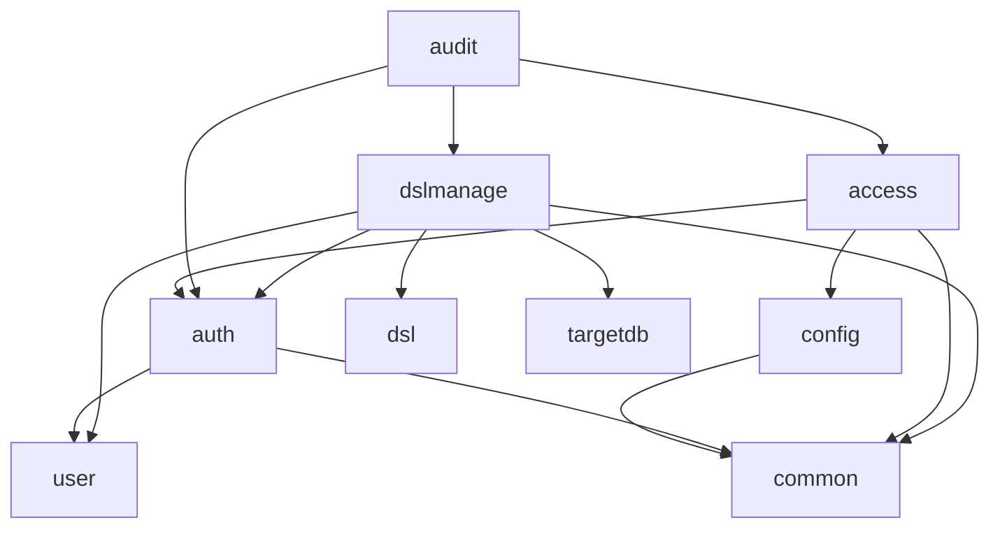

# 依存関係（mastersmith2）

部品の版は `technology-stack.md`、部品ごとの責務は `component-inventory.md` に書き、ここでは依存の向きと管理の決まりだけを書く。

## 外部への依存

### 実行時に接続するもの

| 相手 | 接続の仕方 | 既定 |
|---|---|---|
| 内部DB（H2、組み込み・ファイル） | Spring Boot の自動構成の `DataSource`（HikariCP） | 有効 |
| 対象DB（MySQL・MariaDB・PostgreSQL のどれか1つ） | `targetdb/config/TargetDataSourceConfig`、設定は `MASTERSMITH_TARGET_DB_*`（`application.yaml` 75〜103 行） | 設定したときだけ。読み取りだけ |
| OTLP の受け手（トレース・ログ・指標） | `mastersmith.observability.export.*`（`application.yaml` 221〜244 行） | 無効 |

### コンテナの間の依存（`compose.yaml`）

- `app` は `.env` の全体を `env_file` で読む（32〜34 行）。見本の対象DB の3つのサービス（profile で起動）は、同じ `.env` の `MASTERSMITH_SAMPLE_TARGETDB_ADMIN_PASSWORD`・`MASTERSMITH_SAMPLE_TARGETDB_READER_PASSWORD` を `${...}` の展開で受ける。そのため `app` の環境変数にも見本の DB の管理者のパスワードが入る（TD-6）。
- 負荷の試験の環境（`docker/perf/compose.yaml`）は、対象DB 用に別の環境ファイル（`MASTERSMITH_PERF_TARGETDB_ENV_FILE`）を使い、アプリには渡していない。
- `otel-collector`・`lgtm` は profile で起動し、アプリは外部エクスポートを有効にしたときだけ送る。

### ビルド時・検査時に使うもの

- Maven Central（Gradle の取得元はここだけ）、npm のレジストリ
- Gitleaks・OSV-Scanner（CI では版と SHA-256 で固定）
- `vendor/make-you-chic-ui`（Git サブモジュール。`vendorBuild` で先にビルドし、`vendorUnchanged` で変更が無いことを確かめる。CI は checkout の `submodules: true` で固定先を取る）

## 依存の管理の決まり

- Gradle は lockfile で固定（`backend/gradle.lockfile`・`settings-gradle.lockfile`）。npm は `npm ci`。
- OSV-Scanner の関門: Gradle は CVSS 7.0 以上、npm は実行時の依存が High 以上で失敗（成果物を作る道具と `MAL-` は開発用でも失敗）。`vendor/make-you-chic-ui` の lockfile も検査する。
- Dependabot はサブモジュール（gitsubmodule）と `vendor/make-you-chic-ui` の npm を対象にしていない。
- サブモジュールの固定先の更新は、承認を得た専用のコミットで行い、前後のハッシュを記録する（`project.md` の Mandated）。

## 内部の依存（バックエンドのパッケージ間）

各パッケージの `import cherry.mastersmith.*` を検索して確かめた（アーキテクトの確認）。

文章による代替:

- `config` は `common.security`・`common.web`・`common.observability` を使う。
- `auth` は `user.domain`・`user.service` と `common.error`・`common.security`・`common.observability` を使う。
- `access` は `auth.domain`・`auth.web`、`common.error`・`common.security`、`config` を使う。
- `audit` は出来事の型の `auth.domain`・`access.domain`・`dslmanage.domain` にだけ依存する（出来事で疎結合。逆向きの依存は無い）。
- `dslmanage` は `dsl.domain`・`dsl.service`、`targetdb.domain`・`targetdb.service`、`user.service`、`auth.domain`・`auth.web`、`common.error`・`common.web`・`common.i18n` を使う。
- `dsl`・`targetdb`・`user`・`common` は、アプリの中のほかのパッケージを import しない（`common` の中では `error` が `i18n`・`observability` を使う）。

循環する依存は見当たらない。

### 内部DB の表の持ち主

| 表 | 持ち主 | 作るスキーマ変更 |
|---|---|---|
| `users` | `user` | V2 |
| `login_attempt_states` | `auth`（主キー `subject_id`、ダミーの行 8 行、`users` への外部キーは無い） | V3 |
| `refresh_tokens` | `auth` | V3 |
| `audit_events` | `audit` | V4・V6 |
| `dsl_previews`・`dsl_applied_revisions` | `dslmanage` | V5 |

## 内部の依存（画面）

- `features/*` → `app/registry`・`shared/api-client`・`make-you-chic-ui`
- `features/dsl` → `make-you-chic-ui` の `Modal`（`DslConfirmDialog`）・`Alert`（閉じるボタンつきは `DslAdminPage` だけ）ほか
- `app/*` → `app/registry`・`make-you-chic-ui`・react-router・i18next

## ビルドのタスクの依存

- `verify` → 段 0〜9（`build.gradle.kts` 311〜379 行、中身は `code-quality-assessment.md`）
- `:backend:bootWar` → `frontendBuild` → `vendorBuild`（`frontend/dist` を WAR に同梱）
- `e2eTest` は `verify` と CI の外
- イメージは WAR をコピーするだけ（`Dockerfile`、`.dockerignore` は WAR だけを通す）
