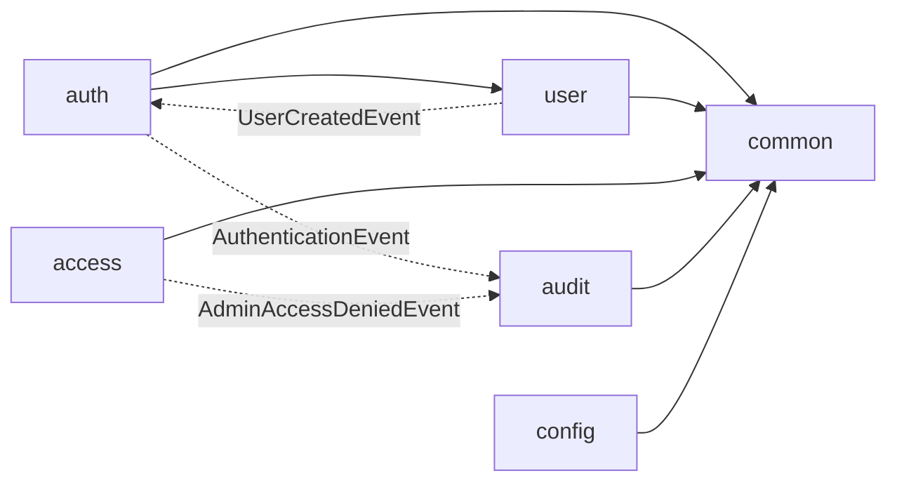

# 依存関係（mastersmith2）

## 外部の依存

外部のライブラリ・イメージと版は `technology-stack.md` に記す。依存の固定の仕組み:

- Gradle: 依存の lockfile（`backend/gradle.lockfile`、`settings-gradle.lockfile`）と版の目録（`gradle/libs.versions.toml`）。Tomcat は 11.0.26 に強制。
- npm: `frontend/package-lock.json`。CI では `npm ci`。
- サブモジュール: `vendor/make-you-chic-ui`。固定先の更新は承認を得た専用のコミットで行う。
- コンテナのイメージ: タグで版を固定（`eclipse-temurin:25.0.4_7-jre-noble`、`grafana/otel-lgtm:0.33.1`、`otel/opentelemetry-collector:0.161.0`、`grafana/k6:2.3.0`）。アプリのイメージは `mastersmith:${MASTERSMITH_IMAGE_TAG:-local}`。
- 外部サービスへの実行時の依存は無い（DB は同じプロセスの組み込み H2。OTLP の送信は既定で無効）。

## ビルドと配備の依存

- `:backend:bootWar` → `:frontendBuild` → `vendorBuild` → `vendorInstall`（`frontend/dist` を WAR に同梱）。
- `verify`（ルート `build.gradle.kts`）→ フォーマット → リンタ → ライセンスヘッダー → ビルド → 単体テスト → 結合テスト → カバレッジ → 安全の検査 → 成果物 の9段。CI（`.github/workflows/ci.yml`）も同じタスクを呼ぶ。
- WAR（`backend/build/libs/mastersmith.war`）→ イメージ（`Dockerfile`。`.dockerignore` で WAR だけを送る）→ 配備（`compose.yaml`）と負荷の試験（`docker/perf/compose.yaml`）が同じイメージを使う。
- イメージの作り直しが要るのは WAR か `Dockerfile`（JVM の引数を含む）を変えたとき。`compose.yaml` の上限（`cpus`・`mem_limit`）と `.env` の値は、作り直さずに `docker compose up -d` で反映できる。colima の VM の大きさは PC の上の操作（`colima stop` → `colima start --cpu … --memory …`）で、リポジトリには残らない。

## 内部の依存（パッケージの間）

図の文字での説明: 直接の呼び出しは `auth` → `user`（照合・利用者の検索）と、各機能 → `common` だけ。`auth`・`access` から `audit` へは出来事だけでつながり、直接の呼び出しは無い（ArchUnit で確認）。`user` → `auth` も `UserCreatedEvent` だけ。

## 実行時に共有する資源

| 資源 | 共有するもの | 影響 |
|---|---|---|
| colima の VM の CPU（現状 2） | 配備したアプリ、使い捨ての環境のアプリ、k6、`lgtm`、`otel-collector` | コンテナの `cpus` は VM の CPU を超えられない。ログインの照合（bcrypt）の速さは使える CPU の数で決まる（F4）。負荷の試験では k6 と対象が取り合う |
| colima の VM のメモリ（現状 2GiB） | 同上 | アプリ 1g ＋ 使い捨ての環境 1g、またはアプリ 1g ＋ `lgtm` 900m でほぼ埋まる。負荷の試験の間は配備したアプリを止める手順（`perf/README.md` 手順 0） |
| アプリのコンテナのメモリ（1g 固定） | JVM のヒープ（最大 768MB）とヒープ以外（上限なし） | 合計が 1g を超えると OOMKilled（F3） |
| HikariCP のプール `mastersmith-db`（上限 既定 30） | auth・user・audit の repository、`TimeBoundedDbHealthIndicator` | 1 要求が2本を同時に持つ経路があり、同時の数が上限に達すると監査の記録が欠けうる（F2） |
| 要求のスレッド（Tomcat、既定 200） | すべての API | 監査は要求と同じスレッドで書く。スレッドが増えるほどヒープ以外（スタック）も増える |
| 組み込み H2 のファイル（ボリューム `mastersmith-data`／`perf-data`） | アプリ1プロセスだけ | 単一インスタンスの前提 |
