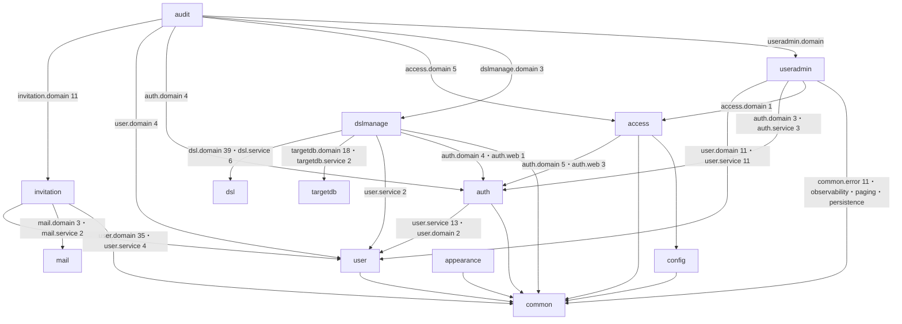
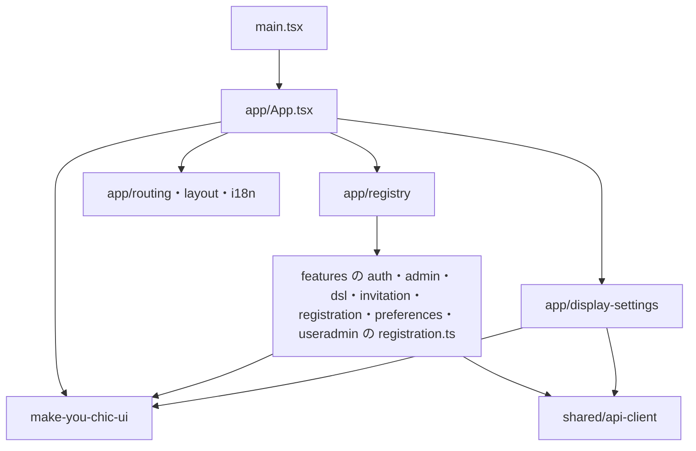

# 依存関係（mastersmith2）

部品の版は `technology-stack.md`、部品ごとの責務は `component-inventory.md` に書き、ここでは依存の向き・管理の決まりと K-3 の本文を書く。

## 外部への依存

### 実行時に接続するもの

| 相手 | 接続の仕方 | 既定 |
|---|---|---|
| 内部DB（H2、組み込み・ファイル） | Spring Boot の `DataSource`（HikariCP） | 有効。単一インスタンス前提 |
| 対象DB（MySQL・MariaDB・PostgreSQL のどれか1つ） | `targetdb`、設定は環境変数だけ | 設定したときだけ。読み取りだけ |
| SMTP（手元では Mailpit） | `mail`、接続先と資格情報は環境変数（`.env`）だけ | 接続先の設定が無ければ送らない（`project.md` の Mandated） |
| OTLP の受け手 | `management.otlp.*` ほか | 無効 |

### ビルド時・検査時に使うもの

- Maven Central（Gradle の依存の唯一の取得元、`settings.gradle.kts` の `RepositoriesMode.FAIL_ON_PROJECT_REPOS`。ビルドのプラグインは Gradle Plugin Portal）、npm のレジストリ
- Git サブモジュール `vendor/make-you-chic-ui`（npm の `file:`、`vendorBuild` で先にビルド）と `vendor/java-mustache-processor`（Gradle の composite build、`includeBuild`）
- Gitleaks・OSV-Scanner、コンテナの実行環境（対象DB の結合テスト）

## 依存の管理の決まり

- Gradle の依存は lockfile で固定、npm は `npm ci`（`package-lock.json`）。Gradle のプラグインは lockfile に載らず、`gradle/libs.versions.toml` の1行で決まる。
- 新しい依存は、採用の前にライセンスと、推移依存で既存の部品の版を引き上げないかを確かめる（`team.md` の Code Style、`project.md` の Corrections）。
- Dependabot（`.github/dependabot.yml`: gradle・npm・github-actions・docker）のプルリクエストは GitHub の画面でマージせず、手元でまとめて更新し `./gradlew verify` を通してから `develop` に統合して閉じる（`team.md` の Way of Working）。

## 内部の依存（バックエンドのパッケージ間）

アーキテクトが 2026-09-30 に各パッケージの `import cherry.mastersmith.*` を検索して数え直した（数は import の行の数）。2026-10-04 には `useradmin` の import と、`useradmin` を import する側だけを数え直して図に足した（ほかの数は 2026-09-30 のまま）。

```mermaid
flowchart TD
  config --> common
  auth -- "user.service 13・user.domain 2" --> user
  auth --> common
  access -- "auth.domain 5・auth.web 3" --> auth
  access --> common
  access --> config
  user --> common
  invitation -- "user.domain 35・user.service 4" --> user
  invitation -- "mail.domain 3・mail.service 2" --> mail
  invitation --> common
  appearance --> common
  audit -- "invitation.domain 11" --> invitation
  audit -- "user.domain 4" --> user
  audit -- "auth.domain 4" --> auth
  audit -- "access.domain 5" --> access
  audit -- "dslmanage.domain 3" --> dslmanage
  dslmanage -- "dsl.domain 39・dsl.service 6" --> dsl
  dslmanage -- "targetdb.domain 18・targetdb.service 2" --> targetdb
  dslmanage -- "user.service 2" --> user
  dslmanage -- "auth.domain 4・auth.web 1" --> auth
  dslmanage --> common
  useradmin -- "user.domain 11・user.service 11" --> user
  useradmin -- "auth.domain 3・auth.service 3" --> auth
  useradmin -- "access.domain 1" --> access
  useradmin -- "common.error 11・observability・paging・persistence" --> common
  audit -- "useradmin.domain" --> useradmin
```

<!-- Text fallback: config は common を使う。auth は user（service 13 行・domain 2 行）と common を使う。access は auth（domain 5 行・web 3 行）・common・config を使う。user は common だけを使う。invitation は user（domain 35 行・service 4 行）・mail（domain と service）・common を使う。appearance は common だけを使う。audit は出来事の型のために invitation・user・auth・access・dslmanage の domain を使う。dslmanage は dsl・targetdb・user（service）・auth・common を使う。useradmin（2026-10-04 に足した）は user（domain 11 行・service 11 行）・auth（domain 3 行・service 3 行）・access の domain・common（error・observability・paging・persistence）を使い、audit が出来事の型のために useradmin の domain を使う。mail・dsl・targetdb・common はアプリの中のほかのパッケージを import しない。循環する依存は無い（useradmin を import するのは自分と audit だけ）。 -->

### `common` の中の依存

| 使う側 | 使う相手 |
|---|---|
| `config` | `common.security`・`common.web`・`common.observability` |
| `auth` | `common.error`・`common.security`・`common.observability` |
| `access` | `common.error`・`common.security` |
| `user` | `common.error`・`common.observability` |
| `invitation` | `common.error`・`common.security`・`common.web`・`common.observability` |
| `appearance` | `common.security` |
| `dslmanage` | `common.error`・`common.i18n`・`common.web` |
| `useradmin` | `common.error`・`common.observability`・`common.paging`・`common.persistence`（2026-10-04） |

## K-3 境界の決まり: `user` は `auth` を知らない

前回（2026-09-30）の記録。その後の Intent `260930-user-admin` は、置き場の候補の 2（新しい機能のパッケージ `useradmin`）を選び、境界の検査 `backend/src/test/java/cherry/mastersmith/useradmin/UserAdminBoundaryArchitectureTest.java` を足した（ファイルの存在だけを確かめた）。

確かめた事実（決まりの名前と対象を読んだ。テストは実行していない）:

- `backend/src/test/java/cherry/mastersmith/auth/AuthBoundaryArchitectureTest.java`:
  - 47 行「auth does not depend on user.domain entities or user.repository」: `auth` は `user` の service の口と値の型だけを使う。
  - 61 行「user does not depend on auth」: `user` は `auth` を知らない。
  - 73 行「auth and user do not depend on audit」: 監査への知らせは出来事で行う。
  - 86 行「only classes inside user read the password hash of User」。
- `backend/src/test/java/cherry/mastersmith/invitation/InvitationBoundaryArchitectureTest.java`: 49 行「invitation depends neither on auth nor on audit」、61 行 `user` は service の口と domain の値の型だけ、101 行 `dsl`・`dslmanage`・`targetdb`・`access`・`appearance` に依存しない、118 行「outside invitation only audit depends on it」（`invitation` の外から依存してよいのは `audit` だけ）。
- `backend/src/test/java/cherry/mastersmith/audit/AuditBoundaryArchitectureTest.java`: 監査の repository に更新・削除の操作を持たない（44・57・70 行）、監査の repository を使えるのは `audit` だけ（82 行）、トランザクションは `audit.service` だけ（95 行）、Web の層を持たない（124 行）。
- 全体の `backend/src/test/java/cherry/mastersmith/ArchitectureTest.java`: web は repository を使わない（91 行）、トランザクションは service だけ（102 行）、controller はエンティティを返さない（120 行）、コンストラクター注入だけ（131 行）、Lombok なし（140 行）。
- 機能ごとの境界の検査は9本（`appearance`・`audit`・`auth`・`dsl`・`dslmanage` の2本・`invitation`・`mail`・`targetdb`）。`user`・`access` には専用の境界の検査が無い（`user` の向きは `AuthBoundaryArchitectureTest` が持つ）。
- 逆向きの知らせの前例: `UserCreatedEvent`（`user`）→ `auth/service/LoginAttemptStateInitializer.java`（`@EventListener`・`Propagation.MANDATORY`、同じトランザクション）。

帰結（見立て、未検証）:

- 利用者（`user` の表）とロックの状態（`auth` の表）を1つの一覧にまとめる処理、ロックの解除、停止した利用者のトークンの扱いは、`user` の側には置けない。置き場の候補は次の3つで、どれにするかは設計の段で決める。
  1. `auth` の側（`user` の service の口を使う。`auth` は既に `user.service` に依存している）。
  2. 新しい機能のパッケージ（`user` と `auth` の service の口を使う。`access`・`dslmanage` と同じく `auth` に依存してよい側になる）。新しい機能の境界の検査を足すことになる。
  3. 知らせ（Spring の出来事）による分担（例 `user` の停止の出来事を `auth` が受けてリフレッシュトークンを無効にする。`UserCreatedEvent` と同じ形）。
- `invitation` の外からは `invitation` に依存できないため、招待の管理の部品（ページ送りの `InvitationPaging` など）は、利用者の管理から直接は使えない。形をまねるか、`common` に移すことになる。
- 既存の ArchUnit の境界の検査を緩める・変える場合は、コード生成の計画に明記して依頼者の承認を得る（`team.md` の Code Style）。
- 管理の操作の監査は、`audit` が新しい出来事の型に依存する形になる（K-6、`component-inventory.md` の `audit`）。新しい機能のパッケージを作るなら、`audit` から見てよい向きに境界の検査を足す。

## 画面の依存

```mermaid
flowchart TD
  main["main.tsx"] --> app["app/App.tsx"]
  app --> myc["make-you-chic-ui"]
  app --> disp["app/display-settings"]
  app --> registry["app/registry"]
  app --> routing["app/routing・layout・i18n"]
  registry --> features["features の auth・admin・dsl・invitation・registration・preferences・useradmin の registration.ts"]
  features --> apic["shared/api-client"]
  features --> myc
  disp --> apic
  disp --> myc
```

<!-- Text fallback: main.tsx が App.tsx を起動し、App.tsx は make-you-chic-ui・見た目の設定（display-settings）・登録・振り分けを組み合わせる。登録は各機能（auth・admin・dsl・invitation・registration・preferences・useradmin）の registration.ts を読み込み、各機能は共通の API の呼び出しと make-you-chic-ui の部品を使う。見た目の設定も API の呼び出しと make-you-chic-ui を使う。画面の import は開発担当の検索とファイルの一覧による。 -->

## ビルドのタスクの依存

- `verify` の中身は `architecture.md` の Interaction Diagrams 4。`e2eTest` は `:backend:bootWar` に依存し、`verify` の外。
- `frontend` → `make-you-chic-ui`（`vendorBuild` が作る `dist` を読む）。固定先は `3d9521a`（2026-10-04）。K-17 の直しで `e82b651` に上げる見込みで、その更新は専用のコミットになる（`team.md` の Way of Working）。`backend` → `java-mustache-processor`（composite build で `cherry.mastersmith:cherry-mustache-core` を置き換える）。
- `:backend:bootWar` → `:frontendBuild`（WAR に `dist` を同梱）。
