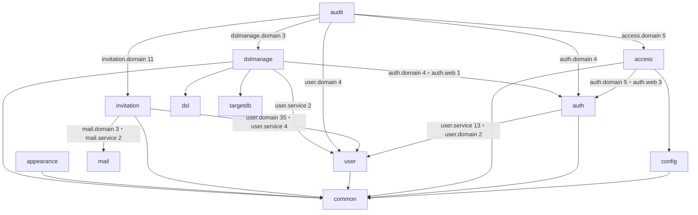

# 依存関係（mastersmith2）

部品の版は `technology-stack.md`、部品ごとの責務は `component-inventory.md` に書き、ここでは依存の向き・管理の決まりと K-7 の本文を書く。

## 外部への依存

### 実行時に接続するもの

| 相手 | 接続の仕方 | 既定 |
|---|---|---|
| 内部DB（H2、組み込み・ファイル） | Spring Boot の `DataSource`（HikariCP、MBean を登録） | 有効 |
| 対象DB（MySQL・MariaDB・PostgreSQL のどれか1つ） | `targetdb` の独自のプール、設定は環境変数だけ | 設定したときだけ。読み取りだけ |
| SMTP（手元では Mailpit） | `mail`、接続先と資格情報は環境変数（`.env`）だけ | 接続先の設定が無ければ送らない（`project.md` の Mandated） |
| OTLP の受け手（指標・トレース・ログ） | `management.otlp.*`・`mastersmith.observability.export.*` | 無効 |

### ビルド時・検査時に使うもの

- Maven Central（Gradle の依存の唯一の取得元。ビルドのプラグインは Gradle Plugin Portal）、npm のレジストリ
- Git サブモジュール `vendor/make-you-chic-ui`（npm の `file:`、`vendorBuild` で先にビルド）と `vendor/java-mustache-processor`（Gradle の composite build）
- Gitleaks・OSV-Scanner（版と SHA-256 を固定）。OSV-Scanner の対象は `backend/gradle.lockfile`・`frontend/package-lock.json`・`vendor/make-you-chic-ui/package-lock.json` の3つ（`build.gradle.kts` 228〜229 行）
- コンテナの実行環境（Testcontainers による対象DB の結合テスト、イメージは `TargetDbImages` の digest）

## 依存の管理の決まり

- Gradle は lockfile で固定、npm は `npm ci`（`package-lock.json`）。CI も lockfile どおりに入れる。
- 新しい依存は、採用の前にライセンスと、推移依存で既存の部品の版を引き上げないかを確かめる（`team.md` の Code Style、`project.md` の Corrections）。
- 画面の実行時の依存の脆弱性は High 以上で統合を止め、開発時だけの依存は `config/npm-build-tools.txt` の道具（Vite・TypeScript など）だけ止める（`team.md` の Deployment）。
- Dependabot のプルリクエストは GitHub の画面でマージせず、手元で版と lockfile をまとめて更新し `./gradlew verify` を通してから `develop` に統合して閉じる（`team.md` の Way of Working）。`dependabot.yml` の gradle は `exclude-paths: vendor/**`、npm は `/frontend` だけ、ほかに github-actions・docker・docker-compose。Dependabot alerts は無効のままで、脆弱性の関門は OSV-Scanner だけ（前の Intent の決定）。

## K-7 Dependabot の作業ブランチと、既存の決まりとぶつかる更新

確かめた事実（`git branch -r` の手元の追跡の参照。最後の取得は `origin/develop` と同じ時点。GitHub 上でプルリクエストが開いているかは確かめていない。前の Intent の記録では開いたプルリクエストは 11 件）: `origin/dependabot/*` が 15 本ある。一部は古い `develop`（`0d72ab8`・`fd44e79`・`37a3a4f`）から作られている。

| 種類 | 更新 | 既存の決まりとの関係 |
|---|---|---|
| gradle | `networknt-json-schema-validator` 3.0.6→3.0.7 | ぶつかる。3.0.7 は Jackson を Spring Boot の版から引き上げるため 3.0.6 を選んだ経緯（`project.md` の Corrections） |
| gradle | `archunit` 1.5.0→1.5.1・`snakeyaml` 2.6→2.7 | 決まりとはぶつからない（小さな更新） |
| gradle | `opentelemetry-logback-appender` 2.28.1-alpha→2.31.1-alpha（lockfile の8行も変わる） | ぶつかる。`project.md` の Tech Stack で 2.28.1-alpha に固定（Spring Boot 4.1.1 の OpenTelemetry 1.62 と食い違うため） |
| gradle | Gradle wrapper 9.7.1→9.8.0 | `gradlew`・`gradlew.bat` の中身も変わる |
| npm | `prettier` 3.9.8→3.9.9・`vite` 8.3.0→8.3.1 | `vite` は `config/npm-build-tools.txt` の対象 |
| npm | `typescript` ^6.0.3→^7.0.2・`vitest` と `@vitest/coverage-v8` ^4.1.11→^5.0.2 | 大きな版の更新。`typescript` は `config/npm-build-tools.txt` の対象 |
| docker | `eclipse-temurin` 25.0.4_7→26.0.2_10 | ぶつかる。`libs.versions.toml` の `java = "25"` と CI の JDK 25 と版が分かれる |
| docker-compose | `grafana/otel-lgtm` 0.33.1→0.34.0 | 手元の監視だけ |
| docker-compose | `mysql` 8.4.11→26.7.0・`mariadb` 11.8.9→13.0.2・`postgres` 18.6 の digest | `TargetDbImages` の digest の定数（34・40・47 行）と一緒に上げる決まり（`dependabot.yml` のコメント）。`mysql`・`mariadb` は大きな版の飛びで、対象DB の読み取り（`information_schema` など）の互換は確かめていない |

帰結（決める点）: どれを取り込み、どれを閉じる・見送るかは要件で決める。取り込むものは `team.md` の受け方（手元でまとめて更新して `verify`）に従い、固定の決まりとぶつかるものは決まりを変えるか見送るかを明示する。

## 内部の依存（バックエンドのパッケージ間）

各パッケージの `import cherry.mastersmith.*` を検索して確かめた（アーキテクト、2026-09-29）。数は import の行の数。

```mermaid
flowchart TD
  config --> common
  auth -- "user.service 13・user.domain 2" --> user
  auth --> common
  access -- "auth.domain 5・auth.web 3" --> auth
  access --> common
  access --> config
  user --> common
  invitation -- "user.domain 35・user.service 4" --> user
  invitation -- "mail.domain 3・mail.service 2" --> mail
  invitation --> common
  appearance --> common
  audit -- "invitation.domain 11" --> invitation
  audit -- "user.domain 4" --> user
  audit -- "auth.domain 4" --> auth
  audit -- "access.domain 5" --> access
  audit -- "dslmanage.domain 3" --> dslmanage
  dslmanage --> dsl
  dslmanage --> targetdb
  dslmanage -- "user.service 2" --> user
  dslmanage -- "auth.domain 4・auth.web 1" --> auth
  dslmanage --> common
```

<!-- Text fallback: config は common を使う。auth は user（service 13 行・domain 2 行）と common を使う。access は auth・common・config を使う。user は common（error と observability）を使う。invitation は user（domain 35 行・service 4 行）・mail（domain と service）・common を使う。appearance は common.security だけを使う。audit は出来事の型のために invitation・user・auth・access・dslmanage の domain を使う。dslmanage は dsl・targetdb・user・auth・common を使う。mail・dsl・targetdb はアプリの中のほかのパッケージを import しない。循環する依存は無い。 -->

- 前回の記録（`c438dc0`）からの変化: `user` が `common.error`・`common.observability` を使うようになった（前回は import なし）。`invitation`・`mail`・`appearance` が増え、`audit` の依存先に `invitation.domain`・`user.domain` が加わった（出来事を足すたびに `audit` の依存先が増える形は変わらない）。
- `mail` はアプリの中のほかのパッケージを import しない。`invitation` から `audit` への知らせは出来事で行う。
- ArchUnit の境界テストはこの向きを確かめる作りだが、今回は読み直していない。

### `common` の中の依存（今回の検索で分かった範囲）

| 使う側 | 使う相手 |
|---|---|
| `config` | `common.security`・`common.web`・`common.observability` |
| `auth` | `common.error`・`common.security`・`common.observability` |
| `access` | `common.error`・`common.security` |
| `user` | `common.error`・`common.observability` |
| `invitation` | `common.error`・`common.security`・`common.web`・`common.observability` |
| `appearance` | `common.security` |
| `dslmanage` | `common.error`・`common.i18n`・`common.web` |

`common` の中どうしの依存は今回は数え直していない（前回の記録を参照）。

## 画面の依存

```mermaid
flowchart TD
  main["main.tsx"] --> app["app/App.tsx"]
  app --> myc["make-you-chic-ui"]
  app --> disp["app/display-settings"]
  app --> registry["app/registry"]
  app --> routing["app/routing・layout・i18n"]
  registry --> features["features の auth・admin・dsl・invitation・registration・preferences の registration.ts"]
  features --> apic["shared/api-client"]
  features --> myc
  disp --> apic
  disp --> myc
```

<!-- Text fallback: main.tsx が App.tsx を起動し、App.tsx は make-you-chic-ui・見た目の設定（display-settings）・登録・振り分けを組み合わせる。登録は各機能（auth・admin・dsl・invitation・registration・preferences）の registration.ts を読み込み、各機能は共通の API の呼び出しと make-you-chic-ui の部品を使う。見た目の設定も API の呼び出しと make-you-chic-ui の ThemeProvider を使う。画面の import は今回数え直しておらず、前回の記録とファイルの一覧による。 -->

## ビルドのタスクの依存

- `verify` の段の並びは `architecture.md` の Interaction Diagrams 4。
- `frontend` → `make-you-chic-ui`（`vendorBuild` が作る `dist` を読む）。`backend` → `java-mustache-processor`（composite build）。
- `vendorUnchanged`・`mustacheVendorUnchanged` はサブモジュールの中の `git status --porcelain` が空であることを確かめる（固定先の変更は止めない）。
- `backend:bootWar` は画面の `dist` を同梱する。イメージは WAR をコピーするだけ（`Dockerfile`）。
