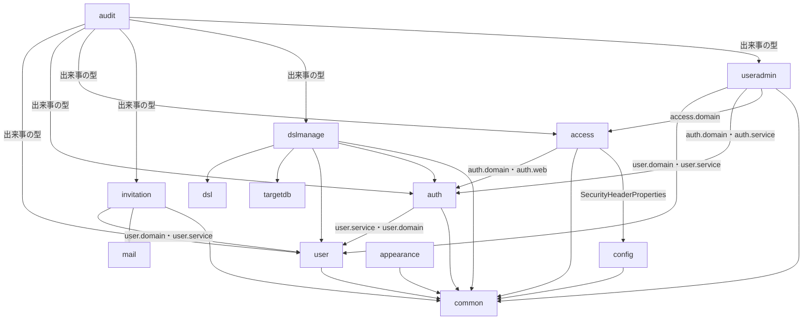

# 依存関係（mastersmith2）

部品の版は `technology-stack.md`、部品ごとの責務は `component-inventory.md` に書き、ここでは依存の向きと管理の決まりを書く。この文書に本文を書いた所見は無い（境界テストの欠けは K-38、`code-quality-assessment.md`）。

## 外部への依存

### 実行時に接続するもの

| 相手 | 接続の仕方 | 既定 |
|---|---|---|
| 内部DB（H2、組み込み・ファイル） | Spring Boot の `DataSource`（HikariCP） | 有効。単一インスタンス前提。権限（`users.admin_flag`）も要求ごとにここから読む（K-32） |
| 対象DB（MySQL・MariaDB・PostgreSQL のどれか1つ） | `targetdb`、設定は環境変数だけ | 設定したときだけ。読み取りだけ |
| SMTP（手元では Mailpit） | `mail`、接続先と資格情報は環境変数（`.env`）だけ | 接続先の設定が無ければ送らない（`project.md` の Mandated） |
| OTLP の受け手 | 観測の設定 | 無効 |

### ビルド時・検査時に使うもの

- Maven Central（Gradle の依存の唯一の取得元。ビルドのプラグインは Gradle Plugin Portal）、npm のレジストリ。
- Git サブモジュール `vendor/make-you-chic-ui`（固定先 `e82b651`、npm の `file:`）と `vendor/java-mustache-processor`（固定先 `8d44c36`、Gradle の composite build）。
- Gitleaks・OSV-Scanner、コンテナの実行環境（対象DB の結合テスト）。

## 依存の管理の決まり

- Gradle の依存は lockfile で固定、npm は `npm ci`（`package-lock.json`）。
- 新しい依存は、採用の前にライセンスと、推移依存で既存の部品の版を引き上げないかを確かめる（`team.md` の Code Style、`project.md` の Corrections）。
- make-you-chic-ui に部品（例: 入れ子のナビゲーション。K-36）を足してもらうときは上流のリポジトリで変え、固定先の更新を承認を得た専用のコミットで行い、更新の前後のコミットのハッシュを記録する（`project.md` の Mandated、`team.md` の Way of Working）。
- Dependabot のプルリクエストは GitHub の画面でマージせず、手元でまとめて更新し `./gradlew verify` を通してから `develop` に統合して閉じる（`team.md` の Way of Working）。

## 内部の依存（バックエンドのパッケージ間）

今回（コミット `d5aea52`）、各パッケージの `import cherry.mastersmith.*` を検索して確かめた。図は import の向きだけを描き、出来事による逆向きの知らせ（`user` の出来事を `auth` が受けるなど）は線にしていない。

```mermaid
flowchart TD
  config --> common
  auth -- "user.service・user.domain" --> user
  auth --> common
  access -- "auth.domain・auth.web" --> auth
  access --> common
  access -- "SecurityHeaderProperties" --> config
  user --> common
  invitation -- "user.domain・user.service" --> user
  invitation --> mail
  invitation --> common
  appearance --> common
  audit -- "出来事の型" --> user
  audit -- "出来事の型" --> auth
  audit -- "出来事の型" --> access
  audit -- "出来事の型" --> invitation
  audit -- "出来事の型" --> dslmanage
  audit -- "出来事の型" --> useradmin
  dslmanage --> dsl
  dslmanage --> targetdb
  dslmanage --> user
  dslmanage --> auth
  dslmanage --> common
  useradmin -- "user.domain・user.service" --> user
  useradmin -- "auth.domain・auth.service" --> auth
  useradmin -- "access.domain" --> access
  useradmin --> common
```

<!-- Text fallback: config は common を使う。auth は user（service と domain）と common を使う。access は auth（domain と web）・common・config（SecurityHeaderProperties）を使う。user は common だけを import する。invitation は user・mail・common を使う。appearance は common だけを使う。audit は出来事の型のために user・auth・access・invitation・dslmanage・useradmin を使う。dslmanage は dsl・targetdb・user・auth・common を使う。useradmin は user（domain と service）・auth（domain と service）・access の domain・common を使う。mail・dsl・targetdb・common はアプリの中のほかのパッケージを import しない。循環する依存は無い。 -->

### 今回の論点に関わる依存の要点

| 向き | 中身（今回確かめたもの） | 関わる所見 |
|---|---|---|
| `access` → `auth` | `auth.domain.AuthenticatedUser`（判定の主体）・`TokenAuthenticationException`・`TokenFailureReason`・`ClientInfo`、`auth.web.ClientInfoResolver`・`TokenAuthenticationEntryPoint` | K-32・K-33 |
| `access` → `config` | `access/web/AccessRequestRejectedHandler.java` が `config.SecurityHeaderProperties` を使う | — |
| `auth` → `user` | 認証の入口が `UserAccountService.findById` で利用者（`admin`・停止）を読む | K-32 |
| `useradmin` → `user` | 管理者の印・停止の書き換えの口と `findActiveAdminIds`。書き換えの口を呼べるのは `useradmin.service` だけ（境界テスト） | K-34 |
| `useradmin` → `access` | `access.domain.AccessProblemTypes` だけ（境界テスト） | K-34 |
| `audit` → 各機能 | 出来事の型（`access` の拒否、`useradmin` の印の付け外しほか） | K-38 |
| `dslmanage` → `dsl` | `ActiveDslModelProvider` を使う唯一の外の読み手（`DslPreviewAnalysis`） | K-37 |
| 差し込み口 | `auth`・`access`・`invitation`・`appearance` の `*SecurityContributor` → `common.security.SecurityRuleContributor`。`config.SecurityConfig` がそれらを集めて当てる | K-33 |

`access` の機能の境界（どの機能に依存してよいか・依存されてよいか）を確かめる ArchUnit のテストは無い（K-38）。

### 境界の決まり（今回の論点に関わるもの）

- `user` は `auth` を知らず、`auth` は `user` の service の口と値の型だけを使う（`backend/src/test/java/cherry/mastersmith/auth/AuthBoundaryArchitectureTest.java`、今回は決まりの一覧を読んだ）。
- `useradmin` が使ってよい `access` は `access.domain.AccessProblemTypes` だけで、印・停止・トークン・失敗回数を変える口を呼べるのは `useradmin.service` だけ（`UserAdminBoundaryArchitectureTest.java` 113 行〜・191 行〜）。
- 機能から `audit` への知らせは出来事で行い、機能は `audit` に依存しない。
- 既存の ArchUnit の境界の検査を緩める・変える場合は、コード生成の計画に明記して依頼者の承認を得る。新しい機能は自分の `<機能>BoundaryArchitectureTest` を足し、既存のものは書き換えない（`team.md` の Code Style）。

## 画面の依存

- `main.tsx` が `app/App.tsx` を起動し、`App.tsx` は make-you-chic-ui・見た目の設定・登録・振り分けを組み合わせる。
- 登録は各機能（`admin`・`auth`・`dsl`・`invitation`・`preferences`・`registration`・`useradmin`）の `registration.ts` を `app/registry/registrationModules.ts` が読み込む。骨組み（`app/navigation`・`app/routing`・`app/layout`・`app/admin-forbidden`）は登録の型（`app/registry/types.ts`）とログイン状態にだけ依存し、個々の機能を import しない（今回読んだファイルで確かめた）。
- 機能は `shared/api-client` と make-you-chic-ui の部品を使う。`app/admin-forbidden/AdminForbiddenProvider.tsx` は `shared/api-client/adminForbidden.ts`（判定）と `apiClient.ts`（`refreshSessionOnce`）を使う（K-35）。
- `ShellLayout.tsx` は make-you-chic-ui の `AppShell` に `navItems` を渡す。サイドバーの描画は make-you-chic-ui の中の `Sidebar` で、骨組みからは差し替えられない（K-36）。

## ビルドのタスクの依存

- `verify` の中に画面の検査・バックエンドの単体と結合のテスト・カバレッジ・SpotBugs・Gitleaks・OSV-Scanner がある。`e2eTest` は `verify` の外。
- `frontend` → `make-you-chic-ui`（サブモジュールのパッケージを `file:` で読む）。`backend` → `java-mustache-processor`（composite build）。`:backend:bootWar` → 画面のビルド（WAR に `dist` を同梱）。
