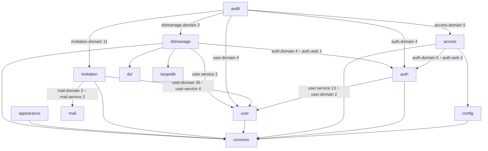

# 依存関係（mastersmith2）

部品の版は `technology-stack.md`、部品ごとの責務は `component-inventory.md` に書き、ここでは依存の向き・管理の決まりと K-14 の本文を書く。

## 外部への依存

### 実行時に接続するもの

| 相手 | 接続の仕方 | 既定 |
|---|---|---|
| 内部DB（H2、組み込み・ファイル） | Spring Boot の `DataSource`（HikariCP、MBean を登録） | 有効 |
| 対象DB（MySQL・MariaDB・PostgreSQL のどれか1つ） | `targetdb` の独自のプール、設定は環境変数だけ | 設定したときだけ。読み取りだけ |
| SMTP（手元では Mailpit） | `mail`、接続先と資格情報は環境変数（`.env`）だけ | 接続先の設定が無ければ送らない（`project.md` の Mandated） |
| OTLP の受け手（指標・トレース・ログ） | `management.otlp.*`・`mastersmith.observability.export.*` | 無効 |

### ビルド時・検査時に使うもの

- Maven Central（Gradle の依存の唯一の取得元。ビルドのプラグインは Gradle Plugin Portal）、npm のレジストリ
- Git サブモジュール `vendor/make-you-chic-ui`（npm の `file:`、`vendorBuild` で先にビルド）と `vendor/java-mustache-processor`（Gradle の composite build）。定義は `.gitmodules`
- Gitleaks・OSV-Scanner（版と SHA-256 を固定）。OSV-Scanner の対象は `backend/gradle.lockfile`・`frontend/package-lock.json`・`vendor/make-you-chic-ui/package-lock.json` の3つ（前回の記録）
- コンテナの実行環境（Testcontainers による対象DB の結合テスト、イメージは `TargetDbImages` の digest）

## 依存の管理の決まり

- Gradle の依存は lockfile で固定、npm は `npm ci`（`package-lock.json`）。CI も lockfile どおりに入れる。Gradle のプラグイン（spotless など）は lockfile に載らず、`gradle/libs.versions.toml` の版の1行で決まる。
- 新しい依存は、採用の前にライセンスと、推移依存で既存の部品の版を引き上げないかを確かめる（`team.md` の Code Style、`project.md` の Corrections）。
- 画面の依存の脆弱性の判定（`build.gradle.kts` 226〜340 行）: lockfile の `dev`・`devOptional` の印で実行時と開発時を分け、実行時は High 以上で失敗、開発時は警告だけ。ただし `config/npm-build-tools.txt` の道具と `MAL-` は失敗（`team.md` の Deployment）。
- Dependabot のプルリクエストは GitHub の画面でマージせず、手元で版と lockfile をまとめて更新し `./gradlew verify` を通してから `develop` に統合して閉じる（`team.md` の Way of Working）。Dependabot alerts は無効のままで、脆弱性の関門は OSV-Scanner だけ（前の Intent の決定）。

## K-14 Dependabot の開いたプルリクエストと ignore の今の形

### 確かめた事実

`.github/dependabot.yml` の今の ignore（ほかの ecosystem の設定は下の表）:

| ecosystem | 対象 | ignore | 説明のコメント |
|---|---|---|---|
| gradle（`/`、`exclude-paths: vendor/**`） | `io.opentelemetry.instrumentation:opentelemetry-logback-appender-1.0` | すべての版 | Spring Boot を上げるときに外す |
| gradle | `com.networknt:json-schema-validator` | すべての版 | Spring Boot の管理の Jackson が 3.2 系以上になったときに外す |
| gradle | `tools.jackson:jackson-bom` | `semver-major`・`semver-minor` だけ（48〜49 行） | 3.1 系のパッチだけを知らせる（42〜44 行）。Spring Boot を上げるときに見直す |
| npm（`/frontend`） | — | 無い | typescript・typescript-eslint・@types/node の扱いは書かれていない |
| docker（`/`） | `eclipse-temurin` | `semver-major` | JDK をビルド・CI とそろえて上げるときに外す |
| github-actions・docker-compose | — | 無い | |

開いているプルリクエスト（開発担当の `gh pr list`、2026-09-28〜29 に作成）:

| 番号 | 更新 | 版の置き場 | 既存の決まりとの関係 |
|---|---|---|---|
| #20 | `tools.jackson:jackson-bom` 3.1.6 → 3.1.7 | `gradle/libs.versions.toml` 28 行 `jackson`、`backend/gradle.lockfile` 254〜256 行（`jackson-core`・`jackson-databind`・`jackson-bom`） | 今の ignore はパッチを知らせる。依頼は「すべての版で ignore」 |
| #19 | `com.diffplug.spotless` 8.10.2 → 8.10.3 | `gradle/libs.versions.toml` 29 行だけ（適用は `build.gradle.kts` 24 行・`backend/build.gradle.kts` 29 行） | lockfile に載らないため、更新は toml の1行 |
| #18 | `@types/node` 26.6.2 → 26.6.3（`/frontend`） | `frontend/package.json` の devDependencies `^26.2.0` と `frontend/package-lock.json` | 範囲の中のパッチ。`config/npm-build-tools.txt` には無い |
| #5 | `typescript` 6.0.3 → 7.0.2（`/frontend`） | `frontend/package.json` の `^6.0.3` と lock | `config/npm-build-tools.txt` の対象。下の peer の範囲の外 |

TypeScript と typescript-eslint の関係:

- プロジェクトは `typescript-eslint`（まとめのパッケージ）ではなく `@typescript-eslint/parser` だけを直接持つ（`^8.67.0`、lock の解決は 8.70.1）。typescript-eslint のプルリクエストは開いていない。
- `@typescript-eslint/parser`・`project-service`・`tsconfig-utils`・`typescript-estree` の peer は `typescript >=4.8.4 <6.1.0`（6.1 以上を受け付けない）。
- `typescript` の lock の項目には `dev: true` が付かない（i18next・react-i18next の peer `^5 || ^6 || ^7` から届くため）。OSV の判定では実行時の扱いになり、あわせて `config/npm-build-tools.txt` にも載る。
- `@types/node` を求めるのは root と、vite の peer（`^20.19.0 || >=22.12.0`）・vitest の peer（`^22.0.0 || >=24.0.0`）。

Jackson の宣言: 直接宣言するのは `tools.jackson:jackson-bom` だけで、ほかの Jackson の部品は Spring Boot の BOM が管理する（`backend/gradle.lockfile` 9 行の `com.fasterxml.jackson.core:jackson-annotations` は 2.21）。

### 見立て（未検証）

- TypeScript 7.0.2（#5）を取り込むと `@typescript-eslint/*` の peer の範囲を外れ、`npm ci` の peer の検査または ESLint の実行が失敗しうる（開発担当の仮説。確かめは Construction）。
- Jackson を「すべての版で ignore」にするには、48〜49 行の `update-types` を外し 42〜44 行の説明を書き換えれば足りる見込み（対象の名前は `tools.jackson:jackson-bom` の1つ）。
- TypeScript 7 を ignore にしても、6 系に High の脆弱性が出れば OSV の判定で統合が止まる（`typescript` は実行時の扱いかつ道具の一覧にある）。
- `@types/node` の大きな版（26）と実行の Node（24）のずれの影響は、後の段で判断する。

### 帰結（決める点）

- 取り込む: #19（spotless、toml の1行）・#18（@types/node、package.json と lock）。`team.md` の受け方（手元でまとめて更新して `verify`）に従い、プルリクエストは閉じる。
- ignore の形: Jackson は `update-types` を外して全版にする。TypeScript 7 の ignore を `typescript` だけにするか、`@typescript-eslint/*` も含めるか、どの `update-types`（major だけか）にするかは要件で決める。npm の ignore はこれが最初になる。
- #20（Jackson 3.1.7）・#5（TypeScript 7）のプルリクエストを閉じるかどうかも要件で決める。

## 前回の K-7（Dependabot の作業ブランチと固定の決まり）

前回（`e68f54d`）の時点で `origin/dependabot/*` が 15 本あり、固定の決まりとぶつかる更新（networknt 3.0.7・opentelemetry-logback-appender・`eclipse-temurin` 26 など）があった。`de75b81`（Dependabot の知らせを取り込み、Jackson の脆弱性を直す）で扱われ、ぶつかるものは上の表の ignore になった（`dependabot.yml` のコメントによる。個々のブランチの行方は今回確かめていない）。

## 内部の依存（バックエンドのパッケージ間）

この節は前回（`e68f54d`）に各パッケージの `import cherry.mastersmith.*` を検索して確かめたもので、今回は数え直していない。数は import の行の数。

```mermaid
flowchart TD
  config --> common
  auth -- "user.service 13・user.domain 2" --> user
  auth --> common
  access -- "auth.domain 5・auth.web 3" --> auth
  access --> common
  access --> config
  user --> common
  invitation -- "user.domain 35・user.service 4" --> user
  invitation -- "mail.domain 3・mail.service 2" --> mail
  invitation --> common
  appearance --> common
  audit -- "invitation.domain 11" --> invitation
  audit -- "user.domain 4" --> user
  audit -- "auth.domain 4" --> auth
  audit -- "access.domain 5" --> access
  audit -- "dslmanage.domain 3" --> dslmanage
  dslmanage --> dsl
  dslmanage --> targetdb
  dslmanage -- "user.service 2" --> user
  dslmanage -- "auth.domain 4・auth.web 1" --> auth
  dslmanage --> common
```

<!-- Text fallback: config は common を使う。auth は user（service 13 行・domain 2 行）と common を使う。access は auth・common・config を使う。user は common（error と observability）を使う。invitation は user（domain 35 行・service 4 行）・mail（domain と service）・common を使う。appearance は common.security だけを使う。audit は出来事の型のために invitation・user・auth・access・dslmanage の domain を使う。dslmanage は dsl・targetdb・user・auth・common を使う。mail・dsl・targetdb はアプリの中のほかのパッケージを import しない。循環する依存は無い。 -->

- `mail` はアプリの中のほかのパッケージを import しない。`invitation` から `audit` への知らせは出来事で行う。
- ArchUnit の境界テストはこの向きを確かめる作りだが、今回は読み直していない。

### `common` の中の依存（前回の検索で分かった範囲）

| 使う側 | 使う相手 |
|---|---|
| `config` | `common.security`・`common.web`・`common.observability` |
| `auth` | `common.error`・`common.security`・`common.observability` |
| `access` | `common.error`・`common.security` |
| `user` | `common.error`・`common.observability` |
| `invitation` | `common.error`・`common.security`・`common.web`・`common.observability` |
| `appearance` | `common.security` |
| `dslmanage` | `common.error`・`common.i18n`・`common.web` |

## 画面の依存

```mermaid
flowchart TD
  main["main.tsx"] --> app["app/App.tsx"]
  app --> myc["make-you-chic-ui"]
  app --> disp["app/display-settings"]
  app --> registry["app/registry"]
  app --> routing["app/routing・layout・i18n"]
  registry --> features["features の auth・admin・dsl・invitation・registration・preferences の registration.ts"]
  features --> apic["shared/api-client"]
  features --> myc
  disp --> apic
  disp --> myc
```

<!-- Text fallback: main.tsx が App.tsx を起動し、App.tsx は make-you-chic-ui・見た目の設定（display-settings）・登録・振り分けを組み合わせる。登録は各機能（auth・admin・dsl・invitation・registration・preferences）の registration.ts を読み込み、各機能は共通の API の呼び出しと make-you-chic-ui の部品を使う。見た目の設定も API の呼び出しと make-you-chic-ui の ThemeProvider を使う。画面の import は前回までの記録とファイルの一覧による。 -->

## ビルドのタスクの依存

- `verify` の段の並びは `architecture.md` の Interaction Diagrams 4。
- `frontend` → `make-you-chic-ui`（`vendorBuild` が作る `dist` を読む）。`backend` → `java-mustache-processor`（composite build）。
- `vendorUnchanged`・`mustacheVendorUnchanged` はサブモジュールの中の `git status --porcelain` が空であることを確かめる（固定先の変更は止めない。前回の記録）。
- `backend:bootWar` は画面の `dist` を同梱する。イメージは WAR をコピーするだけ（`Dockerfile`）。
