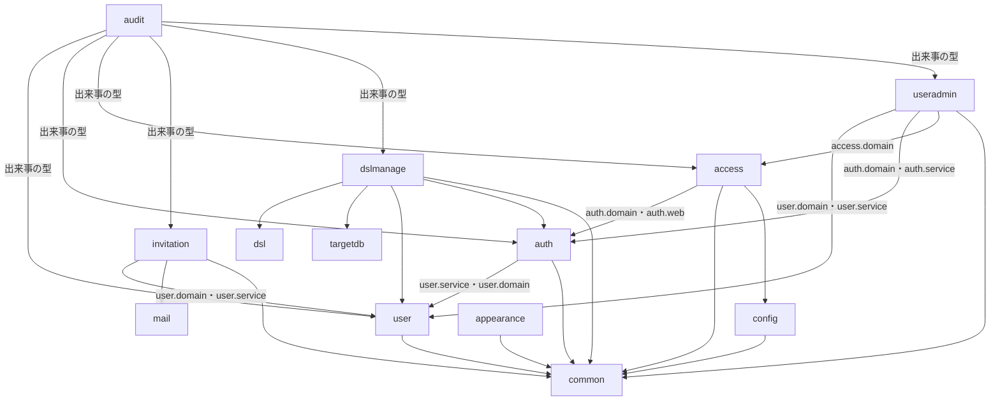

# 依存関係（mastersmith2）

部品の版は `technology-stack.md`、部品ごとの責務は `component-inventory.md` に書き、ここでは依存の向き・管理の決まりと K-31 の本文を書く。

## 外部への依存

### 実行時に接続するもの

| 相手 | 接続の仕方 | 既定 |
|---|---|---|
| 内部DB（H2、組み込み・ファイル） | Spring Boot の `DataSource`（HikariCP、上限の既定 30・借りる待ちの上限 5000 ms） | 有効。単一インスタンス前提。1つのプロセスからしか開けない |
| 対象DB（MySQL・MariaDB・PostgreSQL のどれか1つ） | `targetdb`、設定は環境変数だけ | 設定したときだけ。読み取りだけ |
| SMTP（手元では Mailpit） | `mail`、接続先と資格情報は環境変数（`.env`）だけ | 接続先の設定が無ければ送らない（`project.md` の Mandated） |
| OTLP の受け手 | 観測の設定 | 無効 |

### ビルド時・検査時に使うもの

- Maven Central（Gradle の依存の唯一の取得元。ビルドのプラグインは Gradle Plugin Portal）、npm のレジストリ。
- Git サブモジュール `vendor/make-you-chic-ui`（npm の `file:`）と `vendor/java-mustache-processor`（Gradle の composite build）。
- Gitleaks・OSV-Scanner、コンテナの実行環境（対象DB の結合テスト）。
- コンテナのイメージ（下の K-31）。

## 依存の管理の決まり

- Gradle の依存は lockfile で固定、npm は `npm ci`（`package-lock.json`）。
- 新しい依存は、採用の前にライセンスと、推移依存で既存の部品の版を引き上げないかを確かめる（`team.md` の Code Style、`project.md` の Corrections）。
- Dependabot のプルリクエストは GitHub の画面でマージせず、手元でまとめて更新し `./gradlew verify` を通してから `develop` に統合して閉じる。更新を見送る依存（`ignore`）には理由と外す時期をコメントに書く（`team.md` の Way of Working）。

### K-31 対象DB のイメージの固定先が3か所にあり、Dependabot は1か所しか見ない

確かめた事実:

- 見本の対象DB の同じ版とダイジェストが3か所に手で書かれている。
  - `compose.yaml`: `postgres:18.6@sha256:…`・`mysql:26.7.0@sha256:…`・`mariadb:13.0.2@sha256:…`
  - `docker/perf/compose.yaml`: 同じ3つ
  - `backend/src/test/java/cherry/mastersmith/targetdb/testsupport/TargetDbImages.java`: 版の定数（`MYSQL_VERSION` ほか）とダイジェストの定数（`MYSQL_DIGEST` ほか）。Testcontainers は `イメージ名@ダイジェスト` だけで起動し（65・74・83 行）、版の定数は使っていない。
- Mailpit（`axllent/mailpit:v1.31.2@sha256:…`）も `compose.yaml` と `docker/perf/compose.yaml` の2か所にある。
- ダイジェストの無いイメージ: `Dockerfile` の `FROM eclipse-temurin:25.0.4_7-jre-noble`、`compose.yaml` の `otel/opentelemetry-collector:0.162.0`・`grafana/otel-lgtm:0.34.0`、`perf/README.md` の `grafana/k6:2.3.0`・`eclipse-temurin:25.0.4_7-jdk-noble`（開発担当の検索）。アプリのイメージ（`mastersmith:${MASTERSMITH_IMAGE_TAG:-local}`）は手元で作るもの。
- `.github/dependabot.yml` の `docker`・`docker-compose` はどちらも `directory: /` だけで、`docker/perf/compose.yaml` と Java の定数（`TargetDbImages`）は対象に入っていない。`docker` の `eclipse-temurin` は大きな版の更新だけを見送っている（理由と外す時期はコメントにある）。`docker-compose` のコメントに「見本の対象DB のイメージを上げるときは、結合テストのイメージの定数（TargetDbImages）と一緒に上げる」とある。
- `project.md` の Tech Stack の学びは「`compose.yaml`・`docker/perf/compose.yaml`・`TargetDbImages` の digest を一緒に上げる」で、手で揃える前提である。
- GitHub Actions の `uses:` はコミットのハッシュで固定済み（`.github/workflows/ci.yml`、開発担当の検索）。

見立て（未検証）:

- 手での揃えを減らす形の候補: (a) 版とダイジェストを1つのファイル（例: 固定の値のファイルや compose の `x-` の共通の定義）に置き、2つの compose と `TargetDbImages` がそれを読む、(b) 3か所が一致することを `verify` の中の小さな検査（または単体テスト）で確かめる、(c) Dependabot の `docker-compose` に `docker/perf` を足す（Java の定数は Dependabot では更新されないため、(b) と組み合わせる必要がある）。
- `Dockerfile` の `FROM` にダイジェストを付けると、Dependabot の `docker` がダイジェストの更新も知らせる見込みで、知らせの頻度が上がりうる。
- 固定先をまとめる・ダイジェストを足すときは、`project.md` の Tech Stack の学びと `.github/dependabot.yml` のコメントも合わせて直す必要がある。

## 内部の依存（バックエンドのパッケージ間）

下の図は前回までの記録（2026-09-30 と 2026-10-04 の import の検索）による。今回は `common.persistence`・`common.paging` を使う側と `UserCreatedEvent` の受け手だけを import の検索で確かめ（下の表と境界の決まり）、前回までの線は数え直していない。図は import の向きだけを描き、出来事による逆向きの知らせ（`user` の `UserCreatedEvent` を `auth` が受ける）は線にしていない。

```mermaid
flowchart TD
  config --> common
  auth -- "user.service・user.domain" --> user
  auth --> common
  access -- "auth.domain・auth.web" --> auth
  access --> common
  access --> config
  user --> common
  invitation -- "user.domain・user.service" --> user
  invitation --> mail
  invitation --> common
  appearance --> common
  audit -- "出来事の型" --> user
  audit -- "出来事の型" --> auth
  audit -- "出来事の型" --> access
  audit -- "出来事の型" --> invitation
  audit -- "出来事の型" --> dslmanage
  audit -- "出来事の型" --> useradmin
  dslmanage --> dsl
  dslmanage --> targetdb
  dslmanage --> user
  dslmanage --> auth
  dslmanage --> common
  useradmin -- "user.domain・user.service" --> user
  useradmin -- "auth.domain・auth.service" --> auth
  useradmin -- "access.domain" --> access
  useradmin --> common
```

<!-- Text fallback: config は common を使う。auth は user（service と domain）と common を使う。access は auth（domain と web）・common・config を使う。user は common だけを import する。user から auth への知らせは UserCreatedEvent で行い、auth.service の LoginAttemptStateInitializer が受ける（import の向きは auth から user のため、図には線を足していない）。invitation は user・mail・common を使う。appearance は common だけを使う。audit は出来事の型のために user・auth・access・invitation・dslmanage・useradmin を使う。dslmanage は dsl・targetdb・user・auth・common を使う。useradmin は user（domain と service）・auth（domain と service）・access の domain・common を使う。mail・dsl・targetdb・common はアプリの中のほかのパッケージを import しない。循環する依存は無い。 -->

### `common` の中の依存（今回の論点に関わるもの）

| 使われる側 | 使う側（今回の import の検索） |
|---|---|
| `common.persistence` | `user`（`UserAccountService`・`UserRowLockRepository`）・`auth`（`LoginAttemptStateRepository`・`LockAdministrationService`）・`invitation`（`InvitationService`・`invitation/lock`）・`useradmin`（`UserAdminService`）・`common.error.web`（`GlobalExceptionHandler`）・`common.observability`（`LockFailureSafeTraceInterceptor`） |
| `common.paging` | `useradmin`（`UserAdminService`）・`invitation`（`InvitationService`）。今回の import の検索。中身は読んでいない |
| `common.error` | ほぼすべての機能（前回までの記録） |

`common.persistence` 自身はアプリの中のほかのパッケージを import しない（JPA の例外と SLF4J だけ）。

### 境界の決まり（今回の論点に関わるもの。前回までの記録）

- `user` は `auth` を知らず、`auth` は `user` の service の口と値の型だけを使う（`AuthBoundaryArchitectureTest`）。`user` から `auth` への知らせは出来事（`UserCreatedEvent`）で行う。
- `auth` と `user` は `audit` に依存しない。監査への知らせは出来事で行い、`audit` が受ける（K-25 で監査の種類を足すときもこの向きを保つ）。
- 既存の ArchUnit の境界の検査を緩める・変える場合は、コード生成の計画に明記して依頼者の承認を得る（`team.md` の Code Style）。

## 画面の依存

`main.tsx` が `app/App.tsx` を起動し、`App.tsx` は make-you-chic-ui・見た目の設定・登録・振り分けを組み合わせる。登録は各機能（`admin`・`auth`・`dsl`・`invitation`・`preferences`・`registration`・`useradmin`）の `registration.ts` を読み込み、各機能は `shared/api-client` と make-you-chic-ui の部品を使う（前回までの記録。今回はディレクトリの構成だけを確かめた）。

## ビルドのタスクの依存

- `verify` の中に画面の検査・バックエンドの単体と結合のテスト・カバレッジ・SpotBugs・Gitleaks・OSV-Scanner がある。`e2eTest` は `verify` の外（前回までの記録）。
- `frontend` → `make-you-chic-ui`（`vendorBuild` が作る `dist` を読む）。`backend` → `java-mustache-processor`（composite build）。`:backend:bootWar` → 画面のビルド（WAR に `dist` を同梱）。
