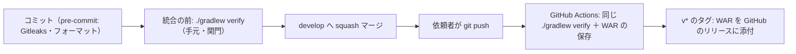

# CI の構成（ci-config）

Intent `260922-auth-audit-base`（auth-audit-foundation）の CI の記録。本書は**すでにリポジトリに存在する** `.github/workflows/ci.yml` の内容を、承認済みの設計（各単位の `infrastructure-design/cicd-pipeline.md`）と突き合わせて記録したものである。新しい仕組みはここでは作らない。

- 作成日: 2026-09-23
- 対象のファイル: `.github/workflows/ci.yml`（ワークフローの名前 `CI`）、`.github/dependabot.yml`
- 検査の中身の入口: `build.gradle.kts` の `verify` タスク（詳細は `quality-gates.md`）

## 1. CI の位置づけ

- CI は**統合の後の再確認**として動く（`aidlc/spaces/default/memory/team.md` の Way of Working・Deployment）。統合を止める関門ではない。
- **統合の前の関門は、手元で実行する `./gradlew verify` の1コマンド**である。CI はこれと**同じタスク**を呼ぶ（`ci.yml` の「1コマンドの検査を実行する」の段が `./gradlew verify`）。検査の中身は一箇所（Gradle）にあり、CI 側で重複して定義していない。
- プルリクエストは使わない。`origin` への `git push` は依頼者自身が行うため、CI が動くのは依頼者がプッシュした後である。
- CI が失敗したら、次の Bolt に進む前に原因を直す。

テキスト表記: コミットの直前に pre-commit のフックが動く。統合の前に手元で `./gradlew verify` を実行し、通ったら `develop` へ squash マージする。依頼者がプッシュすると GitHub Actions が同じ `./gradlew verify` を実行し、WAR を保存する。`v*` のタグを押したときは、その WAR を GitHub のリリースに添付する。

## 2. きっかけ・権限・重なりの制御

| 項目 | 値（`ci.yml` の記述） | 備考 |
|---|---|---|
| きっかけ | `push` の `branches: [develop]` / `tags: ["v*"]`、`workflow_dispatch` | 日々の統合先である `develop` と、リリースのタグ、手動実行の3つ |
| 権限 | ワークフロー全体は `permissions: contents: read` | 最小の権限。`release` のジョブだけが `contents: write` を持つ |
| 重なりの制御 | `concurrency: group: ci-${{ github.ref }}` / `cancel-in-progress: false` | 同じ参照の実行は重ねない。実行中のものは打ち切らない（記録を残すため） |
| 秘密情報 | 使わない | GitHub の秘密情報の保管（Secrets）を参照する記述はワークフローに無い。`GH_TOKEN` は `github.token`（そのワークフローに与えられる一時の権限）のみ |

## 3. ランナーと道具の版（固定の仕方）

ジョブ `verify`: `runs-on: ubuntu-latest`、`timeout-minutes: 60`。

| 段 | 使うもの | 固定の仕方 |
|---|---|---|
| リポジトリの取得 | `actions/checkout@3d3c42e5aac5ba805825da76410c181273ba90b1`（コメント `# v7.0.1`） | **コミットのハッシュで固定** |
| JDK | `actions/setup-java@de7274f081f381c8f8158605e0321c36c376e2e6`（`# v6.0.1`）、`distribution: temurin`、`java-version: "25"` | 同上。JDK は 25（Temurin） |
| Node.js | `actions/setup-node@820762786026740c76f36085b0efc47a31fe5020`（`# v7.0.0`）、`node-version: "24"` | 同上。Node.js は 24 |
| Gradle | `gradle/actions/setup-gradle@9c971963bec38e04b3d30dcc455b5382be2fdbfb`（`# v6.3.0`） | 同上 |
| 成果物の保存 | `actions/upload-artifact@043fb46d1a93c77aae656e7c1c64a875d1fc6a0a`（`# v7.0.1`） | 同上 |
| 成果物の取得（リリース） | `actions/download-artifact@3e5f45b2cfb9172054b4087a40e8e0b5a5461e7c`（`# v8.0.1`） | 同上 |
| Gitleaks | `GITLEAKS_VERSION: 8.30.1`、`GITLEAKS_SHA256: 551f6fc83ea457d62a0d98237cbad105af8d557003051f41f3e7ca7b3f2470eb` | **版と SHA-256 で固定**。`sha256sum -c -` で確かめてから展開する |
| OSV-Scanner | `OSV_SCANNER_VERSION: 2.6.0`、`OSV_SCANNER_SHA256: ca69b3d3cd08f889a49dc0a383122f71cc528b83803671df5fd874d97485b108` | 同上。確認に通ったものだけを実行可能にする |

- Gitleaks と OSV-Scanner は `$HOME/.local/bin` に置き、そのディレクトリを `$GITHUB_PATH` に足して以後の段から使えるようにする。導入の段は `set -euo pipefail` で、ダウンロードか SHA-256 の確認が失敗した時点で止まる。
- 手元の版は README の「前提の道具」に同じ版（Gitleaks 8.30.1、OSV-Scanner 2.6.0）が書かれており、CI と手元で同じ版を使う。

## 4. ジョブ `verify` の段の並び

| 順 | 段の名前（`ci.yml`） | 内容 |
|---|---|---|
| 1 | リポジトリとサブモジュール（固定先のコミット）を取得する | `submodules: true`、`fetch-depth: 0`。深さを全部取るのは、Gitleaks がリポジトリの履歴全体を調べるため |
| 2 | JDK 25（Temurin）を入れる | — |
| 3 | Node.js 24 を入れる | `cache: npm`、`cache-dependency-path` は `frontend/package-lock.json` と `vendor/make-you-chic-ui/package-lock.json` の2つ |
| 4 | Gradle を用意する（キャッシュを使う） | `gradle/actions/setup-gradle` が Gradle の配布物と依存関係をキャッシュする |
| 5 | Gitleaks と OSV-Scanner を入れる（版と SHA-256 を固定） | 3節のとおり |
| 6 | 1コマンドの検査を実行する | `./gradlew verify`。手元の関門と**同じ入口・同じ順**。段ごとの合否は `quality-gates.md` |
| 7 | WAR を成果物として保存する（名前にコミットのハッシュを入れる） | 5節のとおり |

依存関係の導入（`npm ci`・サブモジュールのビルド）は、CI の段ではなく `verify` の 0 の段（`verifyPrepare`）が行う。したがって CI の YAML には検査の中身が書かれていない。

### キャッシュ

| 対象 | 仕組み |
|---|---|
| npm | `actions/setup-node` の `cache: npm`。鍵は上の2つの lockfile |
| Gradle | `gradle/actions/setup-gradle` の既定のキャッシュ |
| そのほか | 明示的な `actions/cache` の記述は無い |

依存関係は lockfile どおりに入れる（`verify` の 0 の段が `npm ci` を使う）。サブモジュールは固定先のコミットで取得し、`verify` の 0 の段の `vendorUnchanged` が「サブモジュールの追跡されるファイルが変わっていないこと」を確かめる。

## 5. 成果物とリリース

| 項目 | 値 |
|---|---|
| 成果物 | 画面のビルド結果（`frontend/dist`）を同梱した実行可能 WAR。パスは `backend/build/libs/mastersmith.war` |
| 名前 | `mastersmith-${{ github.sha }}`（**コミットのハッシュで識別する**。team.md の Deployment） |
| 保存期間 | `retention-days: 30` |
| 見つからないとき | `if-no-files-found: error`（黙って成功にしない） |

リリースのジョブ `release`（表示名「リリースに WAR を添付する」）:

| 項目 | 値 |
|---|---|
| 実行の条件 | `if: startsWith(github.ref, 'refs/tags/v')` かつ `needs: verify`（検査を通った実行の成果物だけを使う） |
| ランナー | `ubuntu-latest`、`timeout-minutes: 10` |
| 権限 | このジョブだけ `contents: write` |
| 手順 | `actions/download-artifact` で `mastersmith-${{ github.sha }}` を取得 → `mastersmith-${TAG}-${GITHUB_SHA}.war` に複写 → `gh release create "$TAG" … --title "$TAG" --notes "コミット ${GITHUB_SHA} の WAR"` |
| 認証 | `GH_TOKEN: ${{ github.token }}` |

部品表（SBOM）の生成は入れていない。配備先が決まってから入れる（team.md の Deployment）。

## 6. CI に入れていないもの

| 対象 | 実行の場所 | 理由 |
|---|---|---|
| **E2E（Playwright）** | 手元の `./gradlew e2eTest`（`build.gradle.kts` に定義。`:backend:bootWar` に依存し、ビルドした WAR を起動して `npx playwright test e2e` を実行する） | **意図して CI と `verify` の外に置いている**（タスクの説明に「`./gradlew verify` と CI には入れない。計画の P2 の決定」と明記）。統合の前とリリースの前に手で実行する（README） |
| 配備（検証環境・本番） | 無し | 当面の配備先は開発者の PC 上のコンテナだけのため、自動の配備を持たない（team.md・project.md の Deployment）。配備先が決まったら Deployment Pipeline の段で作る |
| `vendor/make-you-chic-ui` のテスト | 実行しない | team.md の Deployment。ただし同梱の版でフロントエンドのビルドが通ることは `verify` の 0・4 の段で確かめる |
| SBOM の生成 | 無し | 配備先が決まってから |

## 7. 依存関係の更新（`.github/dependabot.yml`）

| 対象（`package-ecosystem`） | ディレクトリ | 頻度 |
|---|---|---|
| `gradle` | `/` | 毎週 |
| `npm` | `/frontend` | 毎週 |
| `github-actions` | `/` | 毎週 |
| `docker` | `/` | 毎週 |

Actions をコミットのハッシュで固定しているため、更新は Dependabot の提案を受けて行う。

## 8. 承認済みの設計との差

承認済みの設計（`construction/u1-app-skeleton/infrastructure-design/cicd-pipeline.md` 4節）と実装は一致している。記録として残す細部の差は次のとおり。

| 事項 | 設計 | 実装 | 扱い |
|---|---|---|---|
| 取得の深さ | 「深さは必要な分」 | `fetch-depth: 0`（履歴全体） | Gitleaks が履歴全体を調べるため。設計の範囲内 |
| 段の数え方 | `verify` を 1〜9 の段として記述 | 0（準備）〜9 の10段 | 設計の「依存関係の取得」を 0 の段として明示したもの。中身は同じ |
| 本段の質問の要約との差 | — | — | `ci-pipeline-questions.md` 3節の表は 9 の段の失敗の基準を「生成の失敗、上限（500KB）超過」と書いているが、**実装では 500KB の超過は警告だけで失敗しない**（`frontend/scripts/check-bundle-size.mjs`）。承認済みの設計（同 35 行目「量の超過は失敗にしない」）が正であり、実装はそれに従っている。本書と `quality-gates.md` は実装どおりに記録する |

## Sources

- `.github/workflows/ci.yml`、`.github/dependabot.yml`（実装そのもの）
- `build.gradle.kts`（`verify` の段の定義、`e2eTest`）、`frontend/scripts/check-bundle-size.mjs`
- `README.md`（前提の道具の版、`verify` の段の一覧、E2E の位置づけ）
- `aidlc/spaces/default/intents/260922-auth-audit-base/construction/u1-app-skeleton/infrastructure-design/cicd-pipeline.md`（承認済みの設計）
- `aidlc/spaces/default/intents/260922-auth-audit-base/construction/build-and-test/build-and-test-summary.md`、`test-results.md`（同じ検査が通ることの実測）
- `aidlc/spaces/default/intents/260922-auth-audit-base/construction/ci-pipeline/ci-pipeline-questions.md`（確認済みの要約）
- `aidlc/spaces/default/memory/team.md`・`project.md`（Way of Working・Deployment・Code Style）

## Assumptions & Open Questions

- 本ワークフローは GitHub 上での実行結果を本段では取得していない（`origin` へのプッシュは依頼者が行うため）。CI が緑であることの確認は、依頼者のプッシュ後に行う。
- 配備の仕組み（検証環境・本番・SBOM）は配備先が決まってから Deployment Pipeline の段で作る。
