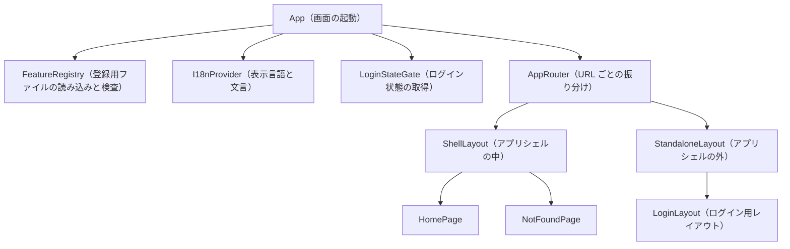

# Frontend Components — U1 アプリの骨格（u1-app-skeleton）

U1 が用意する画面の部品。アプリシェルはデザインシステム（make-you-chic-ui）のアプリシェル（サイドバー・トップバー・コンテンツ）を使う。振る舞いは `functional-spec.md` の WF5〜WF7、決まりは `rules.md` の BR6・BR7 に従う。

## 1. 部品の構成

テキスト表記: App は起動時に FeatureRegistry で登録を読み込み、I18nProvider で表示言語を決め、LoginStateGate でログイン状態を得てから、AppRouter で URL ごとに画面を振り分ける。AppRouter は、アプリシェルの中（ShellLayout）とアプリシェルの外（StandaloneLayout）に振り分ける。ShellLayout の中に HomePage と NotFoundPage を置き、StandaloneLayout の中にログイン用の LoginLayout を置く。

## 2. 部品ごとの受け持ち

| 部品 | 受け持ち | 入力（props） | 状態 | 決まり |
|---|---|---|---|---|
| App | 画面の起動。下の部品をつなぐ | なし | なし | WF5 |
| FeatureRegistry | 各機能の登録用ファイルの自動読み込み、重複の検査、登録の一覧の提供 | なし | 登録の一覧（起動後は変わらない） | BR7.1、BR7.2 |
| I18nProvider | ブラウザの希望言語から表示言語を決め、文言の鍵から文言を引く手段を提供する | 子の部品 | 表示言語（ja／en） | BR6.1、BR6.2 |
| LoginStateGate | 提供元からログイン状態を得る。提供元が無ければ未ログイン | 子の部品 | loggedIn、admin、displayName | BR7.3 |
| AppRouter | URL ごとの振り分け。access の確かめ、未ログイン時のログイン画面への移動、見つからない URL の扱い | 登録の一覧、ログイン状態 | 現在の URL | BR7.4、BR7.5、BR7.8、BR7.9 |
| ShellLayout | アプリシェル（サイドバー・トップバー・コンテンツ）。サイドバーにホームと条件を満たす項目、トップバーにユーザーメニュー | 登録の一覧、ログイン状態、子の画面 | サイドバーの開閉（デザインシステムに従う） | BR7.6 |
| StandaloneLayout | アプリシェルの外の独立した配置 | 子の画面 | なし | BR7.7 |
| LoginLayout | ログイン画面のレイアウト（アプリ名、表示言語に応じた見出し、入力欄を置く場所）。入力欄とボタンは持たない | 子（U2 が置く入力欄とボタン、無ければ空） | なし | BR7.7、Q6 |
| HomePage | ホーム（ログイン後の最初の画面）。本Intentでは見出しと短い説明だけ | なし | なし | BR7.9 |
| NotFoundPage | 「ページが見つかりません」とホームへのリンク | なし | なし | BR7.8 |

## 3. 操作の流れ

| 操作 | 流れ |
|---|---|
| 未ログインで / を開く（U1 だけの状態） | LoginStateGate が未ログインを返す → AppRouter がログイン画面へ移す → role=LOGIN の画面が無いため、StandaloneLayout に LoginLayout だけを表示する |
| ログイン中に存在しない URL を開く | AppRouter が見つからないと判定 → ShellLayout の中に NotFoundPage を表示 → 「ホームへ」でホームへ移る |
| サイドバーの項目を選ぶ | ShellLayout がその項目の path へ移る → AppRouter が access を確かめて画面を表示する |
| ユーザーメニューの項目を選ぶ | 登録された action を実行する（例：U2 のログアウト） |

## 4. 入力の検証

U1 の画面には、利用者が入力する項目が無い。入力の検証の決まりは、入力欄を持つ後の単位（U2 のログイン画面など）で定める。

## 5. API とのつなぎ目

U1 の画面は API を呼ばない。エラー応答を扱う画面は、分岐に `code` を使い、`type` の URL は解釈しない（URL は環境によって変わるため）。ログイン状態は提供元（U2）から、管理者向け領域の確認は U3 から得る。API 呼び出しの共通部分（ApiClient）は U2 が用意する。

## 6. アクセシビリティと文言

- 部品ごとにアクセシビリティ検査を1件入れる（NFR8）。
- ランドマーク（ナビゲーション・メイン）と見出しの順序は、デザインシステムのアプリシェルに従う。
- 文言はすべて文言の鍵で扱い、日本語と英語をそろえる（BR6.2）。U1 の文言の例: アプリ名、ログイン画面の見出し、ホームの見出し、「ページが見つかりません」、「ホームへ」、サイドバーの「ホーム」。
