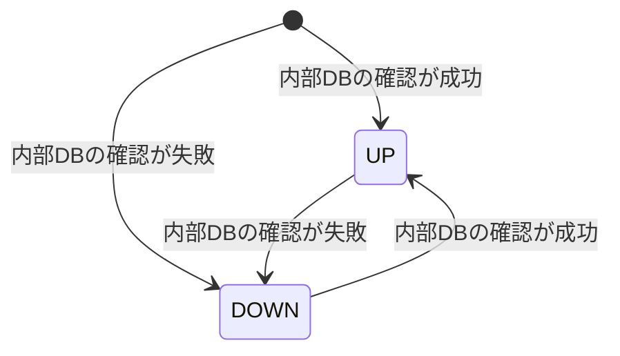
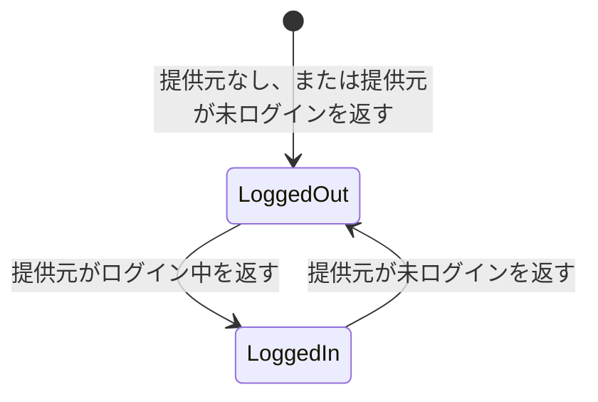
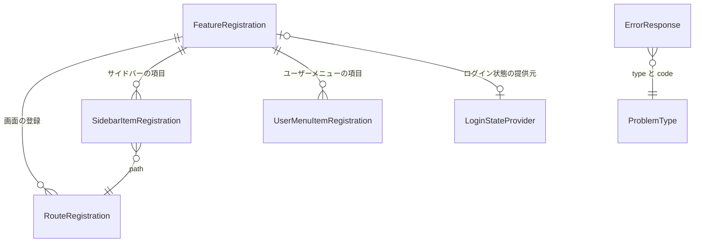

# Functional Specification — U1 アプリの骨格（u1-app-skeleton）

本書は U1 の振る舞い（処理の流れと状態の移り変わり）の正本である。データの形は `entities.md`、判断の決まりは `rules.md` が正本で、本書の関係図と決まりの一覧はそれらから導いたものである。

対象の要件: FR1.1、FR1.2、FR2.3、FR10.1〜FR10.4（`aidlc/spaces/default/intents/260922-auth-audit-base/inception/units-generation/unit-of-work-story-map.md` の U1）。あわせて、単位の定義で U1 が受け持つ共通のエラー応答と、画面の骨組みの差し込み口を扱う。

## 1. 処理の流れ

### WF1 アプリの起動（バックエンド）

1. 設定ファイルと環境変数から、内部DBの接続設定、外部エクスポートの設定、ヘルスチェックの制限時間、エラー応答のベースURL（任意）、転送元のヘッダーを信頼するか（既定は無効）を読む。
2. 各機能が置いた問題の種類の定義をすべて集める。code・slug が重複していれば起動を失敗させる（BR5.16）。
3. 内部DBの接続先を決める。接続設定が変えられていなければ、組み込み・ファイル保存を使う（BR2.1）。変えられていれば、その接続先を使う（BR2.2）。パスワードは環境変数などから受け取り、ログに出さない（BR2.3）。
4. 外部エクスポートの設定を確かめる。有効にされていなければ、外部へは何も送らない（BR4.4）。有効なら送り先を用意する（BR4.5）。
5. ログの出力を1行1件の JSON に設定する（BR3.1、BR3.2）。
6. 要求の受け付けを始める。

### WF2 ヘルスチェック

1. ヘルスチェックの要求を受け取る。ログインは求めない（BR1.4）。
2. 内部DBに確認の問い合わせを1回行う。
3. 問い合わせが成功すれば状態 UP、状態コード 200 を返す（BR1.1）。
4. 失敗した、または制限時間（既定2秒、設定で変更可）内に終わらなければ状態 DOWN、状態コード 503 を返す（BR1.2）。
5. 応答には状態だけを載せる（BR1.3）。

### WF3 要求の受け取りとトレース

1. 要求を受け取る。
2. traceparent ヘッダーを確かめる。
   - 形式が正しければ、そのトレースIDを引き継ぎ、新しいスパンIDを割り当てる（BR4.1）。
   - 無い、または形式が正しくなければ、新しいトレースIDとスパンIDを割り当てる。要求は拒否しない（BR4.2）。
3. 処理中に出るログには、このトレースIDとスパンIDを載せる（BR3.3）。
4. 処理が終わったら、このトレースの情報を破棄する（次の要求に持ち越さない）。
5. 外部エクスポートが有効なら、トレースを送る。送信に失敗しても要求の応答には影響させない（BR4.5）。属性に秘密情報を載せない（BR4.3）。

### WF4 エラー応答への変換

1. API の処理中に例外が起きる。
2. 1か所の変換の仕組みが例外を受け取る（BR5.1）。
3. 例外の種類から状態コードと code を決める。
   - 入力の検証の失敗 → 400 / `VALIDATION_FAILED`（BR5.7）
   - 存在しない API → 404 / `NOT_FOUND`（BR5.8）
   - 後の単位が定める想定内のエラー → 共通の業務エラーの型が持つ問題の種類の状態コードと code（BR5.16。code は BR5.2 の書き方に従う）
   - それ以外 → 500 / `INTERNAL_ERROR`（BR5.6）
4. ErrorResponse を組み立てる。code に対応する問題の種類（ProblemType）から、type に説明ページの絶対 URL（ベースURL＋/api/problems/＋slug）を入れる（BR5.9）。ベースURLは設定があればそれを、無ければ要求から組み立てる。転送元のヘッダーは、信頼する設定が有効なときだけ使う（BR5.10）。traceId にその要求のトレースIDを入れる（BR5.3）。title・detail には利用者に見せてよい説明だけを入れる（BR5.4）。
5. ログに1回だけ出す。4xx は WARN 以下でスタックトレースなし、5xx は ERROR でスタックトレース付き（BR5.5）。
6. ErrorResponse を返す。

### WF8 問題の種類の説明ページ

1. `/api/problems/<slug>` への GET を受け取る。ログインは求めない（BR5.12）。
2. slug に対応する問題の種類を探す。無ければ 404 / `NOT_FOUND` のエラー応答を返す（BR5.13）。
3. 要求の Accept-Language から、表示言語（ja／en）を決める（BR6.3）。
4. 要求が HTML を優先して求めていれば HTML で、そうでなければ JSON で返す。載せるのは名前・状態コード・code・起きるとき・利用者がすべきことだけで、個々の要求の内容は載せない（BR5.11、BR5.12）。HTML では埋め込むすべての値をエスケープする（BR5.15）。

### WF5 画面の起動と差し込み口の読み込み

1. 画面を開くと、骨組みが各機能の登録用ファイルをすべて自動で読み込む（BR7.1）。
2. 登録を検査する。URL・項目の id・featureId の重複や、ログイン状態の提供元・ログイン画面の2つ以上の登録があれば、どの登録が重複したかを示して起動を止める（BR7.2）。
3. 表示言語を決める（WF6）。
4. ログイン状態を決める。提供元が登録されていれば、それに問い合わせる。無ければ未ログインとして扱う（BR7.3）。
5. 開かれた URL に応じて画面を表示する（WF7）。

### WF6 表示言語の決定

1. ブラウザの希望言語を、優先順に1つずつ見る。
2. 最初に ja で始まるものがあれば日本語、en で始まるものがあれば英語にする。
3. どれにも当たらなければ日本語にする（BR6.1）。
4. 画面の文言は、決めた言語の文言の鍵から引く（BR6.2）。

### WF7 画面の表示（URL ごとの振り分け）

1. 開かれた URL が登録済みの画面かを確かめる。
2. 登録済みの場合:
   - access=PUBLIC → そのまま表示する。
   - access=LOGGED_IN → ログイン中なら表示する。未ログインならログイン画面へ移る（BR7.4）。
   - access=ADMIN → 管理者なら表示する。ログイン中だが管理者でなければ「ページが見つかりません」を表示する（BR7.5）。未ログインならログイン画面へ移る（BR7.4）。
3. 登録されていない場合: ログイン中なら「ページが見つかりません」とホームへのリンクをアプリシェルの中に表示する。未ログインならログイン画面へ移る（BR7.8）。
4. ログイン画面へ移るとき、role=LOGIN の画面が登録されていればそれを表示する。無ければ（U1 だけの状態）、ログイン用レイアウトだけを表示する（BR7.4、BR7.7）。
5. layout=SHELL の画面はアプリシェルの中に、layout=STANDALONE の画面はアプリシェルの外に表示する。
6. アプリシェルのサイドバーには、先頭に「ホーム」、続いて visibleWhen を満たす登録項目を order の順に並べる（BR7.6）。ユーザーメニューには登録項目を order の順に並べる。

## 2. 状態の移り変わり

### ST1 ヘルスの状態

テキスト表記: ヘルスの状態は要求のたびに判定する。内部DBの確認が成功すれば UP、失敗すれば DOWN。前の状態は覚えない。

### ST2 画面のログイン状態（骨組みから見た状態）

テキスト表記: 骨組みはログイン状態を自分で持たず、提供元（U2 が登録する）の返す値に従う。提供元が無い間は常に未ログイン（LoggedOut）である。LoggedIn のときは、提供元が返す admin で管理者かどうかを判断する。

## 3. 関係図（entities.md から導いたもの）

テキスト表記: 1つの機能の登録は、画面・サイドバーの項目・ユーザーメニューの項目を0件以上、ログイン状態の提供元を0件か1件持つ。サイドバーの項目は登録済みの画面の URL を指す。エラー応答は1つの問題の種類を指し、その種類から type と code が決まる。DisplayLanguage は他と関係を持たない（ErrorResponse の traceId は、その要求のトレースIDの値を写したもの）。

## 4. 決まりの一覧（rules.md から導いたもの）

| 群 | 決まり | 対応する流れ |
|---|---|---|
| BR1 ヘルスチェック | BR1.1〜BR1.4 | WF2 |
| BR2 内部DBの接続設定 | BR2.1〜BR2.3 | WF1 |
| BR3 アプリのログ | BR3.1〜BR3.5 | WF1、WF3 |
| BR4 分散トレースと外部エクスポート | BR4.1〜BR4.5 | WF1、WF3 |
| BR5 共通のエラー応答 | BR5.1〜BR5.16 | WF1、WF4、WF8 |
| BR6 表示言語 | BR6.1〜BR6.3 | WF6、WF8 |
| BR7 画面の骨組みと差し込み口 | BR7.1〜BR7.9 | WF5、WF7 |

## 5. 例外と境界の場合

| 場合 | 振る舞い | 決まり |
|---|---|---|
| traceparent の桁数が違う、16進数でない、すべて0 | 新しいトレースを始める。要求は拒否しない | BR4.2 |
| 外部エクスポートの送り先に届かない | 警告をログに出し、要求は通常どおり応答する | BR4.5 |
| 内部DBへの確認が時間内に終わらない | ヘルスは DOWN（503） | BR1.2 |
| ブラウザの希望言語が en-US、ja-JP のような地域付き | 先頭の言語部分（en、ja）で判定する | BR6.1 |
| ブラウザの希望言語が fr だけ | 日本語で表示する | BR6.1 |
| 定義されていない slug の説明ページを開く | 404 / `NOT_FOUND` を返す（その type は not-found の説明ページを指す） | BR5.13 |
| 開発時に画面の開発サーバーのプロキシ経由で API を呼ぶ | プロキシが元の Host を保ったまま転送する設定にし、ベースURLは要求の Host から組み立てる。保てない場合は設定でベースURLを固定する | BR5.10 |
| 要求の Host ヘッダーや転送元のヘッダーが偽装されている | 転送元のヘッダーは既定で無視する。Host の偽装は、その要求への応答の type の URL が変わるだけで、ほかの利用者の応答には影響しない。プロキシを置く配備では、ベースURLを設定で固定するか、プロキシの内側からだけ受け付けたうえで転送元のヘッダーを信頼する設定を有効にする | BR5.10 |
| Accept-Language が無い、形式が正しくない、ja・en を含まない | 日本語で返す | BR6.3 |
| 後の単位が定義した問題の種類の code が、既存と重複 | 起動を失敗させる | BR5.16 |
| 登録用ファイルで URL が重複 | 重複した登録を示して画面の起動を止める | BR7.2 |
| U1 だけの状態（ログイン画面・提供元が未登録）で画面を開く | 未ログインとして、ログイン用レイアウトだけを表示する | BR7.3、BR7.4、BR7.7 |
| ログイン中の非管理者が ADMIN の画面の URL を直接開く | 「ページが見つかりません」を表示する（サーバー側の判定は U3 が行う） | BR7.5 |

## 6. ほかの単位とのつなぎ目

| 使う単位 | U1 が提供するもの | 形を決める場所 |
|---|---|---|
| U2・U3・U4 | 共通のエラー応答。想定内のエラーは、U1 の共通の業務エラーの型で起こし、問題の種類（状態コード・code・日英の説明）を自分の場所に定義する。U1 のファイルは書き換えない（BR5.14、BR5.16） | 業務エラーの型と定義の置き場所は U1 の Contract Design、各単位の code は各単位の Contract Design |
| U2・U3・U4 | 要求中のトレースIDの参照（監査ログの記録で使う） | U1 の Contract Design |
| U2・U3 | 4つの差し込み口と登録用ファイルの決まった場所・名前 | U1 の Contract Design |
| U2 | ログイン用レイアウト（role=LOGIN の画面が使う） | U1 の Contract Design |

### 6.1 要求中のトレースIDの取得方法

トレースIDは、U1 が自前で作ったり保持したりしない。分散トレースの仕組み（Micrometer Tracing）が要求ごとに割り当てるトレースIDを、次の方法で参照する。

- **取得の方法**: トレースの仕組みが提供する `Tracer` から現在のスパンを得て、そのスパンの情報からトレースIDを取り出す（`tracer.currentSpan()` → `span.context().traceId()`）。現在のスパンが無い場合（要求の外で呼ばれた場合など）は、トレースIDを「無し」として扱う。取得できないことを理由に処理を失敗させない。
- **ログ**: 要求の処理中のログには、トレースの仕組みがトレースIDとスパンIDを自動で載せる（BR3.3）。ログのために個別に取得する必要はない。
- **エラー応答（BR5.3）**: エラー応答への変換は要求の処理の中で行われるため、上の方法で要求のトレースIDを取得できる。
- **監査ログ（U4）**: 出来事を受け取る処理は、出来事を知らせた要求と同じスレッドで行う。別スレッドで受け取る形にする場合は、トレースの情報を別スレッドへ引き継ぐ設定を必ず入れる。引き継がないと、監査ログのトレースIDがアプリのログと一致しなくなる（FR10.2 の2つ目の受け入れ基準に反する）。
- **外部エクスポートとの関係**: 外部エクスポートを無効にしても（BR4.4）、トレースの仕組み自体は有効のままにする。無効にするのは外部への送信だけとする。トレースの仕組みごと無効にすると、トレースIDが割り当てられず、BR3.3・BR4.1・BR4.2・BR5.3 を満たせない。
- **確認**: Code Generation で、次をテストで確かめる。
  - traceparent 付きの要求で、エラー応答とログのトレースIDが、ヘッダーで渡したトレースIDと一致する。
  - traceparent の無い要求でもトレースIDが割り当てられ、エラー応答とログで一致する。
  - 外部エクスポートが無効（既定）の状態でも、上の2つが成り立つ。
  - サンプリングの設定によってトレースIDの有無が変わらないことも、使う版で確かめる。
