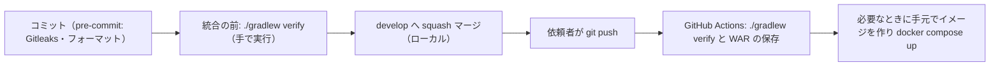

# CI/CD Pipeline — U1 アプリの骨格（u1-app-skeleton）

U1 が用意する検査・ビルド・配備の流れ。U2〜U4 はこの流れに自分のテストと検査を足すだけで、流れの形は変えない。入力は U1 の NFR Design（`reliability-design.md` 5章の1コマンドの検査、`security-design.md` 7章の依存関係と検査、`performance-design.md` 4章の画面の読み込みの量、`observability-design.md`、`scalability-design.md`、`logical-components.md`）、Domain Design の `components.md`、U1 の `functional-spec.md`、チームの進め方（Way of Working・Deployment・Code Style）である。`contract-summary.md` は、本ワークフローで Contract Design を行わないため無い。設計の方針の確定回答は `infrastructure-design-questions.md`（Q3〜Q6）にある。

## 1. 全体の流れ

テキスト表記: コミットの前に pre-commit のフックで秘密情報の検出とフォーマット検査を行う。統合の前に開発者が `./gradlew verify` を手で実行し、通ったら `develop` へ squash マージする。依頼者が `origin` へプッシュすると、GitHub Actions が同じ `./gradlew verify` を実行し、WAR を保存する。コンテナは、必要なときに手元で作って起動する。

- プルリクエストは使わない。統合の前の関門はローカルの `./gradlew verify`、CI は統合の後の再確認（チームの進め方）。CI が失敗したら、次の Bolt に進む前に直す。
- `origin` への `git push` は依頼者が行う。AI はプッシュしない。

## 2. 1コマンドの検査（`./gradlew verify`、Q4）

Gradle のルートに `verify` のタスクを1つ置き、次の順に実行する。1つでも失敗したら全体を失敗にし、後ろの段は実行しない（Gradle のタスクの依存と順序の指定で並べる）。

| 順 | 段 | バックエンド（Gradle） | フロントエンド（Gradle から npm のスクリプトを呼ぶ） | 失敗の条件 |
|---|---|---|---|---|
| 1 | フォーマット | Spotless の確認（palantir-java-format） | Prettier の確認 | 差分がある |
| 2 | リンタ | —（SpotBugs は 7 の段） | oxlint、ESLint（react-hooks）、Stylelint | 違反がある |
| 3 | ライセンスヘッダー | Spotless の `licenseHeader` | ヘッダーの確認のスクリプト（TS・CSS） | ヘッダーが無い・形が違う |
| 4 | ビルド（型の検査を含む） | コンパイル | `tsc --noEmit`、Vite のビルド | エラー |
| 5 | 単体テスト | `XxxTest`（JUnit 5、jqwik、ArchUnit） | Vitest（Testing Library、vitest-axe、fast-check） | 失敗がある |
| 6 | 結合テスト | `XxxIT`（Spring Boot Test、組み込みの H2） | — | 失敗がある |
| 7 | カバレッジの下限 | JaCoCo（行 80%・分岐 70%） | `@vitest/coverage-v8` の `thresholds`（同じ値） | 下回る |
| 8 | 安全の検査 | SpotBugs＋FindSecBugs、OSV-Scanner（Gradle の lockfile）、Gitleaks（リポジトリ全体） | OSV-Scanner（`frontend/` と `vendor/make-you-chic-ui` の lockfile） | 重大度 High 以上がある |
| 9 | 成果物と量の確認 | 実行可能 WAR（`dist` を同梱） | 初回の読み込みの JavaScript の量（圧縮後 500KB を超えたら警告だけ） | WAR が作れない（量の超過は失敗にしない） |

- **npm の呼び方**: Gradle から、PC に入っている Node.js 24 と npm を呼ぶ。依存関係は `npm ci` で lockfile どおりに入れる。Node.js の版が合わなければ失敗させる（`package.json` の `engines` で確かめる）。
- **外部の道具**: Gitleaks と OSV-Scanner は、Gradle から PC に入っている実行ファイルを呼ぶ。見つからなければ、入れ方を示して失敗させる（黙って飛ばさない）。
- **対象の外**: フォーマッタ・リンタ・静的検査は `vendor/` を対象から外す。`vendor/make-you-chic-ui` のテストは実行しないが、同梱の版でフロントエンドのビルドが通ることは 4 の段で確かめる（チームの進め方）。
- **前提**: JDK 25、Node.js 24、Python（pre-commit 用）、Gitleaks、OSV-Scanner、Docker（コンテナで動かすとき）。README に入れ方と `./gradlew verify` の実行の仕方を書く。

## 3. Git のフック（Q5・Q6）

| フック | 仕組み | 内容 |
|---|---|---|
| pre-commit | pre-commit フレームワーク（`.pre-commit-config.yaml`）。各自が `pre-commit install` を1回実行する | Gitleaks（コミットする差分）、フォーマットの確認（Spotless・Prettier の確認を、変更したファイルに対して） |
| pre-push | 置かない | 統合の前に手で `./gradlew verify` を実行する |

pre-commit の道具の版は設定ファイルで固定し、Dependabot（または手で）更新する。

## 4. CI（GitHub Actions）

| 項目 | 設計 |
|---|---|
| きっかけ | `develop` へのプッシュ。あわせて、`main` へのリリースのタグ（`v*`）のプッシュと、手動の実行 |
| ランナー | `ubuntu-latest` |
| 取得 | サブモジュールを固定先のコミットで取得する（`submodules: true`、深さは必要な分） |
| 道具の用意 | JDK 25（Temurin）、Node.js 24、Gitleaks、OSV-Scanner を版を固定して入れる。Gradle と npm のキャッシュを使う |
| 実行 | `./gradlew verify`（ローカルと同じ入口・同じ順） |
| 成果物 | WAR をワークフローの成果物として保存する。名前にコミットのハッシュを入れる（保存期間 30 日）。リリースのタグのときは、GitHub のリリースに WAR を添付する |
| 失敗したとき | ワークフローを失敗にする。依頼者が確認し、次の Bolt に進む前に直す |
| 権限 | ワークフローの権限は読み取りだけ（`contents: read`）。リリースのジョブだけ `contents: write` |
| 秘密情報 | CI は秘密情報を使わない（テストは値を持たない仮の設定で動かす）。GitHub の秘密情報の保管は使わない |
| 依存関係の更新 | Dependabot を Gradle・npm（`frontend/`）・GitHub Actions・Docker（ベースイメージ）に設定する |

## 5. 配備と戻し方

当面の配備先は開発者の PC 上のコンテナだけのため、自動の配備は持たない。

| 手順 | 内容 |
|---|---|
| イメージを作る | `./gradlew verify` で作った WAR（または CI の成果物の WAR）を使い、`docker compose build`。イメージのタグにコミットのハッシュを付ける |
| 起動 | `docker compose up -d` |
| 配備の確認（NFR9.3） | コンテナのヘルスチェックが healthy になること、ブラウザでログイン画面が表示されること。確認できるまで配備の完了としない |
| 戻し方 | 直前の版の WAR（CI の成果物、またはタグのリリース）でイメージを作り直して起動する。スキーマの変更は前進のみ・後方互換のため、1つ前の版のアプリが今のスキーマで動く（U1 の `reliability-design.md` 4章） |
| データの保護 | 版を替える前に、アプリを止めて `/app/data` のボリュームを複写する（NFR9.2。手順は README） |

配備先が決まったら、チームの進め方（統合時に検証環境へ自動配備、本番は依頼者の承認のうえ配備）に沿って、Deployment Pipeline の段階でこの節を置き換える。部品表（SBOM）の生成もそのときに入れる。

## 6. 段と関門の対応

| 段 | 関門 | 失敗したとき |
|---|---|---|
| コミット | Gitleaks、フォーマット | コミットを止める |
| 統合の前（手元） | `./gradlew verify` のすべて | 統合しない |
| CI（統合の後） | `./gradlew verify` のすべて | 次の Bolt に進む前に直す |
| 配備（手元） | コンテナのヘルスチェック、ログイン画面の表示 | 配備の完了としない。直前の版に戻す |
