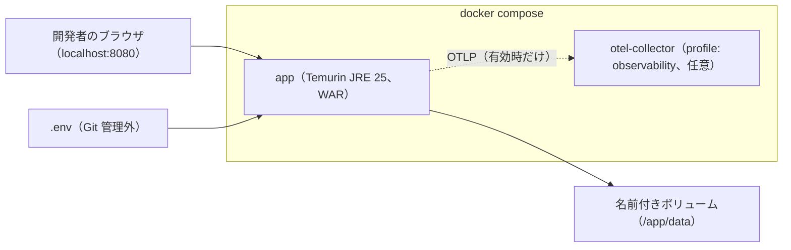

# Infrastructure Specification — U1 アプリの骨格（u1-app-skeleton）

U1 の基盤の設計。入力は U1 の NFR Design（`performance-design.md`・`security-design.md`・`scalability-design.md`・`reliability-design.md`・`observability-design.md`・`logical-components.md`）、Domain Design の部品の一覧（`components.md`）、U1 の `functional-spec.md`（WF1 アプリの起動）である。`contract-summary.md` は、本ワークフローで Contract Design を行わないため無い。設計の方針の確定回答は `infrastructure-design-questions.md`（Q1〜Q6）にある。

当面の配備先は開発者の PC 上のコンテナだけで、クラウドの配備先は後で決める（チームの進め方）。本書はその前提で、配備先が決まったときにそのまま引き継げる形（1つのイメージ・環境変数での設定・ヘルスチェック）にする。U2〜U4 は同じアプリの中の機能で、独自の基盤を持たない（U2 の環境変数だけを 3章で扱う）。

## 1. 配備（Deployment）

| Facet | Choice | Rationale |
|---|---|---|
| 実行の形 | コンテナ1台（実行可能 WAR を `java -jar` で起動）。アプリと Actuator は同じ番号（8080） | ADR-008（1台）、U1 の `logical-components.md` 5章 |
| 起動の手順 | `docker compose up`（Q1）。`compose.yaml` に、イメージ・番号・ボリューム・`.env` の読み込み・ヘルスチェック・停止の猶予を書く | 開発者が同じ手順で起動できる |
| ベースイメージ | Eclipse Temurin の JRE 25（Ubuntu ベース）。版の番号までタグで固定し、更新は Dependabot の知らせで行う（Q2） | 開発者の PC の JDK と同じ配布元、調査のためのシェルがある |
| イメージの作り方 | Gradle でビルドした WAR をコピーする1段の Dockerfile。イメージの中ではビルドしない（Q3） | 検査を通った成果物と同じものを動かす |
| 実行する利用者 | root 以外の専用の利用者（例: UID 10001） | U1 の `security-design.md` 4章 |
| JVM の設定 | コンテナのメモリの上限に合わせる設定（最大ヒープをコンテナのメモリの 75%）。停止の合図（SIGTERM）を Java が直接受け取るよう、起動は `exec` 形式 | 穏やかな停止（U1 の `reliability-design.md` 3章） |
| ネットワーク | 公開する番号は 8080 だけ（開発者の PC の `localhost` に結び付ける）。H2 のネットワークの受け口は持たない。外への通信は、外部エクスポートを有効にしたときの OTLP の受け手だけ | U1 の `security-design.md` 4章 |
| 保存 | 名前付きボリュームを `/app/data` に付け、H2 のファイルを置く。ボリュームは実行の利用者だけが読み書きできる | NFR6.1、U4 の改ざんへの備え（OS の権限） |
| 環境 | 開発者の PC（コンテナ）、CI（GitHub Actions のランナーで検査を実行。コンテナでは動かさない）。検証・本番の環境は配備先が決まったときに作る | チームの進め方（Deployment） |
| 基盤の定義の方法 | `Dockerfile` と `compose.yaml` をリポジトリで管理する。クラウドの基盤のコード（IaC）は配備先が決まってから | 当面の配備先に合わせる |
| 資源の大きさ | コンテナのメモリ 1GB、CPU 2（compose の上限）。起動の時間（30 秒以内）と照合の負荷（U2）を Performance Validation で測って見直す | NFR1.4、U2 の `performance-design.md` 1章 |

### コンテナの構成

テキスト表記: `docker compose up` でアプリのコンテナ1つが起動し、ブラウザは `localhost:8080` でアクセスする。H2 のファイルは名前付きボリュームに置き、秘密情報は Git 管理外の `.env` から環境変数で渡す。外部エクスポートを確かめるときだけ、profile を指定して OTLP の受け手（OpenTelemetry Collector）を一緒に起動する。

### コンテナの確認と停止

| 項目 | 設定 |
|---|---|
| コンテナのヘルスチェック | `/actuator/health` が 200（UP）なら健全。30 秒ごと、起動の猶予 40 秒（NFR1.4 の 30 秒に余裕を足す） |
| 停止の猶予 | 45 秒（アプリの穏やかな停止の待ち時間 30 秒より長く） |
| 再起動の方針 | 異常で止まったときは再起動しない（開発者が原因を見る）。配備先が決まったら見直す |

## 2. 基盤のサービス（Infrastructure Services）

| Service | Role | Configuration | Notes |
|---|---|---|---|
| H2（組み込み・ファイル保存） | database | `jdbc:h2:file:/app/data/mastersmith`（コンテナ）、`./data/`（コンテナの外で動かすとき）。コネクションプール 最大 10 本 | 別サーバーの H2 への切り替えは接続設定だけで（NFR1.8）。今は作らない |
| OpenTelemetry Collector | 外部エクスポートの受け手（確認用） | compose の profile `observability` のときだけ起動する。受け取ったトレース・ログ・指標を標準出力に出すだけ（外へは送らない） | 外部エクスポートの設定と、秘密情報が載らないことを手元で確かめるため（Q1） |
| キャッシュ・待ち行列・検索・CDN・DNS・ロードバランサー | — | 使わない | 1台・小規模（U1 の `scalability-design.md`） |

## 3. 設定と秘密情報

| 種類 | 渡し方 | 例（名前だけ） |
|---|---|---|
| 秘密情報 | 環境変数。compose は Git 管理外の `.env` から読む。`.env.example` に名前だけを置き、値は空 | 内部DBのパスワード、U2 の署名鍵、U2 の初期管理者のメールアドレスとパスワード |
| 秘密でない設定 | 環境変数、または `application.yaml` の既定値 | ヘルスチェックの制限時間、ベースURL、転送元のヘッダーを信頼するか、外部エクスポートの有効化と送り先、サンプリング率、U2 のロック・有効期限の値 |
| 守り | `.gitignore` に `.env`・`.env.*`（`.env.example` を除く）・鍵の形式のファイルを入れる。Gitleaks をコミットの前と CI で実行する | NFR3.2、project.md の Forbidden・Mandated |

環境変数の正確な名前は Code Generation で決め、`.env.example` と README に一覧を書く。

## 4. 単位で共有する基盤（Shared Infrastructure）

| Shared Resource | Owner Unit | Consumer Units | Access Boundary |
|---|---|---|---|
| コンテナとイメージ | U1 | U2、U3、U4 | 同じプロセス。U2〜U4 は独自のコンテナを持たない |
| 内部DB（H2 のファイル、ボリューム） | U1（接続とスキーマの変更の仕組み） | U2（利用者・トークン・ロック）、U4（監査イベント） | 各単位は自分の表だけを読み書きする（Domain Design のデータの持ち主）。スキーマの変更は Flyway の1つの流れで、単位ごとにファイルを分ける |
| `.env` の秘密情報 | U1（渡し方） | U2（署名鍵・初期管理者） | コンテナの環境変数としてだけ渡す |
| OTLP の受け手（確認用） | U1 | U2〜U4（ログ・トレースが流れる） | profile を指定したときだけ |
