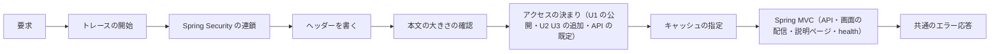

# Logical Components — U1 アプリの骨格（u1-app-skeleton）

U1 の NFR の設計（`performance-design.md`・`security-design.md`・`scalability-design.md`・`reliability-design.md`・`observability-design.md`）が、どの部品に当たるかをまとめた一覧。Infrastructure Design は本書を元に、コンテナ・ボリューム・環境変数・ネットワークを決める。要件は `performance-requirements.md`・`security-requirements.md`・`scalability-requirements.md`・`reliability-requirements.md`・`observability-requirements.md`、技術は `tech-stack-decisions.md`、処理の流れは `functional-spec.md` に従う。`contract-summary.md` は、本ワークフローで Contract Design を行わないため無い。

## 1. 部品の一覧

| 部品 | 種類 | 受け持つ NFR の設計 | 設計書 |
|---|---|---|---|
| 組み込みの Tomcat | 要求の受け付け | 応答の圧縮、スレッドの上限、穏やかな停止（30 秒） | performance 5章・6章、reliability 3章 |
| トレースの開始（要求の観測） | フィルター（最初に通る） | `traceparent` の引き継ぎ、トレースIDの割り当て、MDC への反映 | observability 3章 |
| Spring Security のフィルターの連鎖 | フィルターの連鎖（1つ） | セキュリティ関係のヘッダー、状態を持たない設定、アクセスの決まりの並びと U2・U3 の差し込み口、要求の検査 | security 2章・3章 |
| 要求の本文の大きさの確認 | 連鎖の中のフィルター | 上限 1MB、413 / `PAYLOAD_TOO_LARGE` | security 6章 |
| キャッシュの指定 | フィルター | API は `no-store`、`/assets/` は長期、入口は `no-cache` | performance 5章 |
| API と画面の配信（Spring MVC） | 画面入出力の層 | 画面の配信（`/api/**` 以外は `index.html` へ）、説明ページ | security 6章 |
| 共通のエラー応答（変換の1か所と組み立ての仕組み） | 画面入出力の層の共通部品 | 例外の詳細を載せない、4xx／5xx のログのレベル、フィルターの段階の 401・403 の組み立て | security 3章・5章、observability 2章 |
| 問題の種類の一覧 | 共通部品 | 起動時の収集と重複の検査（`PAYLOAD_TOO_LARGE` を含む） | reliability 1章 |
| 時間の上限付きの DB の確認 | ヘルスの指標 | 制限時間（既定2秒）、確認は1本ずつ | performance 2章、reliability 2章 |
| Actuator | 管理の窓口 | health だけを公開、内訳なし。指標は集めるが窓口は公開しない | security 4章、observability 5章 |
| コネクションプール（HikariCP） | 資源 | 最大 10 本、借りる待ち 5 秒 | performance 6章、scalability 1章 |
| JPA・Flyway | DB アクセス | open-in-view 無効、問い合わせの上限 10 秒、起動時のスキーマの変更（失敗で停止） | performance 6章、reliability 4章 |
| H2（組み込み・ファイル保存） | データの置き場 | ネットワークの受け口なし、コンソールなし、`/app/data` | security 4章、reliability 4章 |
| ログ（logback＋logstash-logback-encoder） | 出力 | 1行1件の JSON、標準出力へ同期で書く | observability 2章、performance 7章 |
| TraceAspect | 調査用の追跡 | TRACE のときだけ、対象の層と除外 | observability 4章 |
| 指標（Micrometer） | 計測 | Spring Boot の既定の指標 | observability 5章 |
| 外部エクスポート（OTLP：トレース・ログ・指標） | 出力（任意） | 既定は無効、1つの設定で切り替え、非同期・上限付きで送る | observability 6章、reliability 2章 |
| 画面（ビルドした SPA） | 静的なファイル | 初回の読み込みの量、遅延読み込み、CSP に合う出力 | performance 4章、security 2章 |

## 2. 要求が通る順番

テキスト表記: 要求は、トレースの開始 → Spring Security の連鎖（ヘッダーを書く → 本文の大きさの確認 → アクセスの決まり）→ キャッシュの指定 → Spring MVC の順に通り、例外は共通のエラー応答で ErrorResponse に変換される。連鎖の中で拒否された要求（413・401・403）も、ヘッダーが書かれた後に共通の組み立ての仕組みで応答する。

## 3. 故障の範囲（失敗の領域と影響の広さ）

| 故障する部品 | 影響を受けるもの | 影響を受けないもの | 閉じ込め方 |
|---|---|---|---|
| H2（応答しない・壊れた） | DB を使う API、ヘルスチェック（DOWN） | 画面の配信、説明ページ | 時間の上限、確認は1本ずつ |
| コネクションプール（使い切った） | DB を使う API（5 秒待って失敗） | 画面の配信、説明ページ、ヘルスチェック（DOWN を返す） | 借りる待ちの上限 |
| 外部エクスポートの受け手 | 外へ送る記録の一部 | すべての要求 | 非同期・上限付きの待ち行列 |
| 標準出力の受け手 | すべての要求（待つ） | — | 受け入れた危険（確定回答 Q2） |
| アプリのプロセス | すべて（1台のため） | ボリュームのデータ | 再起動。データはボリュームに残る |

影響の広さはいずれもこのアプリ1台に閉じる。利用者ごとに分けた影響の区分は持たない（1台・小規模のため）。

## 4. 共有する資源

| 資源 | 使う部品・単位 | 注意 |
|---|---|---|
| 内部DB（1つ）とコネクションプール | U1（ヘルス）、U2（利用者・トークン・ロック）、U4（監査ログ） | データの持ち主の単位だけが自分の表を読み書きする（Domain Design） |
| フィルターの連鎖（1つ） | U1、U2（認証）、U3（アクセスの決まり） | U2・U3 は差し込み口で足し、U1 の設定を書き換えない（security 3章） |
| 問題の種類の一覧 | U1〜U4 | code・slug の重複で起動を失敗させる（BR5.16） |
| 標準出力 | すべて | 1行1件の JSON の形を全単位で守る |

## 5. Infrastructure Design へ渡すもの

| 項目 | 内容 |
|---|---|
| 実行の単位 | 実行可能 WAR を1つのコンテナで動かす（1台） |
| 受け口 | HTTP の1つの番号（アプリと Actuator で共通）。HTTPS は配備先が決まるまで扱わない |
| ボリューム | `/app/data`（H2 のファイル）。root 以外の利用者で読み書き |
| 環境変数 | 内部DBの接続設定とパスワード、U2 の署名鍵・初期管理者の設定、外部エクスポートの有効化と送り先、ベースURL、転送元のヘッダーを信頼するか |
| コンテナの確認 | `/actuator/health` を使い、UP で稼働とみなす。停止の猶予は穏やかな停止（30 秒）より長く |
| ログ | 標準出力。保存と回しはコンテナの実行環境 |
| 外部への送信 | 既定なし。有効にしたときだけ OTLP の受け手へ |
