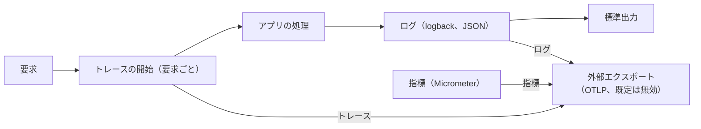

# Observability Design — U1 アプリの骨格（u1-app-skeleton）

U1 の観測性の要件（`observability-requirements.md` の NFR10.1〜NFR10.14）を満たす設計。ログ・トレース・指標・外部エクスポートの仕組みは U1 が用意し、U2〜U4 はそれを使う。技術は `tech-stack-decisions.md`、処理の流れは `functional-spec.md`（WF3・6.1）に従う。秘密情報を載せない仕組みは `security-design.md` 5章（`security-requirements.md` の NFR3.1〜NFR3.4・NFR3.15）、性能への影響は `performance-design.md`（`performance-requirements.md`）、送信の失敗の扱いは `reliability-design.md`（`reliability-requirements.md`）、ログの保存は `scalability-design.md`（`scalability-requirements.md`）で扱う。設計の方針の確定回答は `nfr-design-questions.md`（Q2〜Q5）にある。`contract-summary.md` は、本ワークフローで Contract Design を行わないため無い。

## 1. 全体の形

テキスト表記: 要求ごとにトレースを始め、処理中のログにトレースIDとスパンIDを載せて標準出力へ JSON で出す。外部エクスポートを有効にしたときだけ、トレース・ログ・指標を OTLP で送る。

## 2. ログ（NFR10.1〜NFR10.4、NFR10.14）

**出力の仕組み**: logback の設定ファイルで、標準出力への出力を1つだけ置き、logstash-logback-encoder で1行1件の JSON にする。書き出しは同期（確定回答 Q2、`performance-design.md` 7章）。開発時も同じ形で出す。ファイルへの出力は持たない。

**項目の名前と中身**（NFR10.2、BR3.2）:

| 項目 | 中身 | 必須 |
|---|---|---|
| `timestamp` | ISO 8601、タイムゾーン付き（例: `2026-09-22T19:50:00.123+09:00`） | 必須 |
| `level` | ログのレベル | 必須 |
| `logger` | ロガーの名前 | 必須 |
| `thread` | スレッドの名前 | 必須 |
| `message` | メッセージ（固定の文にし、可変の値はキーと値で渡す） | 必須 |
| `traceId`・`spanId` | 要求の処理中はその要求の値 | あれば |
| `exception` | 例外の型・メッセージ・スタックトレース（5xx のときだけ。4xx は出さない） | あれば |
| 呼び出し側のキーと値 | SLF4J のキーと値の書き方で渡したもの。JSON の値として入る | あれば |

- 上の表以外の項目（呼び出し元の場所、ホスト名など）は出さない。MDC に入る値のうち、ログに出すのは `traceId` と `spanId` だけとする（ほかの値が紛れ込まないように）。
- レベル: 既定は INFO。機能ごと（パッケージごと）に設定で変えられる。想定内のエラー（4xx）は WARN 以下でスタックトレースなし、想定外（5xx）は ERROR でスタックトレース付き、変換する場所で1回だけ出す（BR5.5）。
- ログを集めて見る方法: 当面は、コンテナの実行環境のログの閲覧（標準出力）と、`traceId` による絞り込みで1要求のログをたどる。

## 3. トレース（NFR10.5、NFR10.6）

- Micrometer Tracing（OpenTelemetry のブリッジ）を使い、要求ごとに観測（スパン）を始める。受け取った要求に W3C Trace Context の `traceparent` が正しい形であれば引き継ぎ、無い・正しくなければ新しく始める（BR4.1、BR4.2）。
- **トレースの仕組みは常に有効**とし、外部エクスポートの有効・無効は送信だけを切り替える（`functional-spec.md` 6.1）。
- **サンプリング率の既定は 100%**（確定回答 Q4）。設定で変えられる。サンプリング率は外部へ送るトレースの割合だけに効き、トレースIDは率に関係なくすべての要求に割り当てられ、ログ・エラー応答・監査ログに載る（NFR10.6）。Code Generation で、率を 0% にしてもログとエラー応答にトレースIDが入ることをテストで確かめる。
- ログへの反映: トレースの仕組みが、処理中の MDC に `traceId`・`spanId` を入れる。要求の終わりに取り除き、次の要求に持ち越さない。
- 別スレッドへの引き継ぎ: 別スレッドで処理する場合（U4 の監査ログの受け取りを非同期にする場合など）は、トレースの情報を引き継ぐ実行の枠を使う。引き継がないと監査ログのトレースIDがログと一致しなくなる（`functional-spec.md` 6.1）。
- 外へ出すトレースの属性からの秘密情報の除去は `security-design.md` 5章のとおり。

## 4. メソッドの呼び出しの追跡（NFR10.12〜NFR10.14）

- **仕組み**: U1 が、Spring の CustomizableTraceInterceptor に処理を任せるアスペクト（TraceAspect）を1つ置く。ロガーは追跡の対象のクラスごとに分ける（対象のクラスの名前のロガーを使う設定）。ログのレベルが TRACE のときだけ出力し、TRACE でなければ文字列を組み立てない。
- **出力の形式**: 入る・出る・例外の文言と、スタックトレースを出すかどうかを、設定（`mastersmith.trace.*`）で変えられる。
- **対象**: チームの進め方の4つの層（web・service・domain・repository）のうち、Spring の Bean として代理で包まれるクラスのメソッド。Spring Data の repository は、インターフェースに宣言されたメソッドを対象とする形で指定する（実体のクラスが別のパッケージにあるため）。
- **対象から外すもの**（NFR10.13）: Spring Security のフィルター、フィルター全般、設定クラス（`@Configuration`）、起動クラス、追跡の仕組み自身。対象の指定は「含めるもの」をパッケージの層で書き、「外すもの」を明示的に除く形にする。
- **例外の決まり**: 追跡のログは文字列の組み立てで出す（BR3.5 の例外。NFR10.14）。秘密情報を持つ型は文字列化で伏せ字にする（`security-design.md` 5章）。
- **確かめ方**: TRACE を有効にしたときに出ること、既定では出ないこと、フィルターが正しく動くこと（起動のテストとフィルターを通る要求のテスト）。

## 5. 指標（NFR10.8、NFR10.9）

確定回答 Q3・Q5 により、外部エクスポートを有効にしたときは、Spring Boot が既定で集める指標をすべて OTLP で送る。

| 指標の例 | 使い道 |
|---|---|
| HTTP の要求の件数・時間・状態コード（`http.server.requests`） | エラーの割合（5xx の件数 ÷ 全体）、応答時間の分布 |
| ログのレベルごとの件数（`logback.events`） | ERROR の件数（エラーの割合の指標） |
| コネクションプールの使用・待ち（`hikaricp.*`） | 接続の不足の兆し（`scalability-design.md` 1章） |
| JVM・プロセス（メモリ・GC・スレッド・CPU） | 資源の不足の兆し |

- 取り出すための窓口（`/actuator/metrics` など）は公開しない（`security-design.md` 4章）。アプリから送る形だけとする。
- 送る間隔は既定 60 秒（設定で変更可）。
- 指標の区別の値（タグ）に、利用者の ID・生の URL を使わない（`security-design.md` 5章）。共通のタグとしてアプリの名前を付ける。
- 健全性の指標はヘルスチェック（`/actuator/health`、NFR10.8）とする。
- U2〜U4 が「運用で見る指標の候補」とした値（ログインの失敗の割合、アクセス拒否の件数、監査ログの書き込みの失敗の件数）は、本Intentでは監査ログやアプリのログから数え、指標としては作らない。

## 6. 外部エクスポート（NFR10.7、NFR10.11）

- **有効・無効**: U1 の設定（`mastersmith.observability.export.enabled`、既定は無効）1つで、トレース・ログ・指標の送信をまとめて切り替える。送り先（OTLP の受け手の URL）も設定で1つ指定し、信号ごとに上書きできる。Spring Boot の対応する設定の名前は、使う版に合わせて Code Generation で決める。
- **ログの送信**: 標準出力への出力はそのまま残し、有効にしたときだけ、OpenTelemetry の logback 用の出力を加えて同じログを送る。
- **既定で何も送らない**: 無効のときは、送信の仕組みを作らない。既定の設定で外部へ何も送らないことをテストで確かめる。
- **送信の失敗**: 送信は要求の処理と切り離し、上限付きの待ち行列から送る。届かなくても要求を止めない（`reliability-design.md` 1章）。

## 7. 目標と警報、ダッシュボード

- 本番の目標（SLO）と警報の条件、ダッシュボードは、配備先が決まったときに Operation の段階（Observability Setup）で定める。その際は、目標を割る前に警報が出るようにしきい値を決める（`observability-requirements.md`）。
- 候補とする指標（SLI）: 稼働（5xx でない応答の割合）、応答時間（ログインの API の 95 パーセンタイル）、健全性（ヘルスチェックの UP）。いずれも 5章の指標から計算できる。
- 当面（開発者の PC 上のコンテナ）は、ヘルスチェックと標準出力のログで状態を確かめる。
