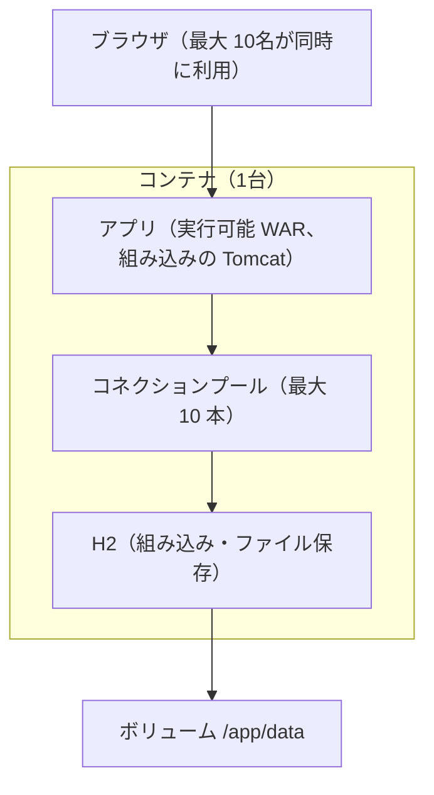

# Scalability Design — U1 アプリの骨格（u1-app-skeleton）

U1 の拡張性の要件（`scalability-requirements.md` の NFR1.7〜NFR1.10）を満たす設計。前提は Domain Design の ADR-008（当面はアプリを1台で動かす）で、複数台への拡張は本Intentの範囲外とし、その余地を残すことだけを設計する。関連する性能の設計は `performance-design.md`（`performance-requirements.md` の要件）、技術は `tech-stack-decisions.md`、処理の流れは `functional-spec.md`、信頼性・観測性・安全の要件（`reliability-requirements.md`・`observability-requirements.md`・`security-requirements.md`）は各設計書で扱う。`contract-summary.md` は、本ワークフローで Contract Design を行わないため無い。

## 1. 規模の想定と容量

| 資源 | 設定・見積もり | 余裕 | 要件 |
|---|---|---|---|
| 利用者 | 最大 50名、同時ログイン 最大 10名 | — | NFR1.7 |
| 内部DBの接続 | 最大 10 本（HikariCP） | 同時に DB を使う要求が 10 件を超えると、空きを最大 5 秒待つ。待ちきれなければ失敗（500）とし、要求を無期限に待たせない | NFR1.7 |
| 要求を処理するスレッド | Tomcat の既定（最大 200） | 同時ログイン 10名に対して十分 | NFR1.7 |
| 内部DBのファイル | 監査ログが1年で約 180MB（1日 500 件 × 1KB × 365 日）。利用者・トークンのデータはこれより小さい | 開発者の PC 上のコンテナのボリュームで十分。年に一度、実際の大きさと見積もりを比べる | NFR1.9 |
| アプリのログ | 標準出力へ出す。保存と回し（ローテーション）はコンテナの実行環境に任せる | アプリはログのファイルを持たないため、ディスクを使い果たさない | NFR1.10 |

見直しの目安: 内部DBの接続の待ちが頻繁に起きる（Hikari の待ちの指標、外部エクスポートを有効にしたとき）、または監査ログの増え方が見積もりの2倍を超えたら、接続の数とボリュームの大きさを見直す。

## 2. 1台で動かす形（ADR-008）

テキスト表記: ブラウザからの要求はコンテナ1台のアプリが受け、アプリの中のコネクションプール（最大 10 本）を通して組み込みの H2 を使う。H2 のファイルはボリューム `/app/data` に置く。

- 負荷の分散（ロードバランサー）と自動の台数の増減は持たない。
- アプリのサーバー側には画面のセッションを持たない（`security-design.md` 3章）。要求ごとの状態は、要求の処理が終われば残らない（トレースの情報も要求の終わりに破棄する。`functional-spec.md` WF3）。

## 3. 複数台にするときの余地（NFR1.8）

本Intentでは作らないが、次の形で切り替えられるようにしておく。

| 切り替えるもの | U1 で用意すること | 切り替えのときに要ること |
|---|---|---|
| 内部DBの接続先 | 接続先を設定（接続の URL・利用者・パスワード）だけで変えられる（BR2.2）。コードに組み込み・ファイル保存を前提とする処理を置かない | 別サーバーの H2 を用意し、アプリからだけ届くネットワークに置く（`security-design.md` 4章） |
| サーバーの状態 | 画面のセッションを持たない。キャッシュを持たない | U2 のロック状態・リフレッシュトークンは内部DBにあるため共有される。同時更新の扱い（U2 の決まりの行の排他）を見直す（ADR-008 の帰結） |
| ヘルスチェック | 状態（UP／DOWN）だけを返す | ロードバランサーの確認先に使える |
| ログとトレース | 標準出力と OTLP で外へ出す形 | 台数が増えても受け手の側でまとめられる |

## 4. データの分け方と非同期の処理

- データの分割（シャーディング）・読み取り専用の複製は持たない。想定の規模では1つの内部DBで足りる。
- 要求の処理を待ち行列で切り離す仕組みは持たない。U1 に時間のかかる処理は無い。外部エクスポートの送信だけは、要求の処理と切り離して非同期に行う（`reliability-design.md` 2章）。
- U4 の監査ログの受け取りを非同期にする場合は、トレースの情報を別スレッドへ引き継ぐ設定を入れる（`functional-spec.md` 6.1、`observability-design.md` 3章）。
