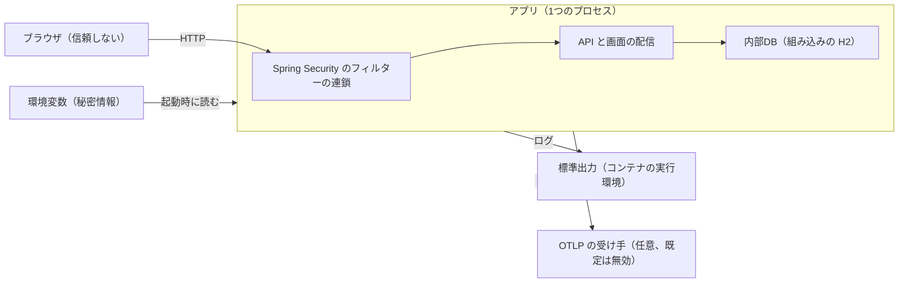

# Security Design — U1 アプリの骨格（u1-app-skeleton）

U1 の安全の要件（`security-requirements.md` の NFR3.1〜NFR3.15）を満たす設計。技術は `tech-stack-decisions.md`、処理の流れは `functional-spec.md`（WF1〜WF8）、決まりは U1 の `rules.md` に従う。性能・信頼性・観測性に関わる部分は `performance-requirements.md`・`reliability-requirements.md`・`observability-requirements.md`・`scalability-requirements.md` の要件とあわせて扱う。設計の方針の確定回答は `nfr-design-questions.md`（Q1〜Q5）にある。`contract-summary.md` は、本ワークフローで Contract Design を行わないため無い。そのため、U2・U3 が U1 の仕組みに足す部分の形（3章の追加の決まりの差し込み口）は本書で決める。

認証・認可そのもの（トークン・パスワード・アクセスの決まり・リフレッシュトークンの Cookie と CSRF 対策）は U2・U3 の設計で扱う。U1 は、その土台となるフィルターの連鎖・ヘッダー・秘密情報の扱い・公開する範囲を受け持つ。

## 1. 守るものと信頼の境界

| 守るもの | 置き場所 | 脅かすもの |
|---|---|---|
| 内部DBのデータ（U2 以降の利用者・トークン・監査ログ） | H2 のファイル（`./data/`、コンテナでは `/app/data`） | 外部からの直接の接続、H2 のコンソール、ファイルの持ち出し |
| 秘密情報（内部DBのパスワード、署名鍵、初期管理者のパスワード） | 環境変数（コンテナの実行時に渡す） | ソース・設定ファイルへの直書き、ログ・トレース・エラー応答・外部エクスポートへの混入 |
| 内部の情報（例外の詳細、設定値、構成） | アプリの中 | Actuator・エラー応答・説明ページからの漏えい |
| 画面を使う利用者 | ブラウザ | スクリプトの注入、別サイトへの埋め込み |

テキスト表記: 信頼の境界は、ブラウザとアプリの間（すべての要求は Spring Security のフィルターの連鎖を通る）、アプリと出力先（標準出力、任意の OTLP の受け手）の間、アプリと環境変数の間にある。内部DBはアプリの中にあり、外部からは接続できない。

## 2. 応答のヘッダー（NFR3.10）

確定回答 Q1 により、U1 で Spring Security を組み込み、すべての要求が通るフィルターの連鎖を1つ用意して、そのヘッダーの設定で付ける。連鎖はすべての要求（API・画面の配信・説明ページ・Actuator・エラーの応答）に当てるため、ヘッダーはすべての応答に付く。

| ヘッダー | 値 | 付け方 |
|---|---|---|
| `Content-Security-Policy` | `default-src 'self'; script-src 'self'; style-src 'self'; img-src 'self' data:; font-src 'self'; connect-src 'self'; frame-ancestors 'none'; base-uri 'self'; form-action 'self'` | Spring Security のヘッダーの設定。値は設定ファイルの固定値とし、画面の構成が変わったときに見直す |
| `X-Content-Type-Options` | `nosniff` | Spring Security の既定 |
| `X-Frame-Options` | `DENY` | Spring Security の既定（CSP の `frame-ancestors 'none'` を解釈しない古いブラウザ向けに残す） |
| `Referrer-Policy` | `same-origin` | Spring Security のヘッダーの設定 |
| `Cache-Control` | API・Actuator は `no-store`。画面のファイルは `performance-design.md` 5章のとおり | Spring Security の既定のキャッシュの指定は外し、U1 の小さなフィルターが要求のパスに応じて付ける |
| `Strict-Transport-Security` | 付けない | HTTPS は配備先が決まるまで扱わない（`tech-stack-decisions.md`）。配備先で TLS を決めるときに付ける |

画面との整合:

- ビルドした `index.html` には埋め込みのスクリプトを置かない（Vite はスクリプトをファイルとして読み込む形で出力する）。CSS はファイルに出力する。
- デザインシステムの部品が使う要素の style の指定は、画面の部品が DOM のプロパティとして設定するため `style-src 'self'` で妨げられない（`security-requirements.md` NFR3.10）。
- 外部のフォント・外部の画像は使わない。
- 画面の開発サーバー（Vite）が配る開発中の画面には、このヘッダーは付かない。CSP の確認は、ビルドした WAR を起動した構成で行う（Playwright の E2E。ブラウザに CSP 違反が出ないことと画面が表示されることを確かめる）。

## 3. フィルターの連鎖と、U2・U3 が足す差し込み口

U1 の設定クラス（`config` パッケージ）が、フィルターの連鎖を1つだけ定義する。

| 項目 | U1 の設定 | 理由 |
|---|---|---|
| 対象 | すべての要求 | ヘッダーをすべての応答に付けるため |
| セッション | 作らない（状態を持たない） | 認証は U2 のトークンで行い、サーバーに画面のセッションを持たない |
| フォームのログイン・Basic 認証 | 無効 | 使わない。既定のログイン画面を出さない |
| CSRF トークンの仕組み | 無効 | U2 の決定（Cookie を使う2つの API は、SameSite=Strict と Origin の確認で守る）。U1 には Cookie を使う API が無い |
| 要求の検査（正規化されていないパスなどの拒否） | Spring Security の既定を外さずに使う | U3 の決まり 1.6 |
| 要求の本文の大きさの確認 | 連鎖の中、ヘッダーを書く処理の後に置く（6章） | 拒否の応答にもヘッダーを付けるため |

**アクセスの決まりの並び**（先に当たった決まりが使われる）:

1. U1 の公開の決まり: `/actuator/health`、`/api/problems/**` は認証を求めない（BR1.4、BR5.12）。
2. 追加の決まり: U2・U3 が、U1 のファイルを書き換えずに、決まりを足す部品（Bean）を置く。U1 は、その部品を順番（order）に従ってすべて当てる。U2 は認証の API の公開とトークンの検証（OAuth2 Resource Server）を、U3 は管理者のみ・ログイン必須の決まりと、401・403 の応答の処理を足す。
3. API の既定の扱い: 1・2 に当たらない `/api/**` の扱い。U1 だけの状態では「許可」とする。U3 が「ログイン必須」に切り替える部品を置く。この部品が2つ以上あれば起動を失敗させる。
4. 画面の配信（`/api/**` 以外）: 認証を求めない。画面の表示の制御は画面側で行い、データはすべて API の側で守る（BR7.5）。

- 差し込み口の名前と正確な形は Code Generation で決め、U2・U3 はそれに従う。Actuator の health 以外の窓口と H2 のコンソールは、アクセスの決まりではなく「そもそも用意しない」ことで閉じる（4章）。決まりの並びに頼らない。
- フィルターの段階で起きる 401・403 の応答は、U1 の共通の組み立ての仕組み（問題の種類から type・code・title を、要求から traceId を埋める）で ErrorResponse の形にする（BR5.1）。U3 の応答の処理はこれを使う。

## 4. 公開する範囲（NFR3.5〜NFR3.7）

| 対象 | 設計 | 確かめ方 |
|---|---|---|
| Actuator | Web に公開するのは health だけとし、ほかの窓口は既定で使えなくする（env・configprops・heapdump・metrics など）。health の応答は状態だけとし、内訳（部品ごとの状態）を出さない。窓口の番号は、アプリと同じ | テストで、`/actuator/env` などに届かないこと、health に内訳が無いことを確かめる |
| 指標 | 指標は集めるが、取り出すための窓口（`/actuator/metrics`・`/actuator/prometheus`）は公開しない。外部エクスポートを有効にしたときだけ、アプリから送る（Q3・Q5） | 同上 |
| H2 のコンソール | 有効にしない（開発時も含む）。設定で明示的に無効にする | テストで、`/h2-console` に H2 のコンソールが無いことを確かめる。画面の配信の決まりで `index.html` が返るため、応答の中身が H2 のコンソールでないことで判定する |
| 内部DBの接続 | 既定は組み込み・ファイル保存（`jdbc:h2:file:./data/...`）。H2 のネットワークの受け口（TCP サーバー・複数プロセスからの自動の接続）は使わない。別サーバーの H2 に切り替えるときは、その H2 をアプリからしか届かないネットワークに置く（Infrastructure Design で決める） | 設定の確認 |
| データのファイル | コンテナでは、アプリを root 以外の利用者で動かし、`/app/data` をその利用者だけが読み書きできるようにする（Infrastructure Design で決める） | 設定の確認 |

## 5. 秘密情報の扱い（NFR3.1〜NFR3.4、NFR3.15）

**受け取り方**: 秘密情報は環境変数から受け取り、設定ファイルには環境変数を参照する書き方だけを置く（値は書かない）。見本は、値を空にした `.env.example` とする。`.env` などはコミットしない（`.gitignore`、Gitleaks を pre-commit と CI で実行し、High 以上で統合を止める）。

**出さない場所と、その仕組み**:

| 出力先 | 仕組み |
|---|---|
| アプリのログ | 要求の本文・ヘッダー（`Authorization`・`Cookie` を含む）をログに出す処理を置かない。設定値の一覧を起動時にログに出さない。秘密情報の値をメッセージにもキーと値にも入れない（BR3.4） |
| メソッドの呼び出しの追跡（TRACE） | 引数と戻り値を文字列にするため、秘密情報を持つ型は文字列化でその項目を伏せ字にする（Q9 の回答）。U2 以降が秘密情報を持つ型を作るときも同じにする。U1 は、ログに秘密情報の値が含まれないことを確かめるテストの補助（ログを捕まえて、指定した値が含まれないことを確かめる部品）を用意し、U2 以降が使う |
| トレースの属性 | 要求の URL の属性から、問い合わせの部分（`?` 以降）を取り除く。例外の記録は型の名前だけとし、例外のメッセージとスタックトレースは外部へ送るトレースに載せない（エクスポートの手前で取り除く）。利用者の ID やトークンを属性にしない |
| 指標 | 指標の区別の値（タグ）は、URL の型（`/api/problems/{slug}` のような形）・状態コード・メソッドなどに限り、利用者の ID・生の URL・トークンを使わない |
| 外部エクスポートのログ | 標準出力と同じ内容のログを送る。標準出力のログに秘密情報が無いことで、送るログにも無い |
| エラー応答 | 利用者に見せてよい説明だけを載せ、例外のメッセージ・スタックトレースを載せない（BR5.4、NFR3.3）。想定外の例外は一般的な説明の 500 にする |
| Actuator | env・configprops を公開しない（4章） |

確定回答 Q3 により、外部エクスポートで送るものは「トレースとログだけ」（NFR3.4 の文言）から「トレース・ログ・指標」に広がる。秘密情報を載せない決まりは、指標にも同じく当てる（上の表の「指標」）。

## 6. 要求と応答の検査

| 要件 | 設計 |
|---|---|
| NFR3.8 転送元のヘッダー | エラー応答の `type` のベースURLは、設定の固定値（`mastersmith.web.base-url`）があればそれを使う。無ければ要求そのもののスキーム・Host・ポートから組み立てる。転送元のヘッダー（`X-Forwarded-*`・`Forwarded`）は、信頼する設定（`mastersmith.web.trust-forwarded-headers`、既定は無効）を有効にしたときだけ使う。既定では、Spring Boot の転送元のヘッダーの扱いを「使わない」にしておく |
| NFR3.9 説明ページ | 説明ページの HTML は、U1 が持つ決まった形のひな形に、問題の種類の定義の値だけを埋め込んで作る。埋め込む値はすべて HTML としてエスケープする。要求から受け取った値（slug を含む）は埋め込まない。CSP も付く（2章） |
| NFR3.11 ログの偽装 | ログは1行1件の JSON とし、可変の値はキーと値で JSON の値に入れる（BR3.5）。JSON の値の中の改行はエスケープされるため、改行で偽の記録を作れない |
| NFR3.12 要求の本文の大きさ | フィルターの連鎖の中に、本文の大きさの確認を置く（既定 1MB、設定で変更可）。`Content-Length` が上限を超えれば、本文を読まずに 413 を返す。`Content-Length` が無い送り方（分割の送信）では、読んだ量を数え、上限を超えた時点で読むのをやめて 413 を返す。応答は ErrorResponse の形で、code は `PAYLOAD_TOO_LARGE`（日英の説明を持つ問題の種類を U1 が定義する。BR5.14） |
| XSS | 画面では HTML を直接埋め込まない（リンタの `react/no-danger`）。CSP で外部のスクリプトと埋め込みのスクリプトを実行させない |

## 7. 依存関係と検査（NFR3.13、NFR3.14）

- 版の固定: Gradle はバージョンカタログ（`gradle/libs.versions.toml`）で版を決め、依存関係の固定（lockfile）も有効にする。npm は `package-lock.json` を使い、CI では `npm ci` で入れる。
- 検査: SpotBugs＋FindSecBugs、OSV-Scanner（`vendor/make-you-chic-ui` の lockfile を含む）、Gitleaks を、ローカルの1コマンドの検査と CI の両方で実行し、重大度 High 以上で失敗させる。Dependabot で更新を知らせる。
- 構造の検査（ArchUnit）で、秘密情報の扱いに関わる決まりのうち機械で確かめられるもの（例: 画面入出力の層が DB アクセスの層を直接呼ばない）を確かめる。

## 8. 脅威の分析（STRIDE、要件定義の未解決の論点 OQ4 のうち U1 の範囲）

| 脅威 | 対象 | 例 | 対策 | 残る危険 |
|---|---|---|---|---|
| なりすまし | エラー応答の URL、接続元IP | 転送元のヘッダーの偽装 | 転送元のヘッダーは既定で無視する（6章）。U2・U3 の接続元IP も同じ方針 | プロキシを置く配備では、信頼の設定を有効にし、プロキシの内側からだけ受け付ける必要がある（配備の手順に書く） |
| なりすまし | Host ヘッダー | エラー応答の `type` の URL を偽の Host にする | その要求への応答の URL が変わるだけで、ほかの利用者に影響しない。配備ではベースURLを設定で固定できる | なし（影響がその要求に閉じる） |
| 改ざん | アプリのログ | 改行の注入で偽の記録を作る | 1行1件の JSON、値はキーと値（6章） | なし |
| 改ざん | 内部DB | ファイルを直接書き換える | ネットワークの受け口を持たない。コンテナのファイルの権限（4章） | ホストの管理者の権限を持つ者は書き換えられる（範囲外） |
| 否認 | 操作の追跡 | 誰の要求か分からない | トレースIDをログ・エラー応答・監査ログに載せる（`observability-design.md`） | 監査の記録は U4 が受け持つ |
| 情報漏えい | Actuator、H2 のコンソール | 設定値・環境変数・メモリの内容の取得 | health だけを公開し、内訳を出さない。H2 のコンソールは用意しない（4章） | なし |
| 情報漏えい | エラー応答、説明ページ、ログ、トレース、指標、外部エクスポート | 例外の詳細・秘密情報の混入 | 5章の表の仕組みと、それを確かめるテスト | 後の単位が秘密情報を持つ型の伏せ字を忘れる。U1 のテストの補助と U2 以降のテストで防ぐ |
| サービス妨害 | 要求の受け付け | 大きすぎる本文 | 本文の大きさの上限（6章） | 大量の小さな要求は範囲外（想定の規模が小さく、配備先で必要なら入口で制限する） |
| サービス妨害 | ヘルスチェック | 内部DBが止まった間の連続した要求で資源を使い果たす | 確認は1本ずつ、制限時間で打ち切る（`performance-design.md` 2章） | なし |
| 権限昇格 | 管理者向けの API | 画面の表示の制御だけに頼る | サーバー側の判定は U3（3章の追加の決まり）。U1 の画面の制御は表示の制御だけ（BR7.5） | U3 が「API の既定の扱い」を「ログイン必須」にするまでは、U1 の段階の API はすべて許可（U1 には守るべき API が無い） |
| XSS | 画面、説明ページ | スクリプトの注入 | CSP、HTML の直接の埋め込みの禁止、説明ページのエスケープ（2章・6章） | なし |
| クリックジャッキング | 画面 | 別サイトへの埋め込み | `frame-ancestors 'none'`、`X-Frame-Options: DENY` | なし |

## 9. 確かめるテスト（Code Generation・Build and Test で書く）

| 対象 | テスト |
|---|---|
| ヘッダー | API・画面・説明ページ・health・エラー応答（413 を含む）のそれぞれに、2章のヘッダーが付くこと。API は `no-store`、`/assets/` の下は長期のキャッシュ |
| CSP | ビルドした WAR で Playwright の E2E を動かし、CSP 違反が出ず画面が表示されること |
| 公開する範囲 | `/actuator/env` などに届かない、health に内訳が無い、`/h2-console` が H2 のコンソールでない |
| 秘密情報 | 内部DBのパスワードを設定して起動し、ログに値が出ないこと。TRACE を有効にしても、U1 の範囲の型に秘密情報が出ないこと（U2 以降は同じ補助で各自確かめる） |
| エラー応答 | 例外のメッセージ・スタックトレースが載らない。転送元のヘッダーが既定で無視される |
| 説明ページ | HTML の特殊文字を含む定義がエスケープされる。要求の値が埋め込まれない |
| ログ | 改行を含む値が1行の JSON に収まる |
| 本文の大きさ | 上限ちょうどは受け付け、上限＋1バイトは 413（`Content-Length` あり・なしの両方） |
| トレース・指標 | 外部へ送るトレースの属性に URL の問い合わせの部分と例外のメッセージが無いこと。指標のタグに生の URL が無いこと |
