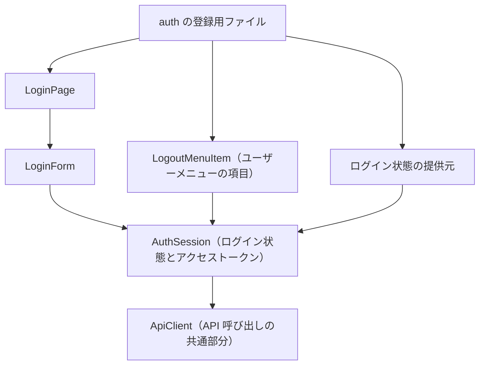

# Frontend Components — U2 認証（u2-authentication）

U2 が用意する画面の部品。U1 の骨組みの差し込み口に登録して組み込む。U1 のファイルは変えない。振る舞いは `functional-spec.md` の WF6〜WF9 と ST3、決まりは `rules.md` の BR8 に従う。

## 1. 部品の構成

テキスト表記: auth の登録用ファイルは、U1 の差し込み口へ、LoginPage（ログイン画面）、LogoutMenuItem（ユーザーメニューの項目）、ログイン状態の提供元を登録する。LoginPage は LoginForm を置く。LoginForm・LogoutMenuItem・提供元は、AuthSession を通してログイン状態を読み書きする。AuthSession は、ログイン・更新・ログアウトの API を ApiClient で呼ぶ。ApiClient は AuthSession からアクセストークンと更新の手段を受け取る（Domain Design の ADR-007。ApiClient は AuthSession を直接知らない）。

## 2. 部品ごとの受け持ち

| 部品 | 受け持ち | 入力（props） | 状態 | 決まり |
|---|---|---|---|---|
| auth の登録用ファイル | U1 の差し込み口への登録。ログイン画面（role=LOGIN、STANDALONE、PUBLIC）、ユーザーメニューのログアウト、ログイン状態の提供元 | なし | なし | BR8.1、BR8.7 |
| AuthSession | アクセストークン（メモリだけ）と CurrentUserView の保持。起動時の復元、ログイン・更新・ログアウト。ApiClient へトークンと更新の手段を登録する | なし | status（Restoring／LoggedIn／LoggedOut）、accessToken、currentUser | BR8.3、BR8.4、BR8.6 |
| ApiClient | アクセストークンの付与。401 / AUTHENTICATION_REQUIRED で1回だけ更新（同時の 401 は1回にまとめる）と送り直し。ログイン・トークンの更新・ログアウトの API の呼び出しは、この更新と送り直しの対象外（繰り返しを防ぐため明示的に外す）。更新の失敗で AuthSession に未ログインを知らせる。エラー応答を code で扱える形に変換 | 登録されたトークンの取得と更新の手段 | 更新中かどうか | BR8.5 |
| LoginPage | U1 の LoginLayout の中に LoginForm を置く | なし | なし | BR8.1 |
| LoginForm | メールアドレス・パスワードの入力欄とログインボタン。空の入力の検査、送信、失敗の表示 | なし | email、password、送信中、エラーの文言 | BR8.2、BR8.8 |
| LogoutMenuItem | ユーザーメニューの「ログアウト」。選ぶと AuthSession のログアウトを呼ぶ | なし | なし | BR8.6 |
| ログイン状態の提供元 | U1 へ loggedIn・admin・displayName（メールアドレス）を返す | なし | AuthSession の値 | BR8.7 |

## 3. 操作の流れ

| 操作 | 流れ |
|---|---|
| 画面を開く | AuthSession が更新を1回試みる（Restoring）→ 成功で LoggedIn、失敗で LoggedOut → U1 が振り分ける |
| ログインする | LoginForm が入力を検査 → AuthSession のログイン → 成功でホームへ、AUTHENTICATION_FAILED で1種類の文言を表示しパスワード欄を空にする |
| API を呼んで 401 を受ける | ApiClient が更新を1回（同時の 401 はまとめる）→ 成功で送り直し、失敗でログイン画面へ |
| ログアウトする | LogoutMenuItem → AuthSession のログアウト（API の結果によらず破棄）→ ログイン画面へ |

## 4. 入力の検証

| 項目 | 画面での検証 | 文言の例（日本語） |
|---|---|---|
| メールアドレス | 必須 | 「メールアドレスを入力してください」 |
| パスワード | 必須。長さは検査しない（BR2.2） | 「パスワードを入力してください」 |
| ログインの失敗（サーバー） | AUTHENTICATION_FAILED は理由によらず1種類 | 「メールアドレスまたはパスワードが正しくありません」 |

文言はすべて文言の鍵で扱い、日本語と英語をそろえる（U1 の決まり 6.2）。

## 5. API とのつなぎ目

| API | 用途 | 成功 | 主なエラー |
|---|---|---|---|
| ログイン | メールアドレスとパスワードでログイン | アクセストークン・有効期限・CurrentUserView、Cookie でリフレッシュトークン | 400 VALIDATION_FAILED、401 AUTHENTICATION_FAILED |
| トークンの更新 | Cookie のリフレッシュトークンで更新 | 同上（新しいもの） | 401 REFRESH_FAILED |
| ログアウト | Cookie のリフレッシュトークンを無効化 | 内容なし | なし（常に成功） |

API の具体的な形（パス・項目名）は U2 の Contract Design で決める。

## 6. アクセシビリティ

- 部品ごとにアクセシビリティ検査を1件入れる（NFR8）。
- 入力欄にはラベルを付け、エラーの文言は入力欄と関連付けて読み上げられるようにする。
- ログインの失敗の文言は、表示されたことが支援技術に伝わるようにする。
- パスワードの入力欄は、ブラウザのパスワード管理と連携できる属性にする。
