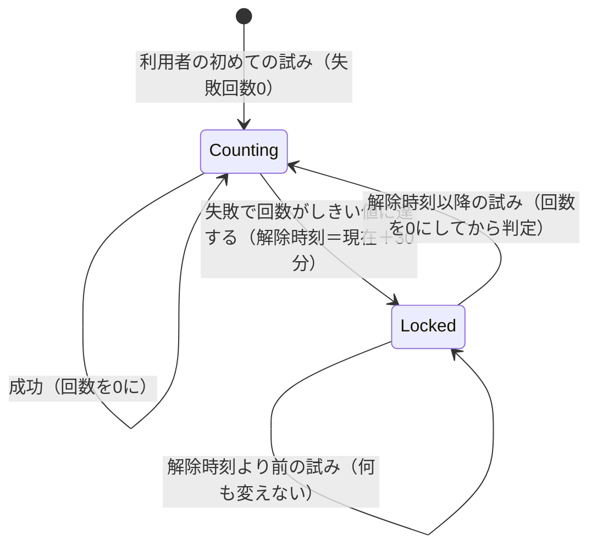
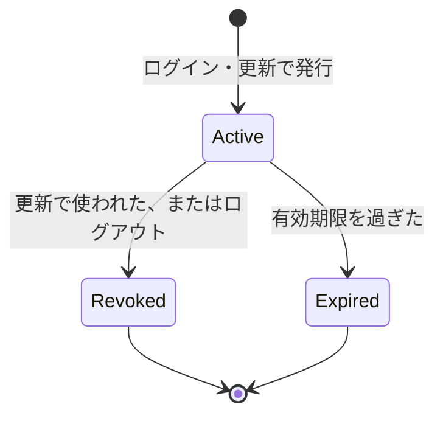
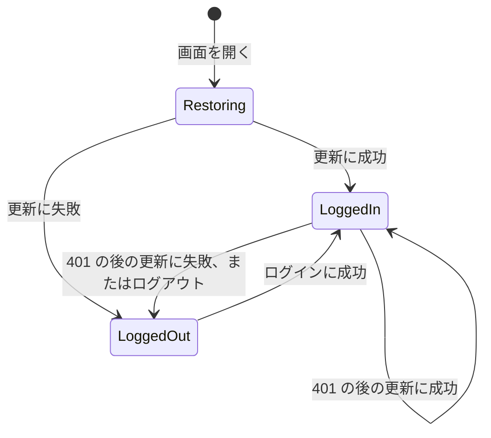
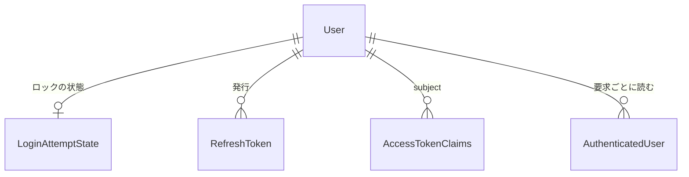

# Functional Specification — U2 認証（u2-authentication）

本書は U2 の振る舞い（処理の流れと状態の移り変わり）の正本である。データの形は `entities.md`、判断の決まりは `rules.md` が正本で、本書の関係図と決まりの一覧はそれらから導いたものである。

対象の要件: FR2.1、FR2.4、FR3.1〜FR3.4、FR4.1〜FR4.5、FR5.1〜FR5.3、FR6.1、FR6.2、FR7.1〜FR7.5（`aidlc/spaces/default/intents/260922-auth-audit-base/inception/units-generation/unit-of-work-story-map.md` の U2）。

## 1. 処理の流れ（バックエンド）

### WF1 初期管理者の自動作成（起動時）

1. 内部DBの準備が済んだ後に行う。
2. 初期管理者の設定（メールアドレス・パスワード）を読む。
3. 設定を検査する。メールアドレスかパスワードが無い、メールアドレスの形式が正しくない、パスワードが12文字未満のいずれかなら、作らずに WARN を出して終える。警告には、足りない・正しくない項目と、設定を直して再起動すると作成されることを載せる。パスワードの値は載せない（BR1.3、BR1.4）。
4. メールアドレスを trim・小文字化する（BR2.1）。
5. その利用者が既にいれば、何もせずに終える（BR1.2）。
6. いなければ、パスワードをハッシュにして、adminFlag=true の利用者を作る（BR1.1、BR1.5）。作成したことを INFO で出す（メールアドレスは載せてよい、パスワードは載せない）。

### WF2 ログイン

1. メールアドレスとパスワードを受け取る。どちらかが空なら 400 / `VALIDATION_FAILED`（BR2.2）。
2. メールアドレスを trim・小文字化する（BR2.1）。
3. 利用者を探す。
   - いない → ダミーの照合を行い（BR2.5）、理由 USER_NOT_FOUND で失敗（手順 7）。ロックの状態は作らない（BR3.9）。
4. その利用者のロックの状態を、同じ利用者の他の試みと重ならないように読む（BR3.8）。
   - 解除時刻を過ぎていれば、ロックを解き、失敗回数を0に戻す（BR3.4）。
   - まだロック中なら、ダミーの照合を行い（BR2.5）、状態を変えずに理由 ACCOUNT_LOCKED で失敗（BR3.3、手順 7）。
5. パスワードを照合する。
   - 一致しない → 失敗回数を1増やし（BR3.1）、しきい値に達したらロックする（BR3.2）。理由 PASSWORD_MISMATCH で失敗（手順 7）。
6. 一致した → 失敗回数を0に戻す（BR3.6）。アクセストークンを発行し（BR4.1）、リフレッシュトークンを発行して保存する（BR5.1、BR5.7）。LOGIN_SUCCEEDED を知らせる（BR2.6、BR7.1）。応答でアクセストークンと有効期限、CurrentUserView を返し、Cookie でリフレッシュトークンを渡す（BR2.3、BR5.2）。
7. 失敗のときは、LOGIN_FAILED を理由つきで知らせ（BR2.6、BR7.1）、理由によらず同じ 401 / `AUTHENTICATION_FAILED` を返す（BR2.4）。

### WF3 認証が必要な API の要求

1. Authorization ヘッダーからアクセストークンを取り出す。無い・形式が正しくなければ 401 / `AUTHENTICATION_REQUIRED`（BR4.4）。
2. 決めた署名方式と鍵で署名を検証する。方式が none・別の方式・署名の不一致なら 401（BR4.3）。
3. 有効期限を確かめる。現在時刻が有効期限以降なら 401（BR4.2）。
4. 利用者IDで内部DBから利用者を読む。いなければ 401（BR4.5）。
5. AuthenticatedUser（userId・email・admin は DB の値）を作り、要求の処理へ渡す（BR4.5）。管理者かどうかの判定は U3 が行う。

### WF4 トークンの更新

1. Cookie からリフレッシュトークンを受け取る。無ければ 401 / `REFRESH_FAILED` と Cookie の削除（BR5.5）。
2. 値のハッシュで保存された行を探し、有効か確かめる（BR5.3）。無効・期限切れ・存在しない・使用済みなら、401 / `REFRESH_FAILED` と Cookie の削除。ほかのトークンは無効にしない（BR5.5）。
3. その行を「まだ無効でないこと」を条件に無効にする。条件が合わなかった（同時の更新に負けた）ときは手順 2 の失敗と同じ（BR5.6）。
4. 新しいリフレッシュトークンを、作り直した時刻から有効期限を数えて作る（BR5.4）。
5. 利用者を内部DBから読み、新しいアクセストークンと CurrentUserView を作る。
6. 応答でアクセストークン・有効期限・CurrentUserView を返し、Cookie で新しいリフレッシュトークンを渡す（BR5.2、BR5.4）。

### WF5 ログアウト

1. Cookie からリフレッシュトークンを受け取る。
2. 有効なら、そのトークンだけを無効にし（BR6.1、BR6.2）、LOGGED_OUT を知らせる（BR7.1）。
3. 無い・無効でも処理を続ける。
4. Cookie を消す指示とともに、成功（内容なし）を返す（BR6.1）。
5. 発行済みのアクセストークンは失効させない（BR4.6）。

## 2. 処理の流れ（画面）

### WF6 画面の起動とログイン状態の復元

1. U1 の骨組みが U2 の登録用ファイルを読み込む。U2 は、ログイン画面（BR8.1）、ログイン状態の提供元とユーザーメニューのログアウト（BR8.7）を登録する。
2. トークンの更新を1回試みる（BR8.4）。
   - 成功 → アクセストークンと CurrentUserView をメモリに持ち、ログイン中にする（BR8.3）。
   - 失敗 → 未ログインにする。
3. 結果が出てから、U1 の骨組みが画面を振り分ける。

### WF7 ログイン画面の操作

1. 利用者がメールアドレスとパスワードを入力し、ログインボタンを押す。
2. どちらかが空なら送らず、入力欄の近くに知らせる（BR8.2）。
3. ログインの API を呼ぶ。
   - 成功 → アクセストークンと CurrentUserView をメモリに持ち、ホームへ移る（BR8.3、BR8.8）。
   - `AUTHENTICATION_FAILED` → 1種類の失敗の文言を表示する（BR8.2）。パスワードの入力欄を空にする。
   - それ以外のエラー（通信エラーなど） → 一般的なエラーの文言を表示する。

### WF8 API 呼び出しの共通部分

1. 要求にアクセストークンを付けて送る。
2. 401 / `AUTHENTICATION_REQUIRED` を受けたら、トークンの更新を行う。同じタブで同時に複数の要求が 401 を受けても、更新は1回にまとめる（BR8.5）。
3. 更新に成功したら、元の要求を1回だけ送り直す。送り直しでまた 401 なら、ログイン状態を消してログイン画面へ移る。
4. 更新に失敗したら、ログイン状態を消してログイン画面へ移る（BR8.5）。
5. エラー応答は `code` で分岐する（U1 の frontend-components.md）。

### WF9 ログアウトの操作

1. 利用者がユーザーメニューのログアウトを選ぶ。
2. ログアウトの API を呼ぶ。
3. 結果によらず、アクセストークンとログイン状態を消し、ログイン画面へ移る（BR8.6）。

## 3. 状態の移り変わり

### ST1 ログイン試行の状態（LoginAttemptState）

テキスト表記: 利用者ごとの状態は「数えている（Counting）」と「ロック中（Locked）」の2つ。Counting で失敗すると回数が1増え、しきい値に達すると Locked になる。成功すると回数は0に戻る。Locked の間の試みは状態を変えない。解除時刻以降に試みると、回数を0にして Counting に戻ってから、その試みを判定する。経過時間だけで回数が戻ることはない（BR3.5）。

### ST2 リフレッシュトークン（RefreshToken）

テキスト表記: 発行されたリフレッシュトークンは有効（Active）。更新で使われるかログアウトすると無効（Revoked）、有効期限を過ぎると期限切れ（Expired）になる。Revoked と Expired からは戻らない。Expired は状態として書き込むのではなく、時刻との比較で判断する。

### ST3 画面のログイン状態

テキスト表記: 画面を開くと、まずログイン状態を戻そうとする（Restoring）。更新に成功すればログイン中（LoggedIn）、失敗すれば未ログイン（LoggedOut）。LoggedOut からはログインの成功で LoggedIn になる。LoggedIn で 401 を受けたときは更新し、成功すれば LoggedIn のまま、失敗すれば LoggedOut になる。ログアウトでも LoggedOut になる。

## 4. 関係図（entities.md から導いたもの）

テキスト表記: 1人の利用者は、ロックの状態を0件か1件、リフレッシュトークンを0件以上持つ。アクセストークンの中身と、要求ごとに作る AuthenticatedUser は、利用者IDで利用者を指す。CurrentUserView と AuthenticationEvent は保存せず、ほかと関係を持たない。

## 5. 決まりの一覧（rules.md から導いたもの）

| 群 | 決まり | 対応する流れ |
|---|---|---|
| BR1 初期管理者の自動作成 | BR1.1〜BR1.5 | WF1 |
| BR2 ログイン | BR2.1〜BR2.6 | WF2 |
| BR3 アカウントロック | BR3.1〜BR3.9 | WF2、ST1 |
| BR4 アクセストークン | BR4.1〜BR4.6 | WF2、WF3、WF4 |
| BR5 リフレッシュトークンと更新 | BR5.1〜BR5.8 | WF2、WF4、ST2 |
| BR6 ログアウト | BR6.1、BR6.2 | WF5 |
| BR7 出来事の通知 | BR7.1〜BR7.3 | WF2、WF5 |
| BR8 画面 | BR8.1〜BR8.8 | WF6〜WF9、ST3 |
| BR9 問題の種類 | BR9.1 | WF2〜WF4 |

## 6. 例外と境界の場合

| 場合 | 振る舞い | 決まり |
|---|---|---|
| 失敗回数3回で4回目の失敗 | ロックされない（回数4） | BR3.2 |
| 失敗回数4回で5回目の失敗 | ロックされる | BR3.2 |
| 失敗回数4回で成功し、その後1回失敗 | ロックされない（回数1） | BR3.6 |
| ロック中に正しいパスワード | 拒否。状態は変わらない | BR3.3 |
| ロックから30分ちょうどに正しいパスワード | ログインできる（回数0から判定） | BR3.4 |
| ロックから30分後に誤ったパスワード | ロックは解け、回数は1になる | BR3.4、BR3.1 |
| 存在しない・誤り・ロック中の3通り | 応答の状態コード・内容が同じ | BR2.4 |
| アクセストークンの発行から4分59秒 | 受け付ける | BR4.2 |
| アクセストークンの発行から5分ちょうど | 401 | BR4.2 |
| 署名方式を none にしたアクセストークン | 401 | BR4.3 |
| アクセストークンの利用者が DB にいない | 401 | BR4.5 |
| リフレッシュトークンの発行から23時間59分59秒 | 更新できる | BR5.3 |
| リフレッシュトークンの発行から24時間ちょうど | 401 / REFRESH_FAILED | BR5.3 |
| 1回使ったリフレッシュトークンで再度更新 | 401。ほかのトークンは無効にしない | BR5.5 |
| 同じリフレッシュトークンで同時に2回更新 | 1つだけ成功、もう1つは 401 | BR5.6 |
| ログアウト直後、期限内のアクセストークン | 受け付ける | BR4.6 |
| Cookie が無い状態でログアウト | 成功を返す | BR6.1 |
| 初期管理者のパスワードが11文字 | 作らず、理由と直し方を WARN。起動は続く | BR1.3 |
| 初期管理者のメールアドレスが大文字を含む | 小文字にそろえて作る。ログインも大文字・小文字を区別しない | BR2.1 |
| ログインで空のパスワード | 画面は送らない。API を直接呼べば 400 / VALIDATION_FAILED | BR2.2、BR8.2 |
| 出来事の受け取り側（U4）で失敗 | ログイン・ログアウトの応答は変わらない | BR7.3 |

## 7. ほかの単位とのつなぎ目

| 相手 | つなぎ目 | 形を決める場所 |
|---|---|---|
| U1 | ログイン画面・ログイン状態の提供元・ユーザーメニューの項目を、U1 の差し込み口に登録する | U1 の Contract Design（差し込み口）、U2 の Contract Design（登録の中身） |
| U1 | 想定内のエラーを U1 の共通の業務エラーの型で起こし、問題の種類を定義する（BR9.1） | U1 の Contract Design |
| U1 | トレースIDの取得（出来事に載せる） | U1 functional-spec.md 6.1 |
| U3 | AuthenticatedUser（利用者ID・メールアドレス・管理者か）を要求ごとに渡す。U3 はこれで 401／403 を判定する | U2 の Contract Design |
| U3（画面） | API 呼び出しの共通部分（アクセストークンの付与・401 の更新と送り直し）とログイン状態 | U2 の Contract Design |
| U4 | AuthenticationEvent（LOGIN_SUCCEEDED・LOGIN_FAILED・LOGGED_OUT）を知らせる。受け取りは同じスレッド | U2 の Contract Design |
