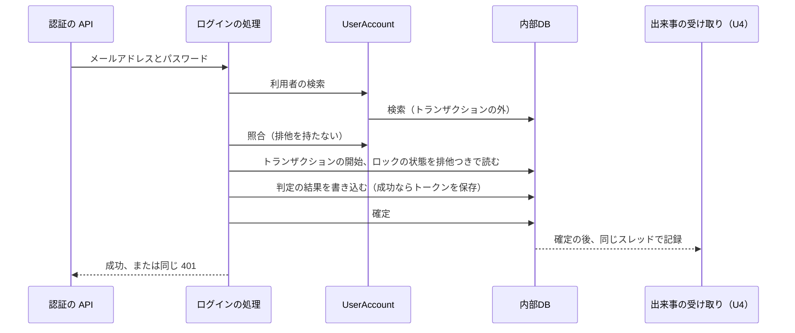

# Logical Components — U2 認証（u2-authentication）

U2 の NFR の設計（`performance-design.md`・`security-design.md`・`scalability-design.md`・`reliability-design.md`・`observability-design.md`）が、どの部品に当たるかをまとめた一覧。要件は `performance-requirements.md`・`security-requirements.md`・`scalability-requirements.md`・`reliability-requirements.md`・`observability-requirements.md`、技術は U2 の `tech-stack-decisions.md`、処理の流れは U2 の `functional-spec.md` に従う。`contract-summary.md` は、本ワークフローで Contract Design を行わないため無い。U2 は U1 の部品（U1 の `nfr-design/logical-components.md`）の上に載る。

## 1. 部品の一覧（バックエンド）

| 部品 | パッケージと層 | 受け持つ NFR の設計 |
|---|---|---|
| 認証の API（ログイン・更新・ログアウト） | `auth.web` | パスと Cookie、Origin の確認の呼び出し、同じ失敗の応答 |
| Origin の確認 | `auth.web` | 更新・ログアウトの前に自分の配信元と比べ、403 / `ORIGIN_NOT_ALLOWED` |
| ログインの処理 | `auth.service` | 検索 → 照合 → 短いトランザクションでの排他つきの判定（確定回答 Q1）、出来事の通知 |
| ロックの判定 | `auth.domain` | DB を使わない純粋な関数（性質ベースのテストの対象） |
| トークンの更新・ログアウトの処理 | `auth.service` | 条件付きの無効化、新しい行の保存 |
| アクセストークンの発行と検証 | `auth.service`（Spring Security の JWT の仕組みを使う） | HS256 だけ、時刻のずれ 0、鍵の長さの確認 |
| リフレッシュトークンの生成とハッシュ | `auth.domain` | SecureRandom、SHA-256 |
| ロックの状態・リフレッシュトークンの保存 | `auth.repository` | 行の排他、ダミーの記録の選び方（待たない指定）、条件付きの更新 |
| 使い終わったトークンの削除 | `auth.service`（定期実行） | 1日1回、件数ごとに分けて削除 |
| U1 の連鎖に足す決まり | `auth` の設定 | 認証なしのパス、トークンの検証、AuthenticatedUser への変換（利用者を DB から読む） |
| U2 の問題の種類 | `auth` | `AUTHENTICATION_FAILED`・`AUTHENTICATION_REQUIRED`・`REFRESH_FAILED`・`ORIGIN_NOT_ALLOWED`（日英） |
| 利用者と照合（UserAccount） | `user.service`・`user.domain`・`user.repository` | bcrypt、72 バイトの確認、ダミーの照合、ハッシュを外に出さない |
| 初期管理者の作成 | `user.service`（起動時の処理） | 重複しない、設定が無い・不正なら WARN |
| 設定のまとまり | `auth`・`user` の設定 | 起動時の検証、既定値、秘密情報の伏せ字 |

## 2. 部品の一覧（画面）

| 部品 | 受け持つ NFR の設計 |
|---|---|
| トークンの保持（AuthUi） | アクセストークンはメモリだけ。ログアウト・更新の失敗で破棄 |
| ログイン画面（AuthUi） | 失敗の文言は1種類、日英、アクセシビリティの検査 |
| ログイン状態の提供元（AuthUi） | 画面を開いたときの更新1回、U1 の差し込み口への登録 |
| API 呼び出しの共通部分（ApiClient） | 401 での更新を1回にまとめて送り直す。認証の API は対象外 |

## 3. ログインの処理の順番と、資源を持つ時間

テキスト表記: ログインの処理は、利用者の検索（トランザクションの外）と照合（排他なし）を先に行い、その後の短いトランザクションでロックの状態を排他つきで読み、判定の結果を書き込んで確定する。確定の後、同じスレッドで U4 が監査ログを記録する。DB の接続と排他を持つのは、短いトランザクションの間だけ。

## 4. 故障の範囲と共有する資源

| 故障・資源 | 影響 | 閉じ込め方 |
|---|---|---|
| 内部DBの接続（U1 のプールを共有） | ログインが持つのは数ミリ秒。同時のログインで使い切らない | 確定回答 Q1 |
| 同じ利用者の行の排他 | その利用者の試みだけが数ミリ秒待つ | 行ごとの排他、待ちの上限 3 秒 |
| ダミーの記録の行 | 存在しないメールアドレスの試みどうしも待たない | 複数行と、待たない指定 |
| U4 の記録の失敗 | U2 の応答に影響しない | 確定の後、別のトランザクション |
| 署名鍵 | 無ければ起動しない | 起動時の確認 |

## 5. Infrastructure Design へ渡すもの

| 項目 | 内容 |
|---|---|
| 環境変数 | 署名鍵（Base64、復元後 32 バイト以上）、初期管理者のメールアドレスとパスワード。`.env.example` には名前だけ |
| 任意の設定 | ロックのしきい値・時間、トークンの有効期限、cost、削除までの日数と時刻 |
| 複数台にする場合 | 全台に同じ署名鍵を渡す |
| HTTPS | 配備先で TLS を決めるとき、Cookie の Secure はそのまま使える |
