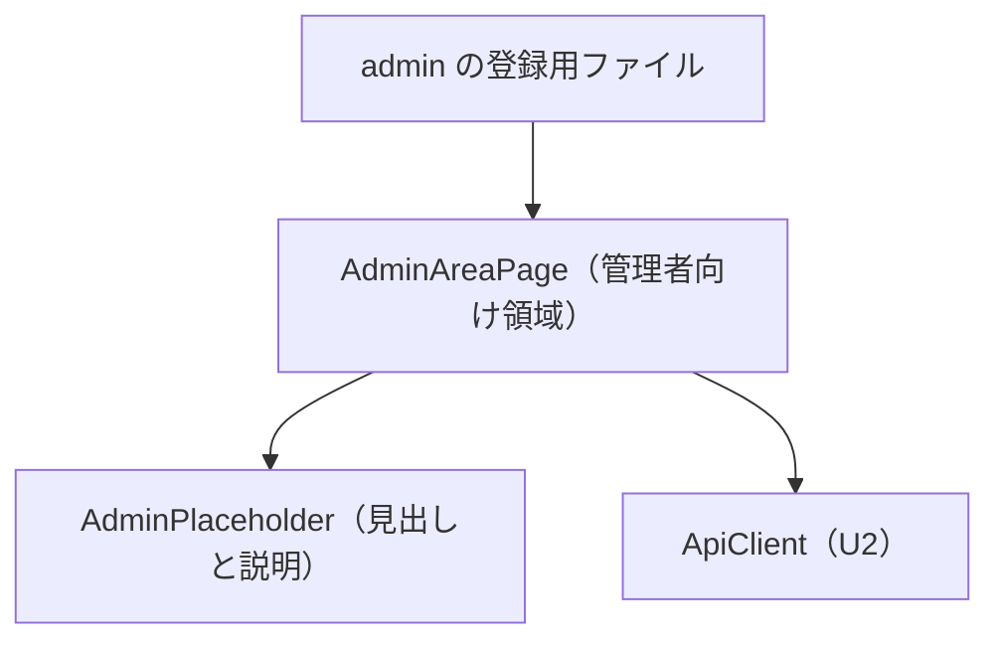

# Frontend Components — U3 管理画面のアクセス制御（u3-access-control）

U3 が用意する画面の部品。U1 の骨組みの差し込み口に登録して組み込む。U1 のファイルは変えない。振る舞いは `functional-spec.md` の WF3・WF4 と ST1、決まりは `rules.md` の BR5 に従う。

## 1. 部品の構成

テキスト表記: admin の登録用ファイルは、U1 の差し込み口へ、AdminAreaPage（access=ADMIN、アプリシェルの中）と、サイドバーの「管理」（visibleWhen=ADMIN、ホームの後）を登録する。AdminAreaPage は表示のたびに U2 の ApiClient で確認用 API を呼び、成功したら AdminPlaceholder を表示する。

## 2. 部品ごとの受け持ち

| 部品 | 受け持ち | 入力（props） | 状態 | 決まり |
|---|---|---|---|---|
| admin の登録用ファイル | 管理者向け領域の画面とサイドバーの「管理」の登録 | なし | なし | BR5.1 |
| AdminAreaPage | 表示のたびの確認用 API の呼び出しと、結果による表示の切り替え（確認中は中身を出さない。403 は見つからない画面） | なし | status（Checking／Shown／NotFound／Error） | BR5.2 |
| AdminPlaceholder | 見出し「管理」と、今後の管理機能がここに加わる旨の説明 | なし | なし | BR5.3 |

「ページが見つかりません」の表示は、U1 の NotFoundPage を使う。

## 3. 操作の流れ

| 操作 | 流れ |
|---|---|
| 管理者が「管理」を選ぶ | AdminAreaPage が確認用 API を呼ぶ → 成功 → AdminPlaceholder を表示 |
| 管理者でない利用者が URL を直接開く | U1 の振り分けで「ページが見つかりません」（AdminAreaPage は表示されない） |
| 管理者フラグが外された直後に開く | 画面はまだ管理者と表示していても、確認用 API が 403 → 「ページが見つかりません」 |

## 4. 入力の検証

U3 の画面には、利用者が入力する項目が無い。

## 5. API とのつなぎ目

| API | 用途 | 成功 | 主なエラー |
|---|---|---|---|
| 確認用 API（/api/admin/ の下） | 管理者向け領域の表示可否の確認 | 内容なし | 401 AUTHENTICATION_REQUIRED（ApiClient が扱う）、403 ACCESS_DENIED |

API の具体的な形（パス）は U3 の Contract Design で決める。

## 6. アクセシビリティと文言

- 部品ごとにアクセシビリティ検査を1件入れる（NFR8）。
- 確認中であることを支援技術に伝える。
- 文言（「管理」、見出し、説明）は文言の鍵で扱い、日本語と英語をそろえる（U1 の決まり 6.2）。
