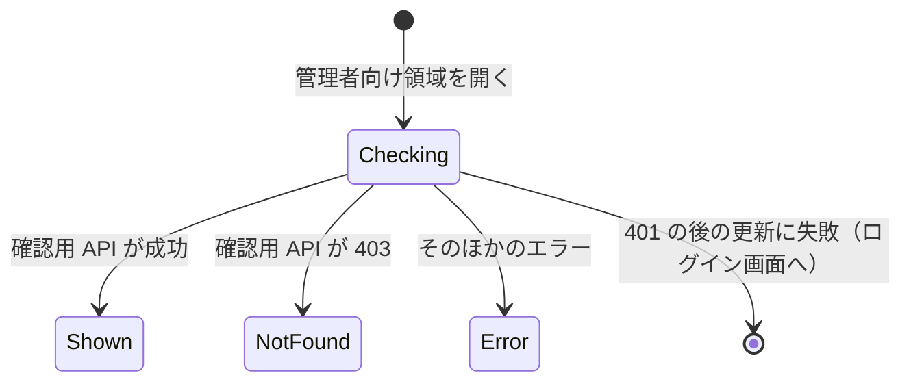

# Functional Specification — U3 管理画面のアクセス制御（u3-access-control）

本書は U3 の振る舞い（処理の流れと状態の移り変わり）の正本である。データの形は `entities.md`、判断の決まりは `rules.md` が正本で、本書の関係図と決まりの一覧はそれらから導いたものである。

対象の要件: FR2.2、FR8.1、FR8.2（`aidlc/spaces/default/intents/260922-auth-audit-base/inception/units-generation/unit-of-work-story-map.md` の U3）。あわせて、アクセス拒否の出来事の通知（記録は U4 の FR9.1）を扱う。

## 1. 処理の流れ（バックエンド）

### WF1 要求ごとのアクセスの判定

1. 要求のパスが /api/ の外（画面の配信）なら、判定せずに通す（BR1.5）。
2. アクセスの決まりを ADMIN、PUBLIC、AUTHENTICATED の順に当てはめ、最初に当たった利用条件を使う（BR1.1〜BR1.4）。
3. PUBLIC なら通す。
4. AUTHENTICATED なら、U2 の判定（U2 の決まり 4.4・4.5）で有効な利用者がいれば通す。いなければ 401 / `AUTHENTICATION_REQUIRED`。出来事は知らせない（BR3.3）。
5. ADMIN なら、次の順に判定する。API が存在するかどうかは、この判定の後に調べる（BR2.5）。
   - 有効な利用者がいない → 401 / `AUTHENTICATION_REQUIRED`（BR2.1）。U2 が判定した理由が TOKEN_EXPIRED でなければ、理由 NOT_AUTHENTICATED の出来事を知らせる（BR3.2）。
   - 利用者はいるが、管理者でない（内部DBの値で判断、BR2.4） → 403 / `ACCESS_DENIED`（BR2.2）。理由 NOT_ADMIN の出来事を知らせる（BR3.1）。
   - 管理者 → 通す（BR2.3）。
6. 出来事の受け取り側で失敗が起きても、応答は変えない（BR3.5）。

### WF2 確認用 API

1. 管理者向け領域が /api/admin/ の下の確認用 API を呼ぶ。
2. WF1 の判定を通れば、成功（内容なし）を返す（BR4.1）。

## 2. 処理の流れ（画面）

### WF3 画面の起動と登録

1. U1 の骨組みが U3 の登録用ファイルを読み込む。
2. U3 は、管理者向け領域の画面（access=ADMIN、アプリシェルの中）と、サイドバーの「管理」（visibleWhen=ADMIN、ホームの後）を登録する（BR5.1）。
3. U1 の骨組みは、ログイン状態の提供元（U2）が返す admin で「管理」の表示を切り替える。これは表示の切り替えにすぎない（BR5.4）。

### WF4 管理者向け領域の表示

1. 利用者が「管理」を選ぶ、または管理者向け領域の URL を開く。
2. 画面側の振り分け（U1 の決まり 7.4・7.5）で、未ログインならログイン画面へ、管理者でなければ「ページが見つかりません」になる。
3. 管理者と判断された場合、確認用 API を呼ぶ。確認が終わるまで中身は表示しない（BR5.2）。
   - 成功 → 見出しと説明を表示する（BR5.3）。
   - 403 → 「ページが見つかりません」を表示する（BR5.2）。
   - 401 → API 呼び出しの共通部分が更新と送り直しを行う。更新に失敗すればログイン画面へ（U2 の決まり 8.5）。
   - それ以外のエラー → 一般的なエラーの文言を表示する。

## 3. 状態の移り変わり

### ST1 管理者向け領域の表示

テキスト表記: 管理者向け領域を開くと確認中（Checking）になり、中身は表示しない。確認用 API が成功すれば表示（Shown）、403 なら「ページが見つかりません」（NotFound）、そのほかのエラーならエラーの表示（Error）になる。401 の後の更新に失敗した場合は、ログイン画面へ移る。表示するたびに確認をやり直す。

## 4. 関係図（entities.md から導いたもの）

U3 のエンティティ（AccessRule、AccessDeniedEvent）は、互いに、またほかのエンティティと関係を持たない。AccessDeniedEvent の userId は U2 の User の利用者IDの値を写したもので、参照ではない。

## 5. 決まりの一覧（rules.md から導いたもの）

| 群 | 決まり | 対応する流れ |
|---|---|---|
| BR1 アクセスの決まり | BR1.1〜BR1.5 | WF1 |
| BR2 判定 | BR2.1〜BR2.6 | WF1 |
| BR3 アクセス拒否の出来事 | BR3.1〜BR3.5 | WF1 |
| BR4 確認用 API | BR4.1 | WF2 |
| BR5 画面 | BR5.1〜BR5.4 | WF3、WF4、ST1 |
| BR6 問題の種類 | BR6.1 | WF1 |

## 6. 例外と境界の場合

| 場合 | 振る舞い | 決まり |
|---|---|---|
| 管理者でない利用者が確認用 API を呼ぶ | 403 / ACCESS_DENIED、NOT_ADMIN の出来事 | BR2.2、BR3.1 |
| 管理者が確認用 API を呼ぶ | 成功 | BR2.3、BR4.1 |
| トークン無しで確認用 API を呼ぶ | 401、NOT_AUTHENTICATED（TOKEN_MISSING）の出来事 | BR2.1、BR3.2 |
| 有効期限切れのトークンで確認用 API を呼ぶ | 401、出来事は知らせない | BR3.2 |
| 署名を改ざんしたトークンで確認用 API を呼ぶ | 401、NOT_AUTHENTICATED（TOKEN_INVALID）の出来事 | BR3.2 |
| 管理者でない利用者が /api/admin/ の下の存在しない API を呼ぶ | 403（存在しないことを明かさない） | BR2.5 |
| 管理者が /api/admin/ の下の存在しない API を呼ぶ | 404 / NOT_FOUND | BR2.5 |
| トークン無しで管理者のみ以外の API を呼ぶ | 401、出来事は知らせない | BR3.3 |
| 画面を介さずに管理者でない利用者が管理者のみの API を呼ぶ | 403（画面の表示に関係なく判定） | BR2.6 |
| 管理者フラグが外された直後に管理者向け領域を開いたまま再表示 | 確認用 API が 403 → 「ページが見つかりません」 | BR5.2 |
| 出来事の受け取り側（U4）で失敗 | 401／403 の応答は変わらない | BR3.5 |

## 7. ほかの単位とのつなぎ目

| 相手 | つなぎ目 | 形を決める場所 |
|---|---|---|
| U1 | 管理者向け領域の画面とサイドバーの「管理」を、U1 の差し込み口に登録する | U1 の Contract Design（差し込み口）、U3 の Contract Design（登録の中身） |
| U1 | ACCESS_DENIED を U1 の共通の業務エラーの型で起こし、問題の種類を定義する（BR6.1） | U1 の Contract Design |
| U2 | 要求ごとの AuthenticatedUser と、401 の理由（TOKEN_MISSING・TOKEN_MALFORMED・TOKEN_INVALID・TOKEN_EXPIRED・USER_NOT_FOUND）を受け取る（U2 の決まり 4.4・4.5） | U2 の Contract Design |
| U2（画面） | API 呼び出しの共通部分と、ログイン状態の admin | U2 の Contract Design |
| U4 | AccessDeniedEvent を知らせる。受け取りは同じスレッド | U3 の Contract Design |
