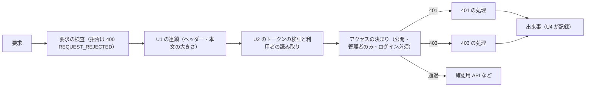

# Logical Components — U3 管理画面のアクセス制御（u3-access-control）

U3 の NFR の設計（`performance-design.md`・`security-design.md`・`scalability-design.md`・`reliability-design.md`・`observability-design.md`）が、どの部品に当たるかをまとめた一覧。要件は `performance-requirements.md`・`security-requirements.md`・`scalability-requirements.md`・`reliability-requirements.md`・`observability-requirements.md`、技術は U3 の `tech-stack-decisions.md`、処理の流れは U3 の `functional-spec.md` に従う。`contract-summary.md` は、本ワークフローで Contract Design を行わないため無い。U3 は U1・U2 の部品（各単位の `nfr-design/logical-components.md`）の上に載る。

## 1. 部品の一覧

| 部品 | パッケージと層 | 受け持つ NFR の設計 |
|---|---|---|
| アクセスの決まりを足す部品 | `access` の設定 | 管理者のみの2つのパスの型、API の既定の扱いを「ログイン必須」に切り替え |
| 401 の処理（認証の入口の処理） | `access.web` | 共通の形の 401、管理者のみのパスで期限切れ以外なら出来事 |
| 403 の処理（アクセス拒否の処理） | `access.web` | 共通の形の 403 / `ACCESS_DENIED`、出来事、WARN |
| 要求の検査の拒否の処理 | `access.web` | 共通の形の 400 / `REQUEST_REJECTED`、U1 のヘッダーを付ける、パスを出さない |
| 確認用 API | `access.web` | `GET /api/admin/check` → 204 |
| アクセス拒否の出来事 | `access.domain` | 監査ログの項目にそろえ、秘密情報を持たない |
| U3 の問題の種類 | `access` | `ACCESS_DENIED`・`REQUEST_REJECTED`（日英） |
| 管理者向け領域（画面、AdminArea） | 画面 | 確認中は中身を出さない、403 で見つからない画面、エラーで止まらない、日英、アクセシビリティ |

## 2. 要求の通り道

テキスト表記: 要求はまず要求の検査を通り、拒否されれば 400 / REQUEST_REJECTED になる。次に U1 の連鎖、U2 のトークンの検証を経て、アクセスの決まりで判定される。401 は 401 の処理、403 は 403 の処理が扱い、必要なら出来事を知らせて U4 が記録する。通過した要求は確認用 API などへ進む。

## 3. 故障の範囲と共有する資源

| 故障・資源 | 影響 | 閉じ込め方 |
|---|---|---|
| U4 の記録の失敗 | 401／403 の応答は変わらない | U4 の受け止め、U3 の二重の備え |
| 内部DBの遅れ | 拒否の応答が遅れる | U1 の時間の上限 |
| 確認用 API の失敗 | 管理者向け領域だけがエラーの文言 | 画面の部品の中で扱う |
| フィルターの連鎖（U1 と共有） | U3 は差し込み口で足すだけ | U1 の設定を書き換えない |

## 4. Infrastructure Design へ渡すもの

U3 に固有の環境変数・資源は無い。転送元のヘッダーを信頼するかどうかの設定（U1）が、出来事の接続元IP の取り方にも効く。
