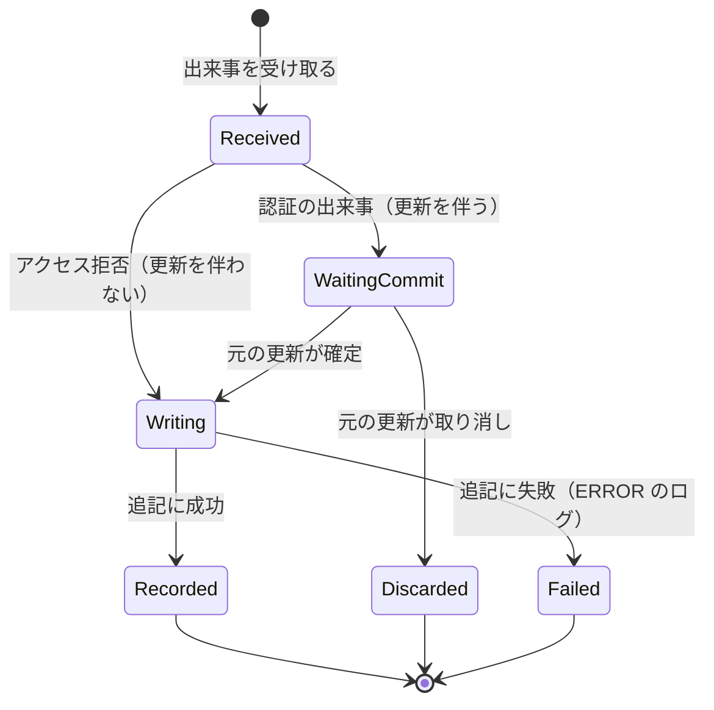

# Functional Specification — U4 監査ログ（u4-audit-log）

本書は U4 の振る舞い（処理の流れと状態の移り変わり）の正本である。データの形は `entities.md`、判断の決まりは `rules.md` が正本で、本書の関係図と決まりの一覧はそれらから導いたものである。

対象の要件: FR9.1〜FR9.5（`aidlc/spaces/default/intents/260922-auth-audit-base/inception/units-generation/unit-of-work-story-map.md` の U4）。U4 は画面を持たない。

## 1. 処理の流れ

### WF1 認証の出来事の記録（ログイン成功・ログイン失敗・ログアウト）

1. U2 がログイン・ログアウトの処理の中で出来事を知らせる。
2. U4 は出来事を受け取り、U2 の内部DBの更新（失敗回数・リフレッシュトークン）が確定するまで待つ（BR1.3）。
   - 更新が取り消された場合は、記録しないで終える（BR1.4）。
3. 更新が確定したら、同じスレッドで、別のトランザクションを始める（BR1.3）。
4. 出来事から監査イベントを作る。種類から結果を決め（BR1.2）、日時は出来事の日時とする（BR1.5）。メールアドレスと User-Agent は長さを超える分を切り詰める（BR2.1）。存在しないメールアドレスもそのまま記録する（BR1.6）。
5. 内部DBに追記する（BR4.1）。
6. 書き込みに失敗したら、WF3 へ。

### WF2 アクセス拒否の出来事の記録

1. U3 が 401／403 の処理の中で出来事を知らせる（U3 の決まり 3.6）。
2. U4 は出来事を受け取り、内部DBの更新を伴わないため、その場で（同じスレッドで、自分のトランザクションで）記録する（BR1.3）。
3. 監査イベントの作り方と追記は WF1 の手順 4・5 と同じ。
4. 書き込みに失敗したら、WF3 へ。

### WF3 書き込みの失敗

1. 書き込みの失敗を U4 の中で受け止める。出来事を知らせた側（U2・U3）へは伝えない（BR3.1）。
2. アプリのログに ERROR で1回出す。記録しようとした全項目（メールアドレスを含む）をキーと値で載せる。パスワード・トークンはもともと含まれない（BR3.1、BR2.3）。
3. 再試行はしない。元の操作の応答（ログイン・ログアウト・401／403）は変わらない（BR3.1）。

## 2. 状態の移り変わり

監査イベントは追記したら変わらないため、状態の移り変わりを持たない（BR4.1）。

出来事の扱いの流れ（WF1・WF2）を図にすると次のとおり。

テキスト表記: 出来事を受け取ると（Received）、認証の出来事は元の更新の確定を待ち（WaitingCommit）、アクセス拒否はすぐに書き込みへ進む（Writing）。確定すれば書き込みへ進み、取り消されれば記録しない（Discarded）。書き込みに成功すれば記録済み（Recorded）、失敗すればアプリのログに ERROR を出して終える（Failed）。

## 3. 関係図（entities.md から導いたもの）

U4 のエンティティは AuditEvent だけで、ほかのエンティティと関係を持たない。enteredEmail は利用者を参照しない文字列である（存在しないメールアドレスも記録するため）。

## 4. 決まりの一覧（rules.md から導いたもの）

| 群 | 決まり | 対応する流れ |
|---|---|---|
| BR1 受け取りと記録 | BR1.1〜BR1.6 | WF1、WF2 |
| BR2 記録の内容 | BR2.1〜BR2.4 | WF1、WF2 |
| BR3 書き込みの失敗 | BR3.1、BR3.2 | WF3 |
| BR4 保存 | BR4.1 | WF1、WF2 |

## 5. 例外と境界の場合

| 場合 | 振る舞い | 決まり |
|---|---|---|
| 存在しないメールアドレスでログインに失敗 | LOGIN_FAILED、failureReason USER_NOT_FOUND、入力されたメールアドレスで記録 | BR1.6 |
| ロック中のアカウントでログイン | LOGIN_FAILED、failureReason ACCOUNT_LOCKED | BR1.1 |
| 管理者でない利用者の 403 | ACCESS_DENIED、failureReason NOT_ADMIN、メールアドレスあり | BR1.1 |
| 有効期限切れのトークンでの管理 API の 401 | U3 が出来事を作らないため、記録されない | U3 の決まり 3.2 |
| 入力されたメールアドレスが 300 文字 | 先頭 254 文字で記録 | BR2.1 |
| User-Agent に改行や制御文字を含む | 加工せずに保存。アプリのログには JSON の値として出るため偽装されない | BR2.2 |
| ログインの失敗回数の更新がロールバックされた | 記録しない | BR1.4 |
| 監査イベントの書き込みで内部DBのエラー | ログインなどの応答は変わらない。ERROR のログに記録しようとした内容を出す | BR3.1 |
| 同じ要求のアプリのログと監査ログ | トレースIDが一致する | BR2.4 |

## 6. ほかの単位とのつなぎ目

| 相手 | つなぎ目 | 形を決める場所 |
|---|---|---|
| U2 | AuthenticationEvent を受け取る。U2 の更新の確定後に記録する | U2 の Contract Design（出来事の形）、U4 の Contract Design（受け取り方） |
| U3 | AdminAccessDeniedEvent を受け取り、その場で記録する | U3 の Contract Design（出来事の形）、U4 の Contract Design（受け取り方） |
| U1 | 内部DBへの接続、アプリのログ（JSON・トレースID） | U1 |
