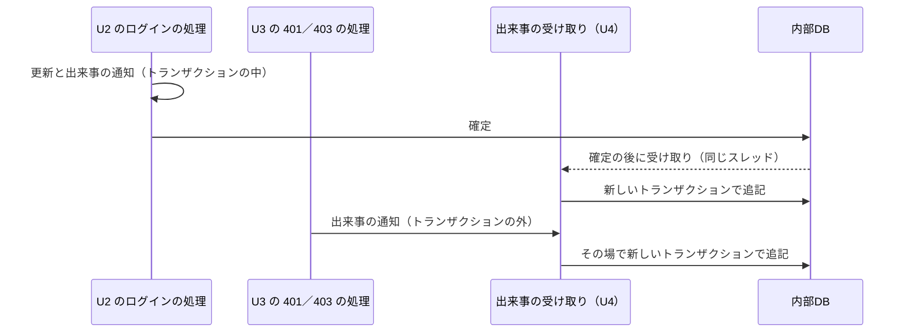

# Logical Components — U4 監査ログ（u4-audit-log）

U4 の NFR の設計（`performance-design.md`・`security-design.md`・`scalability-design.md`・`reliability-design.md`・`observability-design.md`）が、どの部品に当たるかをまとめた一覧。要件は `performance-requirements.md`・`security-requirements.md`・`scalability-requirements.md`・`reliability-requirements.md`・`observability-requirements.md`、技術は U4 の `tech-stack-decisions.md`、処理の流れは U4 の `functional-spec.md` に従う。`contract-summary.md` は、本ワークフローで Contract Design を行わないため無い。U4 は U1 の部品（U1 の `nfr-design/logical-components.md`）の上に載り、U2・U3 の出来事を受け取る。

## 1. 部品の一覧

| 部品 | パッケージと層 | 受け持つ NFR の設計 |
|---|---|---|
| 出来事の受け取り | `audit.service` | 確定の後とその場の2つの経路、同じスレッド、例外を必ず捕まえる |
| 記録の処理 | `audit.service` | 新しいトランザクションで追記1回、失敗は ERROR を1回 |
| 監査イベント | `audit.domain` | 項目の組み立て（アクセス拒否のときの要求のパスを含む。`security-design.md` 6章）、文字を分断しない切り詰め（性質ベースのテストの対象）、あとから変える手段を持たない |
| 監査イベントの保存 | `audit.repository` | 追記と読み取りだけ。更新・削除の操作を持たない |
| 監査イベントの表 | Flyway の SQL | 連番の主キー、日時の索引1つ |
| 構造の検査 | テスト（ArchUnit） | 更新・削除の操作と更新の問い合わせが無いこと |

## 2. 受け取りの経路

テキスト表記: U2 はトランザクションの中で出来事を知らせ、確定の後に U4 が同じスレッドで受け取り、新しいトランザクションで追記する。U3 はトランザクションの外で出来事を知らせ、U4 がその場で新しいトランザクションで追記する。どちらの経路でも、U4 の失敗は U4 の中で受け止める。

## 3. 故障の範囲と共有する資源

| 故障・資源 | 影響 | 閉じ込め方 |
|---|---|---|
| 追記の失敗・接続を借りる失敗 | その1件の記録が欠ける（ERROR のログに内容が残る） | U4 の中で捕まえ、呼び出し元の応答を変えない |
| 確定の後、書く前の停止 | その1件が失われる | 受け入れる（NFR3.7）、穏やかな停止で小さくする |
| コネクションプール（U1 と共有） | 確定の後の経路で一時的に2本 | 負荷の試験で待ちを確かめる（`performance-design.md` 3章） |
| H2 のファイル（U1〜U4 で共有） | 書き込みの順番待ち | 追記だけ、索引を増やさない、負荷の試験で名指しで測る |

## 4. Infrastructure Design へ渡すもの

| 項目 | 内容 |
|---|---|
| ボリューム | 監査ログは内部DB（`/app/data`）にあり、無期限に保存する。ボリュームは実行者だけが読み書きできる権限にする |
| 大きさ | 1年 約 180〜250MB の見積もり。ボリュームの空きを見る |
| バックアップ | U1 の手順（アプリを止めてファイルを複写）で監査ログも守られる |
