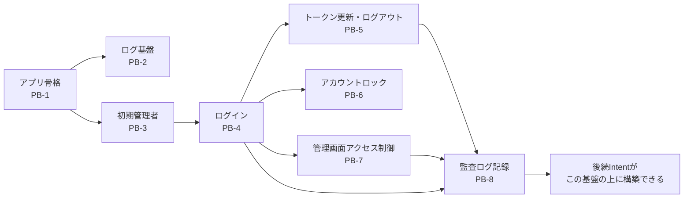

# Intent Backlog — auth-audit-foundation

本バックログは `scope-document.md` のスコープ（S1〜S10）を、実装の単位の候補（proto-Unit）に分けて優先度と順序を付けたものである。上流は `aidlc/spaces/default/intents/260922-auth-audit-base/ideation/intent-capture/intent-statement.md`。

## 優先度付けの方針

- 手法: MoSCoW
- 本Intentは、Q1で選んだ完成形にQ2〜Q5・Q10で確定した機能を加えたものをMVPとしたため、スコープ内の全項目を Must とする。Should／Could に当たる項目はない
- スコープ外の項目は Won't（今回は扱わない）とする

## バックログ

| ID | proto-Unit | 含むスコープ | MoSCoW | 依存先 | 根拠 |
|---|---|---|---|---|---|
| PB-1 | アプリ骨格 | S1, S2（画面の枠） | Must | なし | Q1, Q7 |
| PB-2 | 構造化ログ・分散トレース・外部エクスポート | S10 | Must | PB-1 | Q5, Q7 |
| PB-3 | 初期管理者の自動作成 | S3 | Must | PB-1 | Q2 |
| PB-4 | ログイン・トークン発行／検証 | S2（ログイン画面）, S4 | Must | PB-1, PB-3 | Q1, Q3 |
| PB-5 | トークン更新・ログアウト | S5, S6 | Must | PB-4 | Q3, Q10 |
| PB-6 | アカウントロック | S7 | Must | PB-4 | Q3 |
| PB-7 | 管理画面アクセス制御 | S8 | Must | PB-4 | intent-statement.md（Intent B） |
| PB-8 | 監査ログ記録 | S9 | Must | PB-4, PB-5, PB-7 | Q4 |

## Won't（今回は扱わない）

| ID | 項目 | 扱い | 根拠 |
|---|---|---|---|
| W-1 | ロール・グループ・権限設定 | Intent F | Q6 |
| W-2 | ユーザー登録・招待メール | Intent G | Q6 |
| W-3 | ユーザープリファレンス | Intent H | Q6 |
| W-4 | 対象DBへの接続 | Intent D/E | Q6 |
| W-5 | トークンの失効・強制ログアウト | 扱わない | Q3, Q10 |
| W-6 | 後続Intent向けの共通の監査記録の仕組み | 後続Intentで検討 | Q9 |

## 順序（依存関係順）

Q7で選んだ「依存関係順（アプリ骨格・ログ基盤 → 認証 → 監査ログ）」に従う。

1. PB-1 アプリ骨格
2. PB-2 構造化ログ・分散トレース・外部エクスポート
3. PB-3 初期管理者の自動作成
4. PB-4 ログイン・トークン発行／検証
5. PB-5 トークン更新・ログアウト、PB-6 アカウントロック、PB-7 管理画面アクセス制御（PB-4 の後であれば順不同）
6. PB-8 監査ログ記録

## 価値の流れ（Value Stream）

テキスト表記: アプリ骨格（PB-1）の上にログ基盤（PB-2）と初期管理者（PB-3）が乗り、初期管理者を使ってログイン（PB-4）が成立する。ログインの上にトークン更新・ログアウト（PB-5）、アカウントロック（PB-6）、管理画面アクセス制御（PB-7）が乗り、これらのイベントを監査ログ記録（PB-8）が記録する。これにより、後続Intentが本基盤の上に構築できる状態（intent-statement.md の成功基準）に至る。

## Assumptions & Open Questions

None.
