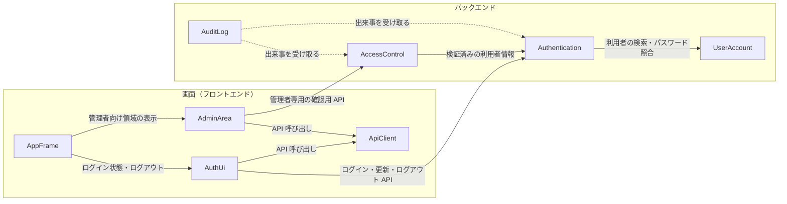

# Components — auth-audit-foundation

本書は、要件定義書 `aidlc/spaces/default/intents/260922-auth-audit-base/inception/requirements-analysis/requirements.md`（FR1〜FR10）を実現する部品（コンポーネント）の一覧である。部品の分け方は `domain-design-questions.md` の確定回答（DQ1〜DQ7）に、その判断理由は `decisions.md` の ADR に基づく。チームの進め方（`aidlc/spaces/default/intents/260922-auth-audit-base/inception/practices-discovery/team-practices.md`）の「機能ごとのパッケージ構成」「層の境界」に沿う。

どの単位でデプロイするかは本書では決めない（次の Units Generation で決める）。

## 部品の一覧（機械可読）

```yaml
components:
  # ---------------- バックエンド ----------------
  - name: UserAccount
    summary: 利用者（メールアドレス・パスワードのハッシュ・管理者フラグ）を管理し、初期管理者を自動作成する
    behaviour: >
      利用者をメールアドレスで一意に識別する。パスワードは一方向のハッシュでのみ保持し、ハッシュ値を部品の外へ渡さない。
      パスワードの照合（入力されたパスワードが一致するか）はこの部品が行い、結果だけを返す。
      初回起動時、設定で指定したメールアドレスの利用者が無ければ、管理者フラグ付きで作成する。設定が無い、または
      パスワードが12文字未満の場合は作成せずに警告をログに出し、起動は続ける。パスワードの値はログに出さない。
    responsibilities:
      - 利用者の保持と、メールアドレスによる検索
      - パスワードの照合（ハッシュ値を外に出さない）
      - 管理者フラグの保持
      - 初期管理者の自動作成（重複作成しない）
    depends_on: []
    dependents:
      - component: Authentication
        interaction: ログイン時の利用者の検索とパスワードの照合、トークンに載せる管理者フラグの取得
    external_dependencies:
      - name: H2（内部DB）
        kind: database
        purpose: 利用者の保存
    entities:
      - name: User
        identifier: userId
        attributes: [userId, email, passwordHash, adminFlag, createdAt]

  - name: Authentication
    summary: ログイン、トークンの発行・検証・更新、ログアウト、アカウントロックを受け持つ
    behaviour: >
      メールアドレスとパスワードでログインし、成功時にアクセストークンを応答で、リフレッシュトークンを
      HttpOnly・Secure・SameSite の Cookie で渡す。アクセストークンの有効期限は既定5分、リフレッシュトークンは既定24時間。
      リフレッシュトークンは使うたびに作り直し、使ったものは無効にする。ログアウトではリフレッシュトークンを無効にする
      （アクセストークンは有効期限まで有効）。連続失敗が既定5回に達したアカウントを既定30分ロックし、成功で失敗回数を0に戻す。
      存在しないメールアドレス・パスワード誤り・ロック中の応答は同じにする。ログイン成功・ログイン失敗・ログアウトの
      出来事をアプリ内に知らせる（監査ログを直接呼ばない）。
    responsibilities:
      - ログインと失敗時の応答の統一
      - アクセストークンの発行と検証
      - リフレッシュトークンの発行・作り直し・無効化
      - ログアウト
      - ログインの失敗回数とロック状態の管理
      - 認証の出来事（ログイン成功・失敗、ログアウト）の通知
    depends_on:
      - component: UserAccount
        interaction: 利用者の検索、パスワードの照合、管理者フラグの取得
        style: sync
    dependents:
      - component: AccessControl
        interaction: 検証済みのアクセストークンから利用者と管理者フラグを得る
      - component: AuditLog
        interaction: 認証の出来事を受け取って記録する
      - component: AuthUi
        interaction: ログイン・トークン更新・ログアウトの API を呼ぶ
    external_dependencies:
      - name: H2（内部DB）
        kind: database
        purpose: リフレッシュトークンとログイン試行の状態の保存
    entities:
      - name: RefreshToken
        identifier: tokenId
        attributes: [tokenId, userId, tokenHash, issuedAt, expiresAt, revokedAt]
        references:
          - entity: User
            owned_by: UserAccount
            relationship: 各リフレッシュトークンは1人の利用者に発行される
      - name: LoginAttemptState
        identifier: userId
        attributes: [userId, consecutiveFailures, lockedUntil]
        references:
          - entity: User
            owned_by: UserAccount
            relationship: 各ログイン試行の状態は1人の利用者に対応する

  - name: AccessControl
    summary: 管理者だけが使える API への要求を、サーバー側で判定する
    behaviour: >
      未認証の要求は 401、管理者フラグの無い利用者は 403 とし、管理者だけを通す。画面でメニューを隠すことは判定の代わりに
      しない。権限不足でアクセスを拒否した出来事をアプリ内に知らせる。管理者向け領域が表示可否を確かめるための
      管理者専用の確認用 API を持つ。後続の Intent F で、ロール・権限による判定をこの部品に追加する。
    responsibilities:
      - 管理者のみの API への要求の判定（401 / 403）
      - 管理者専用の確認用 API
      - アクセス拒否の出来事の通知
    depends_on:
      - component: Authentication
        interaction: 検証済みのアクセストークンから利用者と管理者フラグを得る
        style: sync
    dependents:
      - component: AuditLog
        interaction: アクセス拒否の出来事を受け取って記録する
      - component: AdminArea
        interaction: 管理者専用の確認用 API を呼ぶ
    entities: []

  - name: AuditLog
    summary: 認証・アクセス制御の出来事を受け取り、監査イベントとして内部DBに記録する
    behaviour: >
      ログイン成功・ログイン失敗・ログアウト・権限不足によるアクセス拒否の出来事を受け取り、日時・イベントの種類・結果・
      入力されたユーザーID・失敗の理由・接続元IP・User-Agent・トレースIDを記録する。書き込みに失敗しても出来事を
      知らせた側の操作には影響させず、失敗と記録しようとした内容（秘密情報を除く）をアプリのログにエラーとして出す。
      記録を削除・変更する機能は持たない。パスワード・トークンは記録しない。
    responsibilities:
      - 出来事の受け取りと監査イベントの記録
      - 書き込み失敗時のアプリのログへの出力
    depends_on:
      - component: Authentication
        interaction: 認証の出来事（ログイン成功・失敗、ログアウト）を受け取る
        style: event
      - component: AccessControl
        interaction: アクセス拒否の出来事を受け取る
        style: event
    dependents: []
    external_dependencies:
      - name: H2（内部DB）
        kind: database
        purpose: 監査イベントの保存
    entities:
      - name: AuditEvent
        identifier: auditEventId
        attributes: [auditEventId, occurredAt, eventType, result, enteredUserId, failureReason, sourceIp, userAgent, traceId]

  # ---------------- 画面（フロントエンド） ----------------
  - name: AppFrame
    summary: 画面の骨組み（ルーティング、アプリシェル、表示言語の切り替え）
    behaviour: >
      ログイン画面をアプリシェルの外に、ログイン後の画面を make-you-chic-ui の AppShell の中に置く。ログインしていなければ
      ログイン画面へ導く。サイドバーには「ホーム」を表示し、管理者にだけ「管理」を追加で表示する。ユーザーメニューに
      ログアウトを置く。画面の文言は日本語・英語に対応し、ブラウザの言語設定で切り替え、どちらでもなければ日本語にする。
    responsibilities:
      - ルーティングとログイン状態による画面の振り分け
      - アプリシェル（サイドバー・トップバー・ユーザーメニュー）
      - 表示言語の切り替えと文言の管理
    depends_on:
      - component: AuthUi
        interaction: ログイン状態・管理者かどうか・ログアウト操作を得る
        style: sync
      - component: AdminArea
        interaction: 管理者向け領域を表示する
        style: sync
    dependents: []
    entities: []

  - name: AuthUi
    summary: 認証の画面側（ログイン画面、トークンの保持と更新、ログアウト、ログイン状態）
    behaviour: >
      ログイン画面でメールアドレスとパスワードを受け付け、失敗時は理由によらず同じ表示にする。アクセストークンは画面の
      メモリ上にだけ持ち、リフレッシュトークンは Cookie に任せて画面からは扱わない。画面の再読み込み時はトークン更新で
      ログイン状態を戻す。ログアウトでアクセストークンを破棄する。トークンの提供と更新の手段を ApiClient に登録する。
    responsibilities:
      - ログイン画面
      - アクセストークンのメモリ上での保持と更新
      - ログアウト
      - ログイン状態（ログイン中か、管理者か）の提供
    depends_on:
      - component: ApiClient
        interaction: ログイン・トークン更新・ログアウトの API 呼び出し
        style: sync
      - component: Authentication
        interaction: ログイン・トークン更新・ログアウトの API（ApiClient 経由の HTTP）
        style: sync
    dependents:
      - component: AppFrame
        interaction: ログイン状態・管理者かどうか・ログアウト操作を提供する
    entities: []

  - name: AdminArea
    summary: 管理者向け領域（プレースホルダ）
    behaviour: >
      管理者のみ入れる領域を表示する。表示時に管理者専用の確認用 API を呼び、403 などで拒否された場合は領域を表示しない。
      後続Intent（D・E・F・G）の管理機能がここに加わる。
    responsibilities:
      - 管理者向け領域のプレースホルダの表示
    depends_on:
      - component: ApiClient
        interaction: 管理者専用の確認用 API の呼び出し
        style: sync
      - component: AccessControl
        interaction: 管理者専用の確認用 API（ApiClient 経由の HTTP）
        style: sync
    dependents:
      - component: AppFrame
        interaction: 管理者向け領域として表示される
    entities: []

  - name: ApiClient
    summary: バックエンドの API 呼び出しの共通部分
    behaviour: >
      すべての API 呼び出しにアクセストークンを付ける。401 を受けたら1回だけトークンを更新して再試行し、更新にも失敗したら
      ログインし直しを求める。エラー応答（Problem Details と code）を画面で扱える形に変換する。トークンの取得と更新の手段は
      AuthUi から登録されたものを使い、AuthUi に直接依存しない。
    responsibilities:
      - アクセストークンの付与
      - 401 時のトークン更新と1回の再試行
      - エラー応答の変換
    depends_on: []
    dependents:
      - component: AuthUi
        interaction: ログイン・トークン更新・ログアウトの API 呼び出し
      - component: AdminArea
        interaction: 管理者専用の確認用 API の呼び出し
    entities: []
```

## 部品の関係図



テキスト表記: 画面では、AppFrame が AuthUi（ログイン状態）と AdminArea（管理者向け領域）を使い、AuthUi と AdminArea は ApiClient を通してバックエンドの API を呼ぶ。バックエンドでは、Authentication が UserAccount（利用者の検索・パスワード照合）を呼び、AccessControl が Authentication（検証済みの利用者情報）を呼ぶ。AuditLog は Authentication と AccessControl が知らせる出来事を受け取る（点線は出来事の受け取り）。

## 部品のまとめ

| Component | Purpose | Depends On | Dependents | Entities Owned |
|---|---|---|---|---|
| UserAccount | 利用者の管理、パスワード照合、初期管理者の自動作成 | — | Authentication | User |
| Authentication | ログイン、トークン、ログアウト、アカウントロック | UserAccount | AccessControl, AuditLog, AuthUi | RefreshToken, LoginAttemptState |
| AccessControl | 管理者のみの API の判定 | Authentication | AuditLog, AdminArea | — |
| AuditLog | 監査イベントの記録 | Authentication（出来事）, AccessControl（出来事） | — | AuditEvent |
| AppFrame | ルーティング、アプリシェル、表示言語 | AuthUi, AdminArea | — | — |
| AuthUi | ログイン画面、トークンの保持と更新、ログアウト | ApiClient, Authentication | AppFrame | — |
| AdminArea | 管理者向け領域（プレースホルダ） | ApiClient, AccessControl | AppFrame | — |
| ApiClient | API 呼び出しの共通部分 | — | AuthUi, AdminArea | — |

## データの持ち主

| Entity | Owning Component | Identifier | Attributes | References |
|---|---|---|---|---|
| User | UserAccount | userId | userId, email, passwordHash, adminFlag, createdAt | — |
| RefreshToken | Authentication | tokenId | tokenId, userId, tokenHash, issuedAt, expiresAt, revokedAt | User（UserAccount） |
| LoginAttemptState | Authentication | userId | userId, consecutiveFailures, lockedUntil | User（UserAccount） |
| AuditEvent | AuditLog | auditEventId | auditEventId, occurredAt, eventType, result, enteredUserId, failureReason, sourceIp, userAgent, traceId | —（入力されたユーザーIDは文字列として記録し、利用者を参照しない） |

## 外部の依存

| Component | Dependency | Kind | Purpose |
|---|---|---|---|
| UserAccount | H2（内部DB） | database | 利用者の保存 |
| Authentication | H2（内部DB） | database | リフレッシュトークンとログイン試行の状態の保存 |
| AuditLog | H2（内部DB） | database | 監査イベントの保存 |

## 部品ではない共通の仕組み

次は業務の決まりを持たず、アプリ全体にかかる仕組みとして扱い、部品にはしない（DQ4、ADR-005）。各部品はこれを使う側である。

| 仕組み | 内容 | 対応する要件 |
|---|---|---|
| アプリの骨格 | バックエンドの起動、ヘルスチェック、内部DB（H2）への接続設定（既定は組み込み・ファイル保存、設定で切り替え） | FR1.1、FR1.2 |
| 観測性 | 1行1件の JSON のログ、トレースIDのログへの付与、W3C Trace Context による分散トレースの引き継ぎ、OTEL による外部エクスポート（既定は無効） | FR10.1〜FR10.4 |
| 共通のエラー応答 | Problem Details と `code` による統一したエラー応答 | チームの進め方（Code Style） |

## 分ける理由

| Component | 分ける理由 |
|---|---|
| UserAccount | 利用者のデータの持ち主。後続Intent（G: 登録・招待、H: プリファレンス、F: ロールの割り当て）で最も多く変更されるため、認証とは変更の理由が異なる |
| Authentication | 認証の仕組み（トークン・ロック）は利用者の管理とは別の関心事。トークンとログイン試行の状態を自分で持つ（DQ1） |
| AccessControl | 判定の仕組みは Intent F でロール・権限に広がるため、認証とは変更の頻度と理由が異なる（DQ2） |
| AuditLog | 監査の記録は、記録される側（認証・アクセス制御）と独立して変わる。出来事を受け取る形にして記録される側から切り離す（DQ3） |
| AppFrame | 画面全体の骨組みと表示言語。機能が増えても変わりにくい（DQ6） |
| AuthUi | 認証の画面側。トークンの扱いというセキュリティ上重要な関心事をここに閉じ込める（DQ6） |
| AdminArea | 後続Intentの管理機能が加わる場所。今はプレースホルダ（DQ6） |
| ApiClient | すべての API 呼び出しに共通する処理。機能ごとの画面から切り離す（DQ6） |

### Alternatives Rejected

- 利用者アカウントと認証を1つの部品にまとめる案: 小さく始められるが、後続Intentで利用者の管理（G・H）と認証の仕組みが同じ部品の中で絡み合うため採らない（ADR-001）
- ロック状態を利用者のデータの一部にする案: DQ1 で認証が持つことに決定（ADR-002）
- 管理画面のアクセス制御を認証の一部にする案: DQ2 で別の部品に決定（ADR-003）
- 認証・アクセス制御が監査ログを直接呼ぶ案: DQ3 で出来事の通知に決定（ADR-004）
- 観測性を部品にする案: DQ4 で共通の仕組みに決定（ADR-005）
- 初期管理者の作成を起動時の初期化部品に分ける案: DQ5 で利用者アカウントに決定（ADR-006）
- 画面を1つの部品として扱う案: DQ6 で4つに分けることに決定（ADR-007）

## 支援担当の視点

- **プラットフォームエンジニア**: 当面の配備先は開発者のPC上のコンテナのみ（チームの進め方）。内部DBは組み込みの H2 でファイルに保存するため、コンテナでは保存先をボリュームに置き、アプリは1台で動かす（DQ7、ADR-008）。複数台にする場合は H2 を別サーバーとして動かす形へ接続設定で切り替える。
- **デザイナー**: 画面は make-you-chic-ui の AppShell の構造（サイドバー・トップバー・コンテンツ）に沿う。ログイン失敗の表示は理由によらず同じにし、エラーは入力欄の近くに示す。画面の部品ごとにアクセシビリティ検査（axe）を通す（NFR8）。表示言語はブラウザの設定に従い、ログイン前から切り替わる（FR2.3）。
