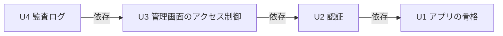

# Unit of Work Dependency — auth-audit-foundation

本書は、`unit-of-work.md` の4単位（U1〜U4）の依存関係を示す。依存関係の形は確定回答 Q4（一列に並べ、すべての単位が直前の単位に依存する）に従う。本書は依存の形だけを示し、どの単位から作るかは Delivery Planning で決める。

## 依存関係（機械可読）

```yaml
units:
  - name: u1-app-skeleton
    depends_on: []
  - name: u2-authentication
    depends_on: [u1-app-skeleton]
  - name: u3-access-control
    depends_on: [u2-authentication]
  - name: u4-audit-log
    kind: service
    depends_on: [u3-access-control]
```

## 依存関係の図



テキスト表記: U2 は U1 に、U3 は U2 に、U4 は U3 に依存する（矢印は「依存する側 → 依存される側」）。循環はない。

## 依存の理由

| 依存する単位 | 依存される単位 | 理由 |
|---|---|---|
| U2 認証 | U1 アプリの骨格 | 起動・内部DB・ログ・共通のエラー応答・画面の骨組みの上に作る |
| U3 管理画面のアクセス制御 | U2 認証 | 判定に、U2 が検証したアクセストークンの利用者と管理者フラグを使う。管理者向け領域は U2 の API 呼び出しの共通部分（ApiClient）を使う |
| U4 監査ログ | U3 管理画面のアクセス制御 | アクセス拒否の出来事を受け取る。あわせて U2 のログイン・ログアウトの出来事も受け取る（U3 を通して U2 にも間接的に依存する） |

一列の形は、部品どうしの本来の依存（Authentication → AccessControl、AuditLog はその両方の出来事を受け取る）とも一致しており、人工的に足した依存はない。U4 の U2 への直接の依存は、U3 を通した間接の依存に含まれるため、辺として重ねて書かない。

## 単位どうしのつなぎ目

約束事の中身（API の形、出来事の項目）は各単位の Contract Design で決める（Q5）。ここではつなぎ目の所在だけを示す。

| 提供する単位 | 使う単位 | つなぎ目 | 種類 |
|---|---|---|---|
| U1 | U2、U3、U4 | 内部DBへの接続、構造化ログとトレースID、共通のエラー応答、画面の骨組み（ルーティング・アプリシェル・文言） | 共通の仕組み（同じアプリ内） |
| U2 | U3 | 検証済みのアクセストークンから利用者と管理者フラグを得る | 同じアプリ内の呼び出し |
| U2 | U3（画面） | API 呼び出しの共通部分（トークンの付与・401 時の更新と再試行）、ログイン状態 | 画面内の呼び出し |
| U2 | 画面（U2 自身） | ログイン・トークン更新・ログアウトの API | HTTP API |
| U3 | 画面（U3 自身） | 管理者専用の確認用 API | HTTP API |
| U2 | U4 | ログイン成功・ログイン失敗・ログアウトの出来事 | アプリ内の出来事 |
| U3 | U4 | 権限不足によるアクセス拒否の出来事 | アプリ内の出来事 |

共有するデータ: 内部DB（H2）は1つで、U2 が User・RefreshToken・LoginAttemptState を、U4 が AuditEvent を持つ。単位をまたいで他の単位のデータを直接読み書きしない（Domain Design のデータの持ち主に従う）。

## 並行して作れる組み合わせ

なし。確定回答 Q4 により4単位を一列に並べたため、互いに依存しない単位の組み合わせは存在しない。可能な作る順番（依存を満たす並べ方）は U1 → U2 → U3 → U4 の1通りだけである。
