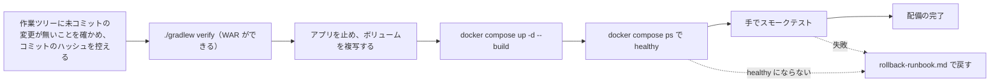

# 配備の流れの構成（cd-config）

Intent `260922-auth-audit-base`（auth-audit-foundation）の配備の流れの構成。配備先がまだ決まっていないため、本書は**開発者の PC 上のコンテナ**への配備だけを扱う（依頼者の回答、`aidlc/spaces/default/memory/team.md`・`project.md` の Deployment）。配備先が決まったら、9節の項目を置き換える。

- 作成日: 2026-09-23
- 決定の記録: `deployment-pipeline-questions.md`（Q1〜Q6、確認済みの要約）
- 入力: `construction/ci-pipeline/ci-config.md`（CI の構成、ci-config）、`construction/ci-pipeline/quality-gates.md`（関門、quality-gates）、各単位の `infrastructure-design/infrastructure-specification.md`（基盤の設計、infrastructure-specification）と `infrastructure-design/cicd-pipeline.md`（検査・配備の流れの設計、cicd-pipeline）

## 1. 位置づけ

- 配備は**手で行う**（Q1）。自動の配備（CD のワークフロー、スクリプト、Gradle のタスク）は持たない。手順は `deployment-strategy.md` と README の「コンテナでの起動と確認」に書く。
- 配備するのは**手元で `./gradlew verify` を通して作った WAR**（Q2）。CI の成果物の WAR（`ci-config.md` 5節、`mastersmith-<コミットのハッシュ>`）とリリースに添付した WAR は、配備にも戻しにも使わない。
- 配備の前の関門は、統合の前の関門と同じ `./gradlew verify`（`quality-gates.md` 2節）。配備のために別の関門は足さない。
- 配備の完了は、スモークテストが手で通ったとき（Q4、team.md の Deployment）。

テキスト表記: まず作業ツリーに未コミットの変更が無いことを確かめ、コミットのハッシュを控える。`./gradlew verify` を通して WAR を作り、アプリを止めてボリュームを複写してから、`docker compose up -d --build` でイメージを作り直して起動する。`docker compose ps` で healthy になったら、手でスモークテストを行い、通れば配備の完了とする。healthy にならないとき、またはスモークテストが失敗したときは `rollback-runbook.md` の手順で戻す。

## 2. 環境の段（環境ごとの扱い）

| 環境 | 今の扱い | 配備のきっかけ | 承認 | 備考 |
|---|---|---|---|---|
| 開発者の PC（コンテナ） | **ある**（唯一の配備先） | 依頼者が手で行う | 依頼者自身（AI-DLC を使う作業では依頼者の承認を得て行う） | `compose.yaml` の `app` を1つ起動する |
| CI（GitHub Actions） | 検査と WAR の保存だけ。配備はしない | `develop` へのプッシュ、`v*` のタグ | — | `ci-config.md` 2・5節 |
| 検証環境 | **無い** | 配備先が決まってから作る | — | org.md の既定: 統合時に自動で配備 |
| 本番環境 | **無い** | 配備先が決まってから作る | 依頼者（team.md の Deployment） | org.md の既定: 手動の承認のうえ配備 |

環境をまたぐ昇格（開発 → 検証 → 本番）は、今は存在しない。

## 3. 配備の前の条件

| 条件 | 確かめ方 | 満たさないとき |
|---|---|---|
| 作業ツリーに未コミットの変更が無い（Q6） | `git status --porcelain` が空（`vendor/make-you-chic-ui` の中も含む） | 配備しない。コミットするか変更を戻してからやり直す |
| 配備する版のコミットのハッシュを控えた（Q6） | `git rev-parse --short HEAD` の値を控える | 戻すときに直前の版が分からなくなるため、控えるまで進めない |
| 検査を通った WAR がある（Q2） | `./gradlew verify` が成功し、`backend/build/libs/mastersmith.war` ができている | 配備しない |
| `.env` がある | 初回は `.env.example` を複写して値を入れる。署名鍵 `MASTERSMITH_AUTH_SIGNING_KEY` は必須 | 署名鍵が無い・短いとアプリが起動しない（U2 の `infrastructure-specification.md` 3章） |
| Docker が動く | `docker compose version`。colima の場合は CPU を 4 つ以上割り当てる | コンテナの CPU の上限 4 を満たせない |

## 4. 成果物と版の見分け方

| 項目 | 値 |
|---|---|
| 配備する WAR | `backend/build/libs/mastersmith.war`（手元のビルド。`frontend/dist` を同梱。ビルドのたびに上書きされる） |
| イメージ | `mastersmith:local`（`compose.yaml` の `image: mastersmith:${MASTERSMITH_IMAGE_TAG:-local}` の既定のまま。Q3・Q6） |
| 版の見分け方 | 配備のときに控えたコミットのハッシュ（Q6）。イメージのタグには付けない |
| コンテナの中の版の確かめ方 | 無い（WAR とイメージに版の印を持たないため）。控えたハッシュが唯一の記録 |

team.md の Deployment の「成果物の版はコミットのハッシュで識別する」は、控えたハッシュと、未コミットの変更が無い作業ツリーから作ったことの2つで満たす。

## 5. 構成のファイル（既にあるもの）

| ファイル | 要点 | 由来 |
|---|---|---|
| `Dockerfile` | `eclipse-temurin:25.0.4_7-jre-noble`（版の番号まで固定）。WAR をコピーするだけの1段。利用者 UID 10001。`/app/data` は権限 700 で所有者 10001。起動は exec 形式で `-XX:MaxRAMPercentage=75.0`・`-Duser.timezone=Asia/Tokyo` | U1 の `infrastructure-specification.md` 1章（Q2・Q3）、U2 の同 1章（タイムゾーン） |
| `compose.yaml` の `app` | `127.0.0.1:8080:8080`、`.env`（無くてもよい）、`TZ: Asia/Tokyo`、名前付きボリューム `mastersmith-data` を `/app/data` へ、ヘルスチェック（`/actuator/health` が 200。30 秒ごと、猶予 40 秒、3 回）、停止の猶予 45 秒、`cpus: 4`・`mem_limit: 1g`、`restart: "no"`、ログは json-file（10MB × 3） | U1 の `infrastructure-specification.md` 1章、U2 の同 1章（CPU 4） |
| `compose.yaml` の `otel-collector` | profile `observability` のときだけ起動。外部エクスポートの確認用 | U1 の `infrastructure-specification.md` 2章 |
| `.env.example` | 環境変数の名前だけ。値は空 | U1・U2 の `infrastructure-specification.md` 3章 |

## 6. 設定と秘密情報

- 秘密情報（内部DBのパスワード、署名鍵、初期管理者のメールアドレスとパスワード）は、Git 管理外の `.env` から環境変数で渡す。環境変数の一覧は README の「環境変数」。
- 配備の流れは GitHub の秘密情報の保管を使わない（配備が手元だけのため）。CI も秘密情報を使わない（`ci-config.md` 2節）。
- 署名鍵を替えるときは、`.env` を替えてコンテナを作り直す（U2 の `cicd-pipeline.md` 3章）。

## 7. 機能の切り替え（フィーチャーフラグ）

使わない。切り替えて出し入れする機能が本 Intent に無く、1台に全員が同じ版でつながるため。外部エクスポートの有効・無効は環境変数（`MASTERSMITH_OBSERVABILITY_EXPORT_ENABLED`、既定は無効）で切り替えるが、これは配備の設定であり、フィーチャーフラグとしては扱わない。

## 8. 承認済みの設計との差

| 事項 | 承認済みの設計 | 本段の決定 | 理由 |
|---|---|---|---|
| イメージのタグ | U1 の `cicd-pipeline.md` 5章「イメージのタグにコミットのハッシュを付ける」 | 付けない。`local` のまま（Q3・Q6） | 戻しは WAR から作り直すため、タグを残す必要が無い。版は控えたハッシュで見分ける |
| 配備する WAR | U1 の `cicd-pipeline.md` 5章「`./gradlew verify` で作った WAR（または CI の成果物の WAR）」 | 手元で作った WAR だけ（Q2） | 設計が認めた選択肢の片方に絞った |
| 戻すときの WAR | U1 の `cicd-pipeline.md` 5章「直前の版の WAR（CI の成果物、またはタグのリリース）」 | 直前の版のコミットを取り出して手元で作り直す（Q5） | 配備する WAR と同じ作り方にそろえる。CI の成果物の保存期間（30 日）にも左右されない |

README の「コンテナでの起動と確認」「戻し方」を、本段の決定に合わせて直した（設計の文書は確定済みのため書き換えない）。

## 9. 配備先が決まったときに置き換えるもの

| 項目 | 今 | 決まったときの方向（org.md・team.md の既定） |
|---|---|---|
| 配備の実行 | 手で行う | `develop` への統合で検証環境へ自動で配備し、本番は依頼者の承認のうえ配備する |
| 成果物 | 手元の WAR、イメージ `local` | 検査を通った1つの成果物（CI の WAR またはイメージ）をコミットのハッシュで識別し、環境をまたいで同じものを使う |
| イメージの置き場所 | 手元の Docker だけ | 配備先に合わせたレジストリ |
| 部品表（SBOM） | 生成しない | 生成する（team.md の Deployment） |
| HTTPS | 扱わない（`localhost`） | 扱う（README の「プロキシを置く配備」） |
| 再起動の方針 | 再起動しない | 見直す（U1 の `infrastructure-specification.md` 1章） |
| 基盤の定義 | `Dockerfile`・`compose.yaml` | クラウドの基盤のコード（IaC） |
| スモークテスト | 手で行う | 自動にするかを改めて決める |

## Sources

- `aidlc/spaces/default/intents/260922-auth-audit-base/operation/deployment-pipeline/deployment-pipeline-questions.md`（Q1〜Q6、確認済みの要約）
- `aidlc/spaces/default/intents/260922-auth-audit-base/construction/ci-pipeline/ci-config.md`（CI のきっかけ・成果物・リリース）
- `aidlc/spaces/default/intents/260922-auth-audit-base/construction/ci-pipeline/quality-gates.md`（`./gradlew verify` の関門）
- `aidlc/spaces/default/intents/260922-auth-audit-base/construction/u1-app-skeleton/infrastructure-design/infrastructure-specification.md`・`cicd-pipeline.md`
- `aidlc/spaces/default/intents/260922-auth-audit-base/construction/u2-authentication/infrastructure-design/infrastructure-specification.md`・`cicd-pipeline.md`
- `aidlc/spaces/default/intents/260922-auth-audit-base/construction/u3-access-control/infrastructure-design/infrastructure-specification.md`・`cicd-pipeline.md`
- `aidlc/spaces/default/intents/260922-auth-audit-base/construction/u4-audit-log/infrastructure-design/infrastructure-specification.md`・`cicd-pipeline.md`
- `Dockerfile`、`compose.yaml`、`README.md`（実装）
- `aidlc/spaces/default/memory/org.md`・`team.md`・`project.md`（Deployment・Way of Working）

## Assumptions & Open Questions

- 内部DBのバックアップ（`mastersmith-data-<日時>.tgz`）は、README の手順ではリポジトリの直下に作られるが、`.gitignore` に入っていない。バックアップにはメールアドレスと接続元IPが入り、リポジトリは公開のため、誤ってコミットしない手当て（`.gitignore` への追加、または置き場所をリポジトリの外にする）が要る。本段では手当てをしておらず、依頼者の判断を待つ。
