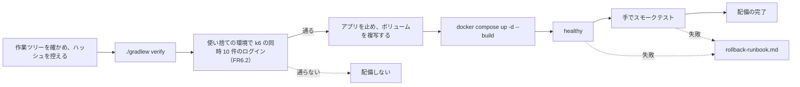

# 配備の流れの構成（cd-config）

Intent `260923-audit-pool-exhaustion`（F2 の修正）の配備の流れ。配備先は、前の Intent と同じく**開発者の PC 上のコンテナ**だけである。配備の仕組みは、既にある `Dockerfile`・`compose.yaml`・README と、前の Intent の `aidlc/spaces/default/intents/260922-auth-audit-base/operation/deployment-pipeline/cd-config.md`（以下「前回の構成」）を正とし、本書は今回の差だけを書く。

- 決定の記録: `deployment-pipeline-questions.md`（Q1〜Q3、FQ1、確認済みの要約）
- 入力: 本 Intent では CI Pipeline・Infrastructure Design の段を行っていない（bugfix の範囲）。そのため、前回の構成と、前の Intent の `construction/ci-pipeline/ci-config.md`・`quality-gates.md` を入力とする。今回、CI（`.github/workflows/ci.yml`）は変えていない

## 1. 今回の変更と、配備への影響

| 項目 | 内容 | 配備への影響 |
|---|---|---|
| 変更 | 内部DBの接続プールの上限の既定値を 10 から 30 にし、環境変数 `MASTERSMITH_DB_MAXIMUM_POOL_SIZE` で変えられるようにした（コミット `d948544`） | 設定の値だけ |
| スキーマ | 変更なし（V1〜V4 のまま） | 戻すときにスキーマの扱いは要らない |
| 依存関係 | 変更なし | — |
| 構成のファイル | 変更なし。`compose.yaml` の `env_file: .env` が `.env` の値をすべてアプリに渡すため、新しい環境変数のために構成を変える必要は無い | — |
| `.env` | 設定しない（既定 30 のまま）。戻すときだけ使う（`rollback-runbook.md`） | — |

## 2. 流れ（前回の構成からの差: 負荷の確かめを配備の前に置く）

テキスト表記: 作業ツリーに未コミットの変更が無いことを確かめてハッシュを控え、`./gradlew verify` を通す。次に、使い捨ての環境で k6 を使い、同時 10 件のログインを流して、監査が欠けないことを確かめる。通らなければ配備しない。通ったら、動いているアプリを止めてボリュームを複写し、`docker compose up -d --build` で起動し、healthy とスモークテストを確かめて配備の完了とする。失敗したら `rollback-runbook.md` で戻す。

## 3. 環境の段・承認・成果物

前回の構成の 2〜7節のまま変えない。

- 環境: 開発者の PC 上のコンテナだけ。検証環境と本番環境は無い。
- 承認: 依頼者。AI-DLC の作業の中で AI が配備する場合は、依頼者の承認を得てから行う。
- 成果物: 手元で `./gradlew verify` を通して作った `backend/build/libs/mastersmith.war`、イメージ `mastersmith:local`。版は、配備のときに控えたコミットのハッシュで見分ける。
- 機能の切り替え（フィーチャーフラグ）: 使わない。今回の変更は環境変数の値で調整できる。

## 4. 要件との差

- 要件 FR6.2 は「配備した後、使い捨ての環境で k6 を使い、同時 10 件の成功のログインを流し直す」としている。依頼者の決定（Q2: A）で、**配備の前**に行う。確かめる中身（使い捨ての環境、同時 10 件、監査の行の数とログの確認）は変えない。
- 要件の文書は書き換えない（`project.md` の Way of Working: 確定済みの設計と違う決定は、その段の成果物に差を明記する）。

## Sources

- `deployment-pipeline-questions.md`（Q1〜Q3、FQ1、要約）
- 前の Intent の `aidlc/spaces/default/intents/260922-auth-audit-base/operation/deployment-pipeline/cd-config.md`・`deployment-strategy.md`・`rollback-runbook.md`
- `compose.yaml`、`Dockerfile`、`README.md`、`perf/README.md`
- `aidlc/spaces/default/intents/260923-audit-pool-exhaustion/inception/requirements-analysis/requirements.md`（FR6、NFR2）
- `aidlc/spaces/default/intents/260923-audit-pool-exhaustion/construction/build-and-test/build-and-test-summary.md`（引き継いだ Unverified の2件）

## Assumptions & Open Questions

- None.
