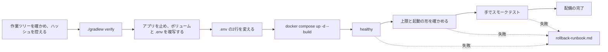

# 配備の流れの構成（cd-config）

Intent `260923-colima-spec-up`（F3・F4 の修正）の配備の流れ。配備先は、前の Intent と同じく**開発者の PC 上のコンテナ**だけである。配備の仕組みは、既にある `Dockerfile`・`compose.yaml`・README と、前の Intent の `aidlc/spaces/default/intents/260923-audit-pool-exhaustion/operation/deployment-pipeline/`（以下「前回の構成」）を正とし、本書は今回の差だけを書く。

- 決定の記録: `deployment-pipeline-questions.md`（Q1〜Q3、確認済みの要約）
- 入力: 本 Intent では CI Pipeline・Infrastructure Design の段を行っていない（bugfix の範囲）。そのため、前回の構成と、前の Intent の `aidlc/spaces/default/intents/260922-auth-audit-base/construction/ci-pipeline/ci-config.md`・`quality-gates.md` を入力とする。今回、CI（`.github/workflows/ci.yml`）は変えていない

## 1. 今回の変更と、配備への影響

| 項目 | 内容 | 配備への影響 |
|---|---|---|
| 変更 | コンテナのメモリの上限を `MASTERSMITH_CONTAINER_MEMORY`（既定 1g）で、JVM の引数を `MASTERSMITH_JAVA_OPTIONS` で変えられるようにした。`Dockerfile` の `ENTRYPOINT` を `sh -c "set -f; exec java ..."` の形にした（コミット `e4b10af`） | イメージの作り直しが要る |
| colima の VM | Build and Test の段で CPU 4・メモリ 6GiB に作り直し済み | この段では変えない |
| スキーマ | 変更なし（V1〜V4 のまま） | 戻すときにスキーマの扱いは要らない |
| 依存関係・アプリのコード | 変更なし | — |
| `.env` | `MASTERSMITH_CONTAINER_CPUS=4` に置き換え、`MASTERSMITH_CONTAINER_MEMORY=2g` を足す（要件 FR2.2。Q2: A で AI が行う） | 変更の前に `.env` を複写する（`rollback-runbook.md` の第一の手に使う） |

## 2. 流れ（前回の構成からの差: 配備の前の負荷の確かめを省き、`.env` の変更を加える）

テキスト表記:

1. 作業ツリーに未コミットの変更が無いことを確かめ、ハッシュを控えて、`./gradlew verify` を通す。
2. 動いているアプリを止め、内部DBのボリュームと `.env` を複写する。
3. `.env` の2行を変え、`docker compose up -d --build` で起動する。
4. healthy になったら、`docker inspect` で上限（メモリ 2GiB・CPU 4）と起動の形（PID 1 が java）を確かめる。
5. スモークテストが通れば配備の完了とする。途中で失敗したら `rollback-runbook.md` で戻す。

配備の前の負荷の確かめは行わない（Q1: A）。Build and Test の段で、同じソース（`e4b10af`）から作ったイメージを配備と同じ上限（2g・CPU 4）で試験し、通っている（`aidlc/spaces/default/intents/260923-colima-spec-up/construction/build-and-test/test-results.md` 4章）。

## 3. 環境の段・承認・成果物

前回の構成のまま変えない。

- 環境: 開発者の PC 上のコンテナだけ。検証環境と本番環境は無い。
- 承認: 依頼者。AI-DLC の作業の中で AI が配備する場合は、依頼者の承認を得てから行う。
- 成果物: 手元で `./gradlew verify` を通して作った `backend/build/libs/mastersmith.war`、イメージ `mastersmith:local`。版は、配備のときに控えたコミットのハッシュで見分ける。
- 機能の切り替え（フィーチャーフラグ）: 使わない。今回の変更は環境変数の値で調整できる。

## 4. 要件との差

- 要件 FR5（負荷の試験）は Build and Test の段で満たした。前の Intent と違い、配備の前・後の負荷の確かめは行わない（Q1: A）。
- 要件 FR2.2（この PC の `.env`）は、この流れの `.env` の変更で満たす。

## Sources

- `deployment-pipeline-questions.md`（Q1〜Q3、要約）
- 前の Intent の `aidlc/spaces/default/intents/260923-audit-pool-exhaustion/operation/deployment-pipeline/cd-config.md`・`deployment-strategy.md`・`rollback-runbook.md`
- `compose.yaml`、`Dockerfile`、`README.md`（「コンテナでの起動と確認」「コンテナの資源の上限」）
- `aidlc/spaces/default/intents/260923-colima-spec-up/inception/requirements-analysis/requirements.md`（FR2.2、FR5）
- `aidlc/spaces/default/intents/260923-colima-spec-up/construction/build-and-test/build-and-test-summary.md`

## Assumptions & Open Questions

- None.
