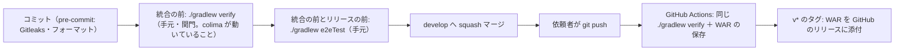

# CI の構成（ci-config）

Intent `260923-dsl-schema-loader`（dsl-schema-loader）の CI の記録。本書は**すでにリポジトリにある** `.github/workflows/ci.yml` と、CI が呼ぶ `./gradlew verify` の中身を記録したものである（project.md の Deployment「CI の仕組みが既に実装されている段では、新しい設計ではなく既にあるものの記録として書く」）。新しい仕組みはここでは作らない。

- 作成日: 2026-09-25
- 対象のファイル: `.github/workflows/ci.yml`（ワークフローの名前 `CI`）、`.github/dependabot.yml`
- 検査の中身の入口: `build.gradle.kts` の `verify` タスク（段ごとの合否の基準は `quality-gates.md`）
- 依頼者の決定: `ci-pipeline-questions.md` の Q1: A（E2E は CI の外）・Q2: B（CI の結果は依頼者のプッシュの後に AI が `gh` で読んで記録する）・Q3: B（手元の `osvScan` は今のまま）と、Consolidated Summary Confirmation（Looks correct）

## 1. この Intent での CI の変更

- **CI の定義（`.github/workflows/ci.yml`）はこの Intent で変えていない**。最後の変更は前の Intent（260922-auth-audit-base）のコミット `d1a9938` である（`git log -- .github/` で確かめた）。`.github/dependabot.yml` も同じ。
- 変わったのは、CI が呼ぶ `./gradlew verify` の**中身**である（`build.gradle.kts`・`backend/build.gradle.kts`・`gradle/libs.versions.toml` とテストのコード）。CI は同じタスクを呼ぶため、中身の変更はそのまま CI にも効く。増えた中身は 5節。

## 2. CI の位置づけ

- CI は**統合の後の再確認**として動く（team.md の Way of Working・Deployment）。統合を止める関門ではない。
- **統合の前の関門は、手元で実行する `./gradlew verify` の1コマンド**である（project.md の Way of Working「CI も同じタスクを呼ぶ」）。CI の YAML には検査の中身を書かず、`ci.yml` の「1コマンドの検査を実行する」の段が `./gradlew verify` を呼ぶだけである。
- プルリクエストは使わない。`origin` への `git push` は依頼者自身が行うため、CI が動くのは依頼者がプッシュした後である。AI はプッシュしない。
- CI が失敗したら、次へ進む前に原因を直す（team.md の Way of Working）。

テキスト表記: コミットの直前に pre-commit のフックが動く。統合の前に手元で colima を動かした状態で `./gradlew verify` を実行し、統合の前とリリースの前には `./gradlew e2eTest` も実行する。通ったら `develop` へ squash マージする。依頼者がプッシュすると GitHub Actions が同じ `./gradlew verify` を実行し、WAR を保存する。`v*` のタグを押したときは、その WAR を GitHub のリリースに添付する。

## 3. きっかけ・権限・重なりの制御

| 項目 | 値（`ci.yml` の記述） | 備考 |
|---|---|---|
| きっかけ | `push` の `branches: [develop]`・`tags: ["v*"]`、`workflow_dispatch` | 日々の統合先の `develop`、リリースのタグ、手動実行の3つ |
| 権限 | ワークフロー全体は `permissions: contents: read` | 最小の権限。`release` のジョブだけが `contents: write` を持つ |
| 重なりの制御 | `concurrency: group: ci-${{ github.ref }}`・`cancel-in-progress: false` | 同じ参照の実行は重ねない。実行中のものは打ち切らない（記録を残すため） |
| 秘密情報 | 使わない | GitHub の Secrets を参照する記述は無い。`GH_TOKEN` は `github.token`（そのワークフローに与えられる一時の権限）だけ |
| 環境変数 `CI` | GitHub Actions が `CI=true` を自動で渡す | 対象DB のテストはこれを見て、Docker に届かなければ飛ばさずに失敗する（5節） |

## 4. ランナーと固定している版

ジョブ `verify`（表示名 `./gradlew verify`）: `runs-on: ubuntu-latest`、`timeout-minutes: 60`。`ubuntu-latest` のランナーには Docker が入っており、Testcontainers が対象DB のコンテナを起動できる。

| 段 | 使うもの | 固定の仕方 |
|---|---|---|
| リポジトリの取得 | `actions/checkout@3d3c42e5aac5ba805825da76410c181273ba90b1`（コメント `# v7.0.1`） | **コミットのハッシュで固定** |
| JDK | `actions/setup-java@de7274f081f381c8f8158605e0321c36c376e2e6`（`# v6.0.1`）、`distribution: temurin`、`java-version: "25"` | 同上。JDK 25（Temurin） |
| Node.js | `actions/setup-node@820762786026740c76f36085b0efc47a31fe5020`（`# v7.0.0`）、`node-version: "24"` | 同上。Node.js 24 |
| Gradle | `gradle/actions/setup-gradle@9c971963bec38e04b3d30dcc455b5382be2fdbfb`（`# v6.3.0`） | 同上。Gradle 本体は Wrapper の版（9.7.1） |
| 成果物の保存 | `actions/upload-artifact@043fb46d1a93c77aae656e7c1c64a875d1fc6a0a`（`# v7.0.1`） | 同上 |
| 成果物の取得（リリース） | `actions/download-artifact@3e5f45b2cfb9172054b4087a40e8e0b5a5461e7c`（`# v8.0.1`） | 同上 |
| Gitleaks | `GITLEAKS_VERSION: 8.30.1`、`GITLEAKS_SHA256: 551f6fc83ea457d62a0d98237cbad105af8d557003051f41f3e7ca7b3f2470eb` | **版と SHA-256 で固定**。`sha256sum -c -` で確かめてから展開する |
| OSV-Scanner | `OSV_SCANNER_VERSION: 2.6.0`、`OSV_SCANNER_SHA256: ca69b3d3cd08f889a49dc0a383122f71cc528b83803671df5fd874d97485b108` | 同上。確かめに通ったものだけを実行可能にする |
| 対象DB のイメージ（テストの中） | MySQL 8.4.11・MariaDB 11.8.9・PostgreSQL 18.6 | **ダイジェストで固定**（`backend/src/test/java/cherry/mastersmith/targetdb/testsupport/TargetDbImages.java`）。CI の YAML ではなくテストのコードが持つ |

- Gitleaks と OSV-Scanner は `$HOME/.local/bin` に置き、そのディレクトリを `$GITHUB_PATH` に足して以後の段から使う。導入の段は `set -euo pipefail` で、ダウンロードか SHA-256 の確かめが失敗した時点で止まる。
- 手元の版は README の「前提の道具」に同じ版（Gitleaks 8.30.1・OSV-Scanner 2.6.0）が書かれており、CI と手元で同じ版を使う。

### ジョブ `verify` の段の並び

| 順 | 段の名前（`ci.yml`） | 内容 |
|---|---|---|
| 1 | リポジトリとサブモジュール（固定先のコミット）を取得する | `submodules: true`、`fetch-depth: 0`（Gitleaks が履歴全体を調べるため） |
| 2 | JDK 25（Temurin）を入れる | — |
| 3 | Node.js 24 を入れる | `cache: npm`。鍵は `frontend/package-lock.json` と `vendor/make-you-chic-ui/package-lock.json` |
| 4 | Gradle を用意する（キャッシュを使う） | `gradle/actions/setup-gradle` が Gradle の配布物と依存関係をキャッシュする |
| 5 | Gitleaks と OSV-Scanner を入れる（版と SHA-256 を固定） | 上の表のとおり |
| 6 | 1コマンドの検査を実行する | `./gradlew verify`。手元の関門と**同じ入口・同じ順**（0〜9 の段、下の表） |
| 7 | WAR を成果物として保存する（名前にコミットのハッシュを入れる） | 6節 |

依存関係の導入（`npm ci`・サブモジュールのビルド）は CI の段ではなく `verify` の 0 の段（`verifyPrepare`）が行い、lockfile どおりに入れる。CI は毎回まっさらな環境で走るため、手元で UP-TO-DATE になりうるタスク（`osvScan` など）も CI では必ず実行される。

### `./gradlew verify` の段（CI の 6 の段の中身）

| 段 | タスク | 中身 |
|---|---|---|
| 0 準備 | `verifyPrepare` | `checkToolchain`（Node.js 24・npm・git）、`vendorInstall`（`npm ci`）、`vendorBuild`、`vendorUnchanged`（サブモジュールが変わっていない）、`frontendInstall`（`npm ci`） |
| 1 フォーマット | `verifyFormat` | Spotless（ルートの Gradle の Kotlin DSL、palantir-java-format とライセンスヘッダー）、Prettier |
| 2 リンタ | `verifyLint` | oxlint・ESLint、Stylelint |
| 3 ライセンスヘッダー | `verifyLicense` | 画面のファイル（`check-license-header.mjs`）。Java と Gradle の Kotlin DSL は 1 の段の Spotless が確かめる |
| 4 ビルド | `verifyBuild` | Java のコンパイル（本番とテスト）、`tsc --noEmit`、Vite のビルド |
| 5 単体テスト | `verifyUnitTest` | `:backend:test`（`*Test`）、Vitest |
| 6 結合テスト | `verifyIntegrationTest` | `:backend:integrationTest`（`*IT`）。**組み込みの H2 と対象DB のコンテナ**（この Intent で説明を変えた） |
| 7 カバレッジの下限 | `verifyCoverage` | JaCoCo の報告と下限の検証（全体と新しいパッケージごと）、`@vitest/coverage-v8` |
| 8 安全の検査 | `verifySecurity` | `spotbugsGate`（priority 1 と `SQL_`）、`osvScan`、`gitleaksScan`（履歴全体） |
| 9 成果物と量 | `verifyArtifact` | `bootWar`、**`verifyDslSchemaInWar`**（この Intent で追加）、`frontendBundleSize` |

前の段が失敗したら後ろの段は実行しない（`verifyStages` が `mustRunAfter` で順番を固定する）。順は team.md の Deployment（フォーマット → リンタ → ライセンスヘッダー → ビルド → 単体テスト → 結合テスト → カバレッジ → セキュリティ）のとおり。

## 5. この Intent で `verify` に増えた中身

いずれも CI の YAML は変えずに、`./gradlew verify` の中で CI でも実行される。

| 増えたもの | 段 | 実装の場所 | CI での扱い |
|---|---|---|---|
| **対象DB 3種類の結合テスト**（MySQL 8.4.11・MariaDB 11.8.9・PostgreSQL 18.6 を Testcontainers でダイジェスト固定のイメージから起動） | 6 | `backend/src/test/java/cherry/mastersmith/targetdb/`・`dslmanage/` の `*IT`、`TargetDbImages.java`・`TargetDbTestDatabase.java`（クラスごとに名前の重ならないスキーマを作って消す） | `verify` の中で**毎回**3種類とも実行する（team.md の Testing Posture、Build and Test の Q1: A）。project.md の Mandated「H2 やモックで代用しない」 |
| **Docker に届かないときの扱い** | 6 | `backend/src/test/java/cherry/mastersmith/targetdb/testsupport/ContainerRuntimeCheck.java` | 環境変数 `CI` が `true` なら、飛ばさずに `IllegalStateException`（「CI ではコンテナの実行環境が必要です」）で**失敗**させる。`CI` が無い手元では警告を出して対象DB のテストだけを SKIPPED にする（この状態では統合しない。team.md の Way of Working） |
| **拡張の登録の順の構造の検査** | 5 | `backend/src/test/java/cherry/mastersmith/targetdb/testsupport/ExtensionOrderArchitectureTest.java`（3 件） | `OutputCaptureExtension` を `ContainerRuntimeCheck` より先に登録していることを確かめる。Docker に届かないときに中断が失敗に変わる不具合（Build and Test の Loop-back 1、NFR12.3）の再発を防ぐ |
| **H2 の詰め直しのテスト** | 5 | `backend/src/test/java/cherry/mastersmith/config/H2DefragOnCloseTest.java`（3 件） | `DEFRAG_ALWAYS=TRUE` を付けると閉じた後にファイルが縮むこと、既定の接続先に付いていることを確かめる（U4-STORAGE-RESTART） |
| **テストの JVM のヒープ 1g** | 5・6 | `backend/build.gradle.kts` の `tasks.withType<Test>` の `maxHeapSize = "1g"` | 構造の検査がクラスを持ち続け、10MB を超える DSL を作る U3 のテストでヒープが尽きたため（Gradle の既定は 512MB）。テストの件数・カバレッジの下限は変えていない。`ubuntu-latest` のランナーのメモリの内に収まる見込み（G-CI で確かめる） |
| **SpotBugs の `SQL_` の関門** | 8 | `backend/build.gradle.kts` の `spotbugsGate` | パターン名が `SQL_` で始まる指摘は priority によらず失敗（team.md の Code Style） |
| **新しいパッケージごとのカバレッジの下限** | 7 | `backend/build.gradle.kts` の `jacocoTestCoverageVerification` の2つ目の `rule`（`element = "PACKAGE"`、`excludes = packagesJudgedByTotal`） | 既存の 22 パッケージは全体の合計で判定し、新しいパッケージ（この Intent の 13 個）はそれぞれ行 80%・分岐 70% を当てる |
| **DSL の JSON Schema を WAR に入れた確かめ** | 9 | `backend/build.gradle.kts` の `verifyDslSchemaInWar` | WAR の中の `WEB-INF/classes/dsl/dsl-schema-v1.json` と `WEB-INF/classes/static/dsl/dsl-schema-v1.json` が、正本 `backend/src/main/resources/dsl/dsl-schema-v1.json` と同じバイト列であること |

依存の追加（JDBC ドライバー3つ・SnakeYAML・networknt の JSON Schema の検証・Testcontainers）は `backend/gradle.lockfile` で固定され、`osvScan` の対象に入る。

手元の時間の実測（Build and Test の C12、`8961cb2`）は 6分17秒で、CI の `timeout-minutes: 60` の内である。CI での時間は G-CI で記録する（8節）。

## 6. 成果物とリリース

| 項目 | 値 |
|---|---|
| 成果物 | 画面のビルド結果（`frontend/dist`）と DSL の JSON Schema を同梱した実行可能 WAR。パスは `backend/build/libs/mastersmith.war` |
| 名前 | `mastersmith-${{ github.sha }}`（**コミットのハッシュで識別する**。team.md の Deployment） |
| 保存期間 | `retention-days: 30` |
| 見つからないとき | `if-no-files-found: error`（黙って成功にしない） |

リリースのジョブ `release`（表示名「リリースに WAR を添付する」）:

| 項目 | 値 |
|---|---|
| 実行の条件 | `if: startsWith(github.ref, 'refs/tags/v')` かつ `needs: verify`（検査を通った実行の成果物だけを使う） |
| ランナー | `ubuntu-latest`、`timeout-minutes: 10` |
| 権限 | このジョブだけ `contents: write` |
| 手順 | `actions/download-artifact` で `mastersmith-${{ github.sha }}` を取得 → `mastersmith-${TAG}-${GITHUB_SHA}.war` に複写 → `gh release create "$TAG" … --title "$TAG" --notes "コミット ${GITHUB_SHA} の WAR"` |
| 認証 | `GH_TOKEN: ${{ github.token }}` |

リリースのときは、依頼者の承認を得て `develop` から `main` へ取り込み、`main` にタグを付ける（team.md の Way of Working・Deployment）。部品表（SBOM）の生成は入れていない。配備先が決まってから入れる。

### キャッシュ

| 対象 | 仕組み |
|---|---|
| npm | `actions/setup-node` の `cache: npm`。鍵は2つの lockfile |
| Gradle | `gradle/actions/setup-gradle` の既定のキャッシュ |
| Docker のイメージ（対象DB） | キャッシュしない。実行ごとにダイジェストで取得する |

## 7. CI に入れていないもの

| 対象 | 実行の場所 | 理由 |
|---|---|---|
| **E2E（Playwright、`frontend/e2e/` の 010〜040 の4本）** | 手元の `./gradlew e2eTest`（`:backend:bootWar` に依存し、ビルドした WAR を起動して `npx playwright test e2e` を実行。`frontend/playwright.config.ts` の `workers: 1` で番号の順に1本ずつ） | **意図して CI と `verify` の外に置く**（前の Intent の決定、この段の Q1: A）。統合の前とリリースの前に手で実行する（README の E2E の節）。`8961cb2` の WAR で 6 件すべて成功（18.7 秒） |
| 性能の測定（`perf/`：`dsl-timing.sh`・k6） | 使い捨ての環境（`docker/perf/compose.yaml`） | 配備とは別の環境が要り、時間もかかるため（project.md の Testing Posture）。持ち主は Build and Test と Performance Validation |
| 配備（検証環境・本番） | 無し | 当面の配備先は開発者の PC 上のコンテナだけのため（team.md・project.md の Deployment） |
| `vendor/make-you-chic-ui` のテスト | 実行しない | team.md の Deployment。同梱の版でフロントエンドのビルドが通ることは `verify` の 0・4 の段で確かめる |
| SBOM の生成 | 無し | 配備先が決まってから |

## 8. CI の実行の結果

依頼者が `gh auth login` とプッシュを行った後に、AI が `gh run list --workflow ci.yml`・`gh run view` で読んだ結果（2026-09-25）。G-CI は **Met**。

| 実行 | コミット | 結果 | 時間 | 内容 |
|---|---|---|---|---|
| 36021036733（develop へのプッシュ） | `6f212e8`（Loop-back 1 の直しと Build and Test の承認を含む、この Intent の最新） | success | ジョブ全体 8分28秒（`./gradlew verify` は `BUILD SUCCESSFUL in 7m 44s`） | `verifyUnitTest`・`verifyIntegrationTest`（対象DB の3種類のコンテナを含む）・`verifyCoverage`・`verifySecurity`・`verifyArtifact` を含む全段が成功。出力に `SKIPPED` は 0 件、コンテナの実行環境が無いときの警告も出ていない（CI では Docker に届いた）。画面のテストは 47 ファイルすべて成功。OSV-Scanner は3つの lockfile（244・395・404 パッケージ）を走査。WAR を成果物 `mastersmith-6f212e88…` として保存。リリースの仕事はタグではないため skipped |
| 35999799366（develop へのプッシュ） | `39f9aeb`（Code Generation の最初の承認） | success | 6分54秒 | 参考。Loop-back 1 の前の版でも CI は成功していた |

- 注記（GitHub の通知）: `ubuntu-latest` のラベルは 2026-10-19 から Ubuntu 26 に移る。移った後も同じ `./gradlew verify` が通ることを、次の CI の実行で確かめる（持ち主は次にこのリポジトリをプッシュする Intent。CI の定義は変えない）。
- 読んだコマンド: `gh run list --workflow ci.yml --limit 6`・`gh run watch 36021036733 --exit-status`・`gh run view 36021036733 --json conclusion,createdAt,updatedAt,headSha,jobs`・`gh run view 36021036733 --log`。

## 9. 依存関係の更新（`.github/dependabot.yml`、変更なし）

| 対象（`package-ecosystem`） | ディレクトリ | 頻度 |
|---|---|---|
| `gradle` | `/` | 毎週 |
| `npm` | `/frontend` | 毎週 |
| `github-actions` | `/` | 毎週 |
| `docker` | `/` | 毎週 |

Actions をコミットのハッシュで固定しているため、更新は Dependabot の提案を受けて行う。サブモジュールの固定先の更新は対象にしない（承認を得た専用のコミットで行う。project.md の Mandated）。テストのコードが持つ対象DB のイメージのダイジェスト（`TargetDbImages.java`）は Dependabot の対象ではなく、手で見直す。

## 10. 記録として残す差

| 事項 | 内容 | 扱い |
|---|---|---|
| README の `verify` の段の一覧 | README の 9 の段の説明は「実行可能 WAR、初回の読み込みの JavaScript の量」で、`verifyDslSchemaInWar` を挙げていない（別の節「WAR の中の複写が正本と同じことは 9 の段で確かめる」には書かれている）。`build.gradle.kts` の段の説明には含まれている | 実装（`build.gradle.kts`）を正として本書に記録する。README の直しはこの段の範囲の外（CI の定義は変えない方針）として、承認の場で伝える |
| Build and Test の記録の書き方 | `test-results.md` 2.5 は `verifyDslSchemaInWar` の確かめを `static/dsl/` の1つだけ書いているが、実装は `WEB-INF/classes/dsl/` と `WEB-INF/classes/static/dsl/` の2つを正本と比べる | 本書は実装どおりに記録する（中身の食い違いではなく、記録の粒度の差） |

## Sources

- `.github/workflows/ci.yml`、`.github/dependabot.yml`（実装そのもの。`git log -- .github/` で最後の変更が `d1a9938` であることを確かめた）
- `build.gradle.kts`（`verifyStages`・`verify`・`osvScan`・`gitleaksScan`・`e2eTest`。`git diff 42def8c HEAD -- build.gradle.kts` でこの Intent の差を確かめた）
- `backend/build.gradle.kts`（テストの JVM のヒープ、`integrationTest`、JaCoCo の下限と `packagesJudgedByTotal`、`spotbugsGate`、`verifyDslSchemaInWar`）
- `backend/src/test/java/cherry/mastersmith/targetdb/testsupport/ContainerRuntimeCheck.java`・`TargetDbImages.java`・`ExtensionOrderArchitectureTest.java`、`backend/src/test/java/cherry/mastersmith/config/H2DefragOnCloseTest.java`
- `frontend/playwright.config.ts`、`frontend/e2e/`、`.pre-commit-config.yaml`
- `README.md`（前提の道具の版、`verify` の段の一覧、E2E の節、対象DB の節）
- `aidlc/spaces/default/intents/260923-dsl-schema-loader/construction/ci-pipeline/ci-pipeline-questions.md`（Q1〜Q3 と確認済みの要約）
- `aidlc/spaces/default/intents/260923-dsl-schema-loader/construction/build-and-test/test-results.md`・`build-and-test-summary.md`（手元の実測）
- `aidlc/spaces/default/intents/260922-auth-audit-base/construction/ci-pipeline/ci-config.md`（書き方の見本と前の Intent の記録）
- `aidlc/spaces/default/memory/team.md`・`project.md`（Way of Working・Deployment・Testing Posture・Code Style・Mandated）

## Assumptions & Open Questions

- CI（GitHub Actions）での実行の結果はまだ無い。依頼者が `gh auth login` をして、`develop`（手元は `origin/develop` の `39f9aeb` より先）をプッシュした後に、AI が `gh run list`・`gh run view` で読んで 8節に記録する（G-CI）。
- `ubuntu-latest` のランナーで、テストの JVM のヒープ 1g と対象DB のコンテナ3種類が同時に収まることは、手元の実測（`verify` の間の colima の VM のメモリの使用量が最大 約 1,424MiB。配備したアプリを動かしたまま）からの見込みであり、CI では未確認。G-CI で確かめる。
