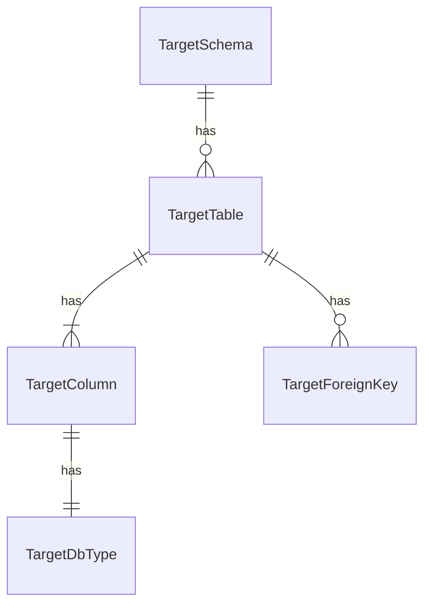

# Functional Spec — U1 対象DB（u1-target-db）

U1 の振る舞い（手順と状態）を示す。データの形は `entities.md`、決まりは `rules.md` が正本。

## 1. 起動時の設定の点検

1. アプリの起動のとき、`mastersmith.target-db.*` の項目を読む。
2. 項目が1つも無ければ、状態を「使わない」にして終える（WARN は出さない、BR1.2）。
3. 必須の項目（種類・ホスト・ポート・DB 名・スキーマ名・ユーザー名・パスワード）を点検する。欠け・不正があれば、問題のある項目の名前を並べた WARN を1件出し、状態を「使わない」にして終える（BR1.3）。
4. 問題が無ければ、状態を「使える」にする。対象DB にはまだ接続しない（BR1.7）。
5. どの場合もアプリの起動は続ける。内部DB の接続・ログイン・監査・Flyway・ヘルスチェックには関わらない（BR1.5）。

## 2. スキーマの読み取り（契約 C1）

1. 状態が「使わない」なら、「設定が無い（UNCONFIGURED）」を返す。
2. 対象DB の接続を得る（初めてのときに開く）。待ち時間の上限を超えたら「接続できない（TIMEOUT）」、接続・認証に失敗したら「接続できない（CONNECTION_FAILED）」を返す（BR1.8・BR1.9）。
3. 読み取り専用で、設定したスキーマのテーブルとビューを、まとめて読む（BR1.6・BR2.1・BR2.2）。
4. DB の種類ごとの違いを吸収し、テーブル・カラム（定義の順）・型・NULL を許すか・既定値・コメント・主キー・外部キーを、同じ形の写しにする（BR2.3・BR2.5・BR2.6・BR2.7）。
5. 問い合わせの途中で待ち時間を超えた・失敗したら、「接続できない」を返す。途中まで読んだ写しは返さない。
6. 「成功」と写しを返す。写しは保存しない。

## 3. 状態の移り変わり（対象DB の設定の状態）

| 状態 | 入る条件 | 読み取りの結果 |
|---|---|---|
| 使わない | 起動時に設定が無い、または欠け・不正 | いつも UNCONFIGURED |
| 使える | 起動時に設定がそろっている | 接続できれば SUCCESS、できなければ UNAVAILABLE |

設定の状態は起動のときに決まり、動いている間は変わらない（設定を変えたら再起動する）。

## 4. エンティティの関係（`entities.md` から導いた図）

図の文章による代替: スキーマの写しは0件以上のテーブル（ビューを含む）を持ち、テーブルは1件以上のカラムと0件以上の外部キーを持ち、カラムは DB 上の型を1つ持つ。

## 5. 決まりの要約（`rules.md` から導いた表）

| 場面 | 決まり |
|---|---|
| 設定 | 設定だけから受け取る（BR1.1）、無ければ使わない（BR1.2）、欠け・不正は項目名だけ WARN（BR1.3）、パスワードは伏せ字（BR1.4） |
| 接続 | 既定を置き換えない（BR1.5）、読み取り専用（BR1.6）、起動時に接続しない・ヘルスチェックに含めない（BR1.7）、待ち時間の上限（BR1.8）、失敗の文言に内部の情報を含めない（BR1.9） |
| 読み取り | 設定したスキーマのテーブルとビュー（BR2.1）、まとめて読む（BR2.2）、名前はそのまま（BR2.3）、識別子は一覧にあるものだけを引用符で（BR2.4）、空のコメントは無し（BR2.5）、別のスキーマへの外部キーは含めない（BR2.6）、3種類の違いを吸収（BR2.7） |

## 6. 失敗の場合とふるまい

| 場合 | ふるまい |
|---|---|
| 設定が無い | 起動する。読み取りは UNCONFIGURED |
| 設定の欠け・種類が対応外・ポートが数でない | 起動する。項目名だけの WARN を1件。読み取りは UNCONFIGURED |
| 対象DB が止まっている | 起動する（起動時に接続しない）。読み取りは UNAVAILABLE（CONNECTION_FAILED） |
| 対象DB が応答しない | 待ち時間の上限で打ち切り UNAVAILABLE（TIMEOUT） |
| 認証に失敗 | UNAVAILABLE（CONNECTION_FAILED）。ログに原因の種類だけ |
| 読み取りの途中で失敗 | UNAVAILABLE。途中の写しは返さない |
| スキーマにテーブルが0件 | SUCCESS（テーブル0件の写し） |
