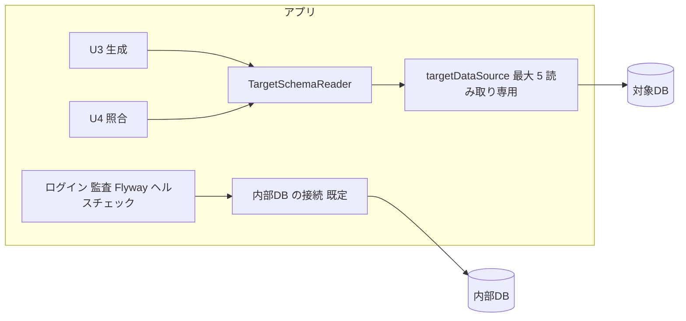

# Logical Components — U1 対象DB（u1-target-db）

U1 の論理的な部品と、障害の範囲を示す。

## 1. 部品

| 部品 | 役割 | 置き場（パッケージ） |
|---|---|---|
| TargetDbProperties | `mastersmith.target-db.*` の設定の型（接続先・資格情報・目的ごとの待ち時間）。パスワードを伏せ字にする | `cherry.mastersmith.targetdb.config` |
| TargetDataSourceConfig | `targetDataSource`（HikariCP、既定の候補にしない）を設定から作る。設定が無い・不正なら作らない | `cherry.mastersmith.targetdb.config` |
| TargetSchemaReader | 読み取りの口 `readSchema(目的)`。設定の有無を見て、種類ごとの読み手に渡し、結果の型で返す | `cherry.mastersmith.targetdb.service` |
| MysqlSchemaQueries・PostgresSchemaQueries | DB の種類ごとの固定の問い合わせと、結果を写しに揃える変換（MariaDB は MySQL と同じ読み手で、違いがあれば分ける） | `cherry.mastersmith.targetdb.repository` |
| TargetSchema ほか | 写しの値（テーブル・カラム・キー）。接続先を持たない | `cherry.mastersmith.targetdb.domain` |

## 2. 障害の範囲

図の文章による代替: 生成（U3）と照合（U4）だけが TargetSchemaReader を通して対象DB の接続を使う。ログイン・監査・Flyway・ヘルスチェックは内部DB の既定の接続を使い、対象DB の接続とは分かれている。

- 対象DB の停止・遅延の影響は、生成と照合（と、後続の Intent で対象DB を使う操作）に限られる。内部DB を使う働きには及ばない（NFR7.1〜NFR7.4）。
- 対象DB の接続は最大 5 本で、内部DB のプール（上限 30）とは別。対象DB が遅くても内部DB の接続を使い切らない。
- 重い処理の同時の数は U4 が1つに絞る（U4 の NFR1.13）ため、生成と照合が同時に対象DB を使うことは通常ない。

## 3. 共有するもの

- HikariCP・Spring の設定の仕組み・ログの仕組みは既存と共有する。
- JDBC ドライバー（3種類）は U1 だけが使う。
