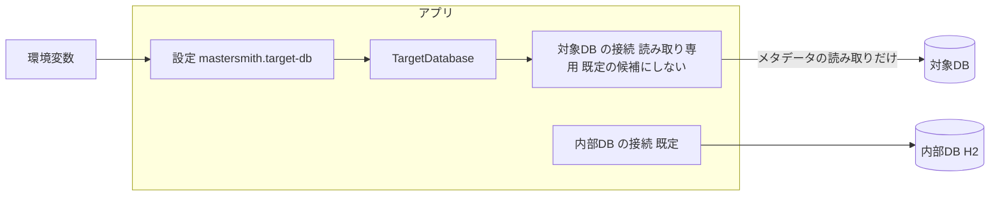

# Security Requirements — U1 対象DB（u1-target-db）

U1 が受け持つ非機能の要件のうち、セキュリティと可用性に関わるもの（NFR4・NFR6・NFR7）を、確かめられる形に分けて示す。機能の決まりは `construction/u1-target-db/functional-design/rules.md`（BR1.x・BR2.x）、選定と数値は `tech-stack-decisions.md`。答えは `nfr-requirements-questions.md`（Q1〜Q6）。

## 1. 守るものと脅威

| 守るもの | 分類 | 脅威（STRIDE） | 主な対策 |
|---|---|---|---|
| 対象DB の接続情報（接続先・ユーザー名・パスワード） | 秘密（restricted） | 漏えい（I）: ログ・応答・DSL・監査に出る | NFR4.1〜NFR4.5 |
| 対象DB のスキーマとデータ | 業務の資産 | 改ざん（T）: 書き込み・DDL、識別子を使った SQL インジェクション | NFR6.1〜NFR6.4、NFR4.6 |
| アプリの可用性 | — | サービス拒否（D）: 対象DB の停止・遅延にアプリが巻き込まれる | NFR7.1〜NFR7.4 |
| 接続先の設定の経路 | — | なりすまし（S）: 画面・API・DSL から接続先を差し込まれる | NFR4.1 |

対象DB のメタデータ（テーブル名・カラム名・型・コメント）は秘密ではないが、読み取るのは管理者の操作だけ（U4・U5 のアクセス制御）とする。

## 2. 要件

| ID | 要件 | 確かめ方 | 出典 |
|---|---|---|---|
| NFR4.1 | 接続情報は `mastersmith.target-db.*` の設定（`application.yaml` の環境変数の参照）だけから受け取る。画面・API・DSL から受け取る口を作らない | 構造の検査（ArchUnit で `targetdb` の設定の型が `web` から使われない）と、設定の型が唯一の受け口であることのコードの点検 | NFR4、BR1.1 |
| NFR4.2 | パスワードは設定の型の文字列表現・ログ（TRACE のメソッドの追跡を含む）で伏せ字にする（値の有無だけ） | 単体テスト（`toString` に値が含まれない）と、TRACE を有効にした結合テストでログに値が出ないこと（ストーリーの AC6.1.4） | NFR4、BR1.4 |
| NFR4.3 | 設定の欠け・不正は、項目の名前だけを WARN で1件出す。値（接続先・ユーザー名・パスワード）は出さない | 結合テストでログの1件と、値が含まれないことを確かめる（AC6.1.5） | NFR4、BR1.3 |
| NFR4.4 | 接続・問い合わせの失敗の結果とログに、JDBC の例外のメッセージ・接続先・ユーザー名を含めない。ログは原因の種類（TIMEOUT・CONNECTION_FAILED）だけ | 3種類の DB で、届かない先・誤ったパスワード・止まった DB の結合テストで、結果とログを確かめる | NFR4、NFR5、BR1.9 |
| NFR4.5 | 資格情報を含む JDBC の URL を組み立てない。ユーザー名とパスワードは URL ではなく接続の設定の別の項目で渡す | コードの点検と単体テスト（組み立てた URL に資格情報が無い） | NFR4 |
| NFR4.6 | 接続は読み取り専用にする（HikariCP の `readOnly`）。対象DB のアカウントは読み取りの権限だけにすることを README で推奨する（アプリはアカウントの権限を調べない、Q5: A） | 結合テストで接続が読み取り専用であること（`Connection.isReadOnly()`）と、書き込み・DDL を発行するコードが無いこと（コードの点検） | FR2.5、BR1.6、ADR-006 |
| NFR6.1 | 識別子を SQL に組み込むのは、読み取った名前の一覧にあるものだけ。DB の種類に合った引用符（MySQL・MariaDB は `` ` ``、PostgreSQL は `"`）で囲み、中の引用符は二重にする | 性質ベースのテスト（jqwik）で、任意の文字列の識別子が引用符の外に出ないこと | NFR6、BR2.4 |
| NFR6.2 | 値（スキーマ名など）は、文字列の連結ではなく、プレースホルダー（`PreparedStatement`）で渡す | コードの点検と SpotBugs | NFR6 |
| NFR6.3 | SpotBugs の SQL インジェクション系（`SQL_` で始まる）の指摘は priority によらず統合を止める。誤検知は `backend/config/spotbugs-exclude.xml` に理由を書いて外す | `./gradlew verify` | NFR6、team.md の Code Style |
| NFR6.4 | 引用符・空白・セミコロンを含むテーブル名・カラム名があっても、読み取りが成功し、対象DB のほかのテーブルとデータは変わらない | 3種類の DB の結合テスト（AC1.1.9） | NFR6 |
| NFR7.1 | 対象DB の設定が無い・一部が欠けている・種類が対応外でも、アプリは起動する | 結合テスト（AC6.1.1・AC6.1.5） | NFR7、BR1.2、BR1.3 |
| NFR7.2 | 起動時に対象DB に接続しない（プールの最小 0、起動時の接続の確かめをしない） | 結合テストで、届かない先を設定しても起動し、プールが一度も接続していないこと（試しで確かめ済み） | NFR7、BR1.7 |
| NFR7.3 | ヘルスチェックは内部DB だけで判断し、応答に対象DB の状態を含めない | 対象DB を止めた結合テストで、ヘルスチェックが 200 で状態だけを返すこと（AC6.1.2） | NFR7、BR1.7 |
| NFR7.4 | 対象DB の接続は既定の候補にせず、ログイン・監査・Flyway・JPA のトランザクション・ヘルスチェックは内部DB を使い続ける | 結合テスト（試しで確かめ済み。B2 で本物のテストにする） | NFR7、BR1.5、ADR-006 |

## 3. 信頼の境界

図の文章による代替: 接続先は環境変数から設定を経て TargetDatabase だけに渡る。対象DB の接続は読み取り専用で既定の候補にせず、メタデータの読み取りだけを行う。内部DB の接続は既定のまま、ログイン・監査・Flyway などが使う。画面・API・DSL から設定への経路は無い。

## 4. 残る危険

| 危険 | 扱い |
|---|---|
| 利用者が書き込みの権限のあるアカウントを設定する | アプリの接続は読み取り専用で、書き込みのコードも無い。README でアカウントの権限を読み取りだけにするよう推奨する（受け入れ、Q5: A） |
| MySQL・MariaDB の読み取り専用の指定は、ドライバーと設定によっては強制されない | 書き込み・DDL を発行するコードを持たないことで守る（NFR4.6 の確かめ方） |
| 対象DB が遅いと、1つの読み込みで最大 5 秒＋20 秒×問い合わせの数を待つ | 問い合わせの数をテーブルの数に比例させない（BR2.2）。数は NFR 設計で決め、30 秒の目標は Build and Test で測る |
