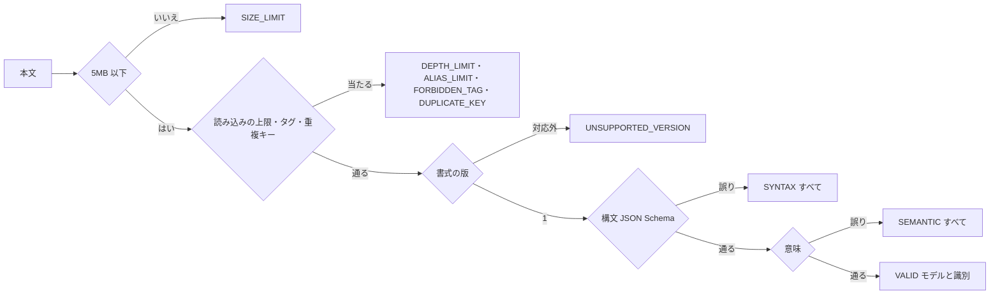
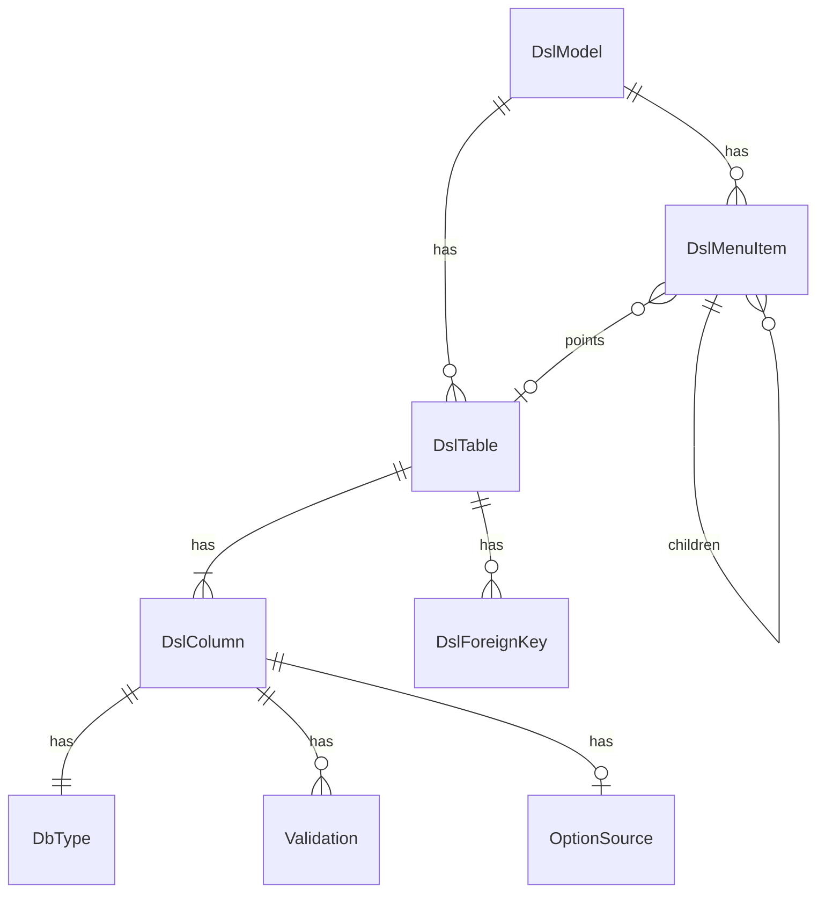

# Functional Spec — U2 DSL の定義（u2-dsl-definition）

U2 の振る舞い（手順と状態）を示す。データの形は `entities.md`、決まりは `rules.md` が正本。DSL の書式の例は `functional-design-questions.md` の「DSL の形（案）」。

## 1. DSL の読み込みと検証（契約 C4 の DslReader.read）

1. 本文（UTF-8 のバイト列）を受け取る。5MB を超えれば、読まずに SIZE_LIMIT を返す（BR1.1）。
2. YAML を安全な設定で読む。読みながら、入れ子の深さ（BR1.2）・別名の数（BR1.3）・タグ（BR1.4）・重複キー（BR1.5）を確かめ、上限や禁止に当たれば打ち切って、その誤りを返す。同時に、値ごとの行・列を記録した位置の対応表を作る。
3. 書式の版を確かめる。無い・対応外なら UNSUPPORTED_VERSION を返す（BR2.1）。
4. 同梱の JSON Schema で構文を検証する。誤りがあれば、見つかったものをすべて返す（BR2.2・BR1.6）。
5. 意味を検証する（BR3.1〜BR3.6）。誤りがあれば、見つかったものをすべて返す（BR3.7）。
6. 誤りを返すときは、誤りの場所（DSL の中のパス）から位置の対応表で行・列を引いて付け（BR4.1・BR4.2）、文言は鍵と埋める値にする（BR4.3）。
7. 誤りが無ければ、変更できない値の木（DslModel）を作り、本文のバイト列から識別（ハッシュ値）を求めて、VALID を返す（BR5.1・BR5.2）。

どの段でも、前の段に誤りがあれば後の段は行わない（BR2.3）。

## 2. 識別を求める（DslReader.hash）

1. 本文のバイト列から識別を求めて返す（BR5.1）。検証はしない。

## 3. 適用中のモデルの保持と提供口（契約 C4 の ActiveDslModelHolder と C8 の ActiveDslModelProvider）

1. 起動の直後は「無い」状態から始まる。
2. U4 が、起動時の読み込みや適用の確定の後に、新しいモデル（または「無い」）で差し替える。差し替えは一度に切り替わる（BR5.3）。
3. 後続の Intent が取り出すと、その時点のモデル（PRESENT）か「無い」（ABSENT）を返す（BR5.4）。取り出したモデルは、その後の差し替えの影響を受けない。

### 状態の移り変わり（適用中のモデルの保持）

| 今の状態 | 出来事 | 次の状態 |
|---|---|---|
| 無い | U4 がモデルで差し替える | ある（モデル M1） |
| ある（M1） | U4 が別のモデル M2 で差し替える | ある（M2） |
| ある（M1） | U4 が「無い」で差し替える（起動時に適用中が無い） | 無い |
| どちらでも | 取り出す | 変わらない |

## 4. 検証の段の流れ

図の文章による代替: 本文が 5MB を超えれば SIZE_LIMIT。読み込みで上限・タグ・重複キーに当たればその誤り。版が対応外なら UNSUPPORTED_VERSION。構文の誤りがあれば構文の誤りをすべて。意味の誤りがあれば意味の誤りをすべて。どれも無ければ VALID。

## 5. エンティティの関係（`entities.md` から導いた図）

図の文章による代替: モデルはメニューの項目とテーブルを持つ。メニューの項目は子の項目を持ち、テーブルを1つ指すことがある。テーブルはカラムと外部キーを持つ。カラムは DB 上の型・バリデーション・選択肢の出どころを持つ。

## 6. 決まりの要約（`rules.md` から導いた表）

| 場面 | 決まり |
|---|---|
| 読み込み | 5MB（BR1.1）、深さ（BR1.2）、別名（BR1.3）、タグ（BR1.4）、重複キー（BR1.5）、同梱の JSON Schema だけ（BR1.6） |
| 版と構文 | 版（BR2.1）、JSON Schema と知らない項目（BR2.2）、段の順と打ち切り（BR2.3） |
| 意味 | メニューの先（BR3.1）、メニューの形（BR3.2）、参照の先（BR3.3）、並び順（BR3.4）、部品と選択肢（BR3.5）、バリデーションの矛盾（BR3.6）、すべて返す（BR3.7） |
| 誤り | 行・列と場所（BR4.1）、別名の参照の場所（BR4.2）、文言の鍵（BR4.3） |
| モデル | 識別（BR5.1）、値の木（BR5.2）、一度に差し替え（BR5.3）、無いとき（BR5.4） |

## 7. 失敗の場合とふるまい

| 場合 | ふるまい |
|---|---|
| 本文が空 | version が無いため、版の検査（BR2.1）で UNSUPPORTED_VERSION の誤り1件（SYNTAX にはしない） |
| YAML として読めない（字下げの誤りなど） | SYNTAX（読めなかった場所の行・列） |
| 誤りが1000件ある | すべて返す（U4 が先頭の100件に絞る） |
| 別名の展開の爆発 | 展開する前に ALIAS_LIMIT で打ち切る |
| 正規表現の検査が長くかかる | 時間の上限で打ち切り、SEMANTIC（正しくない pattern）とする |
| 想定外の失敗（プログラムの誤り） | 例外（U4 が 500 にする。内部の文言は応答に出さない） |

### 7.1 誤りの種類ごとの行・列

| 種類 | 行・列 | 場所（path） |
|---|---|---|
| SIZE_LIMIT | 無し（読む前に止める） | 無し |
| DEPTH_LIMIT | あり（上限を超えた段が始まる位置） | 無し |
| ALIAS_LIMIT | あり（上限を超えた別名の位置） | 無し |
| FORBIDDEN_TAG | あり（タグの位置） | 無し |
| DUPLICATE_KEY | あり（2回目のキーの位置） | あり（その対応表の場所） |
| UNSUPPORTED_VERSION | version があればその値の位置、無ければ無し | `version` |
| SYNTAX | あり（位置の対応表から。YAML として読めないときは読めなかった位置） | あり（読めないときは無し） |
| SEMANTIC | あり（位置の対応表から） | あり |

位置は YAML の部品が読み込みの途中で示す位置を使う。位置が得られなかったときは、上の表で「あり」でも行・列を付けない（null）。
